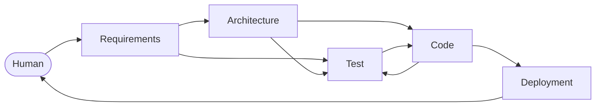

# KAAL: the job, designed

_A design, not a build. Nothing here is implemented; this document is the
requirements plot of KAAL's first job, which is KAAL itself. It depends on khai
and is written in khai's vocabulary on purpose, because the point of depending on
khai is to use it rather than to reinvent it. House rule already in force: no
en-dash or em-dash in content; use `,` `;` `:` `()` or `--`._

## 1. The job in one paragraph

KAAL runs software work as a production. A job enters as requirements, becomes an
architecture and a test suite, becomes code, and leaves as a deployment. Five
positions hold the five stages, each voiced by a skill any model can load, and
each skill is on a ladder: what a human did by hand becomes a conversation, a
conversation becomes a skill, a skill becomes a script. KAAL's own pipeline is the
first thing the pipeline builds, so every script it writes is a script it runs on
itself the next time round. That is the whole job. The rest of this document is
the shape.

## 2. The graph

The five stages and their dependencies, as given:



Four of the edges are forward. One is a back edge, code to test, and it is the
only cycle in the graph. That is not an accident to smooth over: test leads code
(the tests exist before the code they hold to account) and code leads test (the
code, once it exists, is run against them and tells the tester what the suite did
not yet say). The loop between the two is where a job spends most of its time, and
a design that flattens it into a straight line has lost the thing that makes the
pipeline honest. Everything else is a chain: one stage's close is the next one's
cue.

The human sits at both ends and at one gate in between. The human sets the
requirements (that is the cue for the whole run), approves the plan before code is
written (the close of architecture), and holds the key to deployment (the
operator executes, the human authorises). Those are the three places a person is
in the loop by design; every other appearance of a person is an escalation, not a
step.

## 3. A job is a play

khai's claim is that nothing is a ticket, a prompt, or a pipeline; everything is a
production. KAAL takes that at its word. A **job is a play** (ENACTS: Estate,
Name, Arc, Company, Triggers, Stakes) and its five stages are five **plots** (TO
CAST: Cue, Action, Stage, Tension), chained by the Triggers chapter exactly as the
graph above draws them. The company is the five positions. The Stakes are what the
job is fighting over; a plot that leaves the stakes where it found them has not
earned its place, which is a stricter rule than "the stage ran".

That gives KAAL three things for free that a pipeline written from scratch would
have to invent:

- **The conformance walls.** Every play, plot, position, persona, and plan in
  KAAL validates against the canon through `@chbrain/khai-tests`, in the pre-push
  hook and in CI. Chapter names, ordering, frontmatter, links, the cast: computed,
  not judged.
- **The review harness.** `@chbrain/khai-review` resolves one rubric per position
  the house casts. Five positions, five lenses; the harness runs each as N
  independent readings with a skeptic and confirms only on consensus. It never
  gates; it escalates.
- **The voice layer.** The house speaks through named personas holding
  positions, hands off in role, and stages its debates as a discussion play. The
  Choregos (Nicias and Pericles, in tension) and the Roadie (Agatharchus) come
  with the blueprint; KAAL adds its five.

### The house kind

khai's bill knows three kinds of house: a **stage** (a source staged as plays), a
**work** (khai's own canon given a voice), a **canon** (reusable material other
productions draw on). KAAL is none of these. It builds. In a theatre that is the
**shop**: the scene shop, the prop shop, where what the designer drew gets made and
loaded onto the stage. KAAL registers as a `shop` house, its collection is `jobs`,
its anchor is `play_` like every other house, and the kind is the first seam KAAL
needs from khai (section 9), because the kind set is closed on purpose and a new
one is an architectural decision that lands in khai, not here.

### The layout

Raised by `khai-stage` from the blueprint, then given its own rooms:

```
KAAL/
  README.md                 the Estate: the house voice, the pointer to AGENTS.md
  AGENTS.md                 the coding contract, stamped, vendor agnostic
  management/               the voice layer: instructions, positions, personas,
                            standing plans, orders, discussions
  skills/                   the five skills, SKILL.md + references, built and
                            guarded through @chbrain/khai-skills
  bin/                      the Script rung: what the skills call instead of judging
  jobs/<job>/               one directory per job: the play, its plan, its five
                            plots, and a work/ directory or a pointer to the target
  tests/                    the walls: house conformance, script unit tests, the
                            red fixtures every wall must be seen to fail on
  audit/                    the harness manifests: one rubric set per position
  fixtures/                 the small known jobs the skill evals run on
  khai-guard.config.json    lanes: job/*, skill/*, script/*, governance/*
```

The lanes follow the blueprint's rule: the guard computes the branch from the
diff. `job/*` owns `jobs/**`, `skill/*` owns `skills/**`, `script/*` owns `bin/**`
and their tests ride separately as the source and test rule requires, and
`governance/*` owns the rest.

## 4. The company

Five positions, and the names are theatre names because the house is a theatre.
The plain name stays beside each so nobody has to translate. Every position is a
file (TO HOLD: Has, Orders, Loses, Drives) and speaks only through a named persona.

| Plain     | Position          | Holds the stage | Has                                                         | Loses                                                        |
| --------- | ----------------- | --------------- | ----------------------------------------------------------- | ------------------------------------------------------------ |
| analyst   | the Dramaturg     | Requirements    | the source and the question: what is this job actually for  | the right to decide how; the Dramaturg frames, never designs |
| architect | the Scenographer  | Architecture    | the space the play will run in: structure, seams, constraint | the right to build it; the drawing is not the set            |
| tester    | the Prompter      | Test            | the whole text, and the duty to catch every deviation       | the right to be kind; a missed line is a missed line         |
| coder     | the Carpenter     | Code            | the shop: the tools and the drawing to build from            | the right to redesign; the Carpenter builds what was drawn   |
| operator  | the Stage Manager | Deployment      | the book and the cue light: the run, night after night      | the right to improvise; the show runs as called              |

Two positions KAAL inherits rather than adds, and one seam to keep clean:

- **The Choregos** (Nicias and Pericles) stays off-stage and issues orders. A
  job's plan is approved in their voice before the human signs it.
- **The Roadie** (Agatharchus) stocks the house: installs and updates khai, keeps
  the board green, tours what KAAL publishes. The Stage Manager is not the
  Roadie. The Roadie moves the house; the Stage Manager runs one job's show. Where
  a deployment is "publish this package to the registry", the two touch, and the
  rule is: the Roadie owns the venue, the Stage Manager owns the cue.

Personas are the first naming job in this house and they are Kai's. The pattern
khai uses is a real figure with a source, so two candidates to show the shape and
not to close it: **Lessing** for the Dramaturg (the first dramaturg by title,
Hamburg 1767, the man who wrote down what a play was for while it was running),
and **Appia** for the Scenographer (the stage as space and light, designed before
a set was built). The Prompter's persona is the interesting gap: prompters are
anonymous by trade, and a house that names one has said something about what
testing is.

Each position carries a **standing plan** (TO DOIT), its Drives written as a
checklist that never closes: the Dramaturg's is that no job starts without a
question it can fail; the Prompter's is that no code lands without a test that was
seen to fail first. Those standing plans conflict by design (the Carpenter wants
to build, the Prompter wants to hold), and the debate between them is the
discussion play, not a bug in the process.

## 5. The ladder

The concept: **Human < NLP < Skill < Script**, from least deterministic to most.
Every move a job makes sits on one rung of that ladder, and the design's one
standing rule is to push each move as far right as it will go, one rung at a
time, and never further than a test at the target rung can hold it.

khai already carries this ladder under other names, and the two need reconciling
once so the house does not keep two vocabularies. khai's boundary ruling
(`docs/BOUNDARY.md`) reads `human -> ai -> code` downward as consolidation over
time and `code -> ai -> human` upward as escalation per case; its order
"Computed, Harnessed, Instructed" names the three tiers a check can land in. Laid
side by side:

| KAAL rung | What it means here                                                              | khai tier                          |
| --------- | ------------------------------------------------------------------------------- | ---------------------------------- |
| Human     | a person does it, or decides it                                                 | the human rung; taste              |
| NLP       | a model does it in open conversation, prompted for the occasion                 | not a tier: the raw material       |
| Skill     | a model does it under a loaded skill or method; repeatable, portable, judged    | Instructed                         |
| Script    | code does it; a wall, a build, a deploy; no model in it                         | Computed                           |

khai's fourth thing, the **Harnessed** judge, is where KAAL's four rungs and
khai's three tiers looked like they disagreed, and the resolution is that the
ladder nests. A harness is a Script whose one step is an NLP call: the rubric, the
N-of-K consensus, the skeptic, and the verdict rule are code, and only the reading
inside is a model. It sits on the Script rung by the rule that decides rungs (who
owns the verdict), while being honest that the verdict is about meaning and so
advises rather than gates. So KAAL's ladder stays four rungs, and a skill that
needs a judgement calls a harness the way it would call any other script.

### The rung is recorded, not remembered

Every skill declares its **moves** in a small ledger beside the SKILL.md (a
`moves.json`, one entry per move: name, rung, the script it calls if any, the
test that holds it there). A script, `kaal ladder`, reads every ledger and prints
the frontier: per stage, which moves are still conversation, which are skilled,
which are scripted, and which have a test at their rung. That report is the
house's backlog. A move with no test at its rung is flagged as a claim, because a
rung is a measurement and not a self-report (conduct law 2).

### Promotion, one rung at a time

- **Human to NLP**: a person stops doing it and asks; the move exists once it has
  been done in conversation on two jobs and the transcript says how.
- **NLP to Skill**: the how is written into the stage's SKILL.md (or a method in
  `khai-methods` shape when it is a checklist rather than a role), and the skill
  is run on the fixture jobs by at least two models with the harness reading the
  output through the next position's lens. It is promoted when the consensus
  holds across models; a skill that only works on one model is a prompt, not a
  skill.
- **Skill to Script**: the move is written as code under `bin/`, gets a unit test
  and a red fixture the wall was watched to fail on (conduct law 3), and the
  SKILL.md step that used to judge it is cut to a call. The skill stays fat only
  where it judges, thin where it computes: the Roadie's own rule, borrowed whole.
- **Demotion** is allowed and expected. A script whose real cases stop settling
  at its rung goes back to a harness rubric; a rubric that keeps needing a person
  goes back to guidance. The frontier moves both ways.

## 6. The five skills

Each skill is one `SKILL.md` under `skills/<name>/`, built and guarded through
`@chbrain/khai-skills` (the agentskills.io standard, vendor neutrality, provenance
against the canon), so the same bundle loads in whatever model is driving, the
execution tool included. That is the practical reason the Skill rung matters here:
the strategy is thought through in one place and executed in another, and a skill
is the one artefact both can hold.

Every skill has the same skeleton: its position (the accountability it holds),
its cue (what it takes in and refuses to start without), its echo (what it hands
off and in what shape), what it scripts, what it judges, and its lens (the rubric
the harness runs on its output). The handoff between two stages is the Echo of one
plot written as the Cue of the next, in a fixed shape the pipeline stamps; that is
the structured handover, and it is computed so the shape never drifts while the
content stays the skill's.

### kaal-dramaturg (Requirements)

The Dramaturg turns a human ask into a job that can fail. Cue: a request from the
human, in any form. Echo: `jobs/<job>/play_<job>.md` with Stakes written, and
`plan_<job>.md` with Direction and Targets, where every target is an acceptance
criterion phrased so that the Prompter can write a test for it and the Stage
Manager can tick it. Scripts: `kaal stamp-job` (the play, the plan, and the five
plots from the canon templates, filled with the job's name and cast; nothing
written from memory of chapters). Judges: whether the ask is one job or three,
whether a target is testable, what is out of scope. Lens: _is every target a
thing the run can fail on, and is nothing in the Stakes undecidable?_

### kaal-scenographer (Architecture)

The Scenographer draws the space the job runs in. Cue: a plan whose Targets the
human has read. Echo: the plan's Implementation chapter (language, layout,
seams, engines, what is fixed and what is free), a decision record per choice that
closes a door, and a test strategy that names, per target, the kind of test that
will hold it (deterministic, harnessed, or manual, and why). Scripts: `kaal
scaffold` (the directory shape, the package manifest, the lane config for the
target). Judges: the seams, the tradeoffs, what not to build. Lens: _can the
Prompter and the Carpenter each start from this without asking the Scenographer a
question?_ The human approves the plan at this close; it is the second of the
three human gates.

### kaal-prompter (Test)

The Prompter holds the text. Cue: the plan's Targets and Implementation. Echo: a
test suite in which every target has a test, every test has been seen red, and
the tests that need a model to judge are declared as harness rubrics in `audit/`
with their thresholds, never as walls. Scripts: `kaal red` (runs the suite and
refuses a test that has never failed), the harness invocation, coverage of
targets against tests (a target with no test is a wall, computed). Judges: what a
target means when two tests could both claim it. Lens: _does the suite fail for
the right reason, and would it pass on a wrong answer?_ The Prompter is also the
position that owns section 7 of this design, both testing lanes.

### kaal-carpenter (Code)

The Carpenter builds what was drawn until the text is satisfied. Cue: a red
suite and an approved plan. Echo: green, and a changeset that names the bump
class the guard computes. Scripts: everything the house already has (the guard,
the gates, format, the suite) plus `kaal build`. Judges: how, within the drawing;
never whether. A Carpenter who wants to change the drawing hands back to the
Scenographer in voice, which is a step off the plot and is staged as one. Lens:
_does the code do only what a target asked, and does anything in the diff exist
that no test holds?_ The code to test back edge fires here: a green run that
revealed a gap goes back to the Prompter as a new target, and the loop turns.

### kaal-stage-manager (Deployment)

The Stage Manager calls the show. Cue: a green suite, a plan with no open target
but deployment, and the human's key. Echo: the deployment, its record in the
plan's Targets with a verdict, and the retrospective (khai's `retro-4ls` method
loads here) whose findings become the next job's requirements or a promotion on
the ladder. Scripts: `kaal deploy` (the venue-specific release: a package
publish, a tag, a container push), the smoke run, the rollback. Judges: whether
what shipped is what was called. Lens: _did the run match the book, and what does
the next run inherit?_ The retrospective is the pipeline's own Act step, and it is
the mechanism by which the dogfood spiral in section 8 turns at all.

## 7. Testing, both kinds

The Prompter runs two lanes, and the design's most important rule about them is
that they never trade places. A deterministic test gates. A non-deterministic
test reports. Forcing a judgement into a wall is worse than leaving it out
(conduct law 5), and turning a wall into a rubric is paying a model to do what
`===` does.

**The deterministic lane** (walls, in the hook and in CI):

- the house conformance: every khai file in `management/` and `jobs/` validates
  against the canon; every position has a persona; every job's Company matches
  the files on disk;
- the skill guard: every `SKILL.md` passes both khai-skills tiers, and every
  canon reference in a bundle equals its source;
- the script suite: every `bin/` script has unit tests and a red fixture, and the
  test that proves the fixture goes red is itself in the suite;
- the ladder ledger: every move claiming Script names a script that exists and a
  test that passes; every move claiming Skill names a fixture eval that has run;
- the job walls: a target with no test, a test with no target, a plan with an
  open target at deployment.

**The non-deterministic lane** (harness, advisory, escalates):

- **Skill evals.** Each skill is run on the fixture jobs under `fixtures/` by at
  least two models. The output is read by the harness through the _next_
  position's lens (the consumer judges the producer: the Scenographer's rubric
  reads the Dramaturg's plan, the Carpenter's reads the Prompter's suite), as N
  independent readings with a skeptic told to refute. A finding is confirmed on
  K of N, and a claim of fact anchors to the fixture's own files, never to the
  model's memory. The thresholds are the house's local config, as the boundary
  ruling prescribes.
- **Job reviews.** The same harness runs on a real job's artefacts at each plot
  close, with the five lenses resolved from the five positions. It comments; it
  never blocks a merge.
- **Stability as the promotion signal.** A rubric whose verdict has not changed
  across the last N runs on the same fixture is a candidate for the Script rung,
  and the Prompter tables it as such. That is the consolidation direction of the
  ladder made into a measurement rather than a hunch.

What neither lane can do is make a weak model write like a strong one. The walls
guarantee correctness where correctness is decidable and the harness guarantees
that errors get surfaced across models; that is the honest bound, and the design
claims nothing past it.

## 8. Eat your own dogfood: the first jobs

KAAL's pipeline is built by running KAAL's pipeline on KAAL, and the way that
avoids being a paradox is that job N is run by the pipeline as job N-1 left it.
Each job below is a play in `jobs/` from the day the house can hold one, with its
plots filled at whatever rung the moves have reached; the early plots are mostly
conversation, and that is recorded honestly in the ledger rather than dressed up.

0. **Raise the house.** `khai-stage kaal --kind shop --collection jobs`, the
   Roadie's job, mostly scripted already. Register the five positions and the
   personas the human names. Green on an empty house.
1. **The five skills, version zero.** Written as `SKILL.md` files from this
   design, no scripts yet, moves ledgered as NLP or Skill. This is the job where
   this document is the Dramaturg's echo and the human is doing the other four
   plots by conversation. The eval fixtures are written here too, because a
   skill without a fixture cannot be promoted.
2. **The first scripts.** `kaal stamp-job`, `kaal ladder`, `kaal red`. Each one
   is a move that job 1 declared as Skill and that this job promotes, with the
   red fixture the Prompter demands. From here the house can stamp its own jobs.
3. **The harness.** The five `audit/` manifests, the fixture evals under two
   models, the consensus thresholds. From here a skill can be promoted on
   evidence rather than on the author's say-so.
4. **The first foreign job.** Something small that is not KAAL, run end to end,
   to find out where the pipeline only worked because it was building itself.

After job 4 the backlog is whatever `kaal ladder` prints, and the retrospective at
the end of each job is what feeds it.

## 9. What KAAL needs from khai

KAAL depends on khai and should change it as little as possible, but a few seams
are real and are better named now than discovered in job 0. Each would be one
order in khai's own shape (DOIT) and its own lane there; none is done here.

- **A fourth house kind.** The bill's kinds are closed (`stage`, `work`, `canon`;
  `chain` for the website) and a new one is an architectural decision by design.
  KAAL asks for `shop`, and for `khai-stage --kind shop` to stamp a `jobs`
  collection with the five positions available to cast.
- **Building skills from a house.** `@chbrain/khai-skills` exports its builder
  with a `root` option, so KAAL can compose and guard its own `skills/` through
  khai's tiers with a one-line script. What is missing is only that the CLI
  assumes its own package root; a `--root` flag closes it. No change to the
  guard.
- **Rubrics from positions.** `resolvePositionRubrics` already reads a house's
  team, so five positions yield five lenses with no new mechanism. What KAAL adds
  is the _consumer judges producer_ pairing in its own audit manifests, which is
  local config and needs nothing from khai.
- **Methods.** Where a KAAL move is a checklist rather than a role (the handover
  shape, the promotion protocol), it is a method in `khai-methods` frontmatter
  shape, credited to KAAL, and khai may take it upstream or not. KAAL loads
  `khai-authoring`, `khai-review`, `khai-fix`, and `retro-4ls` as they are.

## 10. Decisions taken here, and the ones left open

Taken, and stated so they are not re-argued in a pull request body (conduct law
6): a job is a play; the stages are plots chained by the graph in section 2 with
the code to test back edge kept as the one loop; the five positions carry theatre
names with plain names beside them; the ladder is four rungs and a harness is a
Script that calls NLP; deterministic tests gate and non-deterministic tests
report; the house's first job is itself.

Open, and Kai's:

- **The personas.** Five names, five sources. The Prompter's is the one that
  says the most.
- **What KAAL stands for.** The design does not depend on the expansion, and the
  house README's Estate line is where it will live.
- **Where a job's target lives.** Inside `jobs/<job>/work/` for the house's own
  jobs, or a pointer to a foreign repository for job 4 and after. The design
  allows both; the first foreign job will say which is the default.
