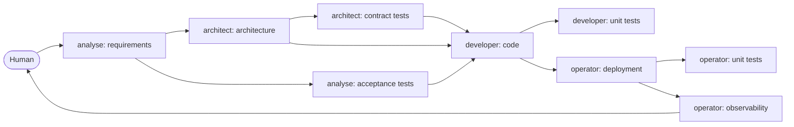

# KAAL: Kai's Artificial Agent League

_A design, not a build. Nothing here is implemented. It is the requirements
stage of KAAL's first job, which is KAAL itself, and it is written to be sliced
into execution briefs later. House rule in force from the start: no en-dash or
em-dash in content; use `,` `;` `:` `()` or `--`._

## 1. What KAAL is

KAAL is a league of agents and the skills they carry. An agent is a traditional
agent definition: a persona that sets voice and stance, a binding that sets scope,
and a loadout of skills it may use. A skill is a skill in the agentskills.io
sense: a directory with a `SKILL.md` and its references, portable to any runtime
that reads the standard. Runtime config (which model, which tools, which sandbox)
stays outside both; KAAL defines what an agent is and what it may do, never where
it happens to run.

Three things follow from the name and they are the design's spine. It is Kai's
(one could argue Khai's, and section 12 leaves that to him), so it is one league
with one set of rules, not a marketplace. It is a league, so
membership is earned and can be lost: not every agent definition or skill
deserves to end up here, and the ones that do have standings. And it is
artificial agents, not plays: KAAL is code oriented and delivers the engine,
while khai is content work. khai's skills author plays, engines, and personas;
KAAL's skills improve the software those run on. So khai is a consumer of KAAL,
one among possible others, and khai's theatre stays in khai. KAAL is written so that a project with
no idea what a play is can adopt it whole.

The league already has its persona, on the `kaal-first-agent` branch: Kaal, who
drives KAAL. Whoever works in this repository works as Kaal; that is what PR #1's
AGENTS.md means by loading the persona first. He reads the measure against the
declared standard and either turns the wheel or sends the artefact back, and the
league grows by what he lets through. His shape (a persona file for voice, an
AGENTS.md for scope, everything else external) is the pattern this design
generalises for the members, and his growth rule (do the small thing well before
expanding) is the design's pace.

## 2. Three nouns, and the sentences between them

**Agent needs Skills.** An agent is defined by its persona, its scope, and its
loadout: the skills it is allowed to carry. An agent with no loadout is a voice
with no hands; a skill nobody carries is a document.

**Skills follow skill rules.** A skill is admitted to the league only if it passes
the rules, which are code: the standard's own constraints mirrored as a wall, plus
league policy on top. A skill that fails the rules does not exist in KAAL,
whatever it does elsewhere.

**Agents follow agent rules.** The same shape one level up: an agent definition
has a standard layout and a wall that checks it, plus league policy on what an
agent may claim about itself.

**Everyone writes their own tests.** Every seat's output is a pair: _I want
this_, and _this is how I test that it is true_. The analyst wants a behaviour
and proves it with acceptance tests; the architect wants a seam and proves it
with contract tests; the developer wants the code to do a thing and proves it
with unit tests; the operator wants a release to hold and proves it with deploy
tests and observability. Nobody proves another seat's want, and a want with no
proof is not yet an output.

**Everyone stays in lane.** Each seat declares the paths it may touch, the lane
is computed from the diff, and a pull request is one lane: a change that
crosses two lanes is refused and told how to split, in the pre-push hook and
again in the required CI check, so no pull request operates all over the place.
A handoff between seats is therefore never a commit that spans them; it is the
producing seat's pull request landing and the receiving seat starting from
what landed. This is khai-guard's concept carried over whole, because it
is the one that removes the guesswork: a branch name typed by hand is a claim,
a lane read off the diff is a measurement.

**Kaal drives.** Kaal is not a member of the league; he is the league's own
voice, the persona the repository works through. Every candidate for admission
passes him, and when KAAL runs its pipeline on itself, so does every artefact
that moves between agents. He reads each against the checklist declared for that
seam; he does not repair, and he does not explain what passes. His own Shadow,
that he cannot see past the checklist, is the reason the checklists are written
by the members and not by him (section 7).

## 3. The agent definition

One directory per agent under `agents/<name>/`:

```
agents/<name>/
  AGENT.md        the binding: frontmatter + scope, the file a runtime loads first
  persona.md      voice, stance, presence; four chapters
  moves.json      the ladder ledger (section 6)
  fixtures/       the small known tasks the agent is evaluated on
```

`AGENT.md` carries a closed frontmatter: `name` (matches the directory, same rule
as a skill), `description`, `division` (section 5), `skills` (the loadout: a list
of skill names that must resolve in `skills/`), `hands_to` (the agents this one
may hand an artefact to), `lane` (the path globs this agent may change, from
which the guard config is generated), and `license`. Its body has fixed sections in fixed
order: **Purpose**, **Allowed**, **Not allowed**, **Input**, **Output**,
**Handoff**. Allowed and Not allowed are the scope, and they are the part of the
definition Kaal reads on every stamp: an output that does something Not allowed is
sent back regardless of quality.

`persona.md` keeps the four-chapter persona shape PR #1 already used, Projection,
Action, Shadow, Tell, because it is a good small contract for a voice and it is
already proven on Kaal. The shape is borrowed from khai's canon and credited to
it in the file's own frontmatter; it is not a package dependency. KAAL's wall
checks the four chapters itself. A persona defines voice and stance only; scope
lives in `AGENT.md`, and a persona that starts issuing operational rules fails the
agent rules.

Runtime config is external by design. A consumer (khai, or anyone) maps an
`AGENT.md` onto its runtime's own agent format (a subagent definition, a custom
instruction set, a system prompt) with a small adapter it owns. KAAL ships the
definition and, where it is cheap, an adapter or two as examples; it never makes
one runtime's format the definition.

## 4. The skill and the skill rules

One directory per skill under `skills/<name>/`, in the standard's layout:
`SKILL.md` with `name`, `description`, `license` and the permitted optional
fields, references one level deep, the body within its budget. Built into a
self-contained bundle and a zip so a runtime with no tools can load it.

The rules are two tiers of code, and they are league rules, not khai's:

- **Tier 1, the standard.** A faithful mirror of the agentskills.io `SKILL.md`
  constraints: name shape and directory match, description bounds, permitted
  fields, reference depth, body budget. Pinned to the spec's content hash and the
  official validator's version, with a drift advisory on the next touch and a
  deliberate human re-pin, never an automatic one.
- **Tier 2, league policy.** Vendor neutrality: a skill names a role, never a
  runtime or a product. Project neutrality: a skill in KAAL does not hard-code one
  consumer's vocabulary; a skill that only makes sense inside khai's plays is
  khai's skill and stays there (section 5). Provenance: where a skill bundles
  material from a source (a template, a standard), the copy equals the source at
  build time or the build fails.

khai's `khai-skills` package already implements tier 1 and the neutrality half of
tier 2, and it does so in a way that is generic. The end state this design names
is that the generic rules live in KAAL and khai consumes them, keeping only its own
provenance against its own canon. The interim is that KAAL carries its own copy of
that small rule set from day one, so that no version of KAAL ever depends on khai;
the copy is the price of the dependency pointing the right way.

## 5. The league: admission and standings

A league has a door and a table. Both are written down and both are checked by
Kaal, with the door's criteria as code where they can be and as a declared
checklist where they cannot.

**Admission.** An agent or skill enters KAAL only if it is:

- **engine, not content**: it improves software. A skill that authors content (a
  khai play, an engine's prose, a persona) belongs to the house whose content it
  is, however good it is; so does an agent whose scope is one repository's
  rituals. KAAL's members deliver the engine, and khai's licence split (code
  open, content NonCommercial) is the same line drawn inside one repository.
  This is the criterion behind "not all skills and agent definitions deserve to
  end up in KAAL", and it is the one that needs judgement, so it is Kaal's
  checklist item and not a wall.
- **conformant**: passes the agent rules or the skill rules, which are walls.
- **evidenced**: has fixtures, and has been run on them by at least two models
  with the result recorded. A definition with no evidence is a draft, and drafts
  do not have standings.
- **ledgered**: declares its moves and their rungs (section 6) so the table can
  place it.

**Standings.** The table is the ladder read across the whole league: each member
sits in a division by how much of what it does is scripted, skilled, or still
conversation, and by whether its evidence holds across models. Members move up
by promotion (section 6) and down by relegation: a skill whose evals stop
agreeing across models, or whose scripted moves stop passing, drops a division at
the next stamp and stays there until it earns its way back. `kaal table` prints
the standings from the ledgers and the eval records; nothing in the table is
typed by hand, because a standing that is typed is a claim.

**What stays out.** Named so it is not re-argued: khai's play skills (the
playwright, the director, the engineer, the impresario, the theatre manager, the
roadie) are khai's and stay in khai. They may be built with KAAL's rules and they
may carry KAAL agents in their loadouts; they are not members.

## 6. The ladder

Every move an agent makes sits on one rung of **Human < NLP < Skill < Script**,
least deterministic to most, and the league's one standing rule is to push each
move as far right as it will go, one rung at a time, never further than a test at
the target rung can hold it.

| Rung   | What it means                                                            |
| ------ | ------------------------------------------------------------------------ |
| Human  | a person does it, or decides it                                          |
| NLP    | a model does it in open conversation, prompted for the occasion          |
| Skill  | a model does it under a loaded skill; repeatable, portable, still judged |
| Script | code does it; no model in the verdict                                    |

A harness (code that runs a rubric through a model N times with a skeptic and a
consensus rule) sits on the Script rung, because the rung is decided by who owns
the verdict and the verdict rule is code. It is honest about what it is: it
advises and never gates, since what it judges is meaning. So the ladder nests, and
a skill that needs a judgement calls a harness the way it calls any script.

**The ledger.** `moves.json` beside each agent and each skill: one entry per move
with its name, its rung, the script it calls if any, and the test that holds it
at that rung. A move claiming a rung with no test at that rung is flagged as a
claim by the wall.

**Promotion, one rung at a time.**

- Human to NLP: a person stops doing it and asks; the move exists once it has
  been done in conversation on two tasks and the transcript says how.
- NLP to Skill: the how is written into the skill, and the skill is run on the
  fixtures by at least two models with the eval harness reading the output. It is
  promoted when the consensus holds across models; a skill that only works on one
  model is a prompt.
- Skill to Script: the move becomes code under `bin/` with a unit test and a red
  fixture the wall was watched to fail on, and the skill step that used to judge
  it is cut to a call. A skill stays fat only where it judges, thin where it
  computes.
- Demotion is expected and is relegation's local form. A script whose real cases
  stop settling goes back to a harness rubric; a rubric that keeps needing a
  person goes back to guidance.

## 7. The first job: five overarching skills

The job that founds the league is a software delivery pipeline. Its spine is
five **overarching skills**, and the agents that carry them are thin: each agent
is a persona and a scope wrapped around one of the five, and the skill is where
the craft lives. That order matters for the league's economics. A skill is the
portable, evaluated, ledgered thing; an agent is the seat it is carried in, and
a consumer may seat the same skill in an agent of its own.



Requirements drive architecture, and requirements drive **architecture-agnostic
testing**: acceptance tests that say what the system must do for whoever asked,
and know nothing about how it is built. Architecture drives **code-agnostic
testing**: contract tests on the seams the architect drew, and know nothing
about what is behind them. Those two layers drive code, which is TDD said in
two edges: the tests exist before the code they hold to account, and the
developer's job is to turn them green within the drawing. Code drives **unit
testing**, and the rule there is protect yourself: whoever writes code writes
the tests that guard it, and nobody else does. Deployment is code, so it has its
own unit tests under the same rule. And deployment drives **observability**,
which is testing carried on into the run: assertions about the live system that
never stop being checked. Each layer is driven by the stage above it and is
blind to the stages below it, which is what agnostic means here and what section
8 turns into a wall.

The human sits at both ends and one gate between: sets the requirements,
approves the architecture before code, holds the key to deployment. Every other
appearance of a person is an escalation, not a step.

**The seams.** A handoff is an artefact leaving one skill's Output for the next
skill's Input, and every handoff is stamped against the **checklist declared for
that seam**, written by the receiving side (the consumer sets the bar for the
producer: the architect's checklist is what the requirements must satisfy, the
developer's is what the tests must satisfy). Inside KAAL the stamp is Kaal's; in
a consumer's repository the checklists travel with the skills and the consumer's
own runtime applies them, because Kaal drives KAAL and does not follow its
members out. Kaal cannot see past the checklist; that is his Shadow, and it is
why the checklists are the receiving side's and are reviewed in the
retrospective, not by him. Where a checklist item is decidable it is a wall;
where it needs meaning it is a harness rubric and the stamp reports the
consensus; nothing on a checklist is Kaal's own opinion. A developer who finds a
test wrong hands back to the seat that wrote it (the analyst for an acceptance
test, the architect for a contract test), and that is a handoff like any other,
not a shortcut.

**The five, in one line each.**

- **analyse**: turns a human ask into a task that can fail. Output: a goal,
  assumptions, constraints, acceptance criteria, and the acceptance tests that
  prove them, blind to the architecture and the code. This is PR #1's plan agent with
  a name, and its output shape is PR #1's output shape.
- **architect**: draws the space the task runs in. Output: structure, seams,
  what is fixed and what is free, a decision record per door closed, and the
  contract tests that prove each seam, blind to the code. The human approves
  here.
- **tester**: the one skill every seat loads, not a seat of its own. It is the
  discipline of the proof: how to write the test for your own want so that it
  is seen red before it is trusted green, stays blind to the layers below it,
  declares as a harness rubric what needs a model to judge and as a wall what
  does not, and is ledgered on the ladder. Section 8 is its content.
- **developer**: builds within the drawing until the acceptance and contract
  suites are green, and proves the code with unit tests of their own. Output:
  green on all three layers, and a diff in which nothing exists that no test
  holds.
- **operator**: runs the release as called, with the human's key, and holds
  two wants with two proofs. The first: deployment is code, so it has its own
  unit tests. The second: observability, where the want is what the run must
  show (the assertions, the budgets, the traces) and the proof is that it
  shows it, a fault seeded and seen to fire the alert, a probe seen to reach
  the signal; an alert that has never fired is a claim. Output: the deployment,
  its tests, the observability with its proof, and the retrospective whose findings
  become the next task's requirements or a promotion on the ladder.

### When a skill gets too big

Five overarching skills is the right number to start with and almost certainly
the wrong number to end with. The design does not decide the splits in advance;
it decides how the league finds out that one is due, and what the candidate cuts
are, so that a split is made on a measurement and along a seam rather than on a
feeling and down the middle.

**The signals, all computed.** The standard's body budget is the first and it is
already a wall: a `SKILL.md` past its line budget is over. The ledger is the
second: a skill whose `moves.json` carries more moves at the NLP rung than at
Skill or Script has grown faster than it has crisped. The evals are the third: a
skill whose fixtures fail on different items for different models is doing too
many things for any one model to hold in its head, and that is what "too big"
means in practice. `kaal table` reports all three per skill, and a skill over on
any of them is tabled for a split at the next retrospective. It is not split
automatically; it is put on the table.

**The cuts, in the order to try them.**

1. **Script first.** Before splitting a skill, promote its scripted moves out of
   its body. A skill stays fat only where it judges, and a great deal of "too
   big" is judgement that has already crisped and is still written as prose.
   This is a split along the ladder, not across the skill, and it is the cheap
   one.
2. **By mode.** A skill that does the same craft in several situations (create,
   audit, repair) keeps one `SKILL.md` and moves each mode's detail into a
   reference one level deep, which the standard allows and the wall checks. The
   skill stays one member with one ledger; only its body thins.
3. **By seam.** A skill whose output has two consumers with two checklists
   (the analyse skill hands its requirements to the architect and its acceptance
   tests to the developer) is a
   candidate to split along that fork, one child per receiving checklist, if the
   two halves share little. The checklists already exist, so the seam is
   already drawn; the question is only whether the halves are independent.
4. **By stage, last.** Cutting a stage into sub-stages (requirements into
   elicitation and acceptance criteria, deployment into release and
   observation) adds a seam and a checklist to the pipeline itself. It is the
   most expensive cut because it changes the graph every consumer adopted, so
   it is taken only when the first three have been tried and the signals still
   fire.

**What a split must preserve.** The parent's name and its place in the graph: a
consumer that loaded `analyse` still loads `analyse`, and finds a skill whose
body now routes to its children. Each child is a member in its own right, with
its own ledger, fixtures, and standing, and the parent's standing is the lowest
of its children's. And the evidence carries over: a child inherits the parent's
fixtures that apply to it, so a split never resets the table to zero.

## 8. Testing: five layers, two kinds

**The layers** follow the stages, and the rule of each is who owns it and what it
may not know.

| Layer         | Driven by    | Owned by  | Blind to                                         |
| ------------- | ------------ | --------- | ------------------------------------------------ |
| acceptance    | requirements | analyst   | the architecture, the code                       |
| contract      | architecture | architect | the code                                         |
| unit          | code         | developer | nothing; protect yourself                        |
| unit (deploy) | deployment   | operator  | nothing; protect yourself                        |
| observability | the run      | operator  | nothing; it watches it all, and is itself proven |

Blindness is the part that can be computed. An acceptance test that imports a
module of the system under test has looked past its layer, and so has a contract
test that reaches behind a seam; both are import boundaries, and import
boundaries are a wall. Ownership is the part that is a rule, and it is one rule:
everyone writes their own tests. A seat's proof is written by the seat that has
the want, so the acceptance test is the analyst's because the behaviour is what
the analyst asked for, and the unit test is the developer's because the code is
what the developer built. A proof written by another seat proves that seat's
want, not yours. The tester is the shared discipline of writing that proof,
loaded by every seat, and owns no layer. Observability is the layer that never
finishes: it is the acceptance and contract questions asked again of the live
system, continuously, with the answers kept. It is not exempt from the pair. The
operator's want is what the run must show, and the proof is that the showing
works: a seeded fault is seen to fire its alert, a synthetic probe is seen to
reach its signal, a budget is seen to burn on a known load. The same law that
governs every wall governs it, watch it fail before you trust it to pass; a
dashboard nobody has seen go red is decoration, and an alert that has never
fired is a claim. Its findings are the retrospective's raw material, and the
league's own observability is the eval records and the standings table, which is
the pipeline watching itself.

**The kinds** cut across the layers. Any layer's test is one of two kinds, and
every seat runs the two kinds as two lanes that never trade places: a deterministic test
gates, a non-deterministic test reports. Forcing a judgement into a wall is worse
than leaving it out, because a rule that reads as computed and is not stops
everyone looking; turning a wall into a rubric is paying a model to do what
equality does.

**The deterministic lane** (walls, in the pre-push hook and in CI):

- the agent rules and the skill rules on every member;
- every loadout resolves, every `hands_to` resolves, every persona has four
  chapters and no operational rule;
- every script under `bin/` has a unit test and a red fixture, and the test that
  proves the fixture goes red is itself in the suite;
- every ledger entry claiming Script names a script that exists and a test that
  passes; every entry claiming Skill names an eval that has run;
- the standings table on disk equals a fresh build from the ledgers and eval
  records (a drift gate, so the table cannot be edited by hand).

**The non-deterministic lane** (the eval harness, advisory, escalates):

- **Member evals.** Each agent and skill is run on its fixtures by at least two
  models; the output is read through the receiving agent's checklist as N
  independent readings with a skeptic told to refute; a finding is confirmed on K
  of N; a claim of fact anchors to the fixture's own files, never to a model's
  memory. The thresholds are league config and are written down once.
- **Task reviews.** The same harness on a real task's artefacts at each seam,
  with the checklist of that seam. It comments; it never blocks.
- **Stability as the signal.** A rubric whose verdict has not changed across the
  last N runs on the same fixture is tabled for the Script rung. That is the
  consolidation direction of the ladder made into a measurement.

The harness is a KAAL script. Its mechanism (rubric as data, N of K, a skeptic,
source anchoring) is the same mechanism khai's review lane already runs, and
whether KAAL writes it fresh or lifts the generic half is a build decision; the
design's rule is only that KAAL does not depend on khai to run it.

What neither lane can do is make a weak model write like a strong one. Walls
guarantee correctness where it is decidable and the harness guarantees that
errors surface across models; that is the honest bound and the design claims
nothing past it.

## 9. The repository

```
KAAL/
  README.md               the definition (section 1, in fewer words), the pointer to AGENTS.md
  AGENTS.md               how an agent works in this repository (the coding contract)
  rules/                  the agent rules and the skill rules, as code, with the pin
  agents/<name>/          AGENT.md, persona.md, moves.json, fixtures/
  skills/<name>/          SKILL.md, references/, moves.json, fixtures/
  bin/                    the Script rung: kaal check, kaal build, kaal eval,
                          kaal table, kaal stamp, and whatever gets promoted
  adapters/               example mappings from AGENT.md to a runtime's own format
  tests/                  the walls, and the red fixtures every wall must fail on
  evals/                  the eval records the table is built from
  TABLE.md                the standings, generated, drift-gated
```

Branches are lanes computed from the diff, khai-guard's concept carried over
whole, and that guard is generic enough to reuse as a tool without making KAAL
a khai house. The league's own lanes: `agent/*` owns `agents/**`, `skill/*`
owns `skills/**`, `script/*` owns `bin/**`, `rules/*` owns `rules/**` and the
pin, and `governance/*` the rest. In a consumer's repository the lanes are the
seats': each `AGENT.md` declares the paths its seat may change (the analyst's
lane is the requirements and the acceptance tests, the developer's the source
and its unit tests, the operator's the deployment, its tests, and the
observability), and the guard config is generated from those declarations, so a
lane is never typed twice. A diff that crosses two seats is refused and told how
to split, which is stay-in-lane as a wall, and it is enforced twice: in the
pre-push hook, so the author hears it first, and in a required CI check, so a
push that skipped the hook is not done. One pull request, one lane, one seat.
The few paths every lane may touch (the lockfile, the changelog, a changeset)
are declared shared once, and a rider (a management order, a changeset) may
travel with the lane it rides. Everything else a pull request touches must be
its own lane's, so the lane name on the branch is a true statement about the
diff and a reviewer can read scope off the title. Whether KAAL uses khai's guard
package or its own small one is a build decision; the lane discipline is the
design. khai's own source-and-tests-in-separate-PRs rule is a consumer's
policy, not a league rule: here a want and its proof share a lane, and the proof
lands first.

## 10. Eat your own dogfood

KAAL's pipeline is built by running KAAL's pipeline on KAAL, and job N is run by
the pipeline as job N-1 left it. The early stages are mostly conversation; the
ledger says so honestly rather than dressing it up.

0. **The rules.** Agent rules, skill rules, the pin, the walls, a red fixture for
   each. Merge PR #1's Kaal into the new layout; he is the first member and
   passes his own door.
1. **The five, version zero.** Five `AGENT.md` and `persona.md` files, five
   `SKILL.md` files written from section 7, fixtures for each, ledgers marking
   every move NLP or Skill. This document is the analyst's output for this job;
   the human does the other four seats by conversation and Kaal stamps by hand
   against the first checklists.
2. **The scripts.** `kaal check`, `kaal build`, `kaal stamp`, `kaal table`, each
   a move job 1 ledgered as Skill and this job promotes, with its red fixture.
3. **The evals.** The harness, the fixtures run under two models, the thresholds,
   the first real standings table. From here a member is promoted on evidence.
4. **The first consumer.** khai adopts the five skills to improve its own
   software (its packages and mechanism), through an adapter it owns, while its
   content skills stay where they are and keep authoring plays. This
   is the job that proves the dependency points the right way.
5. **The second consumer.** A project that is not khai, to find out where KAAL
   only worked because its first consumer was its author's.

After job 5 the backlog is whatever `kaal table` says is still on the left, and
the operator's retrospective at the end of each job feeds it.

## 11. The boundary with khai

Stated once so it is not re-argued. The line is engine versus content: KAAL
improves software, khai makes content, and each keeps the skills of its own
kind.

- **khai uses KAAL.** khai takes the five skills and the agents that carry them
  for its software: the packages, the guard, the conformance kit, the review
  harness, the builders. That is engine work, and it is what the five are for.
  It does so through an adapter khai owns. Nothing in KAAL imports khai.
- **khai keeps its content.** Plays, plots, the house company, the content
  skills (the playwright, the director, the engineer, the impresario, the
  theatre manager, the roadie), the canon and its conformance kit are khai's
  and stay there. KAAL never mentions a play.
- **The skill rules move down.** The generic tiers (the standard mirror, vendor
  neutrality) become KAAL's; khai keeps provenance against its own canon and
  consumes the rest. Until that lands, KAAL carries its own copy.
- **The persona shape is borrowed and credited.** Four chapters, checked by
  KAAL's own wall, credited to khai in the file. A convention, not a dependency.
- **Mechanisms may be lifted, not linked.** The eval harness and the branch
  guard are generic in khai; KAAL may lift their generic halves or reuse them as
  tools, and the rule is only that KAAL's definition of an agent or a skill
  never depends on either.

## 12. Decisions taken, and the ones left open

Taken here: KAAL is agent definitions and skills in the traditional sense, not
plays; Kaal is the persona that drives KAAL, the voice the repository works
through, at the door and at every seam inside it, and never a member; the five
stages are overarching skills carried by thin agents, chained as requirements to
architecture and tests, architecture to tests, tests to code, code to
deployment; the receiving side writes the checklist Kaal reads; everyone writes
their own tests and the tester is the discipline every seat loads, not a seat;
everyone stays in lane and the lane is computed from the diff; a skill is split
on a computed signal and along a seam, script first, by mode, by seam, by stage
last; admission has four criteria and only the first needs judgement; the ladder
is four rungs and a harness is a script that calls a model; deterministic tests
gate, non-deterministic tests report; the dependency points from khai to KAAL
and never back; the first job is KAAL itself.

Open, and Kai's:

- **The expansion.** Kai's Artificial Agent League, or Khai's: the second
  reading says who the league is for, and the design holds under both.
- **The five persona names**, and whether they share Kaal's system of measures.
- **The division names.** The table needs them and the ladder suggests four; a
  league with a good name deserves better than "Division 1".
- **Where the rules live in code.** A copy in KAAL from day one is the design's
  answer; when the generic half moves out of `khai-skills` is khai's call.
