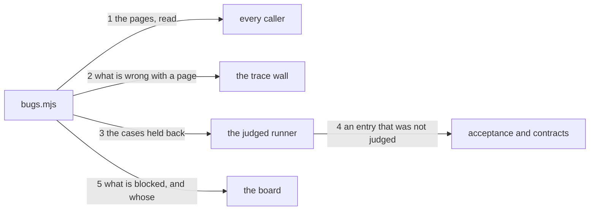

---
traces:
  parent: a-plan-picks-its-suites@cbdfa2bea7574e3ae78f8a4f3cb5651ec1147c711c1227db754326a90093fd0d
  requirement: a-bug-names-where-it-can-be-fixed@2d633dbefa766c4eeaea512289ee5ffe25ed80bd773f70b4da55ccf67224f063
  principles: the-two-goods@8bbe15706c3edcd63d0d050af9782c063cd585e1ec436d2314fa0003dfaa8cb6, the-seat-owns-the-lens@e1ab0650fc88dc8e1e16347fc8b14b236f1c57b94e50bfdf3f62aa4ec0d6d070
---

# Drawing: a-bug-names-where-it-can-be-fixed

## What the runs said

- The trace wall runs no test and never has. `grep -c spawnSync
bin/lib/traces.mjs` answers 0, and the `traces` command's findings are four
  page readers in a list. Criterion 3 asks that wall whether a case passes,
  which nothing there can answer without starting a process.
- A case costs about a second and a third. `time node --test
--test-reporter=tap requirements/a-tree-has-one-root/acceptance.test.mjs`
  answers `real 0m1.299s`.
- The judged runner is handed files and never a root. `runAcceptance(files)`
  and `runJudged(files)` take one argument, and `kaal.mjs` calls them with
  `process.argv.slice(3)`. Nothing in that path knows which tree it is in.
- The board's verdict is the walls and nothing else: `${ok ? "green" :
"red"}: ${gates.length} wall(s), ${failed} failing, ${waived} waived`, where
  `ok` is every wall passing. There is no third thing it reads.
- One acceptance case is run by two walls now. `acceptance` globs
  `requirements/*/acceptance.test.mjs` and `regression` reaches the same 67
  paths through the suite its plan names, so a case that is red is red on two
  walls and says so twice.
- Ten lanes are declared and six carry a seat: `plan/*`, `requirement/*`,
  `architecture/*`, `build/*`, `test/*`, `operate/*`, `governance/*`,
  `skill/*`, `agent/*`, `eval/*`.
- The suite layer already answers which cases the tree knows. `suitePages`
  reads every page under `tests/suites/` and its `cases` block, which is the
  same reader the plans wall uses to decide what a plan reaches.

## Structure

Five parts, one of them new.

- **`bin/lib/bugs.mjs`**, new: the pages, the findings about them, and the set
  of cases a standing bug holds back. It is the only part that knows the shape
  of a bug page.
- **`bin/lib/acceptance.mjs`** learns that a file it was given may be one it
  must not run, and that such an entry is neither passed nor failed.
- **`bin/kaal.mjs`** gains one command that reports what is blocked, and the
  `traces` command's findings list gains the bug reader beside the four
  already there.
- **`bin/lib/gates.mjs`** learns that the board's verdict has a term beside
  the walls and the waivers. `kaal.config.json` gains nothing: a bug is not a
  wall, and `tests/bugs/` is the tester's place and holds nothing yet.

## Seams

1. `bugPages(root)`: in a root, out one record per page under `tests/bugs/`,
   each carrying the page's name and its four fields, a field that is not
   there reading as absent rather than empty. Owned by `bugs.mjs` / every
   caller.
2. `checkBugs(root)`: in a root, out a finding per page that lacks a field,
   names a lane `kaal.config.json` does not hold, is about a case no suite
   names, or is about a case that passes. Each finding stops its page, as the
   plans wall's do. Owned by `bugs.mjs` / the trace wall.
3. `blocked(root)`: in a root, out the set of case paths a standing bug holds
   back. A page with a finding against it holds nothing back: a bug that is
   not well formed is not yet a bug. Owned by `bugs.mjs` / the judged runner.
4. `runJudged(files, root)`: in files and the root they sit in, out results
   where a blocked case is an entry that was not judged, absent from the
   verdict and from the counts. Owned by `acceptance.mjs` / the judged walls.
5. `kaal bugs [root]`: in a root, out one line per standing bug naming its
   case and the lane that owns it, exit 1 while one stands and 0 where none
   does. Owned by `kaal.mjs` / the board.

## Fixed and free

- Fixed: a bug is read from `tests/bugs/` and written by nobody. The runs are
  written by the seat that proves and read by walls, and a wall that wrote a
  bug would be recording its own excuse. From the requirement's constraint.
- Fixed: the four fields are `Case`, `Wall`, `Seen` and `Lane`, each on its
  own `- Field: value` line, and a page missing any one is a finding naming
  that field, by criterion 1.
- Fixed: a lane the config does not hold is a finding naming the lane, by
  criterion 2; a case no suite names is a finding naming the path, by
  criterion 4; a case that passes is a finding saying so, by criterion 3.
- Fixed: the board does not answer green while a bug stands, by criterion 5,
  and names each standing bug with its case and its lane, by criterion 6.
- Fixed: a blocked case is not run by the wall that owns it and the wall's
  answer says which and why, by criterion 7.
- Fixed: the judged runner honours the root it is given all the way down. The
  glob is expanded against it and the case is run in it, or a runner handed a
  root and a relative path looks for the file in the caller's directory and
  answers nothing passing. The second argument cannot be called `root`: that
  name is already bound inside the loop to the tree a requirement's path
  resolves to.
- Free: every name in the modules except the ones a contract calls, the order
  of the checks inside `checkBugs` after the first, the wording of every
  finding beyond the words the criteria fix, what a bug page is called on
  disk, and whether `kaal bugs` takes anything but a root.

## Decisions

### The board reads the bugs, and they are not a wall

- Chosen: `runGates` reads what is blocked and its verdict carries a third
  term beside the walls and the waivers. Criterion 6's lines are pushed onto
  the board's own output, and a `bugs` command exists for a person and for
  the reader the board calls.
- Not taken: a `bugs` gate on the board, red while a bug stands, which is the
  league's own idiom and is what this record said until the stand-in ran.
- Because: criterion 5 says the board does not answer green `whatever every
wall on it says`. A gate makes the board red **because a wall is red**,
  which is exactly what that clause excludes, and the acceptance test proves
  it: the criterion's fixture declares one gate and no bugs gate, so a design
  that needed one could never pass it. The clause is also the stronger
  guarantee and that is why it was written: a wall can be waived, and a bug
  that could be waived away is the licence this task exists to refuse.
- Bought: a bug cannot be waived, and it spent the property that the board's
  verdict is the walls and nothing else. A reader of `green: 15 wall(s), 0
failing, 0 waived` now has to know the sentence has a fourth term, which is
  why the count of what is blocked is printed in it rather than left implicit.
- Weighed against: the-two-goods.
- Reopens if: the board learns a state that is neither a wall nor a waiver, at
  which point a bug is the first instance of it and this is the record.

### The trace wall runs the case a bug is about

- Chosen: `checkBugs` starts the blocked case and reads its exit, so criterion
  3 is answered where its acceptance test asks the question.
- Not taken: pinning the case's sha in the bug and calling a moved case
  cleared, which answers a different question: a case that changed is not a
  case that passes, and a bug would then clear on any edit at all. Handing
  criterion 3 back to the analyst to move it onto the bugs wall.
- Because: the criterion's test drives `kaal traces`, and a drawing that put
  the answer somewhere else would be changing an acceptance test from below.
  The cost is real and it is measured: about a second and a third per bug, on
  a wall that has never started a process. Bugs are the exceptional state and
  a tree with many of them has a worse problem than a slow wall.
- Bought: the criterion is answered at the surface that asks it, and it spent
  the trace wall's character as a reader of pages.
- Weighed against: the-two-goods.
- Reopens if: a tree carries enough bugs that the trace wall is felt, which is
  the same measurement the regression wall's cost is under.

### A bug holds its case back everywhere, and `Wall` records where it was seen

- Chosen: `blocked(root)` answers case paths and not pairs, so a case a bug is
  about is held back by every wall that would run it. The `Wall` field says
  where the failure was found.
- Not taken: holding the case back only on the wall the bug names, which reads
  more precise and is the shape the field suggests.
- Because: one case file has one answer. Two walls run the same 67 acceptance
  paths today, so a bug that held a case back on `acceptance` and let
  `regression` run it would have the tree asserting two things about one run,
  and the second wall would report a red that is already recorded and owned.
  A red reported twice is a red that gets acted on once and looks like two
  defects in a log.
- Bought: one answer per case, and it spent the reading of `Wall` as a scope:
  the field is evidence about where the failure showed and it fixes nothing.
- Weighed against: the-seat-owns-the-lens.
- Reopens if: a case is ever run by two walls that mean different things by
  running it, at which point the field becomes a scope and this record is why.

### A blocked entry is not judged rather than judged as passing

- Chosen: an entry for a case that was not run carries no verdict, no counts
  and no label, and the wall's own `ok` and its `N requirement(s)` summary are
  computed over the entries that were judged.
- Not taken: counting a blocked case as passing, which is the vacuous green
  this league has a task about; counting it as failing, which reports the same
  red the bugs wall already owns and undoes the point of filing one.
- Because: the four verdicts are about a suite against its record and none of
  them is about a case nobody ran. A fifth word would be a change to the
  verdict table, which is a closed task's, and a wall that silently folded a
  blocked case into one of the four would be answering a question it did not
  ask. The line says `not run` and the reason, which is a reader being told
  rather than a counter being adjusted.
- Bought: the counts mean what they say, and it spent the property that a
  wall's entries and the files it was handed are the same list.
- Weighed against: the-two-goods.
- Reopens if: the verdict table gains a word for work that was not attempted.

## Test strategy

| criterion | layer    | kind          | why                                                                                         |
| --------- | -------- | ------------- | ------------------------------------------------------------------------------------------- |
| 1         | contract | deterministic | seams 1 and 2: a page read whole, and each field dropped in turn                            |
| 2         | contract | deterministic | seam 2: a lane the config holds and one it does not                                         |
| 3         | contract | deterministic | seam 2: the same page over a red case and a green one                                       |
| 4         | contract | deterministic | seam 2: a path no suite names, against the suite reader the plans wall uses                 |
| 5         | contract | deterministic | seam 5: the exit code while a bug stands and where none does                                |
| 6         | contract | deterministic | seam 5: the line names the case and the lane, and a tree with no bug prints none            |
| 7         | contract | deterministic | seams 3 and 4: the blocked case absent from the run, the other case present, and the counts |
| none      | unit     | none          | the field reader has a shape a contract cannot see from outside: the developer's to cover   |
| none      | manual   | none          | nothing here reaches a screen or a person                                                   |

## Handoff

- Task: a-bug-names-where-it-can-be-fixed
- Seams: 5; contract tests: 5 (equal)
- Red run: `node --test --test-timeout=60000
architecture/a-bug-names-where-it-can-be-fixed/contracts.test.mjs`, 12
  September 2026, all 5 failing, and each one failing on its own as well
- Stand-in green: all five, and all seven of the requirement's, discarded from
  file copies. It found three things and killed one decision. The judged
  runner handed a root ignored it below the signature, expanding the glob and
  running the case in the caller's directory, which answers nothing passing
  and reads as a counting bug. Its second argument cannot be named `root`,
  which is bound inside the loop already. And the `bugs` gate this drawing
  first chose cannot pass criterion 5, whose fixture declares one gate: the
  clause `whatever every wall on it says` excludes a design that is red
  because a wall is red, which is the decision above rewritten from a run
- Criteria served: seam 1 -> 1; seam 2 -> 1, 2, 3 and 4; seam 3 -> 7; seam 4
  -> 7; seam 5 -> 5 and 6
- Fixed for the developer: the four field names and their line shape; the
  finding wordings the criteria fix; a blocked entry carries no verdict and no
  counts; `blocked` answers paths and not pairs; the judged runner takes a
  root
- Build order: seams 1 and 2 first, which are the whole of criteria 1 to 4 and
  need nothing else. Then 3 and 4 together, because a set nobody reads proves
  nothing. Then 5
- Blocked on: nothing. `tests/bugs/` is the tester's place and holds nothing
  yet, and that does not block the build: the contracts drive scratch trees.
  No governance diff follows this one, which the first version of this drawing
  needed and this one does not
- Answers this drawing gives to the requirement's open questions: the third,
  what happens to a bug whose case is deleted, is answered by seam 2 reading
  the suite layer, so a path with no file behind it is the same finding as a
  path no suite names. The other four are the asker's and are untouched
- Supersedes: nothing
