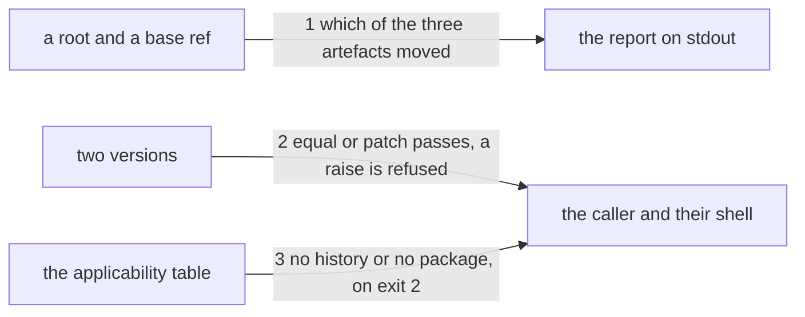

# Drawing: a-change-declares-its-class

_Written in architect mode from `requirements/a-change-declares-its-class`,
four criteria and four red tests. The closed requirements and their tests
were read first. `applies-here` fixes the applicability line, its exit code
and its empty stdout, and its unit test names the guarded list exactly, so
that list grows here and its test moves with it, which is a supersede of
the same kind `nothing-passes-vacuously` already made. `gates-v1` fixes
that a wall which cannot run is a failure and never a skip, which decides
what this wall does when git is absent. The human approves by merge._

## Structure

What exists: `bin/lib/applies.mjs`, one table asked before any branch
reads; `bin/kaal.mjs`, whose branches hand a root to a module;
`kaal.config.json`, the list of walls; `SURFACE.md`, the page a reader and
the wall both use.

What is new:

- **`bin/lib/class.mjs`**: reads two states of a tree through git, and
  answers which of three artefacts moved and whether the version's minor
  or major place changed. It spawns git and reads its output; it writes
  nothing anywhere.

What changes: `bin/lib/applies.mjs` gains a ninth entry; `bin/kaal.mjs`
gains a branch and the usage line; `kaal.config.json` gains the wall;
`SURFACE.md` gains a section, which is itself a surface move and will be
reported on the first run.

## Seams

1. **which of the three artefacts moved**: in, a root and a base ref; out,
   one line per artefact that moved, naming it `surface`, `tool` or
   `skills`, and no line for one that did not. The artefacts are named by
   path: `SURFACE.md`, `bin/`, and `skills/<name>/SKILL.md`. A change that
   touches only the league's own working, its requirements, drawings and
   retros, names none of the three, which is the case the contract holds
   because it is the common one and the easy one to get wrong.
2. **equal or patch passes, a raise is refused**: in, the version in the
   base's `package.json` and the version in the tree's; out, exit 0 when
   they are equal or differ only in the patch place, and exit 1 with one
   line on stderr naming both versions and saying the raise is the
   human's. Owned by the two files on one side and the board on the other.
3. **no history or no package, on exit 2**: in, a root; out, the
   applicability line, exit 2, empty stdout, when the root has no git
   history or no `package.json`. The table grows to nine entries and its
   unit test grows with it.

## Fixed and free

- Fixed: the words `surface`, `tool` and `skills` in the report; the exit
  codes, 0 for a patch or nothing, 1 for a raise, 2 for a tree this
  question is not about; the applicability line's shape, from
  `applies-here`; that the refusal names both versions; and that a surface
  move is reported and never refused while the version's minor and major
  places are zero.
- Free: the report's wording beyond those three words; how the diff is
  read, by name only or with a status; whether `--against` takes one ref
  or a range; where the version is parsed.

## Decisions

### The report names the surface and the refusal never does

- Chosen: a surface move is a line on stdout and exit 0.
- Not taken: treating a surface move as a raise, which is what ordinary
  SemVer would say and what a wall built from habit would do.
- Because: Kai's rule is that the version's minor place is his decision,
  not that the surface may not move. In 0.0.x the surface is expected to
  move; refusing it would put a human in the loop for every new command,
  which is precisely the thing he said is not a decision. The report is
  what will eventually let him make the decision from evidence.
- Reopens if: the version passes 0.0.x, when a surface move really does
  earn a minor bump and this rule inverts.

### The three artefacts are named by path, not configured

- Chosen: `SURFACE.md` is the surface, `bin/` is the tool,
  `skills/<name>/SKILL.md` are the skills, written in the module.
- Not taken: a list in `kaal.config.json`; deriving them from
  `package.json`'s `files`, which does not exist yet.
- Because: three paths in one module is one place to keep true, and a
  configured list is a second place that drifts from the first. When
  `files` exists it will say what ships, which is a different question
  from what a consumer can notice.
- Reopens if: an artefact appears that is not under one of the three
  paths, which would mean the tool ships something nobody named.

### A base that cannot be resolved is not this question either

- Chosen: when the base ref does not exist in the tree, the command says
  so on exit 2 with the applicability line, as it does for a tree with no
  history at all.
- Not taken: exit 1, treating an unresolvable base as a fault.
- Because: `actions/checkout` fetches one commit by default, so
  `origin/main` is absent in this repository's own CI, and a wall that
  goes red there would be deleted within a week rather than fixed. There
  is genuinely nothing to compare against, which is what exit 2 means. The
  wall therefore bites at push time, where the hook runs with the full
  refs, and is quiet in CI until the workflow fetches the base.
- Reopens if: the workflows fetch depth zero, which is one line and a
  governance change rather than this task's, at which point the wall bites
  in both places and a misspelled ref should probably become a fault.

### The base is a ref and defaults to origin/main

- Chosen: `--against <ref>`, defaulting to `origin/main`.
- Not taken: always the merge base, which is more correct on a stale
  branch; always `HEAD~1`, which is simpler and wrong on any branch with
  more than one commit.
- Because: a change's class is its class against what it will merge into.
  The default names the common case and the flag lets a test and a runner
  say otherwise, which is what makes the fixtures possible at all.
- Reopens if: the default branch is renamed, or a consumer's is not
  `main`, at which point the default is read rather than written.

## Test strategy

| criterion | layer      | kind          | why                                                 |
| --------- | ---------- | ------------- | --------------------------------------------------- |
| 1         | contract 3 | deterministic | the table's ninth entry, on two kinds of tree       |
| 2         | contract 1 | deterministic | the three artefacts, and the change that names none |
| 3         | contract 2 | deterministic | equal, patch, minor and major against one base      |
| 4         | acceptance | deterministic | adoption is not a boundary anything crosses         |

## Handoff

- Task: a-change-declares-its-class
- Seams: 3; contract tests: 3 (equal), beside this file; the fixtures are
  git repositories the tests build
- Red run:
  `node --test --test-timeout=60000 architecture/a-change-declares-its-class/contracts.test.mjs`;
  all three red, run and read. Stand-in green: all three, on a scratch
  module, branch, table entry, wall and page section, discarded
- Criteria served: seam 1 serves 2; seam 2 serves 3; seam 3 serves 1;
  criterion 4 is held by its acceptance test alone
- Fixed for the developer: the three words, the three exit codes, the
  applicability line, that both versions are named in the refusal, and
  that a surface move is never a refusal
- Next: the human approves by merge; then `code`
