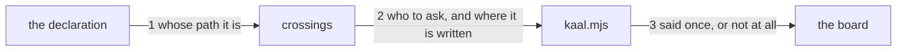

---
traces:
  parent: a-diff-carries-one-seat@fe9f8a9ca575778c548160fe4d1b06380d891842d9c87211a816a66e2f87207b
  requirement: a-crossing-names-its-owner@829ed5fc73b6256078dab8c9d70cd46ccc29b8e2f7a3e594b9df5f6c073dc342
  principles: the-two-goods@8bbe15706c3edcd63d0d050af9782c063cd585e1ec436d2314fa0003dfaa8cb6, the-seat-owns-the-lens@e1ab0650fc88dc8e1e16347fc8b14b236f1c57b94e50bfdf3f62aa4ec0d6d070
---

# Drawing: a-crossing-names-its-owner

One function knows the answer already and does not say it. This page is
mostly about where a sentence goes, and the one place it must not go.

## What the runs said

- The owner is a local variable. `bin/lib/seats.mjs` computes
  `const owner = seats.find((s) => any(p, s.owns))` inside the loop in
  `crossings`, uses it to build the `seat ` lines, and pushes
  `` `${p}: outside the lane ${lane?.pattern}` `` with no reference to it.
  Nothing else in the module reads it.
- Two callers and one of them is a closed proof. `crossings` is imported by
  `bin/kaal.mjs` at the seats command, and driven directly by
  `architecture/a-diff-carries-one-seat/contracts.test.mjs` seam 4. The
  closed contract asserts two findings from three paths, that each names its
  path, and that every one names the lane, all by substring; it asserts
  nothing about the rest of the string and nothing about a third field on the
  return.
- The wall has no units. `bin/lib/seats.test.mjs` names `matches` and
  `laneOf` and never `crossings`, so the contract above is the only thing
  holding this function's shape.
- The command already has the branch where no question is asked. Where
  `where.lane` is null and the diff carries paths, `bin/kaal.mjs` builds its
  findings from the declaration and the branch name and never calls
  `crossings` at all, so there is no lane to record a block in and nothing
  computes one.
- Three closed criteria read the finding as a substring.
  `a-diff-carries-one-seat` criterion 3 and the requirement's criteria 2 and
  3 for the dependency lane all assert `out.includes(path)` or match the lane
  pattern, and none of them pins the whole line. So words may be added to the
  end of a finding and none of them moves.

## Structure

Three parts, and only one of them is new.

- **`bin/lib/seats.mjs`, `crossings`** keeps the owner it already computes:
  each finding says whose path it is, or that no seat owns it, and the
  function answers one more thing than it does now.
- **the block**, the new part, is a sentence and not a page. It names every
  seat owed and the lane the block is recorded in, and there is one of it
  however many paths were refused.
- **`bin/kaal.mjs`, the seats command** prints that sentence where there is
  one, after the seat lines and before the findings, and nothing where there
  is not.

Nothing moves in `kaal.config.json`, in the board's fix line, or in
`AGENTS.md`. The declaration is what it was and the refusal still refuses.

## Seams

1. `crossings(list, lane, declaration)`: in the paths, the lane and the
   declaration; out a finding per refused path naming the path, the lane and
   the seat that owns the path, or saying that no seat owns it. Owned by
   `seats.mjs` / the seat rule.
2. `crossings(list, lane, declaration)`: out one sentence naming every seat
   owed and the lane the block is recorded in, and nothing where no refused
   path had an owner. Owned by `seats.mjs` / the seats command.
3. `kaal seats`: the sentence appears once where the wall answered one, and
   nowhere else, including on a branch no lane holds, which never asks.
   Owned by `kaal.mjs` / the board.

## Fixed and free

- Fixed: the owner is in the finding and not on a line of its own, by
  criteria 1 and 2. A reader who has the path has the name.
- Fixed: a refused path no seat owns says so in words, by criterion 2, and
  names none of the six seats.
- Fixed: one sentence about the block however many paths were refused, by
  criterion 5, naming every seat owed, by criterion 3, and the lane that was
  refused, by criterion 4.
- Fixed: the block never names the owner's tree, by criterion 4. A block is
  recorded where the blocked seat stands.
- Fixed: nothing is said about a path the lane allowed, by criterion 5.
- Free: the wording of both sentences, the name of the field `crossings`
  answers with, whether the seats owed are collected in the loop or derived
  from the findings afterwards, and where in the printed answer the sentence
  sits, so long as it is there once.

## Decisions

### The owner is in the finding, not on a line of its own

- Chosen: each finding carries the name, appended to the sentence it already
  is.
- Not taken: a second line per refused path, which makes the reader pair two
  lines by path; naming the owner only in the block sentence, which leaves a
  diff crossing two seats with no way to tell which path is whose.
- Because: the refusal and the name answer one question asked in one breath.
  A reader who sees a path refused asks whose it is immediately, and an
  answer on another line is a join the reader has to perform. The runs say
  every closed criterion reads this line by substring and none pins it whole,
  so the room to say more is already there.
- Bought: the shortest path to value, and it spent the line's stability: the
  finding is now a longer sentence that three closed criteria read, so a
  later change to its front is a change under all three.
- Weighed against: the-two-goods.
- Reopens if: a finding has to be machine read as fields rather than as
  prose, at which point every wall's finding is the same question and not
  this one's.

### One block for the diff, not one per path and not one per seat

- Chosen: one sentence, naming every seat owed.
- Not taken: one per refused path, which says the count the refusal already
  gave and says it twice; one per seat owed, which is defensible and costs a
  line per seat for nothing the blocked seat will use.
- Because: the block is a message about this diff, and the seat that writes
  it writes one. Criterion 5 fixes that it is not one per path; going further
  to one per seat would make a diff that reached two trees read as two
  negotiations when the seat has one thing to say.
- Bought: the shortest path to value, and it spent the reader who wants to
  act on one seat at a time, who now reads a list rather than a line.
- Weighed against: the-two-goods.
- Reopens if: a block becomes a page rather than a sentence, which is the
  asker's item 6, at which point one page per seat owed is probably right and
  this sentence is what points at them.

### The wall answers the block and the command prints it

- Chosen: `crossings` returns the sentence beside the findings and
  `bin/kaal.mjs` prints it.
- Not taken: the command building the sentence from the findings, which is
  parsing prose the command itself was handed; the wall printing it, which
  makes a library that answers a question into one that writes to a stream
  and cannot be asked.
- Because: who owns which path is the declaration's knowledge and
  `seats.mjs` is the one place that reads the declaration. The method is how
  an answer is shown and the lens is what it is about; the owner is the lens,
  so it belongs where the seat rule already looks rather than where the
  output is formatted.
- Bought: keeping choices open, because the sentence can be asked for by
  anything that can ask the wall a question, and it spent the shape of the
  return: `crossings` answers three things where it answered two.
- Weighed against: the-seat-owns-the-lens.
- Reopens if: a second caller wants the seats owed as data rather than as a
  sentence, at which point the sentence is built from a list the function
  also returns.

### A moved proof is a refusal and gains nothing here

- Chosen: `proofs` and its findings are untouched.
- Not taken: giving the same treatment to a changed acceptance test, a
  requirement fixture or a drawing contract, which also refuse with an owner
  and are arguably the same negotiation.
- Because: the requirement asks about a path outside the lane and says so in
  every criterion, and a moved proof is refused for a different reason: it is
  a proof somebody else wrote, and the way through it is a supersede rather
  than a message. Two refusals that happen to both have an owner are not one
  rule, and the drawing that decided they were would have enlarged the task
  without the asker.
- Bought: the shortest path to value, and it spent consistency: two refusals
  in the same answer will read differently, one naming a seat and a block and
  the other naming a file.
- Weighed against: the-two-goods.
- Reopens if: the asker says a supersede is a negotiation too, which is a
  question the requirement did not ask.

## Test strategy

| criterion | layer    | kind          | why                                                                                     |
| --------- | -------- | ------------- | --------------------------------------------------------------------------------------- |
| 1         | contract | deterministic | seam 1: the finding for a path a seat owns, driven at the function                      |
| 2         | contract | deterministic | seam 1: the finding for a path no seat owns, the same function and the other branch     |
| 3         | contract | deterministic | seam 2: the sentence names every seat owed                                              |
| 4         | contract | deterministic | seam 2: the sentence names the lane and never the owner's tree                          |
| 5         | contract | deterministic | seams 2 and 3: one sentence for the diff, and none where the question was never asked   |
| none      | unit     | none          | the wall has no unit file and this adds one branch to a loop a contract drives directly |
| none      | manual   | none          | nothing here reaches a screen or a person                                               |

## Handoff

- Task: a-crossing-names-its-owner
- Seams: 3; contract tests: 3 (equal)
- Red run: `node --test --test-timeout=60000
architecture/a-crossing-names-its-owner/contracts.test.mjs`, 13 September
  2026, all 3 failing, and each one failing on its own as well
- Stand-in green: all three, and the requirement's five, and the closed
  tasks that read this finding by substring, discarded from file copies
- Criteria served: seam 1 -> 1 and 2; seam 2 -> 3, 4 and 5; seam 3 -> 5
- Fixed for the developer: the owner is in the finding; a path no seat owns
  says so and names no seat; one sentence about the block naming every seat
  owed and the lane, and never the owner's tree; nothing about a path the
  lane allowed; nothing about a block where no lane holds the branch
- Build order: seam 1, because seam 2 has nothing to collect until a refused
  path has an owner. Then 2 and 3 together
- Blocked on: nothing
- Answers this drawing gives to the requirement's open questions: none. All
  three are the asker's and the analyst's, and the third, whether a shared
  path deserves the same sentence, is the one this drawing brushes against
  and leaves alone: a shared path is not refused, so there is nothing to name
- Supersedes: nothing
