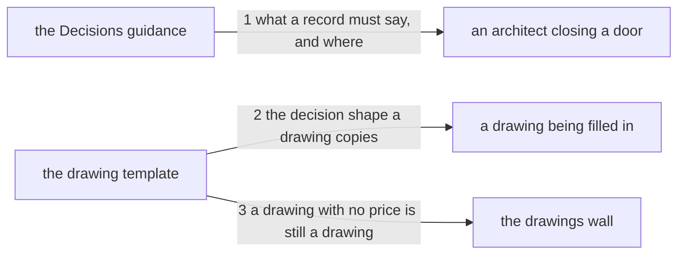

---
traces:
  requirement: a-decision-balances-two-goods
  principles: nothing
---

# Drawing: a-decision-balances-two-goods

_Written in architect mode from `requirements/a-decision-balances-two-goods`,
four criteria and four red tests. The closed requirements on this skill were
read first: `architect-v2` fixed the sections and their order and its tests
name the Decisions bullet, and `a-drawing-fixes-more-than-structure` fixed
that a text change names the section a sentence lives in, its order among the
sentences already there, and the words the contract reads. The records below
carry a `Bought:` line the template does not have yet, which is the change
this task makes; writing them under the old shape would have been the first
thing a reader noticed._

## Structure

Two files change and nothing else. Both are text a person reads, and the
readers are different people at different moments.

- **the Decisions guidance** (`skills/architect/SKILL.md`, changes): one
  bullet in section 2, read by an architect who is about to close a door. It
  says today what a record contains and that a choice with no options was
  never a decision. It gains what a choice costs.
- **the drawing template** (`skills/architect/references/drawing.md`,
  changes): the decision shape, copied by an architect who is filling a
  drawing in. Four labelled lines become five.
- **the drawings wall** (`bin/lib/drawings.mjs`, unchanged): it reads a
  drawing for its six sections, its edges against its seams, its contract
  tests and its strategy table. It does not read a decision's fields, and
  this task does not teach it to.
- **the drawings already written** (`architecture/<task>/`, unchanged):
  thirty-eight of them, under the four-line shape. They stay as they are.

## Seams

1. **what a record must say, and where**: in, the Decisions bullet of the
   skill's section 2; out, the two goods named in the asker's words and said
   to pull apart, the rule that a record names which of the two the choice
   bought and what it spent on the other, that a choice costing nothing on
   either side is a detail rather than a decision, and the instruction to
   read the foreclosed side against what the task exists to deliver. Owned by
   the skill's text on one side and every architect reading it on the other.
2. **the decision shape a drawing copies**: in, the template's decision
   block; out, five labelled lines, the four that are there in the order they
   are in, and `Bought:` between `Because:` and `Reopens if:`. Owned by the
   template and every drawing written from it.
3. **a drawing with no price is still a drawing**: in, a root holding a
   drawing whose decisions carry the four old lines; out, `kaal drawings`
   finds nothing to say. Owned by the template on one side and the wall on
   the other: a shape that grows must not redden what was written before it
   grew, and thirty-eight drawings in this tree were.

## Fixed and free

- Fixed: the two goods in the asker's own words, the shortest path to value
  and keeping the most choices open (criterion 1); the words `bought` and
  `spent` in the rule, which the contract reads (criterion 2); the word
  `foreclos` and, in the same sentences, what the task is for (criterion 3);
  the four existing template labels and their order, with `Bought:` between
  `Because:` and `Reopens if:` (criterion 4); the new sentences live in the
  Decisions bullet and nowhere else; `bin/` is not touched; the drawings
  already in the tree are not amended.
- Free: the wording beyond those words; whether the new material is one
  paragraph or two; the placeholder after `Bought:` in the template; whether
  the sentence about a costless choice points at Fixed and free or says
  nothing about where such a detail goes.

The order inside the bullet is a promise like any other. What is there now
comes first, because it answers a different question: whether a choice
existed at all. The price follows, because it only makes sense once there
was a choice. The check of the foreclosed side comes last, because it is
what you do after you have named the price.

## Decisions

### The price is a field and not a clause inside Because

- Chosen: a fifth labelled line, `Bought:`.
- Not taken: a clause inside `Because:`, which reads better; a `Cost:` line,
  which names only the half that is spent.
- Because: a missing field is visible and a missing clause is not. A reader
  scanning four records sees the gap immediately, and a wall that later wants
  to count prices can read a label rather than guess at prose. `Bought:`
  names both halves in one word: what you got, and by implication what you
  gave for it.
- Bought: choices kept open, since the wall in the requirement's first open
  question stays available at no further cost. It spends a little of the
  shortest path: every record from here carries a fifth line, including the
  ones where the price is small.
- Reopens if: the field fills up with restatements of `Because:`, which would
  mean the two were one thought and the clause was right.

### Nothing gates, and the guarantee is what that costs

- Chosen: no wall. The rule is a discipline the skill states and a reader
  honours.
- Not taken: the drawings wall refusing a record with no `Bought:` line.
- Because: the ask was about how an architect thinks, and a wall is a bigger
  step than the ask. A wall would also redden every drawing in the tree until
  each was amended, which is history paying for a rule about the future.
- Bought: the shortest path to the thing Kai asked for. It spends the
  guarantee: a record can omit the price and nothing will notice, so the rule
  holds only as long as the reader does.
- Reopens if: records start arriving without prices. The wall is then the
  answer and the tree is still small enough to amend.

### The drawings already written are not retrofitted

- Chosen: leave all thirty-eight under the four-line shape.
- Not taken: adding `Bought:` to each; adding it to the recent ones only,
  which would leave a line nobody can date.
- Because: they were written under the shape that was current, and rewriting
  history to match a new rule is the thing this repository does not do. The
  correction convention this tree used on `a-change-declares-its-class` this
  afternoon is for a record found wrong, not for a record found old.
- Bought: the shortest path, and the history stays readable as what people
  actually did. It spends something real: a reader of an old record cannot
  tell whether the choice was free or merely unpriced, and there is no marker
  that says which.
- Reopens if: a reader needs the price of an old decision badly enough to ask
  for it, at which point that one record is amended and says it was amended.

### The two goods keep the asker's words

- Chosen: the shortest path to value, and keeping the most choices open.
- Not taken: the vocabulary another discipline uses for the same pair, which
  would let a reader find more written about it elsewhere.
- Because: the ask is his and the words carry it. A rule translated on
  arrival is a rule somebody else wrote, and the skill is meant to sound like
  this tree.
- Bought: the shortest path, and nothing was invented. It spends reach: a
  reader who knows the pair by other names has to notice they are the same
  two, and this drawing does not help them.
- Reopens if: the skill is read by people who use different words for these
  goods often enough that the terms get in the way.

## Test strategy

| criterion | layer      | kind          | why                                                                          |
| --------- | ---------- | ------------- | ---------------------------------------------------------------------------- |
| 1         | contract 1 | deterministic | the sentences are in one bullet, and which bullet is decidable by reading    |
| 2         | contract 1 | deterministic | the same bullet, and the same reading; one seam, so one test holds all three |
| 3         | contract 1 | deterministic | the same bullet again, read as sentences rather than as a page               |
| 4         | contract 2 | deterministic | the template's labels and their order are a list, and a list is compared     |

Seam 3 serves no criterion. It holds the constraint that the drawings already
written are not amended, which is a promise to thirty-eight files rather than
an observable the asker named, and it is the only one of the three that runs
a command.

## Handoff

- Task: a-decision-balances-two-goods
- Seams: 3; contract tests: 3 (equal), beside this file
- Red run:
  `node --test --test-timeout=60000 architecture/a-decision-balances-two-goods/contracts.test.mjs`;
  1 and 2 red, 3 green. Stand-in green: all three, on a scratch skill and
  template, discarded with `git checkout --`
- Green before the build: contract 3, and it is a guard rather than a
  defect. It says the wall's verdict on a four-line drawing does not change,
  which is true now and must stay true after the template grows; a test that
  only went green at the end would be testing the wrong thing.
- Criteria served: seam 1 serves 1, 2 and 3; seam 2 serves 4; seam 3 serves
  the constraint, not a criterion
- Fixed for the developer: the words under Fixed above, the order inside the
  bullet, and that `bin/` and the existing drawings are not touched. There is
  no unit layer: the diff is text and the two layers above are the whole
  proof, which `skills/code/SKILL.md` names as a case.
- Next: the human approves by merge; then `code`
