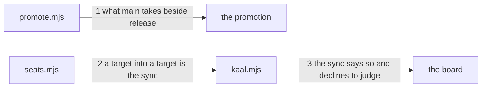

---
traces:
  parent: a-regression-is-a-promise-that-was-kept@6874c736926a89106c88a4e995b986980d3365643aa0260d12d537a4a3b76ea7
  requirement: a-dependency-update-lands-on-main@157cb0b0c397620ef0743fc0a86ed0ffa2172189c154e9ac00e7442d0c0165d9
  principles: the-two-goods@8bbe15706c3edcd63d0d050af9782c063cd585e1ec436d2314fa0003dfaa8cb6, the-seat-owns-the-lens@e1ab0650fc88dc8e1e16347fc8b14b236f1c57b94e50bfdf3f62aa4ec0d6d070
---

# Drawing: a-dependency-update-lands-on-main

Delivery architecture: what this tree uses to deliver, and not what it
delivers. Nothing a consumer installs moves here; what moves is which heads
two targets take and what the engine says about a branch nobody in the league
wrote.

## What the runs said

- Two matchers, one weaker. `bin/lib/seats.mjs` exports `matches(path, glob)`
  with two wildcards, `*` for one segment and `**` for any number.
  `bin/lib/promote.mjs` carries its own three lines above `refusedHead`,
  splitting a pattern on `*` and joining with `[^/]*`, so nothing it reads can
  cross a slash. `matches(branch, "dependabot/*")` is false for a branch four
  segments deep and `matches(branch, "dependabot/**")` is true; the copy in
  `promote.mjs` cannot answer the second at all.
- The promotion refuses the first leg. `refusedHead("main",
"dependabot/npm_and_yarn/x-1", lanes)` answers `main takes only release`.
- The seat rule refuses the second leg, and the promotion never sees it.
  `matches("main", p)` is false for all ten declared lanes.
  `promotion.yml` is `on: pull_request: branches: [main]`, so it does not run
  on a pull request into `release` at all.
- `laneOf` already has the shape the sync needs. Where no lane matches and the
  branch is `PROMOTION_FROM`, it answers `{ branch, lane: null, promotion }`,
  and the `seats` command prints that and exits 2. The board now reads 2 as a
  wall that declined, which `a-wall-that-does-not-apply-reports` built.
- The board runs on both legs whatever they target. `ci.yml` is `on:
pull_request:` with no base filter, so every wall runs on a dependency update
  and on a sync.
- Nothing points Dependabot anywhere. `.github/dependabot.yml` declares two
  ecosystems and names no target branch.

## Structure

Five parts, one of them new to this tree's vocabulary.

- **`bin/lib/promote.mjs`** stops carrying a matcher of its own and reads the
  seat rule's, and `main` takes one named kind beside `release`.
- **`bin/lib/seats.mjs`** learns the other direction of what it already knows:
  a target opening into a target is the sync, as `release` opening into `main`
  is the promotion.
- **`bin/kaal.mjs`** prints the sync the way it prints the promotion.
- **`kaal.config.json`** gains the `dependabot/**` lane, seatless, allowing
  the workflows, the manifest and the lockfile. A governance diff, and not
  this drawing's to land.
- **`.github/dependabot.yml`** names `main` as its target, and
  `.github/workflows/promotion.yml` refuses a head that claims the lane and is
  not the bot. Both are governance's, and the second is the half the engine
  cannot hold.

## Seams

1. `refusedHead(into, from, lanes)`: `main` takes `release` and a branch a
   dependency update opens, and refuses every other head in the words it uses
   now. The pattern that admits it crosses a slash, which is why this module
   reads the seat rule's matcher rather than the one it carried. Owned by
   `promote.mjs` / the promotion.
2. `laneOf(root, env)`: where no lane matches and the branch is a target, out
   that this is the sync, the way it already answers that `release` is the
   promotion. Owned by `seats.mjs` / the seats command.
3. `kaal seats`: a tree on the sync says so on stderr and exits 2, which the
   board reads as a wall that declined rather than one that failed. Owned by
   `kaal.mjs` / the board.

The matcher is not a seam of its own. Reading the seat rule's rather than a
copy has no surface a contract can drive that seam 1 does not already drive:
a branch four segments deep is admitted only by a pattern that crosses a
slash, so the choice is proven where it is used. A test that asserted the
module exports no matcher would pass today and prove nothing, which is what
the first draft of this page had.

## Fixed and free

- Fixed: one matcher, in `seats.mjs`, read by both, and `promote.mjs`'s own
  three lines deleted. Two readers of one rule drift, and this pair has
  already: the weaker copy cannot express the pattern the lane needs.
- Fixed: `main` takes `release` and a dependency update and nothing else, by
  criterion 4, and refuses every other head in the words
  `a-promotion-names-what-it-refuses` fixed.
- Fixed: the sync answers that it is the sync and names no seat, by criterion
  5, and it exits the code a wall uses to decline rather than to fail.
- Fixed: what the lane allows is the workflows, the manifest and the lockfile,
  by criterion 2, and a whole bump passes in it, by criterion 3. Both are the
  governance diff's to declare and this drawing fixes the list.
- Fixed: Dependabot names `main` as its target rather than following a
  default, by criterion 6.
- Free: the wording of the sync's sentence, whether seam 2 reads the lane
  name or the paths, the name of any helper, and where in the config the lane
  sits.

## Decisions

### One matcher, and the weaker copy goes

- Chosen: `promote.mjs` imports `matches` from `seats.mjs` and deletes the
  three lines it carries.
- Not taken: widening the copy to know `**`, which leaves two implementations
  of one rule that now agree; leaving it and expressing the lane without `**`,
  which no branch Dependabot opens would match.
- Because: the copy is not a different rule, it is the same rule written
  worse, and the difference only became visible when a pattern needed to cross
  a slash. A tree with two readers of one rule has met that twice this release
  already, in the board's verdict and in the regression wall's.
- Bought: one definition of what a pattern means, and it spent the
  independence of the promotion from the seat rule's module: a change to
  `matches` now reaches the promotion without anybody looking there.
- Weighed against: the-two-goods.
- Reopens if: the seat rule needs a pattern language the promotion should not
  have, which would be a reason to name two rules rather than to keep two
  spellings of one.

### The engine says what may ride, the workflow says who

- Chosen: `refusedHead` admits a head by the lane it is in and the engine asks
  nothing about who opened the pull request. `promotion.yml` refuses a head
  claiming that lane whose author is not the bot.
- Not taken: reading the author in the engine, which ties it to one provider;
  reading nothing, which lets a person push `dependabot/x` carrying a workflow
  file and ride into `main`.
- Because: `kaal` reads a tree and a branch. It cannot know who opened a
  pull request without being told by a provider, and this engine is meant to
  run under any of them. The paths are the evidence the engine has and the
  author is the evidence the workflow has, so the check is split where the
  knowledge is and neither half is the whole answer.
- Bought: the engine stays vendor agnostic, and it spent a rule that is only
  whole where the workflow runs: a tree checked out anywhere else admits a
  branch by name.
- Weighed against: the-seat-owns-the-lens.
- Reopens if: a second provider is added, at which point the author check is
  written twice and belongs somewhere one of them can share.

### The sync is what the promotion is, in the other direction

- Chosen: `laneOf` answers that a target opening into a target is the sync,
  and the seats command prints it and exits 2, which the board now reads as a
  wall that declined.
- Not taken: a `sync/*` lane, which needs a branch named for it and the sync's
  head is `main` itself; letting the sync read as a lane's diff, which would
  have the seat rule judge every seat's merged work at once.
- Because: a sync carries whatever `main` has that `release` lacks, which is
  as little one seat's diff as a promotion is. The tree already has that
  shape, written for the other direction, and the answer the board needed for
  it landed two tasks ago. This is one branch in a function that already
  branches.
- Bought: the sync needs no new vocabulary, and it spent the distinction
  between the two directions: a reader of `laneOf` now has two near identical
  answers and must read which one it got.
- Weighed against: the-two-goods.
- Reopens if: a target is added, at which point a target opening into a target
  stops naming one road.

## Test strategy

| criterion | layer    | kind          | why                                                                                        |
| --------- | -------- | ------------- | ------------------------------------------------------------------------------------------ |
| 1         | none     | none          | the lane is a line in the config, declared by governance and proven by the acceptance case |
| 2         | none     | none          | the same: what a lane allows is data, and the seat rule that reads it is closed            |
| 3         | none     | none          | the same                                                                                   |
| 4         | contract | deterministic | seams 1 and 2: the head main takes, over a pattern that crosses a slash                    |
| 5         | contract | deterministic | seams 3 and 4: a target opening into a target, and the code it exits on                    |
| 6         | none     | none          | the target branch is a line in a configuration file the acceptance case reads              |
| none      | unit     | none          | the readers are one import and one branch, and a contract sees both                        |
| none      | manual   | none          | nothing here reaches a screen or a person                                                  |

## Handoff

- Task: a-dependency-update-lands-on-main
- Seams: 3; contract tests: 3 (equal)
- Red run: `node --test --test-timeout=60000
architecture/a-dependency-update-lands-on-main/contracts.test.mjs`, 13
  September 2026, all 3 failing, and each one failing on its own as well
- Stand-in green: all three, and the requirement's six once the lane and the
  target branch were staged beside them, discarded from file copies. The
  seams cost one import, one branch in a function that already branches, and
  four lines in the command. What it found was in this page rather than in the
  tree: the first draft drew the matcher as a seam of its own, and its
  contract asserted that `promote.mjs` exports no matcher, which was already
  true and proved nothing. A seam whose only test is a tautology is not a
  seam, and it is folded into the one that uses it
- Criteria served: seam 1 -> 4; seams 2 and 3 -> 5.
  Criteria 1, 2, 3 and 6 are data in two configuration files and the
  acceptance cases read them at the surface, which is why the table has no
  contract row for them and says so
- Fixed for the developer: one matcher and the copy deleted; `main` takes
  `release` and a dependency update and nothing else; the sync answers that it
  is the sync and exits 2; the engine asks nothing about an author
- Build order: the matcher first, because seam 1 cannot express its pattern
  without it. Then seam 1, then 2 and 3 together
- Blocked on: nothing in the build. The `dependabot/**` lane, the target
  branch and the author check are one governance diff that follows, and the
  contracts drive scratch trees
- Answers this drawing gives to the requirement's open questions: the second,
  who may ride this road, is answered by the second decision: the paths are
  the engine's and the author is the workflow's. The others are the asker's
  and are untouched
- Supersedes: nothing
