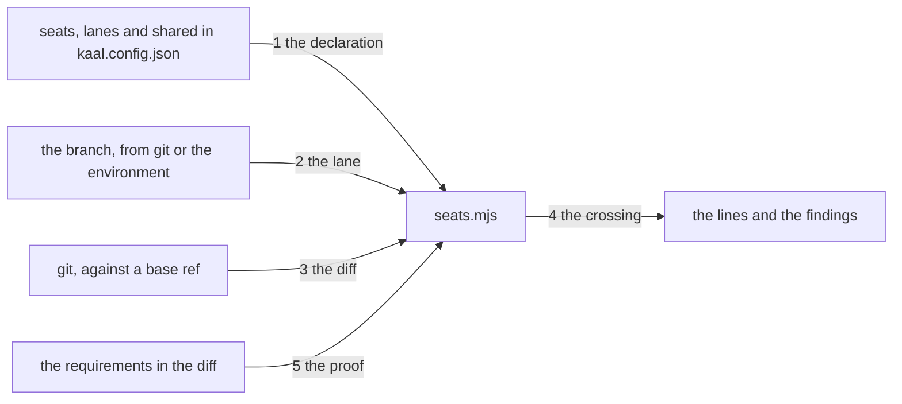

---
traces:
  requirement: a-diff-carries-one-seat@5ee681e3a46a65af292ad3a1e5e3bb89d0e22f0dce3f1eae1cf0e6b9ef483004
  principles: the-two-goods@8bbe15706c3edcd63d0d050af9782c063cd585e1ec436d2314fa0003dfaa8cb6, the-seat-owns-the-lens@e1ab0650fc88dc8e1e16347fc8b14b236f1c57b94e50bfdf3f62aa4ec0d6d070
---

# Drawing: a-diff-carries-one-seat

## What the runs said

- A diff is already read in this tree and the reader is exported.
  `bin/lib/class.mjs` exports `resolves(root, ref)`, which asks git whether a
  ref names a commit, `changed(root, base)`, which is
  `git diff --name-only <base>` filtered to non empty lines, and
  `DEFAULT_BASE`, which is `origin/main`.
- `changed` reads tracked files only and its own comment says why: "a file
  git has never seen is not yet part of the change, and it is at the push
  that it becomes one". Grepping `bin/` for `ls-files` finds nothing, so no
  command in this tree reads an untracked file today.
- CI has no branch. Every job in `.github/workflows/ci.yml` uses
  `actions/checkout`, which on a pull request leaves HEAD detached at the
  merge ref. Run here on a detached HEAD, `git rev-parse --abbrev-ref HEAD`
  answers `HEAD` and not a name. So a wall that reads a lane off the branch
  reads nothing at all in the place a reviewer looks.
- Git pairs a rename and says so. On a scratch tree, moving a unit suite from
  `tests/` to `bin/lib/` and staging it, `git diff --name-status -M main`
  answers one line, `R100 tests/rules.test.mjs bin/lib/rules.test.mjs`.
- And it does not pair one that is only half made. The same move left
  unstaged answers `D tests/rules.test.mjs` and nothing else, because the
  arrived file is untracked and `git diff` never reads untracked content.
  `git ls-files --others --exclude-standard` lists it separately. The pairing
  appears the moment the file is added.
- There is nothing to glob with. `package.json` has one development
  dependency, the formatter, and ships `files: ["bin"]`, so anything added to
  `dependencies` ships to every consumer of the engine. Four modules use
  node's own `globSync`, which walks a directory and cannot answer whether a
  path string matches a pattern.
- The guarded list is thirteen and its unit asserts that no two commands
  refuse a foreign tree in the same words. A fourteenth entry that says
  `no kaal.config.json under X` would collide with `gates`, which the
  applicability unit caught four hours ago between `runs` and `coverage`.
- Twelve of the last twenty commits on main touch more than one seat, and
  two of those crossings are a tool's: `kaal traces --write` calls
  `writeCounts`, which rewrites the suite count in `tests/plans/*.md`, so any
  diff adding a suite moves a file in the tester's directory.
- Seven of the last thirty commits touching `kaal.config.json` are builds.
  The board is thirteen walls green.

## Structure

One module, one command, one gate, and a declaration in the config.

- `kaal.config.json` gains three lists. `seats` is a name and the paths each
  owns; `lanes` is a branch pattern, the one seat it carries or none, and the
  paths that lane allows besides its seat's; `shared` is the paths any lane
  may change.
- `bin/lib/seats.mjs` is new. It reads the declaration, reads the branch,
  reads the diff, and answers four questions: whether the declaration is
  coherent, which lane the branch is in, which seats the diff touches and
  which of its paths the lane does not allow, and whether a proof was changed
  by a seat that did not write it.
- `bin/kaal.mjs` gains `seats [root] [--against <ref>]`, shaped like `class`.
- `bin/lib/applies.mjs` gains a fourteenth entry whose reason names its own
  question, because `gates` already reads the same file.
- `kaal.config.json` gains a fourteenth gate whose fix says to split the diff
  or rename the branch.
- `AGENTS.md` says the same seats and the same lanes, and stops naming a lane
  that carries three of them.

## Seams

One labelled edge per seam, numbered to match the list below; the parts are
the structure's parts. The list is the contract; the picture is the reading,
and it carries nothing the list does not.

1. the declaration: in the config, out the seats with the paths each owns,
   the lanes with their patterns, seats and allowed paths, and the shared
   paths; and a finding naming the path where two seats own one, and a
   finding naming the lane where one lane carries two seats. A lane carrying
   no seat is not a finding, because four of them carry none. Owned by
   `seats.mjs` / `kaal.config.json`.
2. the lane: in a root, out the branch the tree is on and the lane whose
   pattern it matches; out a finding naming the branch and every pattern
   where it matches none and the diff carries a path; out an answer where it
   matches none and the diff carries nothing. Where HEAD names no branch the
   name comes from `KAAL_BRANCH`, and where neither exists the question is
   not this tree's. Owned by `seats.mjs` / git and the environment.
3. the diff: in a root and a base ref, out every path the change carries,
   with a rename reported as the one path it landed at rather than two; out
   that the question is not this tree's where the ref names no commit. An
   empty answer and no answer are different answers, because a caller that
   cannot tell them apart calls a broken ref a clean tree. Owned by
   `seats.mjs` / git.
4. the crossing: in the paths, the lane and the declaration, out one line
   beginning `seat ` per seat the diff touches, and one finding naming the
   path and the lane for every path the lane's seat does not own, the lane
   does not allow, and `shared` does not list. Owned by `seats.mjs` / the
   findings.
5. the proof: in the paths and every requirement in the diff, out a finding
   naming a changed acceptance test, requirement fixture or contract test,
   and nothing where a requirement in the same diff declares a supersede of
   the task that owns it. The finding names the file and not the seat,
   because the reader needs the file. Owned by `seats.mjs` / the requirements
   in the diff.

## Fixed and free

- Fixed: the three lists live in `kaal.config.json` and nowhere else, and
  `AGENTS.md` is checked against them rather than repeating them. Criteria 1
  and 7.
- Fixed: the seats are four. The analyst owns `requirements/**`, the
  architect `architecture/**`, the tester `tests/**`, the developer `bin/**`
  and `SURFACE.md`. The surface page is the developer's because a change to
  what a command does and a change to the page that says so are one act, and
  a league that lands them apart ships an undocumented command in between.
- Fixed: the lanes are nine and four of them carry no seat.
  `requirement/*` the analyst, `architecture/*` the architect, `build/*` the
  developer, `test/*` the tester; `governance/*` allowing `AGENTS.md`,
  `CLAUDE.md`, `README.md`, `kaal.config.json`, `.github/**`, `kaal/**`,
  `package.json` and `waivers/**`; `skill/*` allowing `skills/**`; `agent/*`
  allowing `agents/**`; `eval/*` allowing `evals/**`.
- Fixed: `shared` is `retros/**` and `tests/plans/*.md`, and nothing else.
  Every seat writes a retro, and the plans carry a count a tool writes.
- Fixed: `kaal.config.json` is governance's alone and is in no seat and in no
  other lane's allows. A build that adds a wall is two pull requests. This is
  the one path where the guard's own declaration lives, and a lane that can
  widen itself is not a guard.
- Fixed: the branch is read from git, and from `KAAL_BRANCH` only where git
  names none. Decision 1.
- Fixed: `resolves` is imported from `class.mjs` and `changed` is not.
  Decision 2.
- Fixed: a rename belongs to where it lands, as git reports it. Decision 3.
- Fixed: the escape is a declared supersede in a requirement in the same
  diff, read from its `traces` and its `- Supersedes:` line, which the trace
  wall already holds to each other. A flag is never the escape.
- Fixed: the escape excuses the proof rule and never the crossing. A build
  that must move another task's proof is doing analyst work, and a declared
  supersede makes that legitimate as an act without making it one lane.
- Fixed: the seams are named functions, because a contract test drives a seam
  and cannot drive one that has no name. `bin/lib/seats.mjs` exports
  `readSeats(root)` for seam 1, `laneOf(root)` for seam 2,
  `paths(root, base)` for seam 3, `crossings(paths, lane, declaration)` for
  seam 4, and `proofs(root, paths)` for seam 5. What is behind each of them
  is the developer's.
- Fixed: the fourteenth applicability entry names its own question rather
  than the file, the way `release` and `class` do, and the way `runs` and
  `coverage` had to learn four hours ago.
- Free: how the module caches anything it reads.
- Free: the wording of every finding, except that criterion 3's names a path
  and a lane, criterion 4's names the branch and every pattern, and criterion
  5's names a file.

## Decisions

### The branch comes from git, and a runner may fill it in

- Chosen: read the branch from git; where HEAD names no branch, read
  `KAAL_BRANCH`; where neither answers, the question is not this tree's.
- Not taken: reading a provider's own variable; taking the branch as a
  command line argument; answering clean where there is no branch; asking git
  which branches contain HEAD.
- Because: the lane is the one declaration a person makes before the work,
  and CI is where a reviewer reads it, and on a pull request CI has no branch
  at all. A provider's variable would put a vendor's name inside a vendor
  neutral engine; a command line argument would be a lane the caller chose at
  the moment of being judged, which is the answer this whole task refuses.
  One name the league owns keeps the tool neutral and moves the vendor's name
  to the workflow, where it already is.
- Bought: evidence, and it spent the shortest path. The workflow now has to
  set something, and a runner that sets nothing gets a wall that does not run
  rather than a wall that lies.
- Weighed against: the-two-goods.
- Reopens if: a runner cannot set an environment variable at all, at which
  point the fallback is a file the checkout writes and the same reading.

### This wall reads its own diff, and shares only the ref check

- Chosen: import `resolves` from `class.mjs`; read the diff here, with rename
  detection and with the untracked files beside it.
- Not taken: importing `changed` as well; moving both readers to a third
  module; a `git diff` of its own for the ref check too.
- Because: the two walls ask different questions and `changed` answers the
  other one. The class wall asks what a consumer notices moved, so tracked
  and unpaired is right there. This asks who may have moved it, so a rename
  has to be one act and a file a person has written and not yet added is
  still something they are about to land. Sharing `resolves` costs one line
  and keeps one answer to whether a ref exists; sharing `changed` would mean
  one of the two walls reading a diff that is not its own.
- Bought: keeping choices open, and it spent tidiness: there are now two
  readers of git in this tree and a reader who finds both must be told they
  differ on purpose. That is what this record is.
- Weighed against: the-two-goods, the-seat-owns-the-lens.
- Reopens if: a third wall wants a diff, at which point the question is which
  definition it wants and not which module it imports.

### A rename belongs to where it lands, and half a rename is not one

- Chosen: `git diff --name-status -M`, a paired `R` line reported as its
  arrival path alone; a delete with no pair stays a delete in the lane it
  left.
- Not taken: pairing by content ourselves; exempting renames with a flag, the
  way the sibling repository does; refusing to detect them at all.
- Because: moving a unit suite out of the tester's directory and beside its
  code is one person doing one thing, and it is the first thing this guard
  will meet: 21 of them are waiting. Two lanes would refuse the very move the
  seat rule exists to cause. Git already answers this and answers it better
  than we would, and a flag would be silent where the finding is not.
- The half made rename is the part worth knowing, and it was found by running
  it. An unstaged move answers `D` for the old path and lists the new one as
  untracked, because git never reads untracked content and so cannot pair it.
  The guard then reports a delete in one lane and an unowned arrival in
  another, which is two findings for one act. It is not wrong, it is early:
  the pairing appears the moment the file is added, and the fix line already
  tells a person to split or rename rather than to widen anything.
- Bought: the shortest path, and it spent a sharp edge on a person mid move.
- Weighed against: the-two-goods.
- Reopens if: the two findings on a half made rename mislead somebody into
  splitting a diff that did not need splitting, at which point the delete
  side needs to say what it is waiting for.

### Two wildcards and no dependency

- Chosen: a matcher of the league's own, supporting `*` for one segment and
  `**` for any number, and nothing else.
- Not taken: a glob library; node's `globSync` against the disk; regular
  expressions in the config.
- Because: `package.json` ships `files: ["bin"]` and has one development
  dependency, so a runtime dependency here ships to every consumer of the
  engine for the sake of matching a path against a pattern. `globSync` walks
  a directory and a deleted path is not on the disk to be walked. Regular
  expressions in the config would put a language in a declaration a person
  has to read at a glance.
- Bought: the shortest path for the consumer, and it spent expressiveness: no
  braces, no negation, no character classes. A declaration that needs one of
  those is a declaration that has stopped being readable.
- Weighed against: the-two-goods.
- Reopens if: a lane genuinely needs to exclude a path inside a path it
  allows, which is negation and which this cannot say.

### The plans are shared, and that is a debt with a name

- Chosen: `tests/plans/*.md` in `shared`, so any lane may carry the count a
  tool wrote there.
- Not taken: leaving the plans to the tester, which refuses every specify and
  every draw that adds a suite; making the count a separate file; stopping
  `traces --write` from writing it.
- Because: two of the last twenty commits on main cross a seat for no reason
  a person chose, and this guard cannot tell a tool's write from a person's.
  Sharing the file is the only answer available today that does not refuse
  correct work. It is also the weakest thing in this drawing: a shared path
  is a path the guard does not defend, and the plans are the tester's claim
  about what is proved.
- Bought: the shortest path, and it spent exactly the guarantee this task is
  about, on one file. The gap closes when a machine written count stops
  living in a seat's directory, which is the requirement's own second open
  question and is another task.
- Weighed against: the-two-goods, the-seat-owns-the-lens.
- Reopens if: anybody edits a plan's prose in a lane that is not the
  tester's, which is the harm this makes possible and which nothing here
  would catch.

## Test strategy

| criterion | layer      | kind          | why                                                                                                                                              |
| --------- | ---------- | ------------- | ------------------------------------------------------------------------------------------------------------------------------------------------ |
| 1         | contract   | deterministic | Seam 1. The declaration read as data, a config claiming one path for two seats, and a lane carrying a list where a name belongs.                 |
| 2         | contract   | deterministic | Seams 2 and 3. A scratch repository branched by name, one detached with the variable set and one detached without, and a ref that names nothing. |
| 3         | contract   | deterministic | Seam 4. A path the seat owns, a path the lane allows, a shared path, a path nobody owns, and a path another seat owns.                           |
| 4         | contract   | deterministic | Seam 2 again for the branch that matches no lane, with a change and without one, which is one function deciding both.                            |
| 5         | contract   | deterministic | Seam 5. A proof changed with a supersede declared in the diff and without one.                                                                   |
| 6         | acceptance | deterministic | The gate and its fix line are read from the config; there is no seam between a wall and the list it is named in.                                 |
| 7         | acceptance | deterministic | `AGENTS.md` read against the config; a page agreeing with a file is not a seam either.                                                           |
| none      | unit       | none          | The matcher, the one part with no seam of its own: a unit belongs to it and it is the developer's, named here so it is not forgotten.            |
| none      | manual     | none          | Nothing here needs a person to look, and the one judgement, whether a supersede is honest, no wall reads.                                        |

## Handoff

- Task: a-diff-carries-one-seat
- Seams: 5; contract tests: 5 (equal)
- Red run: `node --test --test-timeout=60000 architecture/a-diff-carries-one-seat/contracts.test.mjs`,
  all five failing on `bin/lib/seats.mjs` not existing
- Stand-in green: all five, on a scratch module, then discarded from file
  copies
- Isolations: five, one break at a time, each reddening exactly one seam
- Criteria served: seam 1 to 1; seam 2 to 2 and 4; seam 3 to 2; seam 4 to 2
  and 3; seam 5 to 5. Criteria 6 and 7 are readings of a config and a page and
  are served by the acceptance tests alone, which the strategy table says in
  full
- Fixed for the developer: the three lists and their contents; the branch read
  from git and filled in from `KAAL_BRANCH`; `resolves` shared and `changed`
  not; a rename as git reports it; two wildcards and no dependency; the
  fourteenth applicability entry naming its own question
- Owed with the build: `AGENTS.md` loses the lane that carries three seats and
  gains the four that carry one, which criterion 7 asserts; `CLAUDE.md` names
  five lanes and there are now nine, and it is the same sentence in a second
  place; `SURFACE.md` gains a `## seats` section
- Owed by the workflow and not by the module: every job in `ci.yml` sets
  `KAAL_BRANCH` from whatever its runner calls the head branch, or this wall
  answers that the question is not this tree's on every pull request. That is
  a governance diff and it is not the build's lane
