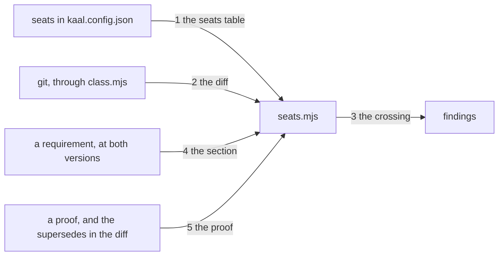

---
traces:
  requirement: a-diff-carries-one-seat@d42531ea2d01e5799848661d312accf5a1a96594eafc517fbcf937215544b562
  principles: the-two-goods@8bbe15706c3edcd63d0d050af9782c063cd585e1ec436d2314fa0003dfaa8cb6, the-seat-owns-the-lens@e1ab0650fc88dc8e1e16347fc8b14b236f1c57b94e50bfdf3f62aa4ec0d6d070
---

# Drawing: a-diff-carries-one-seat

## What the runs said

- A diff is already read in this tree and the reader is exported.
  `bin/lib/class.mjs` exports `resolves(root, ref)`, which asks git whether a
  ref names a commit, and `changed(root, base)`, which is
  `git diff --name-only <base>` filtered to non empty lines. Both are what
  the class wall stands on, so a second git reader would be a second answer
  to a question this tree already answers.
- `changed` passes no rename flag, so git reports a rename as a path removed
  and a path added. A case moved from `tests/` to `bin/lib/` therefore reads
  as two seats by the letter, which is the requirement's own open question
  arriving as a fact.
- The base version of a file is readable without a checkout:
  `git show main:tests/plans/acceptance.md` answers 20 lines. That is what
  makes a section comparison possible at all, because git compares files and
  a criterion here is about a part of one.
- The same section regex is written twice already, in `bin/lib/drawings.mjs`
  and `bin/lib/traces.mjs`, both as
  `^## ${title}\n([\s\S]*?)(?=^## |(?![\s\S]))`. A third copy is the
  cheapest thing in this build and the thing most likely to drift.
- Sorting the last twenty commits on main by the seat directories they touch,
  every specify and every draw touches one seat and every build touches three
  or four. That measurement is in the requirement and it is what this drawing
  has to make false rather than true.
- Two green pull requests merged twelve seconds apart made main red today,
  because each was tested against a base the other had not landed in. That is
  not this task's to fix and it is the reason its findings must name a path
  and not only a seat: a person reading a red board needs to know which file
  put them in which lane.

## Structure

One module, one command, one gate, and a declaration in the config.

- `kaal.config.json` gains `seats`: a list of `{ name, owns }`, where `owns`
  is the globs that seat is answerable for. The four are the analyst over
  `requirements/`, the architect over `architecture/`, the tester over
  `tests/`, and the developer over the code. Everything not matched belongs
  to nobody and is never a crossing.
- `bin/lib/seats.mjs` is new. It reads the declaration, reads the diff
  through `class.mjs`'s own reader, and answers four questions: whether the
  declaration is coherent, which seats a diff touches, whether a requirement
  changed in a part that is its analyst's, and whether a proof was changed by
  a seat that did not write it.
- `bin/kaal.mjs` gains `seats [root] [--against <ref>]`, shaped like `class`:
  the same base ref default, the same answer that the question is not this
  tree's where no base resolves.
- `kaal.config.json` gains a thirteenth gate running it, whose fix says to
  split the diff.
- `AGENTS.md` says the same four seats and the same paths, and stops naming a
  lane that carries three of them.

## Seams

One labelled edge per seam, numbered to match the list below; the parts are
the structure's parts. The list is the contract; the picture is the reading,
and it carries nothing the list does not.

1. the seats table: in the config, out one seat per declared glob and a
   finding naming the glob when two seats claim it. A path no seat claims
   answers no seat, which is an answer and not a finding. Owned by
   `seats.mjs` / `kaal.config.json`.
2. the diff: in a root and a base ref, out every path that differs and every
   path git has never seen, and out that the question is not this tree's when
   the ref names no commit. Read through `class.mjs`'s `resolves` and
   `changed` for the tracked half; the untracked half is one more call and
   the reason is below. An empty answer and no answer are different answers,
   because a caller that cannot tell them apart calls a broken ref a clean
   tree. Owned by `seats.mjs` / `class.mjs`.
3. the crossing: in the changed paths and the seats table, out nothing where
   one seat or none is touched, and a finding naming each seat and one path
   that put it there where two or more are. Owned by `seats.mjs` / the
   findings.
4. the section: in a requirement's path, its text now and its text at the
   base, out which of its named sections differ. A requirement whose Handoff
   or Build differs and whose Acceptance criteria does not is not its
   analyst's seat; one whose Acceptance criteria differs is. Owned by
   `seats.mjs` / git.
5. the proof: in the changed paths and every requirement in the diff, out a
   finding naming a changed acceptance test, requirement fixture or contract
   test, and nothing where a requirement in the same diff declares a
   supersede of the task that owns it. The finding names the file and not the
   seat, because the reader needs the file. Owned by `seats.mjs` / the
   requirements in the diff.

## Fixed and free

- Fixed: the seats and their globs are declared in `kaal.config.json` and
  nowhere else, and `AGENTS.md` is checked against them rather than repeating
  them. Criteria 1 and 7.
- Fixed: the diff is read through `class.mjs`. There is one reader of git in
  this tree and this is not a second one.
- Fixed: a rename is one act and belongs to the seat it lands in. `changed`
  reports it as two paths, so the module resolves a removed path that has a
  matching added path elsewhere to the added path's seat alone. Named here
  because the requirement asked and left it open.
- Fixed: the exemption in criterion 4 is by section and by task. Only the
  requirement whose task the diff is building is exempt, and only in its
  Handoff and its Build.
- Fixed: the escape in criterion 5 is a declared supersede in the same diff,
  read from a requirement's `traces` and its `- Supersedes:` line, which the
  trace wall already holds to each other. A flag is never the escape.
- Fixed: the escape excuses the proof rule and never the crossing. A build
  that must move another task's proof is doing analyst work, and a declared
  supersede makes that legitimate as an act without making it one seat. It
  is still two diffs, which is the whole ask read back: requirements and code
  do not travel together.
- Fixed: the seams are functions and they are named, because a contract test
  drives a seam and cannot drive one that has no name. `bin/lib/seats.mjs`
  exports `readSeats(root)` for the declaration and its findings,
  `seatOf(path, seats)` for one path's answer, `paths(root, base)` for the
  diff or null where the base names no commit, `sectionsChanged(root, base,
path)` for seam 4, and `checkSeats(root, base)` for the findings the wall
  prints. What is behind each of them is the developer's.
- Free: how the module globs, and whether it caches the base versions it
  reads. Nothing here fixes either.
- Free: the wording of every finding, except that criterion 3's names a seat
  and a path and criterion 5's names a file.

## Decisions

### The diff is read through the class wall's reader

- Chosen: import `resolves` and `changed` from `bin/lib/class.mjs`.
- Not taken: a `git diff` of its own in `seats.mjs`; moving both functions to
  a third module both walls import.
- Because: two readers of the same diff will one day disagree about what
  changed, and the disagreement will be between two walls on the same board,
  which is the worst place for it. Moving them to a third module is the
  tidier shape and it edits a closed wall to gain nothing this task needs;
  the import costs one line and the move costs a supersede.
- Not the whole reader, and the build found the seam. `changed` reads tracked
  files only, on purpose: its own comment says a file git has never seen is
  not yet part of the change the class wall measures. That is right there and
  wrong here. A new acceptance test is untracked until somebody adds it, and
  it is the whole of what this guard exists to notice, so this wall reads
  `git ls-files --others --exclude-standard` beside it. The two walls share a
  reader and not a definition of what a diff is, and that difference is the
  one thing about this decision worth remembering.
- Bought: the shortest path, and it spent tidiness. `class.mjs` is now a
  module two walls depend on while its name says one thing.
- Weighed against: the-two-goods.
- Reopens if: a third wall wants the same reader, at which point the module
  is a git reader wearing a class wall's name and should be renamed.

### A rename belongs to where it lands

- Chosen: a removed path whose content appears at an added path is one act,
  attributed to the added path's seat.
- Not taken: two seats, which is the letter of the diff; exempting renames
  from the check, which is what the sibling repository's guard does with a
  flag; asking git for rename detection with `-M`.
- Because: moving a unit case out of the tester's directory and beside its
  code is the first thing this guard will meet, and it is one person doing
  one thing. Two seats would refuse the very move the seat rule exists to
  cause. An exemption would be silent, and this is not: the finding, when
  there is one, names where the file landed. `-M` was not taken because it
  changes what `changed` returns and `changed` belongs to the class wall.
- Bought: keeping choices open, and it spent the shortest path: the module
  now reads content to pair a removal with an addition, which a path list
  alone would not need.
- Weighed against: the-two-goods, the-seat-owns-the-lens.
- Reopens if: a rename that also edits the file stops being recognisable, at
  which point the pairing needs a threshold and a threshold is a judgement.

### The exemption is a section and not a file

- Chosen: a requirement the diff is building may differ in its Handoff and
  its Build and nowhere else, and the module reads both versions of the file
  to know which.
- Not taken: exempting the whole requirement file, which is the cheap
  reading; forbidding the requirement entirely, which makes every build two
  pull requests; a marker in the diff saying which sections were meant.
- Because: the board already refuses an open task whose tests are all green,
  so a build that cannot write its own Handoff lands red by construction, and
  a guard that forces that is a guard nobody will keep. Exempting the whole
  file gives back exactly what this task exists to take away, which is a
  build editing the criteria it is being judged against. The section is the
  smallest thing that is both liveable and honest.
- Bought: evidence, and it spent parts: the module reads a file at two
  versions and cuts it into sections, which is the most machinery in this
  build and all of it for one criterion.
- Weighed against: the-two-goods.
- Reopens if: a requirement gains a section a build must write that is not
  the Handoff or the Build.

### The escape is a declaration and never a flag

- Chosen: a changed proof is allowed when a requirement in the same diff
  declares, in its `traces` and in its `- Supersedes:` line, the task that
  owns the proof.
- Not taken: a command line flag; a marker comment in the changed test; an
  allow list in the config.
- Because: the ask named the harm as the silence rather than the change, and
  a flag is silence with a keystroke. A declaration is read by the trace wall
  already, is reviewed with the diff, and survives in the tree afterwards as
  the record of who moved whose claim. This is the same reason `--no-verify`
  is refused here: an escape that leaves no trace is not an escape, it is a
  hole.
- Bought: keeping choices open, and it spent the shortest path: superseding
  now costs writing a requirement, which is heavier than a flag and is meant
  to be.
- Weighed against: the-two-goods, the-seat-owns-the-lens.
- Reopens if: a legitimate change to a proof turns up that no requirement can
  honestly declare.

### A thirteenth wall, and it reads a diff

- Chosen: a gate running `kaal seats`, beside the twelve.
- Not taken: folding it into the class wall, which already reads a diff; the
  push hook alone; a report that never refuses.
- Because: the board is where every wall in this league lives and a reader
  looks in one place. The class wall answers what a consumer notices moved
  and this answers who may have moved it; they share a reader and not a
  question, and a wall per question is the rule. The hook runs the board, so
  putting it on the board puts it on the hook for free.
- Bought: the shortest path, and it spent nothing this task can name: a
  thirteenth line on a board that already has twelve.
- Weighed against: the-two-goods.
- Reopens if: the board's own runtime becomes the thing that hurts, at which
  point the question is which walls run when and not which exist.

## Test strategy

| criterion | layer      | kind          | why                                                                                                                               |
| --------- | ---------- | ------------- | --------------------------------------------------------------------------------------------------------------------------------- |
| 1         | contract   | deterministic | Seam 1. The declaration read as data, and a config claiming one glob twice.                                                       |
| 2         | contract   | deterministic | Seam 2. A scratch repository with a base commit, and a ref that names nothing.                                                    |
| 3         | contract   | deterministic | Seam 3. One seat, two seats, and paths no seat owns.                                                                              |
| 4         | contract   | deterministic | Seam 4. The same requirement changed in its Handoff and changed in its criteria, which are two diffs and one file.                |
| 5         | contract   | deterministic | Seam 5. A proof changed with a supersede in the diff and without one.                                                             |
| 6         | acceptance | deterministic | The gate and its fix line are read from the config; there is no seam between a wall and the list it is named in.                  |
| 7         | acceptance | deterministic | `AGENTS.md` read against the config; a page agreeing with a file is not a seam either.                                            |
| none      | unit       | none          | Every rule here is a seam between the config, git and a page, and a unit of one would be the contract test with the seam removed. |
| none      | manual     | none          | Nothing here needs a person to look, and the one judgement, whether a supersede is honest, the board never reads.                 |

## Handoff

- Task: a-diff-carries-one-seat
- Seams: 5; contract tests: 5 (equal)
- Red run: `node --test architecture/a-diff-carries-one-seat/contracts.test.mjs`,
  all five failing; stand-in green: all five, then discarded from file copies
- Criteria served: seam 1 to 1; seam 2 to 2; seam 3 to 3; seam 4 to 4; seam 5
  to 5. Criteria 6 and 7 are readings of the config and a page and are served
  by the acceptance tests alone, which the strategy table says in full
- Fixed for the developer: the declaration's place and shape; the git reader;
  a rename belonging where it lands; the exemption by section and by task;
  the escape as a declared supersede; the thirteenth gate and its fix
- Owed with the build: `AGENTS.md` loses the lane that carries three seats,
  which criterion 7 asserts and which is the only page this task rewrites
