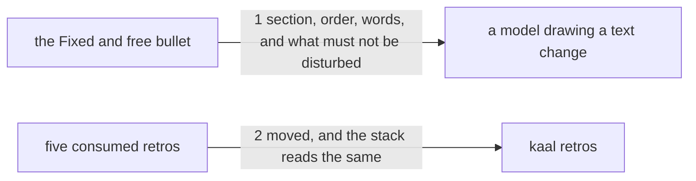

---
traces:
  requirement: a-drawing-fixes-more-than-structure@35f33a46a82c0e9e7a75d4259bb81b924cad6dfcfcb7caae3b6cb983d5d927c1
  principles: nothing
---

# Drawing: a-drawing-fixes-more-than-structure

_Written in architect mode from
`requirements/a-drawing-fixes-more-than-structure`, three criteria and
three red tests. Drawn beside `a-green-contract-is-declared`, which edits
a different section of the same file, and `what-proves-a-build`, which
edits another skill; the three land together as one run's drawings. The
closed requirements and their tests were read first: `architect-v2` fixes
this skill's numbered sections and the Fixed and free bullet's existing
sentences, which the tests below assert are undisturbed. No fixture of
this skill carries a runner, so nothing is regenerated. The human approves
by merge._

## Structure

What exists: `skills/architect/SKILL.md`, whose `## 2. Draw the want`
carries one bullet per section of the drawing template, and whose **Fixed
and free** bullet already says that for a text change the parts are the
sentences' places and the fixed words are what the contract reads.

What changes: that bullet, which gains the third thing a text drawing
fixes and the rule that an order is a promise; and five retro files, moved
to `retros/archive/`.

Nothing is new, and nothing in `bin/` changes.

## Seams

1. **section, order, words, and what must not be disturbed**: in, the
   **Fixed and free** bullet of `## 2. Draw the want`; out, that a text
   drawing fixes the section each sentence lives in, its order among the
   sentences already there, and the words the contract reads; that an
   order is a promise held by where each phrase first appears; and that a
   change joining an existing section names what must not be disturbed
   there. The contract reads that bullet, not the file, because a rule
   about drawing placed under Write the proof is read after the drawing
   is done.
2. **moved, and the stack reads the same**: in, five retro files; out,
   each under `retros/archive/`, none under `retros/`, and `kaal retros`
   reporting what it reported before, since consumption is by name. This
   seam is worded again in the other two drawings of this run, which is
   the duplication the thirtieth architect retro named; it is not fixed
   here, and saying so is better than pretending one of the three owns it.

## Fixed and free

- Fixed: that the rules join the **Fixed and free** bullet and open no new
  one; the phrases the tests read (`when the change is text`, `the section
each sentence lives in`, `its order among the sentences already there`,
  `the words the contract reads`, `an order is a promise`, `where each
phrase first appears`, `what must not be disturbed`); that the bullet's
  existing sentences stay, since `architect-v2` fixed them; and that the
  five files move rather than being deleted.
- Free: the wording beyond those phrases; whether the additions are one
  sentence or three; the order of the moved files.

## Decisions

### The rules join the bullet that already speaks about text

- Chosen: **Fixed and free**, which already says the parts of a text
  change are the sentences' places.
- Not taken: a bullet of its own, or a paragraph before the list.
- Because: a reader looking for what a text drawing fixes will look where
  the skill already talks about text, and two places that both answer
  that question is how one of them goes stale. The bullet is the
  question's home.
- Reopens if: text changes need more than a bullet's worth of guidance,
  at which point they need their own section rather than a second bullet.

### An order is named as a promise, not as a style

- Chosen: the rule says an order is a promise like any other and names how
  it is held.
- Not taken: saying only that order matters, leaving how to hold it to the
  writer.
- Because: a promise nobody knows how to test is advice. Two comparisons
  hold an order, and the whole strength of one drawing this week was an
  order that would have been free without them.
- Reopens if: the league grows a wall that can say "this must be read
  before that", which is the requirement's third open question; then the
  rule points at the wall instead of at a contract test.

## Test strategy

| criterion | layer      | kind          | why                                                  |
| --------- | ---------- | ------------- | ---------------------------------------------------- |
| 1         | contract 1 | deterministic | the three things, inside the bullet that owns them   |
| 2         | contract 1 | deterministic | the order rule and the undisturbed rule, same bullet |
| 3         | contract 2 | deterministic | archived, gone from the stack, counts unchanged      |
| 1, 2      | eval       | harnessed     | whether a model fixes an order; reports, never gates |

## Handoff

- Task: a-drawing-fixes-more-than-structure
- Seams: 2; contract tests: 2 (equal), beside this file
- Red run:
  `node --test --test-timeout=60000 architecture/a-drawing-fixes-more-than-structure/contracts.test.mjs`;
  both red, run and read. Stand-in green: both, on a scratch edit of the
  skill and a copy of the five files, discarded
- Criteria served: seam 1 serves 1 and 2; seam 2 serves 3
- Fixed for the developer: the bullet, the seven phrases, the untouched
  sentences beside them, and that the files move rather than being deleted
- Next: the human approves by merge; then `code`
