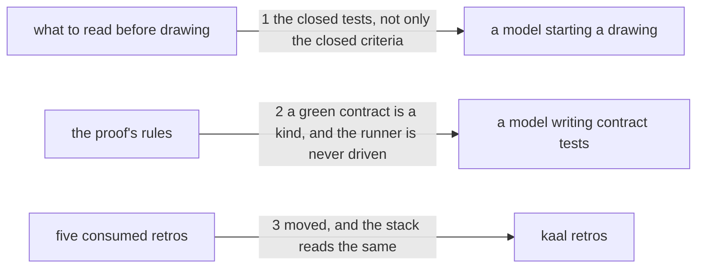

---
traces:
  requirement: a-green-contract-is-declared@3aea244786bd73be82048ccc6f9492f7aa1f1f6d141cf5c3eac7d019b17d1782
  principles: nothing
---

# Drawing: a-green-contract-is-declared

_Written in architect mode from `requirements/a-green-contract-is-declared`,
four criteria and four red tests, in the same run as
`a-drawing-fixes-more-than-structure` and `what-proves-a-build`. The closed
requirements and their tests were read first, which is what criterion 2 is
about: `architect-v2` fixes the numbered sections and the **Seen red**
bullet's wording, and the tests below assert that wording survives. The
human approves by merge._

## Structure

What exists: `skills/architect/SKILL.md`, whose `## 1. Read the
requirement, and refuse what is not ready` already says to read the closed
requirements whose criteria touch the path, and whose `## 3. Write the
proof` carries the rules a contract test must meet, including **Seen red,
then green on a stand-in**.

What changes: one sentence in section 1; the **Seen red** bullet in
section 3, which gains the green case; a new bullet in section 3 for the
runner; and five retro files moved to `retros/archive/`.

Nothing is new and nothing in `bin/` changes.

## Seams

1. **the closed tests, not only the closed criteria**: in, section 1's
   sentence about reading the closed requirements; out, that their tests
   are read as well as their criteria, because a closed test fixes shapes
   no criterion states. The contract reads section 1: a rule about what to
   read before drawing, met while writing the proof, is met too late.
2. **a green contract is a kind, and the runner is never driven**: in,
   `## 3. Write the proof`; out, that a contract green before the build is
   a guard on a reader or a rule that must not change and is named in the
   handoff with the reason it is green; and that a contract never drives
   the runner that runs it, because the runner runs the contracts, which
   run the caller, with the case proved on a fixture instead. The contract
   reads that section and asserts the existing **Seen red** wording is
   still there.
3. **moved, and the stack reads the same**: in, five retro files; out,
   each under `retros/archive/`, none under `retros/`, and the counts
   unchanged. Worded again in this run's other two drawings, which is the
   known duplication.

## Fixed and free

- Fixed: that the reading rule is in section 1 and both proof rules are in
  section 3; the phrases the tests read (`their tests as well as their
criteria`, `fixes shapes no criterion states`, `green before the build`,
  `a guard on a reader or a rule that must not change`, `the reason it is
green`, `never drive the runner that runs it`, `runs the contracts`,
  `prove the case on a fixture`); that the **Seen red** bullet keeps the
  sentences `architect-v2` fixed; and that the five files move.
- Free: whether the green case joins the **Seen red** bullet or follows
  it; the new bullet's title; the wording beyond those phrases.

## Decisions

### The green case joins the rule it contradicts

- Chosen: the green case is written where the skill says every contract
  test fails now, so a reader meets the exception beside the rule.
- Not taken: a separate bullet, which reads more tidily.
- Because: the sentence a reader needs to doubt is "every test fails now".
  An exception filed elsewhere leaves that sentence looking absolute, and
  the architect who believes it writes a guard and then deletes it.
- Reopens if: the guard case grows past a sentence or two, at which point
  it is its own rule rather than an exception to one.

### The runner rule is written for any repository, not for this one

- Chosen: a contract never drives the runner that runs it, with the
  mechanism named in general terms.
- Not taken: naming this league's board and its contracts wall, which is
  concrete and would read plainly here.
- Because: the skill is vendor neutral and travels; a rule that names one
  repository's wall is a rule a reader elsewhere cannot apply, and the
  mechanism (a runner that runs the tests that call it) is the same
  everywhere it bites.
- Reopens if: a repository is found where driving its runner from a test
  is safe, which would make this a rule about which runners rather than
  about all of them.

## Test strategy

| criterion | layer      | kind          | why                                                         |
| --------- | ---------- | ------------- | ----------------------------------------------------------- |
| 1         | contract 2 | deterministic | the green case, beside the rule it qualifies                |
| 2         | contract 1 | deterministic | the reading rule, in the section where it is met            |
| 3         | contract 2 | deterministic | the runner rule, in the proof's rules                       |
| 4         | contract 3 | deterministic | archived, gone from the stack, counts unchanged             |
| 1, 3      | eval       | harnessed     | whether a model declares a green test; reports, never gates |

## Handoff

- Task: a-green-contract-is-declared
- Seams: 3; contract tests: 3 (equal), beside this file
- Red run:
  `node --test --test-timeout=60000 architecture/a-green-contract-is-declared/contracts.test.mjs`;
  all three red, run and read. Stand-in green: all three, on a scratch edit
  of the skill and a copy of the five files, discarded
- Criteria served: seam 1 serves 2; seam 2 serves 1 and 3; seam 3 serves 4
- Fixed for the developer: the two sections, the eight phrases, the
  untouched **Seen red** sentences, and that the files move
- Next: the human approves by merge; then `code`
