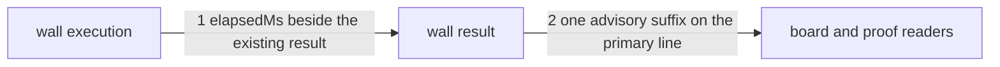

---
traces:
  parent: gates-v1@503b0593b7a1da3670731516c5b8272f1f3060cb47003be6dac7c543599c1bc5
  requirement: a-maintainer-can-see-where-board-time-is-spent@583c542d1126b0a55531f3ec4d7b26ba9fa0a6feaf0d1b5466b93ca5f54594a0
  principles: the-two-goods@8bbe15706c3edcd63d0d050af9782c063cd585e1ec436d2314fa0003dfaa8cb6
---

# Drawing: a-maintainer-can-see-where-board-time-is-spent

## What the runs said

- `node --test --test-timeout=60000
requirements/a-maintainer-can-see-where-board-time-is-spent/acceptance.test.mjs`
  ran three cases: criterion 1 was red because `ok   counted (2 passing)`
  carried no timing annotation; criteria 2 and 3 were green guards.
- `npm test` at `024cb85e5acca5ff88710f4b326d1489e14520ef` ran all
  fifteen walls in declaration order and took about 229 seconds locally. It
  reported three inherited regression failures and no wall line said which
  wall consumed the time.
- `runGates` starts each wall synchronously in the loop that reads the gates
  list. The result record is made immediately after that child returns, and
  the board lines are made from those records after every wall has run.
- Node's monotonic performance clock is present on this runtime and reports
  milliseconds. The platform supplies the clock on both Linux and Windows.
- A discarded stand-in made this task's two contracts and three acceptance
  cases green, including waived and unused-waiver wall lines. Its wider sweep
  made `a-wall-reads-one-format` criterion 3 and one `gates.mjs` unit red:
  both fix an existing primary line at its end, where this requirement adds
  the suffix. The `waiver-v1` contract has the same exact-end assumption, and
  the lane guard correctly refuses this task permission to edit it because
  the requirement declares no supersede.

## Structure

One existing path gains one observation and no new command, wall, file format,
or verdict.

- **The wall execution** stays the synchronous child process started by
  `runGates`, in the order of the `gates` list. The runner observes a
  monotonic clock immediately before starting the child and immediately after
  it returns.
- **The wall result** gains `elapsedMs`, one finite non-negative number for
  that execution. It travels beside the existing status, count, output,
  waiver and applicability facts. It is evidence, never an input to any of
  them.
- **The board line** for every executed wall gains one final suffix:
  `[timing: <number> ms, advisory]`. This is appended to the wall's primary
  line after its existing answer, count, fix hint, waiver note or waiver
  words. Detail lines and the summary do not gain timing.
- **The existing proof readers** keep their claims about the answer, count,
  detail and summary, while treating the final timing suffix as the new part
  of a primary line. The analyst owns the exact-end assertion in
  `a-wall-reads-one-format`, the Architect owns the exact-end assertion in
  `waiver-v1`, and the developer owns the exact array in the gates unit. This
  task may edit none of those proofs without an upstream supersede.
- **The command surface and CI** stay as they are: `node bin/kaal.mjs gates
<root>` prints the board, `npm test` invokes it, and both Linux and Windows
  jobs run that same command.
- **The release placement** stays as it is: the requirement is accepted and
  unassigned. Approval of this drawing closes the Architect's shape only. It
  neither places the requirement in a release nor activates the developer
  handoff while the manager leaves it unassigned.

## Seams

1. **execution to timed result**: in, one gate's command, root and wall
   environment at its place in declaration order; out, the existing result
   record plus `elapsedMs`, a finite non-negative number measured in
   milliseconds with a monotonic clock across that child's execution. Owned
   by `runGates` / the platform process and clock. Serves criterion 1.
2. **timed result to board and proof readers**: in, every result in declaration order;
   out, every wall's existing primary line with exactly one final
   `[timing: <number> ms, advisory]` suffix, followed by the same detail lines
   and the same board summary, with the same command exit answer. Owned by
   `runGates` / `kaal gates`, its reader and the proof owners that consume its
   lines. Serves criteria 1 and 2.

## Fixed and free

- Fixed: one observation starts immediately before each wall child is
  started and ends immediately after it returns; the clock is monotonic and
  the result field is `elapsedMs`, a finite non-negative number in
  milliseconds (criterion 1 and the cross-platform constraint).
- Fixed: every executed wall has exactly one annotation, on its primary line
  and nowhere else, in declaration order; its exact final shape is
  `[timing: <number> ms, advisory]` (criterion 1).
- Fixed: removing only those suffixes reproduces every existing primary line,
  detail line and summary; timing does not enter pass, fail, waiver,
  applicability, bug, promotion or exit decisions (criterion 2 and the
  diagnostic-only constraint).
- Fixed: existing proof readers retain their semantic claims and accept the
  required final suffix. The Analyst and Developer reconcile the proofs they
  own; this lane does not edit them (criterion 2 and the seat boundary).
- Fixed: all walls still run, including after a failure; no cache, parallel
  execution, batching, process reuse, threshold or budget is introduced; the
  Linux and Windows `npm test` jobs stay mandatory (the requirement's
  constraints and criterion 3).
- Fixed: the requirement remains assigned to no release. This drawing records
  no release placement, and its developer handoff stays dormant until the
  manager assigns the requirement (the requirement's placement constraint).
- Free: which monotonic Node clock supplies the readings; integer or decimal
  precision; how many decimal places are retained; the local variable names;
  whether line suffixing is a helper or remains in the existing renderer.

## Decisions

### Measure the wall child boundary

- Chosen: observe immediately around the synchronous child process for each
  wall.
- Not taken: time the whole board and divide it; instrument commands or tests
  inside every wall; time rendering, waiver reads and bug reads as part of a
  wall.
- Because: the unexplained cost is inside the board and the first question is
  which wall owns it. The child boundary is already crossed once per wall on
  both platforms, so it gives comparable attribution without changing what a
  wall runs. A total cannot locate the cost, and internal instrumentation
  would choose a remedy before this measurement says where to look.
- Bought: the shortest path to evidence that distinguishes walls, and spent
  visibility into costs within a wall and into board overhead outside wall
  execution.
- Weighed against: the-two-goods.
- Reopens if: the measurements show material unattributed time outside the
  sum of wall executions, or one wall is dominant and needs its own task for
  a finer breakdown.

### Carry timing on the result and render it on the existing line

- Chosen: one `elapsedMs` fact on each result, rendered as a suffix on the
  primary wall line.
- Not taken: print a timing line while each wall runs; print one timing table
  after the summary; write a timing artifact to the tree.
- Because: the wall line is already the ordered evidence maintainers paste
  and compare. Keeping the measurement on the result lets every renderer use
  the same fact, while the suffix binds the value to the answer without a
  second ordering scheme. A separate artifact would become stale evidence,
  and streaming would change the board from its current collect-then-render
  shape without serving a criterion.
- Bought: one visible, attributable value in the surface that already
  travels, and spent a separate stable artifact or history for analysis
  across runs.
- Weighed against: the-two-goods.
- Reopens if: maintainers need machine-readable timing history rather than a
  diagnosis from one run; that is a new requirement for an evidence format,
  not a reason to make this advisory value release truth.

## Test strategy

| criterion | layer      | kind          | why                                                                |
| --------- | ---------- | ------------- | ------------------------------------------------------------------ |
| 1         | contract 1 | deterministic | the result records expose one finite non-negative value per gate   |
| 1         | contract 2 | deterministic | the primary lines carry the exact suffix once and preserve order   |
| 2         | contract 2 | deterministic | stripping only timing reproduces the board and its non-zero exit   |
| 3         | acceptance | deterministic | the workflow is an unchanged repository surface, already green     |
| none      | unit       | none          | clock precision and rounding are free; no elapsed threshold exists |
| none      | manual     | none          | the evidence is complete in deterministic command output           |

## Handoff

- Task: a-maintainer-can-see-where-board-time-is-spent
- Seams: 2; contract tests: 2 (equal)
- Red run: `node --test --test-timeout=60000
architecture/a-maintainer-can-see-where-board-time-is-spent/contracts.test.mjs`;
  both contracts fail because results have no `elapsedMs` and primary lines
  have no advisory suffix
- Stand-in green: both contracts and all three acceptance cases passed on a
  discarded copy with a monotonic observation around each child and the
  result suffix in the renderer
- Criteria served: seam 1 -> 1; seam 2 -> 1 and 2; criterion 3 is the
  acceptance guard on unchanged CI
- Fixed for the developer: the measurement boundary, `elapsedMs`, the exact
  suffix and its position, one annotation per executed wall in declaration
  order, no other output or exit change, and no timing-based decision
- Architect state: changes requested. The shape and its two contracts are
  complete, but closed proofs owned by the Analyst and Architect fix the old
  primary line at its end. This drawing cannot be approved until their owners
  reconcile the proofs under authority from a requirement that names the
  supersedes.
- Release state: unassigned by the manager; the developer handoff is dormant
  until that seat assigns the requirement
- Backlog state: the current four block kinds cannot record a present but
  contradictory proof truthfully. `no proof` would self-clear because the
  file exists, so no false backlog entry is written.
- Unblocks: nothing while this review finding stands or the requirement is
  unassigned; after both clear, the approved seams permit measurement of the
  reported platform difference and authorize no optimization
