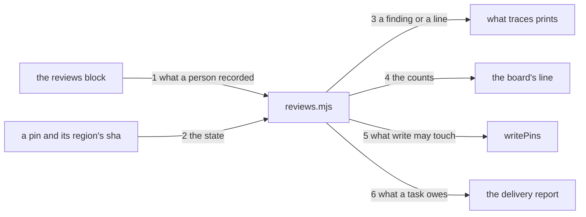

---
traces:
  requirement: a-pin-says-who-cleared-it@5e76974d531f8e9a682ed6767b5f6e6c2cc5239e1b4001e89e54101378ed8b05
  principles: the-two-goods@8bbe15706c3edcd63d0d050af9782c063cd585e1ec436d2314fa0003dfaa8cb6, the-seat-owns-the-lens@e1ab0650fc88dc8e1e16347fc8b14b236f1c57b94e50bfdf3f62aa4ec0d6d070
---

# Drawing: a-pin-says-who-cleared-it

## What the runs said

- A trace's value is a comma separated list. `splitTrace` splits on a comma
  before it reads anything, and two of this tree's pins are lists of four:
  `the-engine-installs-by-name` supersedes four tasks on one line. So a reason
  written inline after a pin may never contain a comma, and a line carrying
  four pins with four sentences on it is a line nobody reads.
- The frontmatter parser reads one level of map under a key with no value,
  and keeps everything after the first colon as the value, so a reason in a
  second block may carry commas and colons alike. But its sub key pattern is
  `[A-Za-z_][\w-]*`, and a key carrying a slash matches none of it and is
  dropped without a word: parse a `reviews:` block holding
  `requirement/alpha` and `principles` and only `principles` comes back. The
  key shape this task wants is one character class away, and a silent drop is
  the worst of the three ways that could have gone.
- `writePins` rewrites every pin it can resolve, in every artefact, from the
  file the pin names. It is the only way a pin is ever cleared, it asks
  nothing and it records nothing, and it did exactly that four hours ago: an
  analyst amending a criterion ran it and it re-pinned the architect's
  drawing, which the lane guard then refused as a crossing.
- 422 traces carry a pin today and every one of them is `current`, because
  the board has been green. So whatever this adds must read those 422 as
  they stand: a pin with no review beside it and a sha that matches is the
  ordinary case and can never become a finding.
- The delivery report already reads a record's freshness rather than deciding
  it: `bin/lib/runs.mjs` answers whether a record still speaks for the suite
  it names and `runs` prints the answer. A second reader asking a second
  module the same shape of question is the pattern this tree already has.
- The trace wall's findings are one shape, `{ artefact, kind, message }`,
  printed as three fields joined by colons. A line that is not a finding has
  nowhere to go today: `traces` prints findings or one sentence and nothing
  else.

## Structure

One new block in an artefact's frontmatter, one module that reads it, and two
readers.

- `reviews:` sits beside `traces:` in any artefact that carries a trace. Its
  keys are `<kind>/<name>` and its values are
  `<state>@<sha> by <who>: <why>`, the same `@` the pins already use.
- `bin/lib/reviews.mjs` is new. It reads the block, answers the state of one
  pin, counts the states in a tree, and says whether a task has one owed.
- `bin/lib/traces.mjs` asks it for a state instead of deciding that a moved
  pin is a finding, and `writePins` asks it what it may touch.
- `bin/kaal.mjs` prints the review lines and the counts under `traces`, and
  the delivery report under `runs` reads the same answer.

## Seams

One labelled edge per seam, numbered to match the list below; the parts are
the structure's parts. The list is the contract; the picture is the reading,
and it carries nothing the list does not.

1. what a person recorded: in an artefact's frontmatter, out one entry per
   reviewed pin carrying its kind, its name, its state, the sha it cleared,
   who cleared it and why; and a finding for a state the league does not know,
   and one for a clearance missing the who or the why, each naming which is
   missing. Owned by `reviews.mjs` / the frontmatter.
2. the state: in a pin, the sha of the region it names as it stands now, and
   the entries from seam 1, out exactly one of `current`, `review-needed`,
   `reviewed-no-impact` and `updated`. Owned by `reviews.mjs` / the four
   words.
3. a finding or a line: in a state, out nothing where it is `current`, a line
   naming the artefact, the kind, the name and the state where it is any of
   the other three, and never a finding. What is still a finding is a name
   that resolves to nothing, which this seam never sees. Owned by
   `reviews.mjs` / the trace wall.
4. the counts: in a tree, out how many pins stand in each of the four states,
   in the order the four are declared. Owned by `reviews.mjs` / the board's
   line.
5. what write may touch: in a pin and its state, out whether `writePins` may
   write it: yes where there is no pin, yes where a review clears the sha the
   region has now, no where it is `review-needed`. One pin at a time, so the
   count of the ones left is the caller's and `--write` prints it. Owned by
   `reviews.mjs` / `writePins`.
6. what a task owes: in a task and a tree, out the pins in that task's
   artefacts that stand `review-needed`, and nothing where none does. The
   pins and not a yes, because the report says why a task is not delivered
   and a bare yes is not a reason. The delivery report reads this beside the
   run record and neither knows about the other. Owned by `reviews.mjs` / the
   report.

## Fixed and free

- Fixed: the block is `reviews:`, its keys are `<kind>/<name>` and its values
  are `<state>@<sha> by <who>: <why>`. Criteria 1 and 3, and decision 1.
- Fixed: the tree keeps one frontmatter parser and its sub key pattern gains
  `/`. Decision 6.
- Fixed: `current` and `review-needed` are never written down. They are what a
  sha comparison says, and a written `current` is a claim nobody checks.
  Decision 2.
- Fixed: a review names the sha it cleared, so a second move reopens it.
  Decision 3, and it answers the requirement's third open question.
- Fixed: `writePins` may advance a pin a review clears and may never touch one
  that is `review-needed`. Criterion 4 and decision 4.
- Fixed: a `review-needed` pin is a line and never a finding, and the trace
  wall's exit code does not change because of one. Criterion 2.
- Fixed: the counts are four numbers in the order the states are declared, on
  the `traces` line. Criterion 6.
- Fixed: the delivery report reads seam 6 and says the task is not delivered.
  Criterion 5, and it costs the task and never the board. Decision 5.
- Fixed: the four states are a table in `reviews.mjs` and the only place the
  words appear, because a fifth word typed anywhere must be a finding rather
  than a state.
- Fixed: the seams are named functions, because a contract drives a seam and
  cannot drive one with no name. `bin/lib/reviews.mjs` exports
  `readReviews(text)` for seam 1, `stateOf(pin, sha, reviews)` for seam 2,
  `report(root)` for seam 3, `counts(root)` for seam 4,
  `mayWrite(pin, sha, reviews)` for seam 5 and `owes(root, task)` for seam 6.
- Free: how `reviews.mjs` walks the tree, and whether it caches what it reads.
- Free: the wording of every line except that seam 3's names the artefact, the
  kind, the name and the state.

## Decisions

### The state lives beside the pin and not on it

- Chosen: a `reviews:` block in the same frontmatter, keyed by `<kind>/<name>`.
- Not taken: appending the state to the pin itself, after the sha; a file per
  artefact under a reviews directory; a single register at the root.
- Because: a trace's value is a comma separated list and a reason wants
  commas. Two pins in this tree are lists of four, so inline would put four
  states and four sentences on one line and nobody would read the fourth. A
  file elsewhere breaks the thing that makes a trace work, which is that an
  artefact carries what it read; a register at the root is the same mistake
  once, for the whole tree.
- Bought: evidence, and it spent the shortest path. There is a second block to
  parse and a second thing that can disagree with the first, and the
  disagreement is a finding seam 1 has to make.
- Weighed against: the-two-goods, the-seat-owns-the-lens.
- Reopens if: an artefact carries so many reviews that the block is longer
  than the artefact, which would mean the tree is re-reading more than it is
  writing.

### Two of the four states are never written

- Chosen: `current` and `review-needed` are computed from a sha comparison,
  and only `reviewed-no-impact` and `updated` are recorded.
- Not taken: writing all four; writing none and inferring the cleared two from
  a commit.
- Because: a written `current` is a claim about a sha nobody checked, which is
  the vacuous pass this league spends its days refusing. The two that are
  written are the two that record an act a person took, and an act is exactly
  the thing a tool cannot infer.
- Bought: evidence, and it spent nothing this task can name.
- Weighed against: the-two-goods.
- Reopens if: a state appears that is neither derivable nor an act.

### A review names the sha it cleared

- Chosen: `<state>@<sha>`, and the review counts only while that sha is the
  region's sha now.
- Not taken: a review with no sha, which clears the pin for ever; a date; a
  commit.
- Because: the requirement's own third open question asks whether a
  `reviewed-no-impact` expires when the region moves again, and the answer is
  that it must: a second move is a second question, and a review that
  outlived its text would be the pin's own problem wearing a person's name. A
  sha is what everything else here compares.
- Bought: keeping choices open, and it spent brevity: a clearance is now
  three parts and a reason rather than two.
- Weighed against: the-two-goods.
- Reopens if: a region moves so often that reviews cost more than reading.

### The tool may advance a reviewed pin and never an unreviewed one

- Chosen: `writePins` writes a pin where there is none, advances one whose
  review clears the sha the region has now, and leaves a `review-needed` one
  exactly as it found it, counting what it left.
- Not taken: never advancing any moved pin, which leaves every pin drifting
  further from the text for ever; advancing all of them, which is what it does
  today and is the defect.
- Because: a person reading the moved text is the act; carrying the sha
  forward afterwards is bookkeeping, and bookkeeping is what a tool is for.
  Refusing to advance even a cleared pin would make every reviewer edit a sha
  by hand, and a rule that costs a reader an act per pin over 422 pins is a
  rule the reader routes around.
- Bought: the shortest path for the reader, and it spent a little of the
  guarantee: a review recorded carelessly now moves a pin. What it cannot do
  is move one nobody reviewed.
- Weighed against: the-two-goods, the-seat-owns-the-lens.
- Reopens if: a review turns out to be cheap to write and cheap to fake, at
  which point the who wants to be something the tree can check.

### An unread pin costs the task and never the board

- Chosen: `review-needed` is a line on the traces output and a reason the
  delivery report gives for a task not being delivered.
- Not taken: failing the board, which is what happens today and is the reason
  this task exists; a bound in days; reporting it and charging nothing.
- Because: a red board stops the seat that cannot fix it, which is the whole
  defect: the analyst moves a criterion and the architect owns the file that
  goes red. A bound in days makes a tree go red while nobody touches it,
  which is a wall failing on a schedule rather than on a change. Charging
  nothing makes `review-needed` a state nobody ever leaves.
- Bought: evidence, and it spent teeth on the board in exchange for teeth on
  the task. A person watching only the board will now see green while a
  reading is owed, and the coverage rows and the delivery report are where
  they must look instead.
- Weighed against: the-two-goods.
- Reopens if: a task ships with an unread pin because nobody read the report,
  at which point the report is not where a reader looks and the answer is
  where it is printed rather than whether it fails.

### One parser, one character wider

- Chosen: `parseFrontmatter` accepts `/` in a sub key, and `reviews.mjs` reads
  its block through the same parser every other reader in this tree uses.
- Not taken: a regex of its own inside `reviews.mjs`, which is the shortest
  diff; a key shape with no slash, such as the name alone or the two joined
  by a dash.
- Because: the parser's own header says one parser, tested once, and a second
  reader of frontmatter is the duplication this tree spends walls refusing.
  The name alone is not a key: `requirement` and `supersedes` both resolve to
  `requirements/<name>/requirement.md`, so two kinds can pin one name and a
  key that drops the kind loses one of them. A dash cannot separate them
  either, because every name in this tree is already dashes.
- Bought: the shortest path, and it spent a little blast radius: the parser is
  read by the skills, the records, the waivers and the retros. What it costs
  them is nothing found: no frontmatter in this tree carries an indented key
  with a slash today, so the only lines this newly reads are the ones this
  task writes.
- Weighed against: the-two-goods.
- Reopens if: an indented line that is not a key turns out to be worth a
  finding rather than a silence, which is a wall about the format and not
  this task.

## Test strategy

| criterion | layer    | kind          | why                                                                                                                                   |
| --------- | -------- | ------------- | ------------------------------------------------------------------------------------------------------------------------------------- |
| 1         | contract | deterministic | Seams 1 and 2. The block read as data, and the four states computed from a pin, a sha and what was recorded.                          |
| 2         | contract | deterministic | Seam 3. A moved pin as a line and not a finding, beside a name that resolves to nothing, which stays one.                             |
| 3         | contract | deterministic | Seam 1 again for the clearance: with who and why, with each half missing, and with a word the table does not know.                    |
| 4         | contract | deterministic | Seam 5. A pin with none, a pin a review clears, and a pin nobody read, which is the one it may not touch.                             |
| 5         | contract | deterministic | Seam 6. A task with an unreviewed pin and one without, asked of the module the report reads rather than of the report.                |
| 6         | contract | deterministic | Seam 4. The counts over a tree holding one pin in each state, so a count that read the wrong state is wrong by one in two places.     |
| none      | unit     | none          | The state table and the four words are behind seams 1 and 2, and a unit of either would be the contract test with the seam taken out. |
| none      | manual   | none          | Nothing here needs a person to look. The one judgement, whether a reason is honest, no wall reads and none should.                    |

## Handoff

- Task: a-pin-says-who-cleared-it
- Seams: 6; contract tests: 6 (equal)
- Red run: `node --test --test-timeout=60000 architecture/a-pin-says-who-cleared-it/contracts.test.mjs`,
  all six failing on `bin/lib/reviews.mjs` not existing
- Stand-in green: all six, on a scratch `reviews.mjs` and the one character
  the parser wanted, then both discarded from file copies
- Isolations: six, one break at a time, each reddening exactly one seam: the
  who finding dropped, a review matched without its kind, a current pin given
  a line, the counts in another order, `mayWrite` always yes, and `owes`
  answering for every task at once
- Found by the contracts, and mine: this drawing said a second block beside
  `traces:` costs nothing to parse, and it costs one character class. A sub
  key carrying a slash matches none of the parser's pattern and is dropped in
  silence, so `requirement/alpha` never arrived and nothing said so
- Criteria served: seam 1 to 1 and 3; seam 2 to 1 and 2; seam 3 to 2; seam 4
  to 6; seam 5 to 4; seam 6 to 5
- Fixed for the developer: the block's place, keys and value shape; two states
  derived and two recorded; a review naming the sha it cleared; what
  `writePins` may and may not touch; a line and never a finding; the counts on
  the traces line; the report reading seam 6
- Owed with the build: the 422 pins this tree already carries must read
  `current` and none of them may gain a block, which is what makes this
  landable at all; `parseFrontmatter` gains `/` in its sub key pattern and
  its unit gains the case; `SURFACE.md` gains what `traces` prints now
- Owed after the build, and not this task's: the held branch
  `requirement/a-diff-carries-one-seat-proof-owner` becomes landable the day
  this ships, and the architect owes a reading of the criterion it moves
