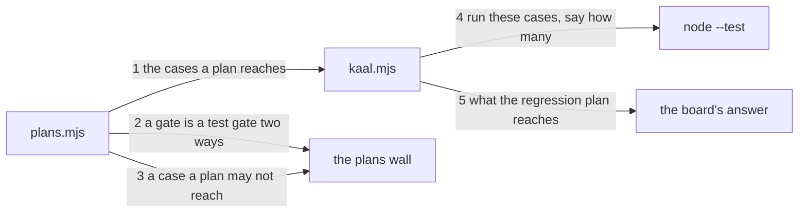

---
traces:
  parent: a-suite-names-its-cases@9187ce52792763b14a51c0c1196fbc175abf1259315421fe128c59b9f56c7300
  requirement: a-plan-picks-its-suites@868b5ebdf83a3aa207496351c966fe543ea29ca162c86d45ab1b367efb760dda
  principles: the-two-goods@8bbe15706c3edcd63d0d050af9782c063cd585e1ec436d2314fa0003dfaa8cb6, the-seat-owns-the-lens@e1ab0650fc88dc8e1e16347fc8b14b236f1c57b94e50bfdf3f62aa4ec0d6d070
---

# Drawing: a-plan-picks-its-suites

## What the runs said

- A gate is a test gate only if its command names a file ending in
  `.test.mjs`. `testGates` splits the command on whitespace and keeps the
  arguments that match, so `node bin/kaal.mjs regression` yields no globs and
  the gate is dropped. The plan about it then answers `regression: plan: is
about the wall regression, which no gate in kaal.config.json holds`, which is
  the wall existing and the reader not seeing it.
- The readers this needs are already here and one of them is nearly it.
  `reach(root)` walks every plan, filters the suites it names to those that
  exist, and sums their case counts. It throws away the paths on the way to
  the number.
- Nothing runs a case by path today. Every test gate hands `node --test` a
  glob and the shell expands it, which is why a glob matching nothing is a
  wall that cannot run rather than a wall with nothing to do.
- The runner does not say which file a red test came from. Two files handed
  to `node --test` directly, one green and one red, answer one flat stream
  whose only red line is `not ok 2 - 1. it does not hold`. The file names
  appear when the runner discovers the files itself and not when it is given
  them.
- A run started from inside `node --test` inherits `NODE_TEST_CONTEXT` and
  reports as a subtest of its parent, exiting 0 whatever happened. The
  stand-in did exactly that and the contract caught it; `wallEnv` exists for
  this and `tests/gates.test.mjs` has held a unit about it since before the
  units moved.
- The board takes two to five minutes and the three test gates are most of
  it. A regression gate that re-runs the suites it picks pays that part twice
  on every pull request.
- No suite names a path under `evals/` and none ever has. The two records
  there are reached by `kaal ledger` and by nothing else.

## Structure

Three parts, none of them new.

- **`bin/lib/plans.mjs`** gains the readers: which cases a plan reaches by
  path, and a wider answer to what a test gate is. It already holds the plan,
  suite and case readers this walks.
- **`bin/kaal.mjs`** gains one command that runs a plan's cases and reports
  what it ran, and one line on `traces` naming what the regression plan
  reaches.
- **`kaal.config.json`** gains the `regression` gate, which is a governance
  diff and not this drawing's, and the plan and suite pages are the tester's.

## Seams

1. `casesOf(root, plan)`: in a root and a plan's name, out the case paths that
   plan reaches, each once and sorted, through the suites it names. Owned by
   `plans.mjs` / every caller.
2. `testGates(root)` widens: a gate is a test gate when its command names a
   file ending in `.test.mjs` **or** names a plan that exists under
   `tests/plans/`. In a root, out the gates that owe a plan. Owned by
   `plans.mjs` / the plans wall.
3. `unrunnable(root, plan)`: in a root and a plan's name, out a finding per
   case it reaches that a wall may not run, which today is a path under
   `evals/`. Owned by `plans.mjs` / the plans wall.
4. `runCases(paths)`: in a list of case paths, out the run's counts and the
   red cases by name. Owned by `kaal.mjs` / `node --test`.
5. `reached(root, plan)`: in a root and a plan's name, out the line the board
   prints naming each case that plan reaches. Owned by `kaal.mjs` / a reader.

## Fixed and free

- Fixed: the selection is read from `tests/plans/<name>.md` and from the
  suites it names, and from nothing else, by criterion 6. No glob of test
  files may appear in the `regression` gate's command.
- Fixed: a plan naming no suite is a finding in the words a suite naming no
  case already uses, by criterion 1.
- Fixed: a suite named by two plans is a finding in neither direction and
  neither plan's count subtracts from the other's, by criterion 2.
- Fixed: every case the regression plan reaches is named by path on the
  board's answer, by criterion 3.
- Fixed: the command runs the cases the plan reaches and no others, says how
  many it ran, and names the red ones, by criterion 4.
- Fixed: a case under `evals/` reached by the regression plan is a finding
  naming the path, by criterion 5.
- Free: the command's name and whether it takes the plan as an argument, how
  the cases are handed to the runner, the order of the paths on the line, and
  every name in the modules except the ones a contract calls.

## Decisions

### The regression wall is a wall like the others

- Chosen: a `regression` gate on the board, whose command runs the cases its
  plan reaches, running on every board run as the other thirteen do.
- Not taken: a gate that runs only at a promotion, which needs a `when` field
  on a gate and a board that skips some of them; a wall read by `promote`
  rather than by `gates`; no wall at all, with the promotion reading the plan
  directly.
- Because: the asker's shape is a plan tied to CI, and the cheapest true
  version of that is a wall, which is what CI already runs. Every alternative
  adds a second kind of gate, and a board where some walls run and some do not
  is a board whose green means two things. The cost is real and it is machine
  time: the regression plan picks suites whose cases their own walls have just
  run, so that work is done twice on every pull request.
- Bought: one kind of wall, and it spent minutes of a runner on every branch.
- Weighed against: the-two-goods.
- Reopens if: the board takes long enough that a person waits on it, which is
  the same condition the promotion's own board run carries.

### A test gate is a test gate two ways

- Chosen: `testGates` counts a gate whose command names a `.test.mjs` file, as
  it does now, and also one whose command names a plan that exists.
- Not taken: a `plan` field on a gate in the config, which declares the pair
  from the governance lane and is the thing this task is moving out of it; a
  gate whose command is matched by name, which makes `kaal regression` special
  in a reader that knows nothing else about this tree.
- Because: the rule the plans wall enforces is that a wall running tests has a
  plan, and a gate that names a plan is naming its own. Reading the command
  for either shape keeps the pairing in one place and lets the three existing
  gates stay exactly as they are, which is what makes this task one gate and
  not four.
- Bought: the wall's rule holds over both shapes, and it spent a reader that
  now knows two ways to say the same thing.
- Weighed against: the-seat-owns-the-lens.
- Reopens if: the other three gates move to naming their plans, at which point
  the `.test.mjs` shape has no user left.

### The verification rule is scoped to what the criterion says

- Chosen: `unrunnable` answers about the cases one plan reaches, and the wall
  asks it of the regression plan.
- Not taken: any suite naming a path under `evals/` is a finding, which is
  simpler to build and simpler to read.
- Because: the criterion scopes it to the regression plan, and a drawing that
  widened it would be writing a criterion nobody stated. The wider rule is
  probably right, an eval record is not a case for any plan, and saying so is
  the analyst's and not this page's.
- Bought: the drawing answers its requirement, and it spent a rule that reads
  as narrower than the reason behind it.
- Weighed against: the-seat-owns-the-lens.
- Reopens if: the analyst states the wider rule.

### A red run is asked again, file by file

- Chosen: `runCases` hands every path to one run, and where that run failed,
  asks again once per path to find which.
- Not taken: one run per path always, which is a process start per case and
  pays the attribution on every green run; parsing the one stream, which
  cannot be done.
- Because: node flattens several files into one stream of test names and
  never says which file a name came from, measured here on two files where
  the only red line was `not ok 2 - 1. it does not hold`. So the fast answer
  and the exact answer are two different runs, and the exact one is only ever
  wanted when something is already wrong. A green selection pays one process;
  a red one pays a process per case and has a reason to.
- Bought: the answer names the case that broke, and it spent a second pass on
  a run that has already failed.
- Weighed against: the-two-goods.
- Reopens if: the runner learns to name the file a test came from, which
  would make the second pass dead weight.

### A case is run by path and never by glob

- Chosen: `runCases` is handed the paths the plan reached and hands them to
  the runner.
- Not taken: writing the paths into a glob; a temporary file listing them.
- Because: a glob matching nothing is a wall that cannot run, and this wall's
  input is a list that may legitimately be short. A list of paths has an empty
  case that means what it says, and the plan naming no suite is already a
  finding before the run is reached.
- Bought: an empty selection that is a finding rather than a crash.
- Weighed against: none.
- Reopens if: the list grows past what a command line holds, which is the same
  measurement that put the suites' cases in a block rather than a comma list.

## Test strategy

| criterion | layer    | kind          | why                                                                                                  |
| --------- | -------- | ------------- | ---------------------------------------------------------------------------------------------------- |
| 1         | contract | deterministic | seam 2: a plan whose wall the config holds by naming the plan                                        |
| 2         | contract | deterministic | seam 1: two plans over one suite, each reaching what it names                                        |
| 3         | contract | deterministic | seam 5: the line names each case reached, and no other                                               |
| 4         | contract | deterministic | seams 1 and 4: the paths reached are the paths run                                                   |
| 5         | contract | deterministic | seam 3: a case under `evals/` reached by the plan asked about                                        |
| 6         | contract | deterministic | seam 1: the same config and two plans reach differently                                              |
| none      | unit     | none          | the readers are walks over answers this tree already gives, and a unit here would restate a contract |
| none      | manual   | none          | nothing here reaches a screen or a person                                                            |

## Handoff

- Task: a-plan-picks-its-suites
- Seams: 5; contract tests: 5 (equal)
- Stand-in green: all five, discarded from file copies. It found two things:
  a run that inherits the runner's marker reports green on a red case, and a
  red run cannot name the file it came from in one pass
- Red run: `node --test architecture/a-plan-picks-its-suites/contracts.test.mjs`
- Criteria served: seam 1 -> 2, 4 and 6; seam 2 -> 1; seam 3 -> 5; seam 4 -> 4;
  seam 5 -> 3
- Fixed for the developer: the selection is read from the plan and its suites
  and from nowhere else; no glob of test files in the `regression` gate's
  command; the finding wordings criteria 1, 2 and 5 fix; the command says how
  many cases it ran and names the red ones; every reached case named by path
  on the board's answer
- Build order: seams 1 and 2 first, which are what make the plan readable and
  its wall visible. Then 5, 3 and 4
- Blocked on: nothing. The `regression` gate is a governance diff and the plan
  and suite pages are the tester's, and neither blocks the build: the
  contracts drive scratch trees
- Answers this drawing gives to the requirement's open questions: the
  regression plan names a wall, that wall is on the board, and it runs on
  every board run. The other three are the analyst's and are untouched
