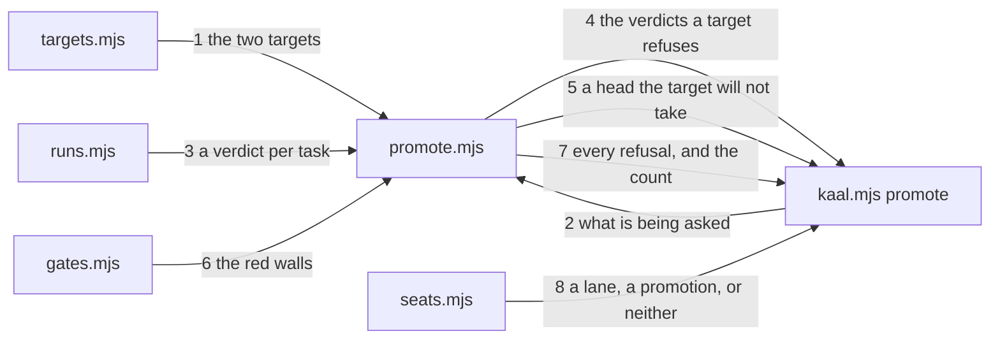

---
traces:
  parent: a-task-is-delivered-by-its-run@5de44d81cbebda3770f735e179acfdca2de7ce038055809b0dfbe1bf55711d43
  requirement: a-promotion-names-what-it-refuses@857e17305ada76b356d08fbce31a1072eb173265a710d59a09970d738c0009c3
  principles: the-two-goods@8bbe15706c3edcd63d0d050af9782c063cd585e1ec436d2314fa0003dfaa8cb6, the-seat-owns-the-lens@e1ab0650fc88dc8e1e16347fc8b14b236f1c57b94e50bfdf3f62aa4ec0d6d070
---

# Drawing: a-promotion-names-what-it-refuses

## What the runs said

- The four verdicts are already one function. `verdict(root, run, pass, fail,
task)` in `bin/lib/runs.mjs` returns one of `delivered`, `not delivered`,
  `regressed` and `nothing ran`, and `runAcceptance` in `acceptance.mjs`
  already calls it per requirement. Nothing here needs a second opinion about
  whether a task is done; it needs the answer sorted by target.
- The board is already one function. `runGates(root)` in `bin/lib/gates.mjs`
  returns every wall with its colour and its waiver, and `bin/kaal.mjs` prints
  it. A caller wanting the count of red walls has it without running a shell.
- The seat rule refuses the promotion today, measured on this tree.
  `KAAL_BRANCH=release node bin/kaal.mjs seats --against origin/main` on
  `origin/release` answers `release: matches no lane (plan/*, requirement/*,
architecture/*, build/*, test/*, operate/*, governance/*, skill/*, agent/*,
eval/*)` and exits 1. Every promotion would be refused by this repository's
  own board.
- The targets are named in two places already and neither knows about the
  other. `bin/lib/class.mjs` holds `["origin/release", "origin/main"]` as the
  fallback order and `.github/workflows/ci.yml` holds `[main, release]` as the
  branches CI runs on. A third list is in this task.
- `laneOf` is what reads the branch. `bin/lib/seats.mjs` exports it, the
  `seats` command calls it, and it reads `KAAL_BRANCH` or the checkout. It
  returns the lane or nothing, and nothing is what produces the refusal above.
- The pre-push hook runs the whole board on every push. `.githooks/pre-push`
  runs `npm test`, which is `node bin/kaal.mjs gates`, on the working tree
  whatever ref is being pushed. A wall standing red on `release` therefore
  cannot be pushed at all, which is the rule this task states being enforced
  in the one direction it is not meant to hold.
- `main` and `release` can move apart without either being wrong. `release` is
  three commits ahead today and a hotfix would put `main` ahead instead, and
  nothing in the tree reads the pair.

## Structure

Four parts, one of them new.

- **`bin/lib/targets.mjs`**, new and tiny. The two target names, the order a
  branch is likely to have come from, and which one a promotion comes from.
  It holds no logic; it exists so the fourth list of the same two words is the
  last one. `class.mjs` reads it in place of its own copy.
- **`bin/lib/promote.mjs`**, new. Reads the promotion being asked about,
  gathers every reason to refuse it, and answers them all at once. It calls
  the three readers that already exist and decides nothing about a suite.
- **`bin/kaal.mjs`**, the `promote` command: exit 0, 1 or 2 as everywhere
  else, and the printing.
- **`bin/lib/seats.mjs`**, one branch: a promotion is not a lane's diff and
  says so.

Nothing about a verdict, a wall or a lane is computed twice. Every seam here
is a sort over an answer this tree already gives.

## Seams

1. `targets`: in nothing, out `TARGETS` (`["release", "main"]`, the order a
   promotion travels), `BASES` (the same as remote refs, the order a branch is
   likely to have come from) and `PROMOTION_FROM` (`"release"`). Owned by
   `targets.mjs` / every reader.
2. `asked(argv, env)`: in the arguments and the environment, out
   `{into, from}` where both are known, or `{why}` where there is no promotion
   to judge, or `{usage}` where a target is named that is not a target. Owned
   by `promote.mjs` / `kaal.mjs`.
3. `verdicts(root)`: in a root, out one `{task, word}` per requirement, from
   the suite as it runs now and the record as it stands. Owned by
   `promote.mjs` / `runs.mjs`, which computes the word.
4. `refusedVerdicts(verdicts, into)`: in the verdicts and the target, out a
   finding per task the target refuses. `release` refuses `regressed` and
   `nothing ran`; `main` refuses those and `not delivered`. Owned by
   `promote.mjs` / the caller.
5. `refusedHead(into, from, lanes)`: in the target, the head and the lanes the
   config holds, out one finding or none. Owned by `promote.mjs` / the caller.
6. `redWalls(root)`: in a root, out the walls that are red, each as a finding,
   and the count whatever the target. Owned by `promote.mjs` / `gates.mjs`,
   which runs them.
7. `promote(root, asked)`: in a root and what is being asked, out every
   finding in the order the gates are read and the count that follows them.
   Owned by `promote.mjs` / `kaal.mjs`.
8. `laneOf(root)` gains a third answer: in a branch, out the lane, or the
   promotion and whose it is, or nothing. Owned by `seats.mjs` / the `seats`
   command.

## Fixed and free

- Fixed: the two targets and the two gates, by criteria 2 and 3. `release`
  refuses exactly `regressed` and `nothing ran`; `main` refuses those and
  `not delivered` and nothing more.
- Fixed: every finding's shape, `<artefact>: <kind>: <message>`, and the three
  kinds `verdict`, `head` and `wall`, by criteria 2, 4 and 5. The target line
  `promote: into <target>` and the count line `promote: into <target>: <n>
finding(s)`, by criteria 1 and 6.
- Fixed: nothing stops at the first refusal, by criterion 6.
- Fixed: exit 2 where there is no promotion to judge, by criterion 7, and
  exit 2 from `seats` on a promotion, by criterion 8.
- Fixed: the word `operator` is in the seat rule's answer, by criterion 8.
- Free: how the verdicts are gathered, whether the board is run in process or
  by command, the order the findings are printed within a kind, and every
  name in the modules except the ones a contract calls.

## Decisions

### The two targets are named once

- Chosen: `bin/lib/targets.mjs`, read by `class.mjs`, `promote.mjs` and
  `seats.mjs`.
- Not taken: a fourth literal in `promote.mjs`; the list in
  `kaal.config.json`, where a tree could declare its own.
- Because: the same two words are in `class.mjs` and in the workflow already,
  and this task would have made three. A reader asking what a target is should
  find one answer, and the retro that asked for this was written the same day
  the second copy appeared. The config was the other candidate and is refused
  for now: a target is where this repository publishes from, not a thing a
  consumer configures, and a declaration nobody varies is a place for the two
  to disagree.
- Bought: one place to be wrong, and it spent the ability for a fork to name
  its targets differently without a diff.
- Weighed against: the-two-goods.
- Reopens if: a second repository uses this engine and its targets are not
  these two.

### The promotion is read from the arguments, then the environment

- Chosen: `--into` and `--from` first; `KAAL_BASE` and `KAAL_BRANCH` second;
  no promotion, and exit 2, third.
- Not taken: the environment only, which no test can drive without inventing
  one; the checkout only, which answers differently on a desk and in a gate.
- Because: the requirement says the target is named and never inferred, for
  the reason that a gate publishes on this answer. The environment is second
  rather than absent because that is where a gate already keeps it, and
  `KAAL_BRANCH` is the precedent this tree set for exactly this.
- Bought: the same question asked the same way everywhere, and it spent a
  second way to say one thing.
- Weighed against: none.
- Reopens if: a runner appears that cannot set an environment variable.

### The board is run, not read from somewhere it was written

- Chosen: `redWalls` calls `runGates(root)` and counts what comes back.
- Not taken: reading a file a previous gate wrote; taking the count as an
  argument; a flag that says how red the board is.
- Because: a promotion that trusted a record of the board would be trusting
  the thing it exists to check, and the record would be the fourth stale
  artefact this tree has found this week. The cost is that the board runs
  twice in a gate that also runs it on its own, which is minutes of a machine
  and not of a person.
- Bought: an answer about the tree as it stands, and it spent the wall clock
  of one board run.
- Weighed against: the-two-goods.
- Reopens if: the board takes long enough that a promotion is waited on.

### A promotion is not a lane, and never becomes one

- Chosen: `laneOf` answers that the branch is the promotion, `seats` exits 2,
  and the answer says the promotion is the operator's.
- Not taken: a `release` lane in `kaal.config.json` with the operator's seat
  and an `allows` of everything, which is what would make the wall pass.
- Because: a promotion carries every seat's work by design, so the question
  the seat rule asks has no true answer about it. A lane holding everything
  would make the rule say yes where it means nothing, and the next reader
  would find a lane that permits any path and conclude the rule is decoration.
  Exit 2 is the tree's own word for a question that is not this one's, and it
  is already what `class` says about a tree with no history.
- Bought: the rule stays true where it applies, and it spent the simplicity of
  one more row in a list.
- Weighed against: the-seat-owns-the-lens.
- Reopens if: a promotion ever carries one seat's work and only one.

### What this drawing does not fix, and whose it is

- Chosen: name two gaps and build neither.
- Not taken: widening the seams to cover them, which would be this drawing
  writing criteria.
- Because: both are real, both were found by running, and neither is in the
  eight criteria. The first is the pre-push hook, which runs the whole board
  on every push and so enforces the strict gate on every branch: a wall
  standing red on `release` cannot be pushed at all, which is this task's rule
  holding in the one direction it is not meant to. The second is that `main`
  can move without `release`, by a hotfix, and nothing reads the pair or says
  which way the sync goes. A blocked seat says where and the owning seat says
  what, so both are the analyst's.
- Bought: the drawing answers its requirement, and it spent two things a
  reader will want on the same day.
- Weighed against: the-seat-owns-the-lens.
- Reopens if: either becomes a criterion.

## Test strategy

| criterion | layer    | kind          | why                                                                                                  |
| --------- | -------- | ------------- | ---------------------------------------------------------------------------------------------------- |
| 1         | contract | deterministic | seam 2: what is being asked, read from arguments before the environment                              |
| 2         | contract | deterministic | seam 4 at `release`: two words refused and two not                                                   |
| 3         | contract | deterministic | seam 4 at `main`: the same two and the third                                                         |
| 4         | contract | deterministic | seam 5: a head each target will not take                                                             |
| 5         | contract | deterministic | seam 6 and seam 4 together: the same board judged twice                                              |
| 6         | contract | deterministic | seam 7: four refusals and a count that matches                                                       |
| 7         | contract | deterministic | seam 2: no promotion to judge                                                                        |
| 8         | contract | deterministic | seam 8: a lane, a promotion, or neither                                                              |
| none      | unit     | none          | the readers are sorts over answers this tree already gives, and a unit here would restate a contract |
| none      | manual   | none          | nothing here reaches a screen or a person                                                            |

Seams 1 and 3 carry no criterion of their own: the first is a list two other
seams read and the third is a call into a function another task proves. Each
is exercised by the contracts that use it, and neither is a promise this task
makes to anyone outside it.

## Handoff

- Task: a-promotion-names-what-it-refuses
- Seams: 8; contract tests: 8 (equal)
- Red run: `node --test architecture/a-promotion-names-what-it-refuses/contracts.test.mjs`
- Criteria served: seam 2 -> 1 and 7; seam 4 -> 2 and 3; seam 5 -> 4; seams 4
  and 6 -> 5; seam 7 -> 6; seam 8 -> 8. Seams 1 and 3 serve the others
- Fixed for the developer: the two targets, the two gates and exactly what
  each refuses; the three finding kinds and the finding shape; the target line
  and the count line; that nothing stops at the first refusal; exit 2 for no
  promotion and for a promotion asked of the seat rule; the word `operator` in
  that answer
- Build order, which is the asker's: seams 1, 2, 5 and 8 first and they are
  the head wall, the piece asked for ahead of the rest. Seams 3, 4, 6 and 7
  after, and the task reads `not delivered` in between, which is the licence
  this task is about standing under the task that defines it
- Blocked on: nothing. Two gaps are named in the decisions and both are the
  analyst's: the pre-push hook enforcing the strict gate on every branch, and
  no rule for `main` moving without `release`
