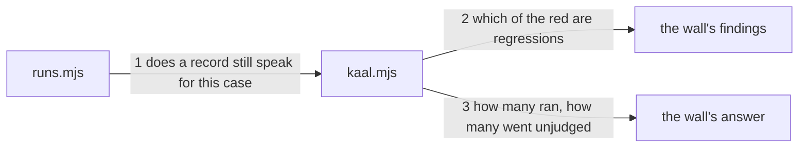

---
traces:
  parent: a-wall-that-does-not-apply-reports@35f96cd91e7de5777ce2eb2596454b68bef85b3cafa37fd568411d80adab0146
  requirement: a-regression-is-a-promise-that-was-kept@ccc81e5cf0720b7b7f0a993aee52b973456a1e8c497828dc7f8c9e0066ff1432
  principles: the-two-goods@8bbe15706c3edcd63d0d050af9782c063cd585e1ec436d2314fa0003dfaa8cb6, the-seat-owns-the-lens@e1ab0650fc88dc8e1e16347fc8b14b236f1c57b94e50bfdf3f62aa4ec0d6d070
---

# Drawing: a-regression-is-a-promise-that-was-kept

Delivery architecture: what this tree uses to deliver, and not what it
delivers. What moves is the sentence a wall says about work in flight.

## What the runs said

- The join between a case and its task is built and exported.
  `requirementFor(testFile)` in `bin/lib/acceptance.mjs` resolves an
  acceptance test to its sibling requirement and a contract test to the
  requirement under `requirements/<task>/`, and the judged runner reads the
  task off it with `basename(dirname(req))`. Both judged walls already use it.
- The two terms the verdict table turns on are separate and both exported.
  `verdict(root, run, pass, fail, task)` in `bin/lib/runs.mjs` computes
  `fresh = isFresh(root, run)` and then answers `regressed` where `fail > 0
&& fresh`, and `not delivered` where `fail > 0` and it is not.
  `readRun(root, task)` and `isFresh(root, run)` are exported beside it.
- The regression command reads neither. `bin/kaal.mjs` calls
  `casesOf(root, "regression")`, hands the list to `runCases`, and prints
  every path in `r.red`. Nothing on that path opens a requirement or a record.
- `runCases` answers paths and never counts. It runs the whole list in one
  process, and only where that failed does it ask again file by file, so what
  comes back is `{ ok, cases, red: [path] }` and no per-case pass and fail.
- A case path does not always name a task. An acceptance case is
  `requirements/<task>/acceptance.test.mjs` and a contract case is
  `architecture/<task>/contracts.test.mjs`, but a unit is `bin/lib/x.test.mjs`
  and answers to no requirement at all. The regression plan reaches only the
  acceptance suite today.

## Structure

Three parts, all of them existing.

- **`bin/lib/runs.mjs`** gains the one reader this needs, and the join it
  rests on: whether a run on record still speaks for the task a given case
  belongs to, and which task that is. It is where `readRun` and `isFresh`
  already live and where the verdict table is, so the two answers cannot come
  from different places; and the join has to be here rather than borrowed from
  `acceptance.mjs`, which already imports this module.
- **`bin/kaal.mjs`** splits what the run gave it: the red cases that are
  regressions, and the cases the wall did not judge.
- **`SURFACE.md`** says what the wall now promises, which is a narrower claim
  than the one it made.

Nothing in `bin/lib/plans.mjs` moves: which cases the plan reaches and how
they are run is `a-plan-picks-its-suites` and this task does not touch it.

## Seams

1. `promised(root, path)`: in a root and a case path, out whether the task
   that case belongs to has a run on record that still speaks for it. False
   where the path answers to no task at all. Owned by `runs.mjs` / the
   regression wall. The join from a path to a task comes with it and lives
   there too: `requirementFor` is in `acceptance.mjs`, which already imports
   `runs.mjs`, so importing it back is a cycle that answers false for every
   case rather than failing to load. A reader that resolves the two trees a
   case can sit under, and answers nothing for any other shape, is the seam.
2. The findings: of the cases that came back red, only those `promised`
   answers true for are named, and each is named by path as before. Owned by
   `kaal.mjs` / a reader and the exit code.
3. The answer: how many cases the wall ran and how many of them it did not
   judge, on the line it already prints. Owned by `kaal.mjs` / a reader.

## Fixed and free

- Fixed: `promised` reads the record through the join both judged walls
  already use, and the freshness through the same `isFresh` the verdict table
  uses. Two readers of one thing drift, and this release met that twice.
- Fixed: a case the wall did not judge is not named as a finding, by criterion
  1, whatever it did when it ran.
- Fixed: a case with a record that now fails is named by path, by criterion 2,
  and the wall refuses.
- Fixed: the answer carries both numbers, what ran and what went unjudged, by
  criterion 4. A reader must not have to subtract.
- Fixed: which cases the plan reaches and how they are run, by
  `a-plan-picks-its-suites` criterion 4, which this task leaves alone.
- Free: the name of the reader, where the counts sit in the sentence, the
  wording of the line, and whether the split is computed before the run or
  after it.

## Decisions

### The wall reads the two terms and never the verdict table

- Chosen: `promised` answers the one thing the verdict table calls `fresh`,
  from the same `readRun` and the same `isFresh`, and the red comes from the
  run as it does now. The wall never asks for a word.
- Not taken: calling `verdict(root, run, pass, fail, task)` per case, which is
  the table itself and would guarantee agreement by identity.
- Because: the table needs a pass and a fail count per case and `runCases`
  answers paths. Getting counts means a process per case, seventy of them
  where the fast path spends one, on a wall that already runs on every branch.
  The two terms are what the table turns on for this question, they come from
  the same two functions, and a case cannot be fresh to one reader and stale
  to the other. Criterion 3 is met by shared inputs rather than by a shared
  call.
- Bought: the wall stays one process on a green tree, and it spent the
  guarantee by identity: if the table's meaning of `regressed` ever widens
  beyond `fail and fresh`, this reader does not follow it.
- Weighed against: the-two-goods.
- Reopens if: the verdict table gains a term, at which point two readers of
  one rule exist again and the per-case call is the honest answer.

### A case that answers to no task was never promised

- Chosen: `promised` is false where the path resolves to no requirement, so a
  unit or any other case with no task behind it is never named a regression.
- Not taken: treating such a case as always promised, which is what the wall
  does today for every case; refusing the plan that reaches one, which is a
  new finding for a tree nobody has built yet.
- Because: a record is what says a promise was made, and a case with no task
  has no record and can have none. Calling it promised would report a
  regression the tree can offer no evidence for, which is the thing this task
  exists to stop. The regression plan reaches only the acceptance suite today,
  so nothing changes now and the rule is there before it is needed.
- Bought: the rule holds over any suite the plan later picks, and it spent the
  protection a unit case would get if the plan ever named the units suite:
  that case's red would go unreported by this wall. Its own wall still runs it.
- Weighed against: the-seat-owns-the-lens.
- Reopens if: the regression plan names a suite whose cases answer to no task,
  which is the tester's choice and would make this silence load bearing.

### Both numbers, and the run stays whole

- Chosen: the wall runs everything the plan reaches, as it does now, and the
  answer says how many it ran and how many of those it did not judge.
- Not taken: skipping the cases it will not judge, which saves their run time
  and makes the count of what it ran smaller than what the plan reaches; two
  numbers a reader then has to reconcile against the plan.
- Because: a case that is not judged is still a case somebody may want to see
  fail, and the acceptance wall runs it anyway on the same board, so skipping
  buys time on one wall and loses nothing but noise on the other. Both numbers
  on one line is the cheapest thing that leaves nothing to subtract.
- Bought: one arithmetic a reader can do in their head, and it spent the run
  time of cases whose answer the wall then sets aside.
- Weighed against: the-two-goods.
- Reopens if: the regression plan reaches enough unjudged cases that their run
  time is felt, which is the same measurement the wall's own cost is under.

## Test strategy

| criterion | layer    | kind          | why                                                                     |
| --------- | -------- | ------------- | ----------------------------------------------------------------------- |
| 1         | contract | deterministic | seams 1 and 2: no record, so nothing to name                            |
| 2         | contract | deterministic | seams 1 and 2: a record that passed and a case that fails now           |
| 3         | contract | deterministic | seam 1: the same two functions the verdict table reads, on one tree     |
| 4         | contract | deterministic | seam 3: both counts, computed from a tree and not written into the test |
| none      | unit     | none          | the reader is two calls and a join, and a contract sees all of it       |
| none      | manual   | none          | nothing here reaches a screen or a person                               |

## Handoff

- Task: a-regression-is-a-promise-that-was-kept
- Seams: 3; contract tests: 3 (equal)
- Red run: `node --test --test-timeout=60000
architecture/a-regression-is-a-promise-that-was-kept/contracts.test.mjs`, 13
  September 2026, all 3 failing, and each one failing on its own as well
- Stand-in green: all three, and the requirement's four, and the superseded
  task's six, discarded from file copies. It found the one thing this drawing
  could not have known by reading: `acceptance.mjs` already imports
  `runs.mjs`, so the join cannot be imported back. `promised` reading
  `requirementFor` where it lives is a cycle and answers false for every case,
  which reads as a record that does not speak rather than as a module that
  did not load
- Criteria served: seam 1 -> 1, 2 and 3; seam 2 -> 1 and 2; seam 3 -> 4
- Fixed for the developer: `promised` reads through `requirementFor` and
  `isFresh` and derives neither; a case answering to no task is not promised;
  the run stays whole; both counts on the answer
- Build order: seam 1 first, because the other two read it. Then 2, then 3
- Blocked on: nothing
- Unblocks: every task stated between here and the cut, each of which reds
  this wall on its own branch today, and item 13 which wants a board whose red
  means something
- Supersedes: nothing. Its requirement supersedes `a-plan-picks-its-suites`
  in the proof and this drawing adds nothing to that
