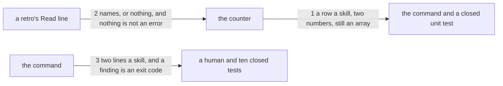

---
traces:
  requirement: a-retro-names-what-it-read@16eec13b76235731ac675abd5ed118d851ff0c3ffb86e50d73a3a2ed9bd457c1
  principles: nothing
---

# Drawing: a-retro-names-what-it-read

_Written in architect mode from `requirements/a-retro-names-what-it-read`,
five criteria and five red tests. The closed requirements were read first:
`nothing-passes-vacuously` fixes that a command finding nothing still
answers, which is why an empty read count is an answer and not a finding;
`status-v1` fixes the exit vocabulary this change adds a 1 to; and
`gates-v1` fixes that `kaal retros` is a report and not a wall, which is the
gap this drawing prices and does not close._

## What the runs said

- `grep -rn countRetros --include=*.mjs` finds four readers of the counter:
  its own definition, `bin/kaal.mjs` line 242, and **two assertions in
  `tests/retros.test.mjs`**, one of which is `assert.ok(Array.isArray(c))`.
  The array shape is held by a closed unit test that belongs to another
  seat, so the counter's return may gain a field and may not change kind.
- Ten test files read `^<skill>: (\d+) unconsumed$` anchored, counted in the
  requirement. Twenty seven files under `requirements/` and `architecture/`
  drive `kaal retros` in some form.
- `node bin/kaal.mjs retros` exits 0 today on every tree it can read, and 2
  on a tree that is not this league's. It has never exited 1.
- The counter accepts two spellings of the line it already reads,
  ``Feeds: `skill`.`` and `Feeds: skill`, and both are in use in the tree,
  68 and 63 times.

## Structure

One module changes, one command changes, one skill's text changes. No wall
is added and `kaal.config.json` does not move.

- **the counter** (`bin/lib/retros.mjs`, changes): reads `retros/`, reads
  every `requirements/*/requirement.md` to know what is consumed, and
  returns one row per skill. It gains a second number per row and a second
  exported function beside it.
- **the command** (`bin/kaal.mjs`, changes): prints the rows and sets the
  exit code. It is the only place the two numbers become lines and the only
  place a finding becomes an exit code.
- **the skill's text** (`skills/retro-4ls/SKILL.md`, changes): the output
  format block a seat copies, and the rule in `Feed the loop` that says what
  the new line carries. A human reads it; nothing parses it.
- **the retros** (`retros/*.md`, data, unchanged by this task): 131 of them,
  none carrying the new line. They are the counter's input and the reason
  an absent line is an answer.
- **the closed unit test** (`tests/retros.test.mjs`, unchanged): another
  seat's test, which fixes the counter's return kind. It is a constraint
  here, not a part to change.

## Seams

1. **A row per skill carries two numbers.** `countRetros(root)` returns an
   array, one entry per directory under `skills/`, each
   `{ skill, count, read }`. `count` is unchanged: unconsumed retros whose
   `Feeds:` line names the skill. `read` is every retro whose `Read:` line
   names the skill, consumed or not, archived excluded as today. The array
   kind is the promise; a caller may still `map` it.
2. **A read line's grammar.** The counter reads at most one `Read:` line per
   retro, at the start of its own line, holding names separated by commas.
   A name may be wrapped in backticks and the line may end in a period, the
   two liberties `Feeds:` already takes. No line, or a line holding nothing,
   is zero names and never an error.
3. **The unknown names are asked for separately.** `readFindings(root)`
   returns `{ retro, name }[]`, one entry per name on a `Read:` line that is
   not a directory under `skills/`, empty when there are none. It is a
   second function rather than a second field because the first seam's kind
   is held by a closed test.

## Fixed and free

Fixed:

- The line `<skill>: <n> unconsumed`, exactly as it is printed today,
  including its position at the start of its own line. Ten closed tests read
  it anchored.
- The line `<skill>: <n> read`, in that shape, printed for every skill.
- The order: a skill's two lines are adjacent, unconsumed first, and the
  skills keep the order the counter returns them in, which is the sorted
  directory listing.
- The exit codes: 0 with no findings, 1 with any, 2 unchanged for a tree
  that is not this league's.
- `countRetros` returns an array.
- The skill's new sentence lives in `Feed the loop`, after the sentence that
  names `Feeds:`, and the new line lives in the output format block after
  the `Feeds:` line. Both are places, and both are what the acceptance
  tests read.
- That `retro-4ls` gets no exception. A retro naming it on the read line is
  ordinary, and the analyst priced that in the requirement.

Free:

- The finding's wording. Nothing reads it but a person, and the acceptance
  test asks only that the retro's filename and the unknown name are both in
  what comes back.
- Whether the counter reads each retro once or twice, and whether the two
  exported functions share a helper.
- The order of findings.

## Decisions

### The read count is a second line, not a second number on the first

- Options: a second number on the existing line
  (`<skill>: 2 unconsumed, 5 read`); a second line per skill; a `--read`
  flag; a trailing block.
- Chosen: a second line per skill.
- Why: ten closed tests across two walls read the existing line anchored on
  its end. A second number breaks all ten to add a report, and the report
  is worth less than the contracts.
- Bought: the shortest path to value. Nothing else in the tree moves and no
  closed task is superseded.
- Spent: the output doubles in length, and a reader who scans the command's
  answer meets every skill twice. On a six skill tree that is twelve lines
  where six would do.
- Reopens if: a consumer needs both numbers on one line, or the tree grows
  enough skills that twelve lines becomes fifty.

### A read counts whether or not the retro was consumed

- Options: count reads over unconsumed retros only, the way `count` works;
  count reads over every retro in `retros/`.
- Chosen: every retro in `retros/`.
- Why: the number exists to answer "is this skill being leaned on and
  hearing nothing". A stack run on another skill consumes retros for that
  skill's sake, and if it also erased their reads, the skill they read would
  go quiet at exactly the moment the tree learned something.
- Bought: keeping the most choices open. The number stays meaningful under
  any future rule about what consumption means, which is the open question
  the requirement left.
- Spent: the two numbers on a skill's two lines do not mean the same kind of
  thing. `unconsumed` is a backlog that falls when it is worked; `read` is
  closer to a running total and falls only when retros are archived. A
  reader who assumes they are comparable will misread both.
- Reopens if: someone needs reads since the last stack, at which point the
  answer is a third number and not a change to this one.

### An unknown name is a finding, and the board never sees it

- Options: ignore an unknown name; print it as a note and exit 0; make it a
  finding with exit 1; add a wall.
- Chosen: a finding with exit 1, and no wall.
- Why: a name that matches no skill counts nowhere and looks exactly like a
  skill nobody reads, which is the one reading this whole task exists to
  make impossible. Exit 1 is the vocabulary's word for findings.
- Bought: the shortest path. One command learns to refuse; nothing in the
  board's ten walls moves.
- Spent: `kaal retros` is a report and no wall runs it, so nothing in `npm
test` will ever see the finding. A misspelled read line lands green and
  stays wrong until a person runs the command.
- The gap this opens, and the task that closes it: **`the-board-counts-the-reads`**,
  a wall that runs the counter over the league's own tree and fails on any
  finding. It is not this task, because adding a wall is a bigger step than
  the ask and the board's ten walls are a governance surface.
- Reopens if: a wrong read line survives a merge, which is the evidence that
  a person running the command is not enough.

## Test strategy

| criterion | layer    | kind          | why                                                                                                                      |
| --------- | -------- | ------------- | ------------------------------------------------------------------------------------------------------------------------ |
| 1         | contract | none          | the skill's text is read by a person and by the acceptance test; no seam is below it, and a wall on prose is not the ask |
| 2         | contract | deterministic | seam 3: the command's two lines per skill, driven on a fixture root                                                      |
| 3         | contract | deterministic | seam 1: the counter's rows, read as data, so a wrong number is read off the row and not off a printed line               |
| 4         | contract | deterministic | seam 2 and seam 3: an unknown name becomes a finding and the finding becomes an exit code                                |
| 5         | contract | deterministic | seam 2: no line, and a line holding nothing, are zero names and not an error                                             |
| none      | wall     | none          | no wall runs `kaal retros`, priced in the third decision and left to `the-board-counts-the-reads`                        |

## Handoff

- Task: a-retro-names-what-it-read
- Seams: 3; contract tests: 3 (equal)
- Red run: `node --test --test-timeout=60000 architecture/a-retro-names-what-it-read/contracts.test.mjs`, all 3 failing; stand-in green: all 3 passing, discarded
- Criteria served: seam 1 -> 3; seam 2 -> 4, 5; seam 3 -> 2, 4
- Fixed for the developer: the two line shapes and their order, the three
  exit codes, `countRetros` returning an array, the two places in the
  skill's text, and that `retro-4ls` gets no exception
