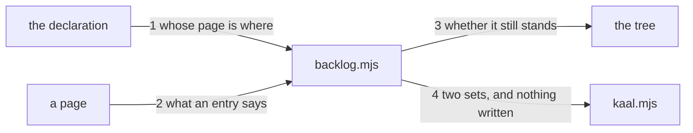

---
traces:
  parent: a-crossing-names-its-owner@d447518f9968861e91e5f849797b14fbc621177684197dc65d23e2672a66b3a9
  requirement: a-seat-carries-its-own-backlog@11ddece8d1df62f6dfd8315f5d8d8db7e6c30c0052e7bc575705cd04c85d0816
  principles: the-two-goods@8bbe15706c3edcd63d0d050af9782c063cd585e1ec436d2314fa0003dfaa8cb6, the-seat-owns-the-lens@e1ab0650fc88dc8e1e16347fc8b14b236f1c57b94e50bfdf3f62aa4ec0d6d070
---

# Drawing: a-seat-carries-its-own-backlog

Delivery architecture. Nothing a consumer installs moves here; what moves is
where a seat writes what it cannot do, and how a page stops being true
without anybody editing it.

## What the runs said

- The tree already has this shape, one kind of thing away. `bin/lib/traces.mjs`
  carries `KINDS`, a table whose rows say where a thing of that kind lives
  relative to a root, with the comment that a row per kind is what makes the
  concept general and a rule per kind is what it refuses. A block waits for a
  requirement, a drawing, a proof or a record, which are four of those rows
  already written.
- The parser returns the block as a map and the key may carry a slash.
  `parseFrontmatter` on a page carrying `blocks:` answers
  `{ blocks: { "<key>": "<value>" } }`, and `bin/lib/frontmatter.mjs` says the
  slash in a sub key was widened in for `reviews:`, whose keys are compound
  for the same reason this one is.
- Every seat's tree is one segment. `manager plan/**`, `analyst
requirements/**`, `architect architecture/**`, `tester tests/**`, `developer
bin/** SURFACE.md`, `operator deploy/**`: the first glob's first segment is
  the tree in every case, so a page beside what a seat owns needs no seventh
  declaration.
- The requirement's own proof fixes two shapes no criterion states.
  Criterion 4's test asserts that no `blocked` is followed anywhere by the
  task's name, so the set reporting a cleared block cannot sit after the
  standing set. Criterion 3's asserts `/\bclear\b/i`, which the word
  `cleared` does not match, so the set is called clear and not cleared. A
  criterion is what somebody chose to say and a test is what is actually
  held, and both of these are held. The second was found by a stand-in going
  red on a word.
- Nothing resolves a kind today. `kaal backlog` is not a subcommand, the
  declaration carries no kinds, and `AGENTS.md` says a blocked seat names its
  block where it stands without saying what a block may be about.

## Structure

Four parts, one of them new to this tree and three of them shapes it already
has.

- **`bin/lib/backlog.mjs`**, the new module: which page belongs to which seat,
  what a page holds, and whether a block still stands.
- **a row per kind**, in that module, saying where the thing a block waits for
  lives. The same table `traces.mjs` carries, for a different question.
- **`kaal.config.json`** gains `blocks`, the kinds a seat may write. A
  governance diff, and not this drawing's to land.
- **`bin/kaal.mjs`** gains the subcommand: two sets, and nothing written.
- **`AGENTS.md`** gains the table, and **`package.json`** the exclusion. Both
  governance's, and the second is a patch the asker has already placed an ask
  to remove.

## Seams

1. `pages(root)`: in the declaration; out one page per declared seat, at the
   first segment of that seat's first owned glob. Owned by `backlog.mjs` /
   the seat rule.
2. `entries(text)`: in a page; out one entry per key in its `blocks:` block,
   split at the first slash into the seat that owes and the task, the value
   the kind. A key with no slash, a seat the declaration does not hold or a
   kind it does not hold is a finding naming the page and the key. Owned by
   `backlog.mjs` / the frontmatter parser.
3. `stands(root, entry)`: in an entry and a tree; out whether the block still
   stands, through the row for its kind. A kind the declaration holds and no
   row resolves is a finding, because a block of that kind could never clear
   and would stand for ever without anybody being told. Owned by
   `backlog.mjs` / the tree.
4. `kaal backlog`: the cleared set, then the standing set grouped by the seat
   that owes it, and not one byte written under the root. Owned by
   `kaal.mjs` / the board.

## Fixed and free

- Fixed: one page per declared seat and no seventh declaration of where it
  lives, by criterion 1.
- Fixed: the key is `<seat>/<task>` and the value carries the kind and no
  remedy, by criterion 2, and both the seat and the kind are checked against
  the declaration.
- Fixed: a declared kind that no row resolves is a finding, by criterion 4,
  which cannot be satisfied for a kind that can never be met.
- Fixed: the cleared set is reported before the standing set and the word
  for it is `clear`, both by the requirement's own proof rather than by its
  words, at criteria 4 and 3.
- Fixed: a task blocked by two seats appears under each, by criterion 3, which
  is why the key is compound and the grouping is by the seat that owes.
- Fixed: nothing under the root changes, by criterion 5.
- Free: the wording of both sets beyond the one word the proof holds, the
  name of every function here, whether a row is a function or a path
  template, and whether the kinds are read once or per entry.

## Decisions

### The kinds are declared and their resolution is the engine's

- Chosen: `kaal.config.json` holds the kinds a seat may write, and
  `backlog.mjs` holds a row per kind saying where the thing waited for lives.
  A kind in one and not the other is a finding.
- Not taken: the kinds only in the engine, which leaves a seat reading source
  to learn what it may write and `AGENTS.md` unable to be held to anything;
  the kinds only in the config, carrying their own path template, which makes
  a declaration a place where a path is written and a config file a program.
- Because: these are two different facts. What a seat may say is vocabulary
  and belongs where the seats and the lanes are already declared; where a
  drawing lives is resolution and belongs where `traces.mjs` already answers
  the same question for the same four artefacts. What a seat may write is its
  own lens and where an artefact lives is the method, which is why the first
  belongs in the declaration and the second in the engine. The split is the
  one this tree already made once, and the wall that checks they agree is
  what keeps it from being two sources of one truth.
- Bought: keeping choices open, because a kind can be added to the vocabulary
  and the engine says plainly that it cannot resolve it, and it spent one
  more agreement for somebody to keep: the config, the engine and `AGENTS.md`
  now say the same list in three places and two walls hold them together.
- Weighed against: the-seat-owns-the-lens.
- Reopens if: a kind needs a resolution the tree cannot express as a path,
  such as a state of a provider, at which point the row is not a path and the
  split moves.

### The clear set is what cleared, not what is left

- Chosen: the two sets are blocks that no longer stand and blocks that do.
- Not taken: the clear set as every task with no block, which is the whole
  tree minus the blocked and says nothing a reader did not know; the cleared
  block silently dropped, which makes criterion 4 unobservable and leaves a
  seat's page carrying an entry nobody told them was spent.
- Because: the interesting fact is movement. A seat that wrote a block wants
  to know it is spent, and the manager wants to know what is newly orderable;
  neither learns anything from a list of work nobody blocked. It is also what
  makes the self clearing rule visible rather than merely true.
- Bought: the shortest path to value, and it spent the word: `clear` in the
  answer means a block that cleared and not a task that is free, which is a
  reading a reader has to be told once.
- Weighed against: the-two-goods.
- Reopens if: the manager's own command wants orderable work rather than
  spent blocks, which is the asker's item 7 and a different question.

### A page is a page and the command never writes one

- Chosen: `kaal backlog` reads six pages and answers; a seat writes its own
  page by hand, as it writes a bug and a record.
- Not taken: the command clearing a spent entry, which is the manager's
  process editing a seat's tree, the exact reach across lanes this shape
  exists to remove.
- Because: the tree already draws this line twice. `kaal bugs` reads and never
  writes because recording is the act of the seat that proves, and the same
  sentence is in `SURFACE.md` about a run record. A collector that tidied up
  after a seat would be a seventh hand in six trees.
- Bought: keeping choices open, and it spent tidiness: a spent block sits on a
  seat's page until that seat removes it, and the answer says so every time.
- Weighed against: the-seat-owns-the-lens.
- Reopens if: a spent block becomes noise at a scale a person will not clear,
  which is a count nobody has yet.

## Test strategy

| criterion | layer    | kind          | why                                                                          |
| --------- | -------- | ------------- | ---------------------------------------------------------------------------- |
| 1         | contract | deterministic | seam 1: a page per seat, off the declaration                                 |
| 2         | contract | deterministic | seam 2: the key split, and the two kinds of stranger                         |
| 3         | contract | deterministic | seam 4: two sets, grouped, and one task under two seats                      |
| 4         | contract | deterministic | seam 3: the same entry against two trees, and the unresolvable kind          |
| 5         | contract | deterministic | seam 4: the tree before and after                                            |
| 6         | none     | none          | the table is prose in a page and the acceptance case reads it at the surface |
| 7         | none     | none          | the exclusion is a line in a manifest and the acceptance case packs the tree |
| none      | unit     | none          | every seam here is driven directly by a contract and the module is new       |
| none      | manual   | none          | nothing here reaches a screen or a person                                    |

## Handoff

- Task: a-seat-carries-its-own-backlog
- Seams: 4; contract tests: 4 (equal)
- Red run: `node --test --test-timeout=60000
architecture/a-seat-carries-its-own-backlog/contracts.test.mjs`, 13 September
  2026, all 4 failing, and each one failing on its own as well
- Stand-in green: all four and the requirement's seven, with the kinds, the
  table and the exclusion staged beside them, discarded from file copies
- Criteria served: seam 1 -> 1; seam 2 -> 2; seam 3 -> 4; seam 4 -> 3 and 5.
  Criteria 6 and 7 are data in two files and the acceptance case reads them at
  the surface, which is why the table has no contract row for them
- Fixed for the developer: one page per seat off the declaration; the key
  compound and both halves checked; a declared kind no row resolves is a
  finding; the cleared set before the standing set; nothing written
- Build order: seam 1, then 2, because 3 has no entry to judge until 2 reads
  one. Then 3 and 4 together
- Blocked on: nothing in the build. The kinds, the table and the exclusion are
  one governance diff that follows, and the contracts drive scratch trees
- Answers this drawing gives to the requirement's open questions: the third,
  what happens to a block on a task nobody is working on, is answered in part
  by seam 3: a block whose kind no row resolves is a finding rather than a
  thing that stands for ever. A block whose kind resolves and whose artefact
  never arrives still stands, and that is the asker's. The first two are
  untouched
- Supersedes: nothing
