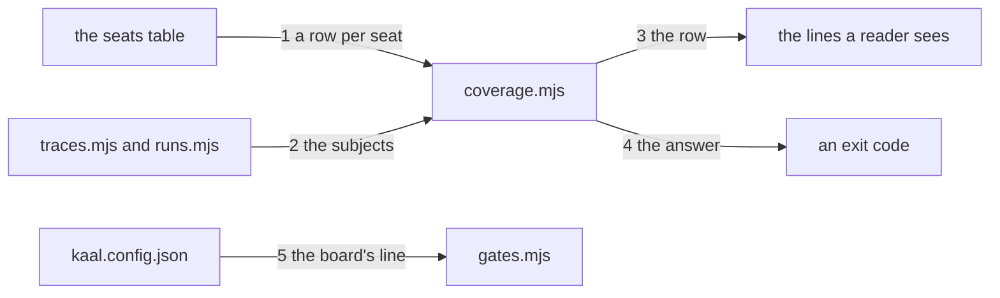

---
traces:
  requirement: a-seat-claims-what-it-covers@54e362d6620a25b61c205540439cf90f3284faf96820c9c646951401ec8440e0
  principles: the-two-goods@8bbe15706c3edcd63d0d050af9782c063cd585e1ec436d2314fa0003dfaa8cb6, the-seat-owns-the-lens@e1ab0650fc88dc8e1e16347fc8b14b236f1c57b94e50bfdf3f62aa4ec0d6d070
---

# Drawing: a-seat-claims-what-it-covers

## What the runs said

- The board cannot show what this wall has to say. `bin/lib/gates.mjs` reads
  one number from a wall, a line beginning with a hash or the spec reporter's
  info symbol and then `pass` and a number, and prints it as
  `(N passing)`. A wall's own output is printed only when it fails. So a
  coverage wall that passes would print `ok coverage` and nothing else, and
  the four rows would be invisible on the board that ran them.
- Criterion 6's own test asks the config for a per gate `count` pattern, and
  no such thing is read: `gates.mjs` matches the one shape and the config
  declares no counts at all. The criterion is right and its test asks for a
  mechanism that does not exist, which the build must answer for.
- `gates-v1` fixes the line: the board "prints one line per wall and a
  summary with measured counts". `gates-v2` fixes the reading: a wall
  "printing a count exits 0 and reads the count". Both are about a count of
  tests, and neither anticipated a wall whose whole output is the answer.
- Everything the rows need is already read by something. A drawing declares
  the requirement it answers and `bin/lib/traces.mjs` parses it; a run record
  lives at `tests/runs/<task>.md` and `bin/lib/runs.mjs` reads it and says
  whether it is fresh. Two modules, no new source.
- The numbers on this tree today: 61 stated, 54 answered by a drawing, 59
  with a fresh record, 54 of 54 drawings carrying contract cases. Seven
  requirements have no drawing and two have no record.

## Structure

One module, one command, one gate, and one thing the board learns to do.

- `bin/lib/coverage.mjs` is new. It holds the seats as a table, one row each,
  saying what that seat counts and how; it answers, for a root, which tasks
  each row covers and which it does not; and it renders a row.
- `bin/kaal.mjs` gains `coverage [root]`, shaped like `traces` and `runs`.
- `kaal.config.json` gains a thirteenth gate running it, and the gate says
  its output is worth showing when it passes.
- `bin/lib/gates.mjs` learns that one thing: a gate may declare that its own
  line belongs on the board whether it passed or failed. Nothing else about
  the board changes.

## Seams

One labelled edge per seam, numbered to match the list below; the parts are
the structure's parts. The list is the contract; the picture is the reading,
and it carries nothing the list does not.

1. a row per seat: in the table, out one entry per seat carrying its name,
   the word for what it counts, and the function that counts it. Adding a
   seat is adding a row and nothing else, which is what makes the operator's
   row a later line rather than a later design. Owned by `coverage.mjs` /
   the table.
2. the subjects: in a root, out for each row the tasks it covers and the
   tasks it does not, as two lists that together are every task stated. The
   architect's row reads a drawing's declared requirement through the trace
   module; the tester's reads a record's freshness through the runs module.
   Neither counts a directory. Owned by `coverage.mjs` / `traces.mjs` and
   `runs.mjs`.
3. the row: in a name, a word, a covered list and a total, out one line
   carrying the seat, the word, how many of how many, the share as a whole
   percentage, and the names it does not cover up to a limit, with how many
   more when it stops. A row covering everything says so instead of naming
   nothing. Owned by `coverage.mjs` / the reader.
4. the answer: in a root, out 0 with the rows where the tree states a
   requirement, and 2 where it states none, and never 1. A gap is a fact and
   not a finding, so this command has no way to fail. Owned by
   `bin/kaal.mjs` / the exit vocabulary.
5. the board's line: in a gate declaring that its line is worth showing, out
   that wall's own output on the board whether it passed or failed. A wall
   that cannot fail is a report the board carries, and a board that only
   speaks when refused cannot carry one. Owned by `gates.mjs` /
   `kaal.config.json`.

## Fixed and free

- Fixed: the seats are a table and a row is `{ name, counts, of }`. Criterion
  1 and decision 2.
- Fixed: the architect's row reads a drawing's declared requirement and the
  tester's reads a record's freshness. Criterion 2, and both through the
  modules that already own those readings.
- Fixed: every row names what it misses, up to a limit, and says how many
  more. Criterion 3.
- Fixed: 0 or 2 and never 1. Criterion 5.
- Fixed: the gate declares that its line shows, and the board honours it.
  Criterion 6 and decision 1.
- Fixed: the share is truncated and never rounded. Nothing in the criteria
  says so and it is the one number this report must never be able to get
  wrong: 199 of 200 rounds to 100 per cent and reads as done.
- Free: the limit's number, the exact wording of a row, and whether the rows
  are padded to align. None of those is a promise to anyone.
- Free: whether `coverage.mjs` caches what it reads from the two modules.

## Decisions

### The board learns to show a wall that cannot fail

- Chosen: a gate may declare that its own line belongs on the board, and
  `gates.mjs` prints that wall's output whether it passed or failed.
- Not taken: printing `# pass N` from the coverage command so the existing
  count is read; a per gate count pattern in the config, which is what
  criterion 6's test asks for; leaving coverage off the board and making it
  a command a person runs.
- Because: the board reads one number and calls it passing tests, and this
  wall has four numbers and none of them is a test. A count pattern would
  carry one of the four and the criterion asks for all of them. Printing a
  false `# pass` would put a number on the board under the wrong word, which
  is the kind of quiet lie this league spends its days refusing. Showing the
  wall's own line is smaller than either and it generalises: any wall whose
  output is the answer can say so.
- Bought: the shortest path, and it spent uniformity. Some walls now speak
  when green and some do not, and a reader has to know that is deliberate.
- Weighed against: the-two-goods.
- Reopens if: a second wall wants to show a line and the two disagree about
  how much, at which point the flag needs a size and not only a yes.

### The seats are a table and a row is a seat

- Chosen: one entry per seat, each carrying the word for what it counts and
  the function that counts it.
- Not taken: a function per seat called in turn; a switch on a seat's name.
- Because: the ask names four seats and says operations has nothing to count
  yet, so the shape has to make a fifth row cheap. The trace wall's kinds
  table is the same idea and it has already paid twice: adding a kind is
  adding a row, and adding a place was a line. Making the seats a list means
  the operator's row is a later line rather than a later design.
- Bought: keeping choices open, and it spent almost nothing: a table of four
  is barely longer than four calls.
- Weighed against: the-two-goods, the-seat-owns-the-lens.
- Reopens if: two rows need to disagree about what a task even is, at which
  point they are not rows of one table.

### A row names what it misses

- Chosen: every row lists the tasks it does not cover, up to a limit, and
  says how many more when it stops.
- Not taken: the percentage alone; a second command for the names; naming
  everything however long the list.
- Because: a percentage tells a reader they have a problem and not where it
  is, which is the same complaint this league makes of a wall that says red
  without saying which. The limit exists because a row naming fifty tasks is
  a row nobody reads, and saying how many more is what keeps the elision
  honest.
- Bought: evidence, and it spent brevity: the board's coverage lines are now
  the longest lines on it.
- Weighed against: the-two-goods.
- Reopens if: a row's misses outgrow a line often enough that the limit is
  always reached, which would mean the report wants a second surface.

### Nothing here can fail

- Chosen: exit 0 with rows, 2 with nothing to count, never 1.
- Not taken: failing under a threshold; failing when a row drops; a waiver
  for a low number.
- Because: coverage is a fact about how far the work has got, not a promise
  anybody made, and no threshold is in the ask. A number that refuses is a
  policy, and this league does not wall a judgement. What could fail is a
  claim about the number, and the requirement's own open question names the
  shape: a coverage record, pinned like a run, would make a drop a
  regression rather than an opinion.
- Bought: keeping choices open, and it spent teeth. A number that only ever
  reports is a number people can learn to scroll past.
- Weighed against: the-two-goods.
- Reopens if: the asker wants a drop to refuse, which is the open question
  and is a different task.

## Test strategy

| criterion | layer      | kind          | why                                                                                                                                            |
| --------- | ---------- | ------------- | ---------------------------------------------------------------------------------------------------------------------------------------------- |
| 1         | contract   | deterministic | Seam 1. The table read as data: a row per seat, each naming its word and its counter.                                                          |
| 2         | contract   | deterministic | Seam 2. The two readings on a fixture with one gap in each, so a row counting directories would be wrong and a row reading the edge would not. |
| 3         | contract   | deterministic | Seam 3. A row over a covered tree, a row with misses, and a row whose misses pass the limit.                                                   |
| 4         | contract   | deterministic | Seam 4. A tree that states nothing, a tree with gaps, and neither of them a finding.                                                           |
| 5         | contract   | deterministic | Seam 4 again for the code itself; kept in one seam because one function decides both the rows and the answer.                                  |
| 6         | contract   | deterministic | Seam 5. A gate declaring its line shows, and the board carrying it while green.                                                                |
| 7         | acceptance | deterministic | The league's own numbers are a sweep of this tree and not a seam, and only the acceptance test can hold the tree to itself.                    |
| none      | unit       | none          | The counting is behind seams 1 and 2 and a unit of it would be the contract test with the seam removed.                                        |
| none      | manual     | none          | Nothing here needs a person to look, and the judgement this league refuses to wall, whether 88 per cent is enough, no wall reads.              |

## Handoff

- Task: a-seat-claims-what-it-covers
- Seams: 5; contract tests: 5 (equal)
- Red run: `node --test architecture/a-seat-claims-what-it-covers/contracts.test.mjs`,
  all five failing; stand-in green: all five, on a scratch `coverage.mjs`, the
  command, and the board's one new reading, then discarded from file copies
- Isolations: five, one break at a time, each reddening exactly one seam
- Found by an isolation that reddened nothing twice: the fixtures beside the
  requirement cannot tell a declared edge from a directory, because there the
  drawing directories and the declared answers are the same set; nor a stale
  record from a missing one, because there a record is either fresh or
  absent. Seam 2's contract builds both cases itself now, and the two breaks
  that answered nothing answer
- Found by a contract test getting a number wrong: the share is truncated and
  never rounded. Rounding prints 100 per cent while something is missing,
  which is the one number a coverage report must never be able to say
- Criteria served: seam 1 to 1; seam 2 to 2; seam 3 to 3; seam 4 to 4 and 5;
  seam 5 to 6. Criterion 7 is a sweep of this tree and is served by the
  acceptance test alone, which the strategy table says in full
- Fixed for the developer: the seats as a table; both readings through the
  modules that own them; a row naming its misses with a limit; 0 or 2 and
  never 1; the gate declaring its line shows
- Owed with the build: criterion 6's acceptance test asks the config for a
  per gate `count` pattern, and the board reads no such thing. The build
  supersedes that test to ask for what decision 1 fixes, and supersedes
  `gates-v1`'s claim that the board prints one line per wall, because a wall
  may now add its own
