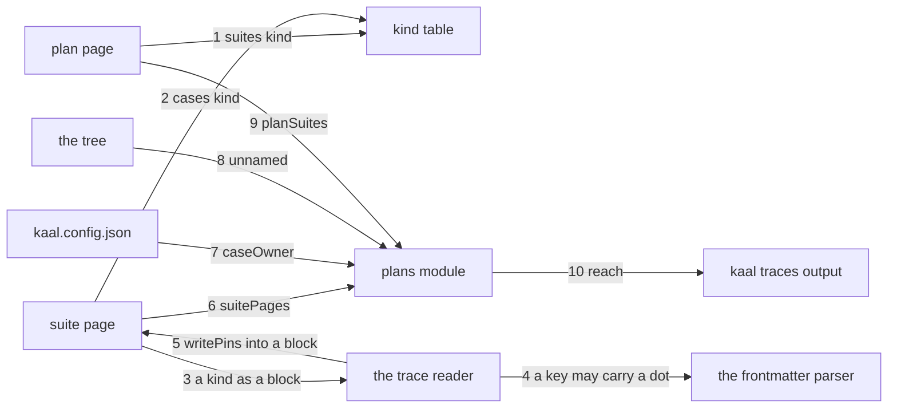

---
traces:
  requirement: a-suite-names-its-cases@7a9f8ad898a57d0ebd52e759e0dd6dff8412ea962c3388afecec3451ef6cd64c
  principles: the-two-goods@8bbe15706c3edcd63d0d050af9782c063cd585e1ec436d2314fa0003dfaa8cb6, the-seat-owns-the-lens@e1ab0650fc88dc8e1e16347fc8b14b236f1c57b94e50bfdf3f62aa4ec0d6d070
reviews:
  requirement/a-suite-names-its-cases: updated@7a9f8ad898a57d0ebd52e759e0dd6dff8412ea962c3388afecec3451ef6cd64c by architect: criterion 4 widened from a seat's tree to anything the board says owns a path, and seam 7 grew with it into owners and caseOwner; criterion 2 and 5 stopped saying how a trace is written, which is what seams 3, 4 and 5 now fix here
---

# Drawing: a-suite-names-its-cases

## What the runs said

- The kind table is the whole of the blockage and it says so itself. A plan
  carrying `suites:` and a suite carrying `cases:` answer `no such kind; the
table holds requirement, supersedes, parent, principles`, once each, and the
  tree still exits 1 on the plan's missing glob underneath.
- Only `parent:` is single valued: it carries `perArtefact: true` and is the
  one row whose `where` reads the artefact that declared it. `principles:` has
  always been a comma list resolving to many files, so `splitTrace` already
  returns many entries per key and the grammar is a graph before this drawing
  touches it.
- `where` returns a repo relative path and the caller joins it to the root:
  `if (!existsSync(join(root, where)))`. So a row whose name is already a path
  needs `where` to be the identity function and nothing else.
- The trace wall walks every `.md` under `tests/`. A suite page written with
  no frontmatter answers `suites/alpha: traces: no frontmatter block in
tests/suites/alpha`, and a `parent:` there resolves against `tests/` rather
  than the declaring file's own directory, so `parent: acceptance` from
  `tests/suites/alpha.md` answers `acceptance is not at tests/acceptance.md`.
- `checkPlans` holds three questions today: a plan is about a wall that
  exists, its globs equal that wall's globs, and its stated count equals what
  those globs match. The second and third are what criterion 5 removes.
- The board reads plan findings through `kaal traces`, not a command of its
  own: `kaal.mjs` folds `checkPlans(troot)` into the trace wall's findings and
  prints one line. So a suite finding has a place to go without a new wall.
- Counted on this tree: 64 acceptance files, 58 contract files, 25 unit files,
  147 in all, and 21 of the 25 units sit under `tests/`.

## Structure

Five parts, three of them already here.

- **The kind table** in `bin/lib/traces.mjs`, which gains two rows and loses
  nothing. It is what makes a suite's cases and a plan's suites resolve, pin,
  and go `review-needed` when what they name moves.
- **The suite pages** under `tests/suites/`, new. One document per suite,
  carrying a `traces` block whose `parent` is the strategy and whose `cases`
  is the comma list of paths this suite covers. The page's prose is the
  tester's and this drawing fixes none of it.
- **The plan pages** under `tests/plans/`, which gain `suites:` in their
  trace block and lose the glob and the stated count from their prose.
- **The plans module** in `bin/lib/plans.mjs`, which stops comparing globs
  and starts reading suites: it answers what each suite covers, which of those
  cases sit where no seat may hold them, which test files no suite reaches,
  and how far each plan reaches.
- **The strategy page**, which gains one section naming the five kinds
  `tests/` holds, so a reader with only that page can say what belongs there.

The trace wall and the plans module stay separate modules, as they are today,
and `kaal traces` keeps folding both sets of findings into one line.

## Seams

1. `suites` kind: in a name from a plan's `suites:` trace, out
   `tests/suites/<name>.md`; a name resolving to nothing is the trace wall's
   own finding and a name that resolves carries a pin like any other. Owned by
   the kind table / the plan page.
2. `cases` kind: in a repo relative path from a suite's `cases:` trace, out
   that same path unchanged; resolution, the finding for a path that is not
   there, and the pin are all the trace wall's, unchanged. Owned by the kind
   table / the suite page.
3. a kind written as a block: in a page's frontmatter, a top level key whose
   name is a kind, holding one entry to a line keyed by the name and valued by
   its sha, out the same entries a comma list inside `traces:` would give. One
   grammar and two writings: a kind picks the writing its length needs, and
   `nothing` on a line inside `traces:` and an empty block mean the same. A
   kind written both ways in one page is the block, because a block is what
   the page shows a reader. Owned by the trace reader / the pages.
4. a key may carry a dot: in the frontmatter parser's sub key, out a key of
   `[A-Za-z_][\w/.-]*` where it was `[A-Za-z_][\w/-]*`, so a case path is a
   key it reads rather than a line it drops in silence. This is a change to a
   reader four seats share, so it is a seam for every reader of it: the
   skills, the records, the waivers, the retros and the reviews block all keep
   the behaviour they have, and the only thing that changes is which keys are
   read rather than dropped. Owned by `frontmatter.mjs` / every caller.
5. `writePins` into a block: in a page carrying a kind as a block, out that
   page with a sha on each entry's own line and nothing else moved; a block
   holding one pin a review has not cleared is left whole, exactly as a line
   is. Owned by `traces.mjs` / the pages.
6. `suitePages(root)`: in a root, out one entry per `tests/suites/*.md` with
   its name and its cases, read through the trace grammar so `nothing` and
   `none` yield none and a pin is stripped. A suite yielding no case is a
   finding naming the suite and saying it names no case. Owned by the plans
   module / the suite pages.
7. what owns a case, in two halves. `owners(root)`: out every pattern the
   board says owns a path, which is each seat's `owns` and each lane's
   `allows`, because four lanes carry no seat and one of them holds the
   skills. `caseOwner(path, owners)`: out `null` where one of them holds the
   path, and otherwise one of exactly two findings: a path under `tests/` says
   `tests/` points at cases and does not hold them, and any other unheld path
   says nothing owns it. The first is checked before the second, because the
   tester owns `tests/**` and would otherwise answer the wrong one. Owned by
   the plans module / the board's config.
8. `unnamed(root, named)`: in a root and the set of case paths some suite
   names, out every `*.test.mjs` under the top level directories that set
   reaches which no suite names, and never one inside a `fixtures/` directory.
   Two exclusions and each for its own reason. Only those top level
   directories, because a tree no suite points into is not yet this wall's
   business. And never a fixture, because a fixture is a scratch tree built
   for a case and its files are that case's data rather than cases of their
   own: on this tree the first reading found forty six of them, and every one
   would have asked a suite to name a file that exists to be read and not to
   be run. Owned by the plans module / the tree.
9. `planSuites(text)`: in a plan page's text, out `{ names, findings }`: the
   suite names its `suites:` trace holds, and one finding naming any glob left
   in its prose.
   Two plans naming one suite, one plan naming many, and one case named by
   many suites are each silence. Owned by the plans module / the plan pages.
10. `reach(root)`: in a root, out one row per plan with the count of suites it
    names and the count of cases those suites cover, printed by `kaal traces`
    on its own line whatever the findings say. Owned by the plans module /
    `kaal.mjs`.

## Fixed and free

- Fixed: the two kind names, `suites` and `cases`, because a plan and a suite
  are written by hand and a reader types the key. Fixed by criteria 2 and 5.
- Fixed: both edges are written as a block, one entry to a line, keyed by the
  name and valued by its sha. Not because the criteria say so, they no longer
  say anything about it, but because a comma list cannot carry sixty five
  paths on one line and a reader meeting two shapes for one relation learns
  the shape rather than the relation.
- Fixed: the widened sub key is `[A-Za-z_][\w/.-]*` and nothing else moves in
  that parser. Every other reader of it keeps exactly the behaviour it has.
- Fixed: `cases` names a repo relative path and `suites` names a bare suite
  name. Criterion 2 says a case is named as a path; a suite lives in one place
  and a path there would be four repeated segments.
- Fixed: the edges are declared from above only. A suite never names its
  plans and a case never names its suites, which is decision 3.
- Fixed: both findings of seam 7 name the path first, and the `tests/` one is
  reached first. Criteria 3 and 4 each require their own sentence and a path
  under `tests/` satisfies both readings.
- Fixed: `reach` prints whatever the findings say, because criterion 7 asks a
  reader to see coverage without asking a second question and a red tree is
  when they ask.
- Fixed: the plan pages lose the glob and the stated count, and a glob left
  behind is a finding. Criterion 5.
- Free: every word of a suite page below its frontmatter. The tester writes
  it and no criterion reads it.
- Fixed: the plans module exports `suitePages`, `owners`, `caseOwner`,
  `unnamed`, `planSuites` and `reach`, under those names and with the shapes
  seams 6 to 10 give them. A seam a contract cannot call is a promise nobody holds, which is
  why the names are the contract and not a detail.
- Free: everything inside those five. How a suite page is read, whether the
  tree walk is one glob or many, and what is cached between calls.
- Fixed: a path with a `fixtures/` segment is never a case, whoever is asking.
  The tree already keeps that distinction, in the seats guard's proof table
  where `requirements/*/fixtures/**` is the analyst's own proof, and seam 8
  reads it rather than inventing one.
- Free: the order of the findings in the output, and whether a suite's
  findings are grouped. No criterion reads order.
- Free: the prose of the strategy page's new section beyond naming the five
  kinds and the three places, which criterion 1 fixes.

## Decisions

### A kind is written as a block where a list will not fit

- Chosen: a kind may be written as a top level block beside `traces:`, one
  entry to a line, as well as a comma list inside it, and both read the same.
  Both edges of the test graph use the block.
- Not taken: a comma list for both, which is what the first draft of this
  drawing fixed; a comma list for `suites` and a block for `cases`, each
  picking by length; cases in the page's body, outside the trace grammar
  entirely, which was the third option put to the asker.
- Because: the list does not fit. Seeding the acceptance suite from its own
  glob is 3,557 characters on one line and 7,782 once the shas are on, and
  the page that was meant to make the tree readable would be the least
  readable file in it. Letting each edge pick its own writing is worse than
  either: a plan and a suite are the same relation and a reader who meets two
  shapes learns the shapes. And leaving the grammar would cost the pin, the
  review state and the finding for a name that resolves to nothing, all of
  which this tree already has and none of which anyone would rebuild.
- Bought: keeping choices open, at the price of the shortest path. A second
  writing is a second thing to read, to test and to keep, and the shortest
  path was one line per kind for ever. What it buys is that a kind can grow
  past what a line holds without anybody having to leave the grammar, which is
  the door the first draft closed without noticing it was a door.
- Weighed against: `the-two-goods`.
- Reopens if: a third writing is wanted, which would mean the grammar is being
  asked to carry something a key and a value cannot.

### The parser is widened rather than worked around

- Chosen: the frontmatter sub key pattern gains a dot, so a case path is a key.
- Not taken: keying a case by something without a dot, a name or an index, with
  the path as the value; parsing the block outside the shared parser.
- Because: the tree did this once already, for `reviews:`, and the slash it
  added then is the same character class this adds a dot to. A key that is not
  the path means every reader joins two halves to learn what a line is about,
  and a parser beside the parser is the second grammar this whole task exists
  to refuse.
- Bought: the shortest path, and it spends a little of the other: a widened
  key reads more lines than before, so a line that was silently dropped in
  some other page may now be read. That is an improvement and it is still a
  change nobody asked for, which is why the seam names every reader.
- Weighed against: `the-two-goods`, `the-seat-owns-the-lens`.
- Reopens if: a page wants a key the pattern still refuses, which today means
  a space or a colon.

### The two edges are rows in the kind table

- Chosen: `suites` and `cases` become entries in `KINDS`, resolved, pinned and
  reviewed by the machinery every other trace already uses.
- Not taken: a parser of its own for `tests/`, reading the references out of
  prose or out of a block beside `traces:`; a `uses:` block with its own
  grammar.
- Because: the grammar is already a graph. `splitTrace` returns many entries
  per key and `principles:` has exercised that since it was written, so the
  only thing standing between a plan and its suites is a row saying where a
  name resolves. A parser of its own would be a second grammar for the same
  sentence, and the tree has been bitten once this week by a reader that
  silently dropped a key it did not understand.
- Bought: the shortest path, and it buys more than it spends. A case named as
  a trace carries a pin, and a pin that goes stale when the case moves is
  `review-needed` on the suite, which is the retest signal the bugs task would
  otherwise have had to invent. What it spends on keeping choices open is that
  the kind table now holds a row whose name is a path, and a later kind that
  wants a different resolution rule has one more precedent to argue with.
- Weighed against: `the-two-goods`.
- Reopens if: a reference under `tests/` needs to carry something a trace
  value cannot, which today means a comma or a second field.

### A case is named by its path and a suite by its name

- Chosen: `cases:` holds repo relative paths; `suites:` holds bare names
  resolved under `tests/suites/`.
- Not taken: naming a case by a bare name under a convention directory, the
  way `suites` and `principles` resolve; naming it as `<tree>:<name>`.
- Because: a case lives in `requirements/<task>/`, `architecture/<task>/`,
  `bin/lib/` and `skills/<name>/scripts/`, and no single convention reaches
  all four. A `<tree>:<name>` pair would reach them and is a second grammar
  inside a trace value, which is the thing decision 1 refused.
- Bought: the shortest path again, and it spends brevity: a suite's trace line
  is long, and a case that moves needs its path rewritten in every suite that
  names it. That cost is real and it is the one the pin makes visible rather
  than silent.
- Weighed against: `the-two-goods`.
- Reopens if: cases acquire a home of their own, which is what would happen
  if the twenty one move somewhere other than beside their modules.

### Both edges are declared from above

- Chosen: a plan names its suites and a suite names its cases. Neither a suite
  nor a case says what uses it.
- Not taken: a suite declaring the plans it serves; both ends declaring, with
  a wall checking they agree.
- Because: the asker's cardinality is `Plan n:m Suite n:m Case` with nothing
  mutually exclusive, and an edge written once is n:m for free while an edge
  written at both ends is two lists somebody keeps in sync. The tree already
  has a shape for a relation that runs one way and is read the other: a
  drawing names its requirement and a requirement names no drawing.
- Bought: keeping choices open, at the price of the shortest path. Asking
  which plans use a suite is now a computation over every plan rather than a
  field on the suite, and the first reader who wants that answer will have to
  write the loop. Declaring both ends would answer it today and would put the
  league's third pair of lists that can disagree into a tree that has been
  burned twice this week by the first two.
- Weighed against: `the-two-goods`, `the-seat-owns-the-lens`.
- Reopens if: a seat other than the tester needs to read a suite's membership
  often enough that the loop is written more than once.

### The plan stops carrying a count

- Chosen: a plan's prose loses both the glob and the stated number of suites,
  and `reach` computes the counts at read time.
- Not taken: keeping the count and checking it against the suites the trace
  names; keeping a glob beside the suites as a second opinion.
- Because: a count in a page is a number somebody rewrites, and the tree has
  spent two rounds this week on counts written per branch and merged in pairs.
  `the-test-tree-is-written-down` left this open in its own words, asking
  whether a plan carries a count that goes stale or a glob that does not, and
  the answer this drawing takes is neither.
- Bought: keeping choices open, and it spends the shortest path: a reader of
  the page alone no longer sees a number, and must run the tool. That is the
  trade the asker's own criterion 7 already made by putting the counts on the
  board.
- Weighed against: `the-two-goods`.
- Reopens if: a reader needs the count in a page a tool cannot run against,
  which is what a published page would be.

## Test strategy

| criterion | layer     | kind          | why                                                                                                                                                                       |
| --------- | --------- | ------------- | ------------------------------------------------------------------------------------------------------------------------------------------------------------------------- |
| 1         | contract  | none          | the strategy page is prose with no seam under it; the acceptance test reads the page and there is nothing to promise                                                      |
| 2         | contract  | deterministic | seams 2, 3, 4, 5 and 6: the kind resolves, a block reads as a list, a key may carry a dot, a sha lands on an entry's own line, and the reader answers what a suite covers |
| 3         | contract  | deterministic | seam 7, the first of its two findings                                                                                                                                     |
| 4         | contract  | deterministic | seam 7, the second                                                                                                                                                        |
| 5         | contract  | deterministic | seams 1 and 9: the kind resolves a suite name, and a glob left in a plan is a finding                                                                                     |
| 6         | contract  | deterministic | seam 2 for the case that is not there, seam 8 for the file no suite names                                                                                                 |
| 7         | contract  | deterministic | seam 10                                                                                                                                                                   |
| all       | unit      | deterministic | the developer's, beside the modules, for the grammar edges a seam never mentions: an empty field, a pin stripped, a path with a backslash                                 |
| all       | manual    | none          | every criterion reaches a command or a file, so nothing here needs a person                                                                                               |
| all       | harnessed | none          | nothing here is a judgement; the whole of it is verification, which the strategy page says is the only thing a wall may hold                                              |

## Handoff

- Task: a-suite-names-its-cases
- Seams: 10; contract tests: 10 (equal). Seven and seven when this landed; the
  block, the widened key and `writePins` into a block are the three the
  measured line added
- Red run: `node --test --test-timeout=60000 architecture/a-suite-names-its-cases/contracts.test.mjs`,
  two of ten failing: seam 7, which the widened criterion 4 moved from a
  seat's tree to anything the board says owns a path, and seam 8, which now
  excludes a fixture. The other eight were red in the redraw and are green in
  the build that followed it
- Green before the build, and named rather than hidden: seams 1 and 2.
  Their promises did not move when the writing did, and they were built in the
  diff before this one. Each is a guard now: seam 1 that a suite name still
  resolves under `tests/suites/`, seam 2 that a case path still resolves to
  itself. Seam 8 has joined seam 7 in going red again, for the same kind of
  reason: its promise grew when the first reading of it on this tree asked
  forty six fixtures to be named by a suite. Seam 7 is red because: it was green until the criterion it serves
  widened from a seat's tree to anything the board says owns a path, and a
  promise that grows is a promise that has to be kept a second time
- Stand-in green: all ten again, on a throwaway `owners` reading the seats'
  `owns` beside the lanes' `allows`, then discarded from file copies. And
  before that, all ten on a throwaway widening of the sub key pattern, a
  reader that folds a block into the value shape, and a `writePins` that
  rewrites a block entry by entry, then discarded from file copies. It found
  two: contract 2 was still asserting seam 5's pin, which is now its own seam
  with its own contract, and a fixture wrote a case literally called `nothing`,
  because a block says none by holding no entry and a line says it with a word
- Criteria served: seam 1 to criterion 5; seam 2 to criteria 2 and 6; seams 3,
  4 and 5 to criteria 2 and 5, which ask only that the edges are traced and
  leave the writing here; seam 6 to criterion 2; seam 7 to criteria 3 and 4;
  seam 8 to criterion 6; seam 9 to criterion 5; seam 10 to criterion 7
- Fixed for the developer: the two kind names; `cases` holds paths and
  `suites` holds names; the edges are declared from above only; seam 4 reaches
  its `tests/` finding before its unowned one; `reach` prints on a red tree
  too; a glob left in a plan is a finding
