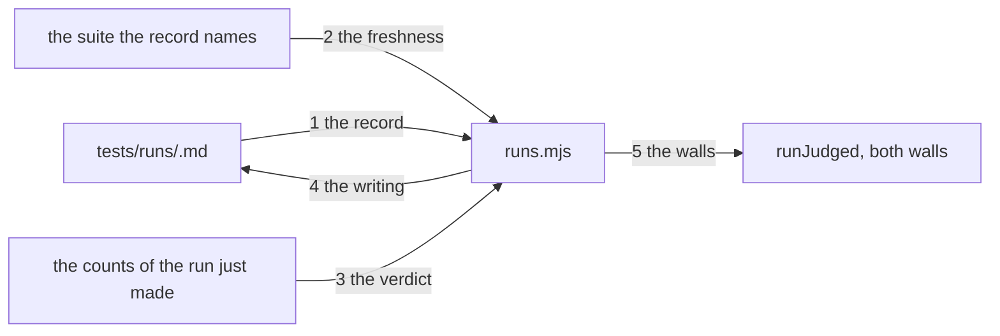

---
traces:
  requirement: a-task-is-delivered-by-its-run@56339b88ab538bcfac34f66fd1903c2f0c039fcb00f3935ba7927a9d0f5ec29d
  principles: the-two-goods@8bbe15706c3edcd63d0d050af9782c063cd585e1ec436d2314fa0003dfaa8cb6, the-seat-owns-the-lens@e1ab0650fc88dc8e1e16347fc8b14b236f1c57b94e50bfdf3f62aa4ec0d6d070
---

# Drawing: a-task-is-delivered-by-its-run

## What the runs said

- One function holds the whole verdict table and both walls already share it.
  `bin/lib/acceptance.mjs` exports `judge(status, pass, fail, mustClose,
people)` and `runJudged(files, statusFor, mustClose)`; `runAcceptance` calls
  it with `readStatus` and `runContracts` with `statusForDrawing` and
  `mustClose` false. Replacing the field replaces one argument in one place.
- The contracts wall never had a status of its own. `statusForDrawing` reads
  the status of the requirement whose task the drawing answers, so a drawing's
  verdict already follows its requirement's, and the ask's rule that
  downstream answers is already how that wall works.
- `mustClose` exists for exactly one verdict. It is false for contracts so a
  green drawing on an open task is not told to close, and it is the only
  reason the argument is there. The verdict it guards is the one this task
  deletes.
- The acceptance tests fix where a record lives. Criterion 2's test records
  with the tool and then reads `tests/runs/` one directory deep for `.md`, so
  a record is a flat page in that directory and not a file under a
  per wall subdirectory. That closes the requirement's second open question
  by proof rather than by argument.
- The fixtures fix the record's fields: Task, Suite, Ran, Suite sha, Passing,
  Failing, as `- <name>: <value>` lines under a heading. A record is a page
  like every other artefact in the tester's lane.
- `readStatus` is read by nine assertions in `tests/acceptance.test.mjs` and
  by nothing else outside `acceptance.mjs`. The blast radius of removing the
  field is one module, its unit suite, and 60 requirement pages.

## Structure

One new module, one new command, one argument changed in an old one, and a
line gone from every requirement.

- `bin/lib/runs.mjs` is new. It reads a run record, says whether a record is
  about the suite as it stands, gives the verdict from a run and a record,
  and writes records for what is green.
- `bin/lib/acceptance.mjs` keeps `runJudged` and loses the status readers.
  `judge` takes the record's state where it took a status, and loses
  `mustClose`, whose only verdict this task deletes. `readStatus` and
  `statusForDrawing` go.
- `bin/kaal.mjs` gains `runs [root] [--write]`, shaped like `traces`.
- `tests/runs/` holds one page per task, recording that task's acceptance
  suite. A drawing's verdict follows its task's record, as it already does.
- Every `requirement.md` loses its `- Status:` line, and the requirement
  template loses it too.

## Seams

One labelled edge per seam, numbered to match the list below; the parts are
the structure's parts. The list is the contract; the picture is the reading,
and it carries nothing the list does not.

1. the record: in a root and a task, out that task's record as its named
   fields, or nothing where no record exists. A record missing a field is
   not a record, and says which field is missing. Owned by `runs.mjs` /
   `tests/runs/`.
2. the freshness: in a record and the suite it names, out whether the record
   is about that suite as it stands now, read from the sha of the file and
   never from a date. A record whose suite is gone is not fresh either.
   Owned by `runs.mjs` / the suite file.
3. the verdict: in the passing and failing counts of the run just made, and
   the record's state, out exactly one of delivered, not delivered,
   regressed, nothing ran, and whether it fails. Regressed and nothing ran
   fail; the other two do not. A stale record is no record, so a red run with
   one is not delivered and says the record is stale. Owned by `runs.mjs` /
   both walls.
4. the writing: in a root, out a record written for every suite green now,
   nothing written for a red one or one that ran nothing, and no record
   removed. Called by the command and by no wall. Owned by `runs.mjs` /
   `tests/runs/`.
5. the walls: in a suite file, out the verdict from its task's record, for
   the acceptance wall from its own record and for the contracts wall from
   the record of the task its drawing answers. Neither wall reads a page for
   a status and neither writes anything. Owned by `acceptance.mjs` /
   `runs.mjs`.

## Fixed and free

- Fixed: a record is a flat page at `tests/runs/<task>.md` carrying Task,
  Suite, Ran, Suite sha, Passing and Failing. Criterion 2 and its test fix
  both the place and the fields.
- Fixed: freshness is the sha of the suite file. Criterion 6.
- Fixed: four verdicts and only two of them fail. Criteria 3 and 4.
- Fixed: the writer is a command and no wall calls it. Criterion 5.
- Fixed: one record per task, recording its acceptance suite, and a drawing's
  verdict follows its task's record. Decision 2 says why, and it answers the
  requirement's first and second open questions.
- Fixed: `judge` keeps its name and its place, so the verdict table stays one
  function that both walls call, as it is today.
- Free: how the record is parsed, and whether `runs.mjs` caches shas.
- Free: the wording of the four verdicts beyond the words the criteria name.
- Free: the order records are written in, and whether the writer prints what
  it wrote.

## Decisions

### The record is a page in the tester's lane

- Chosen: `tests/runs/<task>.md`, a heading and `- <name>: <value>` lines.
- Not taken: JSON; a single index file listing every run; a record beside the
  suite it ran.
- Because: every artefact in this league is a page a person can read and a
  wall can parse, and the tester's lane already holds a strategy and three
  plans in exactly that shape. One index would make every recording a write
  to one file, which is a merge conflict on every task and the same mistake
  the suite count is already making. Beside the suite would put the tester's
  evidence in the analyst's directory, which is the seat rule inverted.
- Bought: the shortest path, and it spent nothing this task can name.
- Weighed against: the-seat-owns-the-lens.
- Reopens if: records outgrow a directory a person can list.

### One record per task, and a drawing's verdict follows its task's

- Chosen: the record covers a task's acceptance suite; the contracts wall
  reads the same record.
- Not taken: a record per suite, which needs `tests/runs/<wall>/<task>.md`;
  a record per wall inside one page; no verdict for drawings at all.
- Because: criterion 2's test reads `tests/runs/` one directory deep, so a
  per wall subdirectory is a shape the proof does not allow, and inventing
  one would be the drawing overruling a test it did not write. It is also
  what the tree already does: `statusForDrawing` reads the requirement's
  status, so a drawing's verdict has always followed its task's, and the
  ask's rule that downstream answers says it should.
- Bought: the shortest path, and it spent evidence. A contract suite's own
  freshness is not recorded, so a drawing whose contract tests changed while
  its acceptance suite did not reads as fresh when it is not.
- Weighed against: the-two-goods.
- Reopens if: the coverage report needs to claim architecture verification
  separately, which the ask's own wording suggests it will.

### A stale record is no record

- Chosen: a record whose suite sha does not match counts as absent, so a red
  run reads not delivered and the report says the record is stale.
- Not taken: treating a stale record as evidence of a pass, which would make
  every unfinished task a regression; ignoring staleness and comparing dates;
  refusing to judge at all until somebody re-records.
- Because: a pass recorded against text that no longer exists says nothing
  about the text that is failing now. Saying so is cheap and saying nothing
  is a lie in the direction of alarm, which is the worse direction: a board
  that cries regression on ordinary unfinished work is a board nobody reads.
- Bought: evidence, and it spent the shortest path: the wall now reads the
  suite file as well as its record.
- Weighed against: the-two-goods.
- Reopens if: a suite changes so often that no record is ever fresh, which
  would mean the sha is too strict a reading of "the same suite".

### `mustClose` goes with the verdict it guarded

- Chosen: remove the argument and the fourth verdict together.
- Not taken: keeping the argument for a later use; keeping "all green and not
  recorded" as a failure that tells somebody to record.
- Because: the argument exists so the contracts wall does not tell a drawing
  to close, and the verdict it guards is `FAIL open and all green: close it`,
  which is the exact rule that forced a build onto the analyst's page. A
  green suite with no record is not a failure: it is a claim the tester has
  not yet proved, which is what not delivered means and is the honest state
  between the coder's act and the tester's.
- Bought: keeping choices open, and it spent nothing: an argument nobody
  passes is a branch nobody tests.
- Weighed against: the-two-goods, the-seat-owns-the-lens.
- Reopens if: a green unrecorded task sits long enough that silence becomes
  the problem, which is a report about age and not a verdict about delivery.

## Test strategy

| criterion | layer      | kind          | why                                                                                                                                         |
| --------- | ---------- | ------------- | ------------------------------------------------------------------------------------------------------------------------------------------- |
| 1         | contract   | deterministic | Seam 5. Both walls judged from records, with no status anywhere and no reader for one.                                                      |
| 2         | contract   | deterministic | Seam 1. A record read back as fields, and a record missing one read as no record.                                                           |
| 3         | contract   | deterministic | Seam 3. Four inputs, four words, on the four fixture roots the analyst built.                                                               |
| 4         | contract   | deterministic | Seam 3 again, for which of the four fail; kept in one seam because one table decides both.                                                  |
| 5         | contract   | deterministic | Seam 4. What a green tree records, what a red tree does not, and that no wall calls the writer.                                             |
| 6         | contract   | deterministic | Seam 2. A record against a suite that has since changed.                                                                                    |
| 7         | acceptance | deterministic | The whole tree answering as it answers today is a sweep and not a seam, and its own test guards against running inside itself.              |
| none      | unit       | none          | The parsing of a record and the sha of a file are behind seams 1 and 2, and a unit of either is the contract test with the seam removed.    |
| none      | manual     | none          | Nothing here needs a person to look. The judgement this league does not wall is whether a recorded pass was deserved, and no wall reads it. |

## Handoff

- Task: a-task-is-delivered-by-its-run
- Seams: 5; contract tests: 5 (equal)
- Red run: `node --test architecture/a-task-is-delivered-by-its-run/contracts.test.mjs`,
  all five failing; stand-in green: all five, on a scratch `runs.mjs` and a
  rewired `runJudged`, then discarded from file copies
- Isolations: nine, one break at a time. Three of them redden seams 3 and 4
  together, and that is the seams telling the truth: one table decides both
  the word and whether it fails, which the strategy table says. The rest fall
  alone
- Found while drawing: the first version of this contract file tested seam 3
  twice and seam 5 not at all, and the drawings wall counted five tests for
  five seams and could not see it. The wall counts; only a reader can pair
  them. Worth a rule and it is in the retro
- Found by an isolation: seam 5 passed on a field the wall carries and never
  prints. It reads the board's own line now, which is what a person sees
- Criteria served: seam 1 to 2; seam 2 to 6; seam 3 to 3 and 4; seam 4 to 5;
  seam 5 to 1. Criterion 7 is a sweep of this tree and is served by the
  acceptance test alone, which the strategy table says in full
- Fixed for the developer: the record's place and fields; freshness by sha;
  four verdicts and which two fail; the writer as a command no wall calls;
  one record per task with the contracts wall reading it; `judge` keeping its
  name and its place
- Owed with the build: the `- Status:` line gone from every requirement and
  from the analyst's template, `readStatus` and `statusForDrawing` gone with
  their nine unit assertions, and `SURFACE.md` saying what `runs` answers
