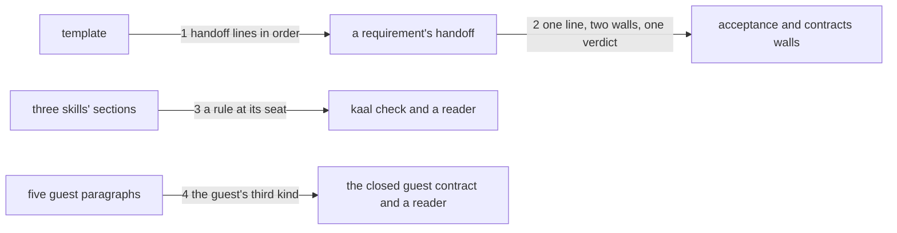

---
traces:
  requirement: a-task-names-its-people@6903b89a47adfcd49ad66e9a356351f9f23cb2b9a8d83ddde7860add006bb351
  principles: nothing
---

# Drawing: a-task-names-its-people

_Written in architect mode from `requirements/a-task-names-its-people`,
nine criteria, nine red tests, each red for its own reason. Drawn once on
7 September on an older base and redrawn here on the base that merged the
requirement, since the wall, the template and two of the skills moved under
it in between. The human approves this drawing by merging it._

## Structure

What exists: the acceptance wall in `bin/lib/acceptance.mjs`, which reads
one line of a requirement's handoff, `- Status:`, judges the run by it, and
for a drawing reads the task's requirement. The requirement template in
`skills/analyse/references/requirement.md`, whose handoff lines stand in an
order a closed contract fixes (`analyse-v2`), with `- Unblocks:` between
`Blocked on` and `Supersedes` since `a-requirement-shows-its-work`. Five
working skills with a `Where you act` section whose sentences and order a
closed contract fixes (`a-guest-takes-no-orders`). Three skills with
numbered sections. `SURFACE.md` with a section per command. Seventy-three
requirement files across `requirements/`, the fixtures under
`requirements/` and `architecture/`, and the template. Generated runner
pages carrying each skill's sha.

What is new:

- **The line**: `- People:` in a requirement's handoff, after `- Supersedes:`,
  `none` or the data with its system of record and how it is erased. The
  template carries it as a placeholder on one line.
- **The reader**: the wall resolves the requirement a test file belongs to
  once, for both walls (an acceptance test's sibling, a drawing's task), and
  reads the line from it. A missing line is a verdict of its own,
  `FAIL no people line: write \`- People: none\` or the data in the Handoff`,
  judged after the status verdict and before the run's.
- **The words at three seats**: a numbered section in the analyse skill,
  `Data about a person`, between `Hand off` and `When the ask is a stack of
retros`, the stack section renumbered; it carries the rule, and whose
  presence is not the question: a record naming the person who wrote it or
  who gave a key is evidence, and the rule is about a person who did not
  choose to be in the tree. One paragraph closing `Prove the proof` in the
  test skill; one paragraph closing `Build to the proof` in the code skill.
- **The guest's third kind**: one paragraph closing `Where you act` in each
  of the five working skills, after the conventions paragraph, saying what
  a guest does with data about a person it finds: it names the file to the
  ask and never the data, and removes nothing, because a name removed from
  a working tree stays in the history and the tree then reads as clean.
- **The surface**: one clause in `SURFACE.md`'s `acceptance` section.

What changes: every requirement file in the tree gains `- People: none`,
fixtures included, since a fixture obeys the rules it is not testing; the
runner pages of the five working skills regenerate, since their shas move.

## Seams

1. **handoff lines in order**: in, the template's Handoff; out, a
   requirement whose handoff carries the lines in the order Open
   questions, Status, Blocked on, Unblocks, Supersedes, People, the last on
   one line, and which `kaal acceptance` reads as closed and green when
   stamped and filled. Owned by the analyse skill on one side, the wall on
   the other.
2. **one line, two walls, one verdict**: in, a test file; out, the
   requirement it belongs to (an acceptance test's sibling, a drawing's
   task under `requirements/<task>/`) and the verdict on its handoff: a
   requirement with no status reads `FAIL no status` whatever else it
   lacks; a requirement with a status and no People line reads the fixed
   label above, on both walls; a requirement with `- People: none` is
   judged by its run. Owned by the handoff on one side, `acceptance.mjs`
   on the other.
3. **a rule at its seat**: in, the three skills' text; out, the analyse
   section in its place with its number, carrying the rule and whose
   presence is not the question; the test and code paragraphs closing the
   sections named; every skill still passing `kaal check`; and the phrases
   the acceptance tests read present. Owned by the skills on one side, the
   rules and the readers on the other.
4. **the guest's third kind**: in, the five working skills' `Where you act`
   sections; out, in each, a paragraph after the conventions paragraph
   naming the file and never the data, and that nothing is removed because
   of the history, with the three sentences and the order the closed guest
   contract fixes undisturbed. Owned by the skills on one side, that
   contract and a reader on the other.

## Fixed and free

- Fixed: the line's name and place, after `- Supersedes:` (seam 1,
  criterion 2); the verdict label, character for character, and its order
  after the status verdict (seam 2, criterion 3, and the `status-v2`
  contract on an orphan drawing); both walls reading the same line from
  the same requirement (seam 2); the section titles and places in the three
  skills and the analyse section's number, `6`, with the stack section
  moving to `7` (seam 3, criteria 1, 5, 6, 9); the guest paragraph as the
  last paragraph of `Where you act` in all five working skills, and every
  sentence the closed guest contract reads staying where it is (seam 4,
  criterion 8); every requirement file carrying the line, `none` for every
  existing task (criterion 4); the runner pages regenerated with
  `kaal runner <skill> <fixture> --write` for the five skills; the surface
  page's clause (criterion 7); the task closed by the build.
- Free: the words inside the passages beyond the phrases the tests read;
  the reader's internal shape, so long as the resolution lives once; the
  unit tests, which are the developer's.

## Decisions

### One line in the handoff, not a section in every requirement

- Chosen: `- People:` as one handoff line, read like `- Status:`.
- Not taken: a `## Data about a person` section in every requirement; a
  file beside the requirement.
- Because: the wall already reads the handoff, and a closed contract fixed
  the handoff as the wall's place to read. A section would rewrite
  seventy-three files to say one word in seventy-two of them.
- Bought: the shortest path to a standing question. Spent: a task that
  does touch a person has one line to answer in, which will be too small
  the day an answer has four parts.
- Reopens if: a requirement's People line wraps, at which point the line
  points at a section and the wall reads the pointer.

### The rule is written at every seat that acts on it, in each skill's own words

- Chosen: a section in analyse, a paragraph in test, a paragraph in code,
  and the guest's paragraph in all five working skills.
- Not taken: one sentence in analyse alone; a shared text stamped into the
  skills the way shared scripts are.
- Because: a skill is self-contained by the standard, no mechanism for
  shared text exists, and each seat acts on the rule differently: the
  analyst asks, the tester names the proof that cannot be a wall, the
  developer keeps the tree clean, and any seat may be a guest.
- Bought: the shortest path, no new mechanism. Spent: eight passages to
  keep in agreement, the cost the thirty-fifth analyse retro named for
  every rule that belongs to more than one seat, now paid twice over.
- Reopens if: the league builds shared text for skills, at which point the
  guest paragraph is the first candidate, being five copies already.

### The wall reads that the line is there, never what it says

- Chosen: presence and a non-empty value.
- Not taken: a grammar for the value (`none`, or `data; record; erased`)
  checked by the wall.
- Because: what the line says is meaning, and meaning is not a wall. A
  grammar written before ten requirements have used the line is a rule
  written from imagination, the same argument the surface page makes about
  a minor version.
- Bought: choices kept open until the line has been used. Spent: a
  requirement can write nonsense after the colon and pass the board; the
  reader at the merge is the check, and the analyse skill says so.
- Reopens if: ten requirements that touch a person show a stable shape for
  the line, at which point the shape becomes the wall's.

## Test strategy

| criterion | layer      | kind          | why                                       |
| --------- | ---------- | ------------- | ----------------------------------------- |
| 1         | contract 3 | deterministic | a section in its place, phrases present   |
| 2         | contract 1 | deterministic | six lines in order, stamped reads closed  |
| 3         | contract 2 | deterministic | the label and its order, on both walls    |
| 4         | acceptance | deterministic | every requirement file in the tree, read  |
| 5         | contract 3 | deterministic | a paragraph in its place, phrases present |
| 6         | contract 3 | deterministic | a paragraph in its place, phrases present |
| 7         | acceptance | deterministic | one clause on the surface page            |
| 8         | contract 4 | deterministic | five guest paragraphs, order kept         |
| 9         | contract 3 | deterministic | the sentences in the section, read        |

## Handoff

- Task: a-task-names-its-people
- Seams: 4; contract tests: 4 (equal), beside this file; fixtures under
  `fixtures/`: `stamped`, `no-people`, `people-none`, `orphan`
- Red run: `node --test --test-timeout=60000 architecture/a-task-names-its-people/contracts.test.mjs`,
  8 September 2026, all four failing, each for its own reason: no line in
  the template, no reader in the wall, no section in analyse, no third kind
  in the guest paragraphs; stand-in green in a scratch clone of this
  branch, four passing and the board green but for the task's own
  open-and-green, discarded
- Criteria served: seam 1 serves 2; seam 2 serves 3, 4; seam 3 serves 1,
  5, 6, 9; seam 4 serves 8; criterion 7 is held at the acceptance layer
  alone
- Fixed for the developer: the line after Supersedes; the label verbatim
  and after the status verdict; one resolution of a test file's
  requirement for both walls; analyse section `6. Data about a person`
  carrying whose presence is not the question, with the stack section
  renumbered `7`; the paragraphs closing `Prove the proof` and `Build to
the proof`; the guest's paragraph last in `Where you act` in all five
  working skills; `- People: none` in every requirement file, the fixtures
  under `architecture/` and the template included; runner pages of the
  five skills regenerated; the surface clause; the task closed
- Next: the human approves by merge; then `code`
