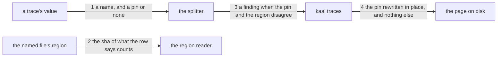

---
traces:
  requirement: a-trace-pins-what-it-read
  principles: the-two-goods
---

# Drawing: a-trace-pins-what-it-read

_Written in architect mode from `requirements/a-trace-pins-what-it-read`, six
criteria and six red tests. Read first: `an-artefact-traces-what-it-came-from`,
whose module, table and command this one extends and whose contract fixes the
three kinds by name; `nothing-stale`, whose eval record is the league's only
other staleness check and the shape this generalises; and `applies-here`,
which fixes what a command's three codes mean._

## What the runs said

- `bin/lib/traces.mjs` holds `KINDS` as three rows, each a function from a
  name to a path. `checkTraces` calls `KINDS[kind](name)` and asks only
  whether the file is there.
- A closed contract reads `KINDS`'s keys and asserts the three names. It does
  not read the rows' values, so a row may grow without that contract moving.
- Of 48 tasks with a requirement and a drawing, 47 had the requirement edited
  after the drawing landed and 2 had the `## Acceptance criteria` section
  change. A pin over the whole file would report 45 times in 47.
- `bin/lib/sha.mjs` is `fileSha(path)` over a file's bytes. Nothing in the
  tree hashes a region of a file.
- `bin/lib/drawings.mjs` already cuts `## Acceptance criteria` out of a
  requirement, with a section reader that takes a title and returns the text
  under it.
- `bin/lib/record.mjs` pins three shas in an eval record's frontmatter and
  `bin/lib/runner.mjs` generates that block. No part of the league asks a
  person to type a sha.
- Six commands already take a flag: `retros`, `class`, `runner`, `assess`,
  `witness`, and `standard` by its optional file. `an-argument-is-read-once`
  was owed at the third and is still not written.

## Structure

One module grows, one command gains a flag, one module learns a flag's
reading, one page and two templates gain text, and every trace in the tree is
pinned by the tool rather than by hand.

- **the table** (`KINDS` in `bin/lib/traces.mjs`, changes): a row becomes a
  pair, where the thing lives and which region of it counts. A requirement's
  region is its `## Acceptance criteria`; a principle's is the whole file.
- **the value** (`bin/lib/traces.mjs`, changes): a trace's value splits into
  a name and an optional pin, `<name>@<sha>`, comma separated as before.
- **the comparison** (`bin/lib/traces.mjs`, changes): a pin that no longer
  matches its region is a finding, in words a reader can tell from the
  finding for a name that resolves to nothing.
- **the writer** (`bin/lib/traces.mjs`, changes): given a root, replaces the
  pin inside every trace value it can resolve and touches nothing else.
- **the command** (`bin/kaal.mjs`, changes): `traces [root] [--write]`.
- **applicability** (`bin/lib/applies.mjs`, changes): `traces` reads a root
  that may be a flag, the pair `class` and `retros` already carry.
- **the surface page** (`SURFACE.md`, changes): the flag and the regions.
- **the templates** (both, changes): a value shown as `<name>@<sha>`.
- **the tree** (106 artefacts, changes): pinned by `--write`, never by hand.

## Seams

1. **The value, split.** `splitTrace(value)` returns one entry per name, each
   a name and a pin or null. `<name>` and `<name>@<sha>` both parse, a comma
   separates them, and the two liberties `Feeds:` accepts still hold.
   `nothing` yields no entries and therefore never carries a pin. Text in,
   entries out.
2. **The region, hashed.** `regionSha(root, kind, name)` returns the sha of
   the region the row names, or null when the file is not there. A row that
   names no region hashes the whole file. It reads one file and hashes text,
   never bytes of a path.
3. **The disagreement, reported.** A pin that differs from the region's sha
   is one finding naming the artefact, the kind, the name and the region, and
   saying the text moved. A name that resolves to nothing keeps its own
   finding and its own words: one wants a rename, the other a reread.
4. **The pin, written.** `--write` replaces the pin inside a trace value and
   changes no other character of the page. A second run on its own output
   writes nothing, which is the only way to tell a writer from a rewriter.

## Fixed and free

Fixed:

- `KINDS` keeps its three keys. A closed contract asserts them and this task
  does not move it.
- A row carries where the thing lives and which region counts. A requirement
  pins `## Acceptance criteria`; a principle pins the whole file.
- The value grammar: `<name>` or `<name>@<sha>`, comma separated, backticks
  and a trailing period tolerated. A pin is 64 hex characters.
- `nothing` carries no pin, and a value with no pin is not a finding.
- The stale finding names four things: the artefact, the kind, the name and
  the region. The dangling finding keeps the three it has.
- The two findings are told apart by their words, not only by their fields.
  A reader who sees one must know whether to rename or to reread.
- A stale pin is an exit 1, not a report. The requirement left this open and
  criterion 2's own test closes it: it asserts the code a finding ends on.
- `--write` writes only inside a trace value and is idempotent.
- `traces` reads a root that may be a flag, the way `class` and `retros` do.
- The writer never invents a pin for a name that does not resolve.

Free:

- The wording of both findings beyond the four things and the three.
- Whether the row is an object, a pair or two parallel tables, so long as
  `KINDS`'s keys are the three names.
- How a region is cut, and whether the section reader is imported from
  `bin/lib/drawings.mjs` or written again. Two callers is not yet three.
- Whether the writer rewrites a page in one pass or per line.
- The order the findings come back in.

## Decisions

### The region is a column on the row, not a second table

- Chosen: a row says where the thing lives and which region counts.
- Not taken: a second table from kind to region; a function per kind that
  returns both; a region named on the trace itself.
- Because: the row is the unit that makes this general, and a second table
  keyed by the same names is the same list written twice, which is the
  tension `the-two-goods` names and which the league has now paid for four
  times in its own retros. A region on the trace would let two artefacts pin
  different parts of the same file and disagree about what changed.
- Bought: the shortest path. Adding a kind stays adding a row, which is the
  claim the previous task made and this one must not break.
- Spent: a row is now a pair and every reader of `KINDS` learns the shape. The
  closed contract that reads its keys is unaffected, which is luck rather
  than design: had it read the values, this task would be a supersede.
- Weighed against: `the-two-goods`
- Reopens if: a kind needs more than one region, at which point the row holds
  a list and the finding names which one moved.

### A principle pins the whole file

- Chosen: a row may name no region, and then the whole file is hashed.
- Not taken: giving a principle a section to pin, such as `## The pull`;
  requiring every row to name a region.
- Because: a principle is its claim and it has no section that is not. The
  evidence that made a region the right unit for a requirement is that 45 of
  47 edits were outside the criteria; there is no such split in a principle,
  where a changed sentence about which side a case is on is exactly the thing
  a drawing that cited it should reread.
- Bought: keeping the most choices open, and honesty about what each kind is.
  A rule that forced a region on every kind would have invented one.
- Spent: two kinds now behave differently under the same word, and a reader
  must look at the row to know which. The finding names the region, so the
  reader is told rather than left to guess.
- Weighed against: `the-two-goods`
- Reopens if: a principle grows a part that is not its claim, provenance
  being the candidate, at which point the row names a region like the others.

### `--write` is a flag on `traces`, and the debt is named again

- Chosen: `kaal traces [root] [--write]`, the pair `class` and `retros`
  already carry.
- Not taken: a separate `kaal pin` command; a `--fix` shared by every wall.
- Because: the writer and the checker read the same table and the same
  grammar, and a second command would be a second front door onto one
  reading. `runner` already sets the precedent with `--write` and `--check`
  on one command.
- Bought: the shortest path, and one place where the trace grammar lives.
- Spent: the sixth command whose first argument may be a flag, each reading
  it for itself with the same three lines. **`an-argument-is-read-once`** was
  owed at the third and is now owed at the sixth; this drawing does not pay
  it and says so rather than pretending the cost is new.
- Weighed against: `the-two-goods`
- Reopens if: that task lands, at which point every one of the six loses its
  own reading.

### A stale pin gates rather than reports

- Chosen: exit 1, like every other finding this wall makes.
- Not taken: a report at exit 0; a separate `--report` mode.
- Because: the requirement left it open and criterion 2's test answers it by
  asserting the code a finding ends on, which is the analyst's answer written
  before the question was asked out loud. A wall that finds and does not gate
  is a wall the league does not have, and inventing one here would be a new
  kind of thing smuggled in under a pin.
- Bought: the shortest path, and one meaning for the twelfth wall's codes.
- Spent: a drawing whose requirement moved blocks the board until somebody
  rereads it or runs `--write`. That is the point and it is also the risk,
  because `--write` can silence the finding without anyone reading the
  change. The requirement's open question on who may clear a pin is not
  closed here and it is the one worth answering next.
- Weighed against: `the-two-goods`
- Reopens if: the first stale pin in anger is cleared by `--write` without a
  reread, which is the evidence that the tool needs to refuse.

## Test strategy

| criterion | layer          | kind          | why                                                                                                      |
| --------- | -------------- | ------------- | -------------------------------------------------------------------------------------------------------- |
| 1         | contract, unit | deterministic | seams 1 and 2: the grammar driven with text, the rows read as data, the region hashed on a fixture       |
| 2         | contract       | deterministic | seam 3: a pin that differs, driven on a fixture whose name resolves                                      |
| 3         | contract       | deterministic | seam 3 again, on a tree holding both defects, because two findings that read alike are one finding twice |
| 4         | contract, unit | deterministic | seams 1 and 3: a value with no pin, and `nothing`, neither of which may be a finding                     |
| 5         | contract       | deterministic | seam 4: the writer run twice on a copy, compared line by line                                            |
| 6         | none           | none          | a migration the tool performs; once done, criterion 2's wall is what keeps it true, not this criterion   |

## Handoff

- Task: a-trace-pins-what-it-read
- Seams: 4; contract tests: 4 (equal)
- Red run: `node --test --test-timeout=60000 architecture/a-trace-pins-what-it-read/contracts.test.mjs`, all 4 failing; stand-in green: all 4 passing, discarded
- Criteria served: seam 1 -> 1, 4; seam 2 -> 1; seam 3 -> 2, 3, 4; seam 4 -> 5
- Fixed for the developer: the three keys, a row as a pair, the two regions,
  the value grammar and the 64 hex pin, `nothing` carrying no pin, four
  things in the stale finding and three in the dangling one, both told apart
  by words, exit 1 for a stale pin, a writer that is idempotent and minimal,
  and a root that may be a flag
- Owed with the build: every trace in the tree pinned by `--write` in the
  same change, and the writer's test run on a copy in a temporary directory,
  because a test that leaves the repository dirty has changed what it was
  measuring
- Unproven, and it is the point: nothing here stops `--write` from silencing
  a real finding. The wall says the text moved; whether anyone read it is a
  human's business, and the requirement's open question on who may clear a
  pin is the task that would close it
