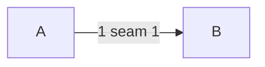

---
traces:
  requirement: alpha@0b84b11360f9b5855868d60b10d2879b4743302b1f9288566798c34eb62c65bd
  principles: a-principle-nobody-wrote
---

# Drawing: alpha

## Structure

Parts.

## Seams

1. first: in, out, owned.

## Fixed and free

- Fixed: the formats.
- Free: the rest.

## Decisions

### One

- Chosen: this
- Not taken: that
- Because: reasons
- Reopens if: never

## Test strategy

| criterion | layer    | kind          | why |
| --------- | -------- | ------------- | --- |
| 1         | contract | deterministic | why |

## Handoff

- Task: alpha
