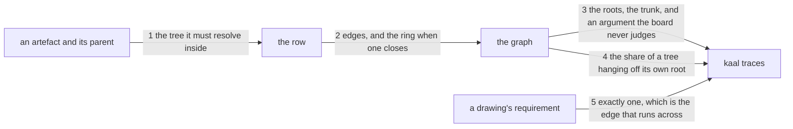

---
traces:
  requirement: a-tree-has-one-root
  principles: the-two-goods, the-seat-owns-the-lens
---

# Drawing: a-tree-has-one-root

_Written in architect mode from `requirements/a-tree-has-one-root`, seven
criteria and seven red tests. Read first: `an-artefact-traces-what-it-came-from`,
whose table and command this extends and whose closed contract fixes the kinds
by name; `a-trace-pins-what-it-read`, which already made a row a pair and is
the precedent for changing one; and `nothing-passes-vacuously`, because five
of these seven criteria are silences and a silence is where a wall dies._

## What the runs said

- `KINDS` holds three rows, each a `where` from a name to one path and a
  `region`. Every row answers the same way for every caller: a `supersedes`
  in any artefact resolves under `requirements/`.
- `PLACES` holds two entries, `requirements` and `architecture`, and
  `checkTraces` walks them. The trunk is neither, so it is a third.
- A closed contract asserts `KINDS`'s keys are exactly the three names and
  reads none of their values. A fourth key moves that contract; a changed
  row does not.
- The trace's splitter filters `nothing` and not `none`. This task's
  criterion 6 says `parent: none`, so the first stand-in run reported
  `none is not at requirements/none/requirement.md` on every root in every
  fixture. The two words are the same idea and the grammar knew one of them.
- 57 requirements and 50 drawings carry a trace today and not one carries a
  `parent`. The wall is silent on all of them and must stay silent: the
  seats populate their own trees and this task populates none.
- `bin/lib/gates.mjs` reads `waivers/<wall>.md` and its comment is the model
  for an argument the board reads and never judges: "it never hides a red:
  the wall still runs and its line says waived, with who and why."
- `bin/lib/acceptance.mjs` matches `/^- People: (.+)$/m` over a whole page.
  A `- Root because:` line is read the same way and the same hazard applies:
  no artefact carries two of any handoff line today, and none appears
  outside a Handoff.

## Structure

One module grows a fourth row and a third place, one command gains nothing,
and the tree gains one document.

- **the row** (`KINDS.parent` in `bin/lib/traces.mjs`, new): the first row
  whose `where` cannot answer from a name alone. It is handed the artefact
  that declared it and answers inside that artefact's own tree.
- **the third place** (`PLACES`, changes): `kaal/` joins requirements and
  architecture, so the trunk is walked like any other artefact.
- **the graph** (`bin/lib/traces.mjs`, changes): parents assembled once into
  edges, then read four ways: cycles, roots, the trunk, and the share of a
  tree hanging off its own root.
- **the argument** (`bin/lib/traces.mjs`, changes): a root beyond the first
  is read for a `- Root because:` line, in the Handoff, never judged.
- **the one to one** (`bin/lib/traces.mjs`, changes): a drawing answers
  exactly one requirement, which is the edge that runs across and the only
  rule here that is not about `parent`.
- **the trunk** (`kaal/league.md`, new): the document above the three trees,
  written by this build because the shape is the league's.
- **the templates** (both, changes): each offers `parent`.
- **the board** (`kaal.config.json`, unchanged): the twelfth wall already
  runs and gains rules rather than a thirteenth.

## Seams

1. **The tree a parent resolves inside.** `KINDS.parent.where` is handed the
   artefact that declared it, not only the name, and answers a path in that
   artefact's own place. A requirement's parent is under `requirements/`, a
   drawing's under `architecture/`, a test document's under the test tree's
   place when it has one. It is the first row in the table that needs to
   know who asked.
2. **The graph, and the ring.** Parents are assembled once into edges and
   walked. A cycle is a finding naming every artefact in the ring, in the
   ring's own order, so a reader can see where to break it. A chain that
   ends is not a cycle and says nothing.
3. **The roots and the argument.** An artefact declaring `none` is a root.
   The trunk under `kaal/` is one root and needs no argument; any other root
   is a finding unless its Handoff carries a `- Root because:` line with
   something after the colon. The board reads that it argued and never what
   it said.
4. **The share, reported.** For each tree, how many of its artefacts declare
   the tree's own root as parent, against how many the tree holds. Over a
   stated share it is a finding naming the tree and both numbers. It reports
   a shape, not a mistake, and it is the only rule here that could be
   argued with.
5. **The one to one, across.** A drawing's `requirement` names exactly one
   task. None, or more than one, is a finding naming the drawing. This is
   the only rule in the task that reads the edge between trees rather than
   the edge down one.

## Fixed and free

Fixed:

- `KINDS` gains exactly one key, `parent`, and the other three keep theirs.
  The closed contract that asserts the three by name moves to four and is
  declared as superseded.
- `KINDS.parent.where` is handed the declaring artefact. Every other row's
  `where` keeps its one argument, so the table holds two shapes and the
  module says which and why.
- A parent resolves inside the declaring artefact's own place and nowhere
  else. Crossing is a finding, and its words say the edge is wrong rather
  than that the name is missing.
- `PLACES` gains `kaal/`, so the trunk is an artefact and not a special case
  in four rules.
- A cycle finding names every artefact in the ring.
- A root is an artefact declaring `none`. The trunk is one; another is a
  finding unless a `- Root because:` line carries something.
- The depth finding names the tree and both numbers, and the share it
  compares against is one number in one place.
- A drawing's `requirement` names exactly one task; none or several is a
  finding naming the drawing.
- An absent `parent` is never a finding. The seats populate their trees and
  this task populates none.
- Every finding this task adds is distinguishable in words from every other
  the wall already makes.

Free:

- The wording of all five findings beyond what is named above.
- Whether the graph is built once and read four times or read four times
  from the pages. Four walks over 108 files is nothing; one walk is tidier.
- How a ring's order is chosen, so long as every artefact in it appears.
- The share's number, which the requirement leaves open and the build must
  pick, name in the surface page, and defend in its handoff.
- The trunk's own prose, which the asker has written and this build carries.

## Decisions

### The row learns who asked, rather than the table splitting in two

- Chosen: `KINDS.parent.where` takes the declaring artefact as well as the
  name. The table keeps one shape with one row that reads more of it.
- Not taken: a second table for edges that resolve per artefact; a rule
  outside `KINDS` for `parent` alone; a `parent` value that names its tree,
  as `architecture:a-task`.
- Because: a row is what made the concept general and the previous task's
  whole claim was that adding a kind is adding a row. A second table would
  make `parent` a special case in the one place built to have none, and a
  value naming its tree would say in every artefact what the artefact's own
  location already says.
- Bought: keeping the most choices open. A later kind that also resolves per
  artefact is a row like this one, and the table's promise survives with one
  more thing in it.
- Spent: the table now holds two shapes of `where`, one taking a name and
  one taking a name and an artefact, and a reader must look at the row to
  know which. That is a real cost and it is why the module says so at the
  table rather than in a commit message.
- Weighed against: `the-two-goods`
- Reopens if: a third row needs an argument the others do not have, at which
  point every `where` takes the same shape and ignores what it does not use.

### The trunk is a place, not a special case

- Chosen: `kaal/` joins `PLACES` and the trunk is walked like any artefact.
- Not taken: reading the trunk by its path wherever a rule needs it.
- Because: four of the five rules here ask about the trunk, and a special
  case written four times drifts in one of them. As a place it carries a
  trace, is read by every rule already written, and would be pinned by
  `a-trace-pins-what-it-read` without that task knowing it exists.
- Bought: the shortest path, and one fewer thing that is nearly an artefact.
- Spent: `kaal/` must hold exactly one document or the walk finds several
  trunks, and nothing in this task stops a second file being added there.
  The roots rule catches it, one step later than a rule about the place
  would.
- Weighed against: `the-two-goods`
- Reopens if: the trunk grows neighbours, a picture or a glossary, at which
  point the place needs to say which file is the document.

### An absent parent is silence, and the seats are why

- Chosen: the wall reports a parent that does not resolve, crosses a tree,
  or closes a ring. It never reports one that is missing.
- Not taken: requiring a parent from the day the kind exists; a warning that
  does not fail; a deadline after which absence becomes a finding.
- Because: the asker settled that each seat figures out its own topology, so
  a wall demanding 107 parents on the day it lands would be the shape task
  making four seats' judgements by deadline. A warning nobody fails is a
  line people learn to scroll past.
- Bought: the shortest path to a wall that is true on the day it lands.
- Spent: the tree is not a tree yet and nothing says so out loud. Between
  this build and the last seat's topology the board is green on a forest,
  which is exactly the state the requirement was written to end.
- The gap this widens, and the task that closes it: **the closing task named
  in the requirement's `Unblocks:`**, which makes a missing parent a
  finding once the three seats have landed. It is owed the moment the third
  does.
- Weighed against: `the-two-goods`
- Reopens if: a seat lands its topology and the next does not follow, at
  which point the closing task is the way to say so and waiting is not.

### `none` and `nothing` both name nothing, everywhere

- Chosen: the trace's splitter treats `none` as it treats `nothing`, for
  every kind rather than for `parent` alone.
- Not taken: `parent: nothing`, contradicting the requirement's own
  criterion 6; a guard inside the parent rule so the two words survive.
- Because: the stand-in found it. The trace grammar landed with `nothing`
  and this task's criterion says `parent: none`, so a first run reported
  `none is not at requirements/none/requirement.md` on every root in every
  fixture. Two words for one idea inside one grammar is a trap, and it does
  not matter which word wins as long as one of them does not silently mean
  a file called `none`.
- Bought: the shortest path, and a reader who writes whichever word comes to
  mind is right either way.
- Spent: the grammar now accepts two spellings, so a future reader cannot
  tell from the code which one the league prefers, and nothing stops the two
  drifting into different meanings later. The alternative was to correct a
  merged criterion over one word.
- Weighed against: `the-two-goods`
- Reopens if: a kind ever needs to name something actually called none.

### The depth rule reports a shape and the number is the build's to pick

- Chosen: one number, named in the surface page, defended in the handoff.
- Not taken: leaving the share as a report with no threshold; asking the
  asker for a number nobody has evidence for; a rule per tree.
- Because: the requirement says a star cannot pass as a tree and leaves the
  number open, and a rule with no number cannot fail. The honest move is to
  pick one, put it where a reader can find it, and let the first tree that
  trips it be the evidence for changing it.
- Bought: a rule that can fail, which is the only kind worth having.
- Spent: a number chosen without evidence, in a league that keeps saying a
  threshold should be found rather than declared. It is the one place in
  this task where the league does the thing it warns about, and it is
  written here so the next reader knows it was a choice and not a
  measurement.
- Weighed against: `the-two-goods`
- Reopens if: the first tree to trip it is a tree nobody thinks is wrong.

## Test strategy

| criterion | layer          | kind          | why                                                                                                            |
| --------- | -------------- | ------------- | -------------------------------------------------------------------------------------------------------------- |
| 1         | contract, unit | deterministic | seam 1: the row read as data, and a parent that crosses a tree driven on a fixture                             |
| 2         | contract       | deterministic | seam 3: a second root with and without its line, so the argument is the difference and not the count           |
| 3         | contract       | deterministic | seam 2: a ring of three, so a finding naming two is a finding that walked and stopped                          |
| 4         | contract       | deterministic | seam 5: a drawing answering none and one answering two, on names that all resolve                              |
| 5         | contract       | deterministic | seam 4: a star and a tree with depth, the second silent, or the rule reports every tree                        |
| 6         | contract       | deterministic | seam 3 again: the trunk is a place, so a tree with none and a tree with two are both findings                  |
| 7         | none           | none          | the league's own tree, which is a forest with a trunk until the seats land; the wall's silence is the evidence |

## Handoff

- Task: a-tree-has-one-root
- Seams: 5; contract tests: 5 (equal)
- Red run: `node --test --test-timeout=60000 architecture/a-tree-has-one-root/contracts.test.mjs`, all 5 failing; stand-in green: all 5 passing, discarded
- Criteria served: seam 1 -> 1; seam 2 -> 3; seam 3 -> 2, 6; seam 4 -> 5; seam 5 -> 4
- Fixed for the developer: one new key in `KINDS` and a `where` that takes
  the declaring artefact, `kaal/` as a third place, a ring named in full, a
  root argued by a Handoff line the board never judges, a depth finding
  naming a tree and two numbers, a drawing answering exactly one
  requirement, and an absent parent that is never a finding
- Owed with the build: the trunk at `kaal/`, whose prose the asker has
  written; and the closed contract asserting `KINDS`'s three keys moved to
  four and declared as superseded on its own task's page
- Unproven, and it is the point: criterion 7 is a silence. On the day this
  lands the league is still a forest with a trunk above it, and the wall
  says nothing because nothing is yet wrong. What makes the tree a tree is
  three seats' topologies and the task that closes behind them, and none of
  that is proven here
