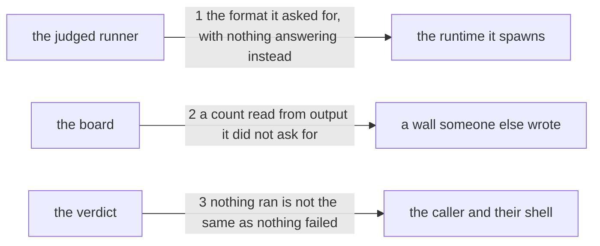

# Drawing: a-wall-reads-one-format

_Written in architect mode from `requirements/a-wall-reads-one-format`, four
criteria and four red tests. The closed requirements were read first:
`gates-v1` fixes `# pass N` as the board's own convention and that a wall
which cannot run is a failure, `status-v1` and `status-v2` fix the four
verdicts and their labels, and `nothing-passes-vacuously` fixes that a
command finding nothing still answers, which is the principle criterion 4
extends from commands to verdicts. The defect was found on a contributor's
machine running node 24 and is reproduced here on 22 by forcing the
reporter._

## Structure

Two modules change and one verdict changes with them. Nothing in the config
moves and no wall is added.

- **the judged runner** (`bin/lib/acceptance.mjs`, changes): it spawns the
  test runner itself, once per file, and reads counts and failing names out
  of what comes back. Because it spawns, it can say which format it wants.
- **the wall's environment** (`wallEnv`, in `bin/lib/gates.mjs`, changes):
  the environment every wall's child is given. It already removes the test
  runner's own marker so a nested run cannot report green whatever happened.
  A reporter named in `NODE_OPTIONS` is the same kind of thing and it is
  worse: node collects it alongside the one a wall names and then refuses
  the pair.
- **the board** (`bin/lib/gates.mjs`, changes): it reads a count out of a
  wall's output. It did not spawn that wall and the command belongs to
  whoever wrote the config, so it cannot name the format; it can only read
  what arrives.
- **the verdict** (`judge`, in the judged runner, changes): asks today
  whether anything failed. It gains the other half of the question.
- **the runtime** (outside, unchanged): node 22 prints TAP when its test
  output is piped and node 24 prints spec. Both are correct and the default
  is theirs to change, which is the whole reason this task exists.
- **`kaal.config.json`** (unchanged): its `units` wall runs the runtime
  directly. It stays as it is, and the board's tolerance is what carries it.

## Seams

1. **the format it reads is the format it asked for, and nothing answers
   instead**: in, a test file and whatever environment the caller had; out,
   the passing count and the failing tests by name, the same on any runtime.
   Two halves and both are needed: the runner names the reporter when it
   spawns, and the environment handed to that spawn carries no reporter of
   its own. Owned by the judged runner and the runtime it starts. Serves
   criteria 1 and 2.
2. **a count read from output it did not ask for**: in, a wall's stdout;
   out, its passing count when the output carries one in either of the
   runtime's two shapes, and no count when it carries none. Owned by the
   board and by whoever wrote the wall's command, which is why this side
   reads rather than names. Serves criterion 3.
3. **nothing ran is not the same as nothing failed**: in, a status and the
   two counts; out, a closed task with no passing tests is refused and named
   rather than labelled ok. Owned by the verdict table and the board that
   prints it. Serves criterion 4.

## Fixed and free

- Fixed: the judged runner passes `--test-reporter=tap` on every spawn it
  makes, because that is the format its two patterns already read, and
  `wallEnv` removes any `--test-reporter` from the environment it hands
  that spawn, because the two do not compete, they accumulate and then
  fail (criteria 1 and 2); the board accepts a count in either shape and never
  fails a wall for lacking one, since a count is printed and never decides
  (criterion 3); `judge` refuses a closed task whose passing count is zero,
  in `judge` itself so both walls inherit it (criterion 4); `# pass N` stays
  the board's own convention for what a wall prints, from `gates-v1`; the
  four verdict labels keep their words, from `status-v1`; `kaal.config.json`
  is not touched, and no requirement's status changes.
- Free: how the board's two shapes are recognised, one pattern or two; the
  wording of the new refusal's label beyond the words the contract reads;
  whether the reporter flag sits before or after `--test` in the spawn.

## Decisions

### The reader that spawns names the format; the reader that receives tolerates

- Chosen: two mechanisms, one per reader. The judged runner pins
  `--test-reporter=tap`. The board accepts either shape.
- Not taken: pinning both, which is impossible, since the board does not
  spawn the wall and the command is a consumer's to write; tolerating both
  everywhere, which puts a second pattern on the reader whose numbers decide
  a verdict.
- Because: the two readers differ in what they control and in what their
  numbers do. The judged runner starts the process, so it can name the
  format and be certain; its counts feed `judge` and a wrong one is a wrong
  verdict. The board is handed output by a command someone else wrote and
  its count is printed and never decides anything. Certainty where it
  matters, tolerance where it must.
- Bought: choices kept open on the side we do not own, since a consumer's
  wall can print whatever its command prints and the board still reads it,
  and certainty on the side we do. It spends one mechanism's worth of
  simplicity: a reader of this tree now meets two answers to what looks like
  one question, and has to be told which reader is which and why. The
  comments carry that and nothing else does.
- Reopens if: the runtime stops offering TAP, at which point the pinned side
  has to name whatever replaced it and the tolerant side has already been
  reading it.

### The environment is cleared, because a flag does not win an argument

- Chosen: `wallEnv` strips `--test-reporter` and its destination from
  `NODE_OPTIONS` before a wall's child is spawned, beside the marker it
  already strips.
- Not taken: naming the reporter on the command line alone, which is what
  this drawing said until it was built; passing a matching destination
  alongside, which needs to know how many reporters the environment brought.
- Because: a reporter on the command line does not override one in
  `NODE_OPTIONS`. Node collects both and refuses the pair, because reporters
  and destinations must match in number, so a wall that names its format
  crashes for any caller who named one first. The stand-in found this: the
  contract stayed red with the flag in place and the error was
  `ERR_INVALID_ARG_VALUE ... Received [ 'spec', 'tap' ]`. This is the same
  reason the marker is already stripped there, one line above, and the
  comment says so.
- Bought: the promise actually holding, which the flag alone did not. It
  spends a little of the caller's control: someone who sets a reporter in
  their environment and then runs the board does not get it, and no message
  tells them. The alternative is a board that crashes for them instead.
- Reopens if: node lets a command line reporter replace an environment one,
  at which point the strip is redundant and the flag stands alone.

### Nothing ran is refused in the verdict, so both walls inherit it

- Chosen: `judge` refuses a closed task whose passing count is zero.
- Not taken: refusing it in the acceptance wall alone, which is where the
  criterion is written; refusing it in both walls separately, which is the
  same rule in two places.
- Because: `judge` is the one verdict table and both walls call it, so the
  rule belongs there or it belongs in two places that will drift. This also
  answers the analyst's third open question, which asked whether a drawing
  with no contract tests is the same vacuity one layer up: it is, and one
  rule covers both.
- Bought: one rule in one place, and the class rather than the instance:
  even if a future runtime prints a third format the pinned side cannot
  read, a wall that measures nothing is refused rather than green. It
  spends a case nobody has hit yet: a closed drawing with no contract tests
  is now red, where before it was ok. Nothing in the tree is in that state
  today, and the drawings wall already requires one contract test per seam,
  so the two rules agree.
- Reopens if: a closed task legitimately has nothing to run, which none does
  and which would be a task worth reading rather than a rule worth loosening.

### The config keeps its command as a consumer would copy it

- Chosen: `kaal.config.json`'s `units` wall is left exactly as it is.
- Not taken: adding `--test-reporter=tap` to that command as well, which
  would make the league's own board deterministic without relying on the
  board's tolerance.
- Because: a config a consumer copies should not carry a workaround for a
  defect the tool has fixed. The tolerance is required anyway, by a
  criterion whose test writes its own config, so pinning here would be a
  second belt on a fixed problem and a line every consumer inherits without
  knowing why.
- Bought: the shortest path, and a config that stays readable. It spends
  redundancy: the league's own units count now rests on the board's
  tolerance being right, where a flag here would have held it twice, and if
  the tolerance is wrong the board loses a number quietly rather than
  loudly.
- Reopens if: the tolerance turns out to need a third shape, at which point
  the commands we own are the cheap place to stop guessing.

## Test strategy

| criterion | layer      | kind          | why                                                                                                         |
| --------- | ---------- | ------------- | ----------------------------------------------------------------------------------------------------------- |
| 1         | contract 1 | deterministic | a spawn's arguments are readable, and the counts it returns are comparable across two forced reporters      |
| 2         | contract 1 | deterministic | the same spawn and the same two runs, reading names instead of numbers                                      |
| 3         | contract 2 | deterministic | the board is handed output it did not spawn, which a test can hand it directly without a runtime in the way |
| 4         | contract 3 | deterministic | a verdict is a function of a status and two numbers, and needs no process at all                            |

The acceptance tests drive the commands end to end under both reporters,
which is the only place the defect is visible as a user meets it. The
contracts hold the three promises those runs depend on, so a failure names
the promise rather than the runtime.

## Handoff

- Task: a-wall-reads-one-format
- Seams: 3; contract tests: 3 (equal), beside this file
- Red run:
  `node --test --test-timeout=60000 architecture/a-wall-reads-one-format/contracts.test.mjs`;
  all three red, run and read. Stand-in green: all three, on a scratch
  runner, board and verdict, discarded with `git checkout --`
- Criteria served: seam 1 serves 1 and 2; seam 2 serves 3; seam 3 serves 4
- What the acceptance tests can and cannot tell apart, which the developer
  should know before trusting a green run: they force a reporter through
  `NODE_OPTIONS`, and the fix clears exactly that, so on a runtime whose
  default is already TAP a build that only strips the environment and never
  names a format passes them. It would still be broken on node 24. The
  contract is what holds the other half, by running with a reporter in the
  environment and requiring the run to survive; a build that names a format
  without clearing the environment crashes there. Neither test alone is the
  proof and the pair is.
- Fixed for the developer: the words under Fixed above. No unit layer of its
  own is needed for the verdict, which already has one in
  `tests/acceptance.test.mjs`; that test asserts the four verdicts and moves
  with this change, and it is yours. The three units that fail on node 24
  fail for the reporter and not for their subject: they pass under tap on
  the same runtime, which was run and read.
- Next: the human approves by merge; then `code`
