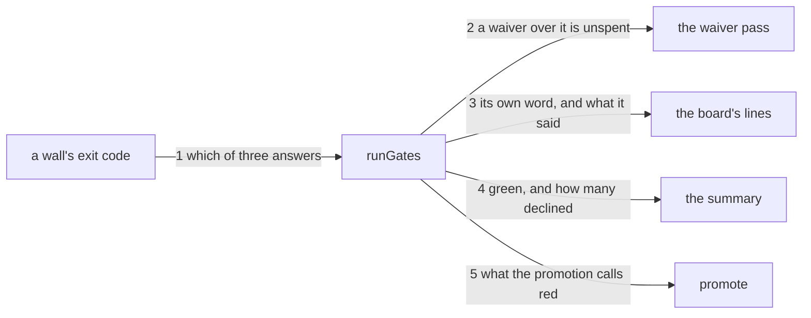

---
traces:
  parent: a-bug-names-where-it-can-be-fixed@3a63b03d2d0c3b17c1588091adc11a94738f76304a7c0085af1741c5661a8bb7
  requirement: a-wall-that-does-not-apply-reports@733091de4c7bb66c3ec9376b6c05ffea26facda960b219a9d8213333d0dbf418
  principles: the-two-goods@8bbe15706c3edcd63d0d050af9782c063cd585e1ec436d2314fa0003dfaa8cb6, the-seat-owns-the-lens@e1ab0650fc88dc8e1e16347fc8b14b236f1c57b94e50bfdf3f62aa4ec0d6d070
---

# Drawing: a-wall-that-does-not-apply-reports

This is delivery architecture: what this tree uses to deliver, and not what
it delivers. Nothing a consumer installs moves here; what moves is the road
between `release` and `main` and the report a person reads on the way.

## What the runs said

- The board reads one number. `bin/lib/gates.mjs` builds each result with
  `ok: r.status === 0`, and `failed` counts `!x.ok && !x.waived`, so 1 and 2
  are the same answer to everything downstream.
- A waiver over a wall that declined would be spent. The waiver pass reads
  `if (x.ok) { x.unused = true; continue; }` and then takes the waiver, so a
  wall answering 2 has `ok: false` and its waiver is marked `waived` and
  counted, where the truth is that there was no red to waive.
- The promotion re-derives the same thing. `redWalls(root)` filters
  `!w.ok && !w.waived`, so it would keep counting a declined wall red however
  the board's own summary read.
- One wall declines on a promotion and it is `seats`. On a real `release`
  worktree with `KAAL_BRANCH=release KAAL_BASE=origin/main`, the board answers
  `ok class` and `FAIL seats`, and `kaal seats` on its own answers `not
applicable here: this is the promotion, and it is the operator's` and exits 2. A bare copy of the tree also shows `class` declining, which is that copy
  holding no git history and not a fact about promotions.
- The vocabulary is published. `SURFACE.md` states three codes as the whole
  of it: 0 an answer, 1 findings or usage, 2 the question is not this tree's,
  where a pass would be a coincidence.

## Structure

Two parts, both of them existing.

- **`bin/lib/gates.mjs`** learns that a wall has three answers rather than
  two: it classifies from the exit code, keeps a declined wall out of the
  failing count, leaves its waiver unspent, gives it a word of its own on the
  board and a term in the summary.
- **`bin/lib/promote.mjs`** stops re-deriving what red means and reads the
  classification the board already made.
- **`SURFACE.md`** says what a reader of the board now sees. Nothing else
  moves: no wall changes, no config field appears, and no command gains an
  argument.

## Seams

1. `runGates(root)` classifies: a result carries whether the wall passed,
   declined or failed, read from the exit code alone, where 0 passed, 2
   declined and everything else failed. Owned by `gates.mjs` / every reader.
2. The waiver pass: a waiver filed over a wall that declined is unused and
   not spent, the same answer it gives over a wall that passed. Owned by
   `gates.mjs` / a person who filed one.
3. The board's lines: a wall that declined is printed in a word that is
   neither the word for passing nor the word for failing, and what the wall
   said follows it indented, as a failing wall's output does. Owned by
   `gates.mjs` / a reader.
4. The summary: the board is green where every wall passed or declined, and
   the count line names how many declined beside the failing and the waived.
   Owned by `gates.mjs` / a reader and the exit code.
5. `redWalls(root)`: a wall that declined is not among the red the promotion
   refuses. Owned by `promote.mjs` / the promotion.

## Fixed and free

- Fixed: the three answers are read from the exit code and from nothing else,
  by the requirement's third open question and the constraint that the
  vocabulary keeps its meanings.
- Fixed: a wall whose command cannot run is failed, by criterion 3 and by
  `gates-v1`. Anything that is not 0 and not 2 is a failure, so a runtime
  that cannot start a command lands there without being asked about.
- Fixed: the board is green where every wall passed or declined and exits 0,
  by criterion 2; the summary names the count of those that declined beside
  the failing and the waived, by criterion 5.
- Fixed: the promotion is not refused for a wall that declined, by criterion
  4, and it goes on refusing every wall that failed.
- Fixed: a declined wall's own output reaches the board, by criterion 1. A
  word with no reason is a state a reader has to guess at.
- Free: the word itself, where the count sits in the sentence, the name of
  the field on a result, and whether the classification is a boolean, a pair
  of them or a string.

## Decisions

### The answer is read from the exit code and never declared beside it

- Chosen: `runGates` reads 2 as "this wall declined" wherever it comes from,
  with no field in `kaal.config.json` and no list of walls allowed to say it.
- Not taken: a `mayDecline: true` on a gate, which says which walls are
  permitted the answer; a list of wall names in the runner.
- Because: the vocabulary is published on the surface page and every command
  in this tree is judged against it, so a wall answering 2 has already said
  what it means in the only language the board speaks. A field would put the
  pairing back in the governance lane, which is the lane this league has
  spent two tasks moving declarations out of, and a list in the runner would
  make the engine know the names of its own walls.
- Bought: one place to read it, and it spent the guard against a wall that
  exits 2 for its own reasons and is read as declining when nobody meant it.
  That is the requirement's third open question and this is the answer.
- Weighed against: the-seat-owns-the-lens.
- Reopens if: a wall is found exiting 2 by accident, which would mean the
  vocabulary is not held below as tightly as it is published above.

### A waiver over a wall that declined is unused

- Chosen: the waiver pass treats a wall that declined the way it treats one
  that passed, so a waiver filed over it reads `unused waiver: the wall is
green` and is not counted among the waived.
- Not taken: letting it be spent, which is what the code does today for any
  wall whose `ok` is false; refusing a waiver over such a wall as a finding.
- Because: a waiver is a human's act over a red and there is no red here. A
  waiver spent on a wall that never failed is a person's licence consumed by
  nothing, and the count of waived walls, which a reader uses to judge how
  much is being let through, would be wrong in the direction that flatters.
  Refusing it outright would be a new finding for a mistake that costs
  nothing once the answer is honest.
- Bought: the count of waived means what it says, and it spent an exactly
  truthful word: `the wall is green` is what a reader sees over a wall that
  is not green so much as silent.
- Weighed against: the-two-goods.
- Reopens if: the unused wording is read as a claim rather than as a
  dismissal, which a wall that declines every run would make likely.

### The promotion reads the board's answer rather than making its own

- Chosen: `redWalls` filters on the classification `runGates` already
  attached, so the board and the promotion cannot disagree about what red is.
- Not taken: `redWalls` deciding for itself, which is what it does now, with
  its own copy of `!w.ok && !w.waived`.
- Because: two readers of one thing drift, and this pair has drifted once
  already: the board's summary and the promotion's count are the same
  question asked twice, and the whole defect this task exists for is a
  classification made in one place and read in another as something else.
- Bought: one definition of red, and it spent the promotion's independence
  from how the board reports.
- Weighed against: the-two-goods.
- Reopens if: the promotion ever needs to refuse something the board counts
  green, which is the shape a bug already has and a declined wall does not.

## Test strategy

| criterion | layer    | kind          | why                                                                                     |
| --------- | -------- | ------------- | --------------------------------------------------------------------------------------- |
| 1         | contract | deterministic | seams 1 and 3: the classification, and the line and output a declined wall gets         |
| 2         | contract | deterministic | seam 4: green where every wall passed or declined, red where one failed                 |
| 3         | contract | deterministic | seam 1: a command that cannot run is neither 0 nor 2, so it lands in failed             |
| 4         | contract | deterministic | seam 5: the promotion's red count over a board carrying one that declined               |
| 5         | contract | deterministic | seam 4: the count line, computed from a board with two that declined and not written in |
| none      | contract | deterministic | seam 2: the waiver, which no criterion states and the code today gets wrong             |
| none      | unit     | none          | the classification is one comparison and a contract sees all of it                      |
| none      | manual   | none          | nothing here reaches a screen or a person                                               |

## Handoff

- Task: a-wall-that-does-not-apply-reports
- Seams: 5; contract tests: 5 (equal)
- Red run: `node --test --test-timeout=60000
architecture/a-wall-that-does-not-apply-reports/contracts.test.mjs`, 12
  September 2026, all 5 failing, and each one failing on its own as well
- Stand-in green: all five, and all five of the requirement's, discarded from
  file copies. The second seam is why it is drawn at all: a stand-in built
  for the last drawing had the waiver wrong and every contract passed over
  it, because none of them filed one. Reading the waiver pass rather than the
  contract is what found it, and this drawing's own contract holds it now
- Criteria served: seam 1 -> 1 and 3; seam 2 -> none stated, and it is drawn
  because the code today spends a waiver over a wall that never failed; seam
  3 -> 1; seam 4 -> 2 and 5; seam 5 -> 4
- Fixed for the developer: the three answers read from the exit code alone; a
  wall that cannot run is failed; a declined wall's output reaches the board;
  the promotion reads the board's classification and does not make its own
- Build order: seam 1 first, because the other four read it. Then 2, which is
  the one nothing else would have caught. Then 3, 4 and 5 in any order
- Blocked on: nothing
- Unblocks: item 13 of `plan/0.0.2.md`, which cannot happen until this does,
  and the sync leg of `a-dependency-update-lands-on-main`
- Answers this drawing gives to the requirement's open questions: the first,
  whether a wall that declined may be waived, is answered by the second
  decision: a waiver over it is unused. The third, whether the answer belongs
  to the wall or the board, is answered by the first decision: the wall says
  it and the board reads it, with nothing declared between them. The second
  and fourth are the asker's and are untouched
- Supersedes: nothing
