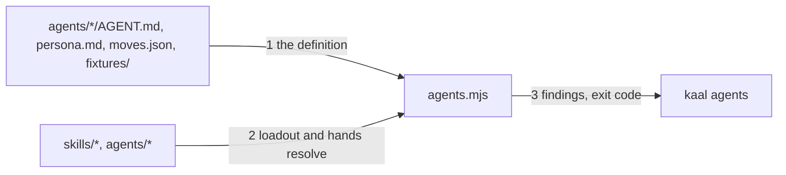

# Drawing: agent-v1

_Written in architect mode from `requirements/agent-v1`, five criteria, five
red tests. The human approves this drawing by merging it._

## Structure

What exists: the design's section 3 (the agent definition); Kaal's persona
on the `kaal-first-agent` branch (PR #1); `bin/kaal.mjs` with five
commands; `bin/lib/rules.mjs` for skills.

What is new:

- **The first agent**, `agents/kaal/`: `AGENT.md` (the binding: seven
  fields, six sections), `persona.md` (PR #1's four chapters, the
  frontmatter reshaped to this league's, `shape: khai persona` as the
  credit), `moves.json` (his moves: read the measure, turn or return, record
  the verdict; all at `nlp`), `fixtures/stamp/` (an artefact and its
  checklist, with what a correct stamp says).
- **The agent rules**, `bin/lib/agents.mjs`: `checkAgents(root)` returning
  `{ agent, rule, message }` findings, rules named `fields`, `name`,
  `division`, `skills`, `hands_to`, `lane`, `license`, `sections`,
  `chapters`, `credit`, `scope`, `ledger`, `fixtures`. Reads only the agent
  directory and resolves loadouts against `skills/` and hands against
  `agents/`.
- **The command**, `agents [root]` on `bin/kaal.mjs`: findings to stderr as
  `<agent>: <rule>: <message>`, exit 1 on any, a summary on stdout on none.

What changes: `bin/kaal.mjs` (dispatch and usage), `README.md` (the layout
line for `agents/` stops saying "when defined"), and PR #1, which closes as
superseded.

## Seams

1. **agent directory to rules**: in, one agent directory; out, one finding
   per broken rule, naming agent and rule. Owned by the agent's author on
   one side, `agents.mjs` on the other.
2. **loadout and hands to the tree**: in, the `skills` and `hands_to` lists;
   out, a `skills` or `hands_to` finding for every entry that does not
   resolve to a directory with its defining file. Owned by the tree on one
   side, `agents.mjs` on the other.
3. **rules to shell**: in, `node bin/kaal.mjs agents [root]`; out, findings
   on stderr, exit 1 on any, summary on stdout on none. Owned by the command
   on one side, the hook and the workflow on the other.

## Fixed and free

- Fixed: the seven fields, the six sections and four chapters in order, the
  credit field, the no-scope rule (criteria 2, 3); the command name and exit
  contract (criterion 4); the finding format, because contract tests name
  the rules; Kaal's persona text is PR #1's, moved not rewritten (criterion
  5).
- Free: the rule messages' wording; whether `agents.mjs` shares the
  frontmatter parser (it should) and the list parser with the acceptance
  test (it need not).

## Decisions

### Division takes a rung name until divisions are named

- Chosen: `division` is one of `human`, `nlp`, `skill`, `script`; Kaal is
  `nlp`.
- Not taken: inventing division names; leaving the field out.
- Because: the field is in the design's binding and the names are Kai's to
  give; a rung name is a true statement about an agent today.
- Reopens if: the divisions are named; then the wall's list changes and
  every binding is edited in one change.

### Kaal carries retro-4ls and nothing else

- Chosen: `skills: [retro-4ls]`.
- Not taken: an empty loadout; every skill.
- Because: the stamp is Kaal's own move and needs no skill; the retro is the
  one skill he runs on his own work, after every stamp of a stack.
- Reopens if: the stamp becomes a skill of its own.

### A persona's credit is a frontmatter field

- Chosen: `shape: khai persona` in `persona.md`'s frontmatter.
- Not taken: a sentence in the body; a `khai:` type key.
- Because: the design says the shape is borrowed and credited in the file's
  own frontmatter and is not a dependency; a `khai:` key would make the
  file read as khai content.
- Reopens if: khai's canon publishes a credit convention.

## Test strategy

| criterion | layer         | kind          | why                           |
| --------- | ------------- | ------------- | ----------------------------- |
| 1         | acceptance    | deterministic | files exist                   |
| 2, 3      | contract 1, 2 | deterministic | named rules on fixture agents |
| 4         | contract 3    | deterministic | exit codes and stderr         |
| 5         | acceptance    | deterministic | words in Kaal's files         |

## Handoff

- Task: agent-v1
- Seams: 3; contract tests: 3 (equal), beside this file; fixtures
  `unresolved` and `scoped` here, `bad-agent` under the requirement
- Red run: all three failing; stand-in green in scratch
- Criteria served: seam 1 serves 2, 3; seam 2 serves 2; seam 3 serves 4
- Next: the human approves by merge; then `code`, which also closes PR #1
