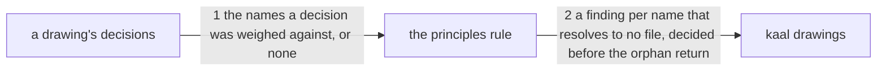

# Drawing: an-architect-names-its-principles

_Written in architect mode from `requirements/an-architect-names-its-principles`,
six criteria and six red tests. The closed requirements read first:
`architect-v2` fixes the drawings wall's shape and its one fixture per rule;
`a-decision-balances-two-goods`, which this task supersedes, fixes that a
record prices the trade; `nothing-passes-vacuously` and `applies-here` fix
what a command's exit codes mean. The requirement decided where a principle
lives and that the wall reads the citation and never the application; this
drawing decides what the wall does with the name and where in the reading it
does it._

## What the runs said

- `bin/lib/drawings.mjs` holds five rules and the fifth returns early:
  `orphan` writes its finding and then `return findings`, so nothing after
  it runs on a drawing whose requirement is missing.
- The acceptance fixture `requirements/an-architect-names-its-principles/fixtures/cites-nothing`
  has no `requirements/` directory at all. `node bin/kaal.mjs drawings` on it
  today prints four lines, two per drawing, `tests` and `orphan`, and exits
  1. Both its drawings are orphans, so a citation rule written below that
     return would never have run on either and the acceptance test would have
     stayed red with the rule in place.
- `architecture/` holds 47 drawings and none of them carries a
  `Weighed against:` line. Neither does
  `requirements/architect-v2/fixtures/clean/architecture/t/drawing.md`, the
  fixture that must yield no findings at all. A rule requiring the line
  reddens the whole tree and the clean fixture with it.
- `tests/drawings.test.mjs` loops over the exported `RULES` and asks
  `checkDrawing(join(FX, rule), "t")` for exactly that one finding, where
  `FX` is `requirements/architect-v2/fixtures`. A sixth rule owes a sixth
  fixture root there, and that fixture must break nothing else.
- `skills/architect/references/` holds one file, `drawing.md`.
- The fixture `cites-nothing/architecture/a-task` cites two names and
  `says-none` cites `none`. The second exists because the first never
  exercises the answer the template offers: with only `a-task` in the tree,
  dropping the guard that treats `none` as naming nothing reddens nothing.

## Structure

Two files are new, one module learns a sixth rule, one template gains a
line, one skill gains three passages and loses one, and two fixture roots
are new.

- **the principles** (`skills/architect/references/principles/`, new): one
  file per principle, `the-two-goods.md` and `the-seat-owns-the-lens.md`.
  Prose a person reads. Nothing runs them and nothing but the wall's
  resolution knows they exist.
- **the citation** (`bin/lib/drawings.mjs`, changes): a reader that turns a
  drawing's `Weighed against:` lines into names, and a sixth rule that
  resolves each name against the principles directory.
- **the template** (`skills/architect/references/drawing.md`, changes): the
  decision record gains a sixth line.
- **the skill** (`skills/architect/SKILL.md`, changes): section 2's
  Decisions bullet says what a principle file holds and cites
  `the-two-goods` where it used to restate it; section 5's closing
  instruction gains the lens.
- **the rule's fixture** (`requirements/architect-v2/fixtures/principles/`,
  new): a drawing that breaks the sixth rule and no other, because a unit
  asks each rule's fixture for exactly one finding.
- **the contract's fixture**
  (`architecture/an-architect-names-its-principles/fixtures/resolves/`,
  new): a drawing whose citation resolves, in a tree that is not an orphan,
  so the rule is proven silent as well as loud.
- **the board** (`kaal.config.json`, unchanged): the drawings wall already
  runs, and a sixth rule needs no twelfth wall.

## Seams

1. **The names, read from the text.** `citedPrinciples(text)` returns the
   names a drawing's decisions cite, in the order they appear and without
   repeats. It takes text and returns names: no filesystem, no root, no
   knowledge of what a principle is. `none` names nothing, an empty value
   names nothing, and a line that is absent names nothing. The spellings a
   seat writes are the spellings `Feeds:` and `Read:` already accept: a
   comma separated pair, a name in backticks, a trailing period.
2. **The name, resolved against the architect's principles.**
   `checkDrawing(root, task)` gains a `principles` rule reporting one
   finding per cited name with no
   `skills/architect/references/principles/<name>.md` under the root, each
   naming the task and the name. It reads the drawing and that directory
   and nothing else, so it is decided before the `orphan` return, and a
   drawing that is both an orphan and a dangling citation says both.

## Fixed and free

Fixed:

- The rule is named `principles` and joins the exported `RULES`. The name is
  what a finding prints and what the fixture directory is called.
- The rule is decided before the `orphan` return. A drawing that is both an
  orphan and a dangling citation yields both findings.
- One finding per unresolved name, each naming the task and the name.
- A name resolves to `skills/architect/references/principles/<name>.md`
  under the root the wall was given, by file name and not by anything
  inside the file.
- `none`, an empty value, and an absent line each name nothing. The wall
  never requires the line.
- The wall resolves the name and never reads the principle. Whether the
  decision honoured it is not a finding and never becomes one.
- `citedPrinciples` is exported and takes text alone.
- The `Weighed against:` line joins the decision record after `Bought:` and
  before `Reopens if:`, and the other five lines keep their names and their
  order. The line's value is `none` or the names.
- The template's six sections keep their names and their order.
- `the-two-goods` has one home. The Decisions bullet cites the file by name
  and the eleven lines that stated the principle are gone from the skill.
- The lens joins section 5's closing instruction as prose. No new section,
  no new line in the handoff list.
- `requirements/architect-v2/fixtures/principles/` yields exactly one
  finding, whose rule is `principles`, on the task `t`.

Free:

- The wording of the finding beyond the task and the name. The command
  already prints `<task>: <rule>: <message>`, so a message opening with
  the rule's own name says it twice.
- How the names are split out of a line, and whether `citedPrinciples`
  slices the Decisions section first or reads the whole page. The wall's
  other rules do it both ways.
- The prose of the two principle files beyond the pulls the acceptance
  tests name, and the shape of a principle file beyond what the skill says
  it holds. Two files are not enough to fix a format.
- Where in the Decisions bullet the principle passage sits, and its words.
- Whether the new fixture roots are written or copied from `clean`.

## Decisions

### The rule is decided before the orphan return

- Chosen: the `principles` rule runs above the `orphan` early return, and a
  drawing that is both says both.
- Not taken: below the return, with the other rules that need the
  requirement; a rule ordered by nothing, with the return removed.
- Because: the return exists because `strategy` reads the requirement's
  criteria and has nothing to count without one. The citation rule reads
  the drawing and one directory, so the reason for the return does not
  reach it. It was found by running: the acceptance fixture has no
  requirements at all, so a rule written below would have been dead on the
  fixture written to prove it, and the wall would have been green for
  having skipped the test.
- Bought: keeping the most choices open. The return stays, so `strategy` is
  still protected, and the module now says out loud which rules need a
  requirement and which need only the page. It spent the shortest path: the
  developer must read where the return is before adding the rule, and every
  rule after this one owes the same reading.
- Reopens if: a third rule needs the drawing alone, at which point the two
  groups are worth separating by name rather than by line number.

### `none` is filtered before resolution, and the line is never required

- Chosen: `none` names nothing, and so does an absent line. The wall
  resolves what is left.
- Not taken: a `none.md` in the principles directory, so the word resolves
  like any other; requiring the line on every decision and reading its
  absence as a finding.
- Because: `none.md` is a file whose only purpose is to be found, and the
  first person to read the directory would ask what principle it states.
  Requiring the line reddens 47 drawings and the clean fixture on the day
  it lands, which turns a rule about citations into a retrofit of the whole
  tree; and the requirement holds that a league where every decision cites
  three principles has noisy citations and a theatrical wall.
- Bought: the shortest path to value. The rule lands on a tree that does not
  move, and the first drawing to carry the line is the first one written
  after it. It spent the count: nothing knows how many decisions were
  weighed against nothing on purpose and how many were never asked, so the
  lens in section 5, which is prose, is the only thing that notices.
- Reopens if: the retro lens nominates a third principle, at which point
  there is a population worth counting and a reason to ask every record.

### The wall resolves citations in drawings and nowhere else

- Chosen: only a drawing's decisions are read. The architect skill cites
  `the-two-goods` by name and nothing checks that the name resolves.
- Not taken: resolving citations in the skill's text too; a rule in the
  skills wall over any `references/principles/` directory.
- Because: the drawings wall's subject is a drawing, and a rule in it that
  reads a skill is a wall answering a question it was not asked. The skills
  wall is the right place and this task's constraint is that nothing under
  `bin/` changes except the drawings wall's reading.
- Bought: the shortest path, and one wall with one subject. It spent a real
  guarantee: renaming a principle file leaves the skill citing a name that
  resolves to nothing, and the same hole is open between the wall's
  hardcoded path and the skill's prose about where principles live. Both
  are a page and a tree that agree by hand.
- The gap this widens, and the task that closes it:
  **`an-artefact-names-what-it-describes`**, the computable link between an
  artefact and what it stands for. It is the next task after this build and
  it is what the hole here is made of; until it exists, two of this task's
  agreements are honoured by a reader.
- Reopens if: that task lands and the link it defines can carry a citation,
  at which point this rule is a special case of it rather than its own
  reading.

### The lens is prose in the closing instruction, not a line in the retro

- Chosen: section 5's closing instruction tells the retro to name which
  tensions the drawing weighed and whether any had no name.
- Not taken: a `Tensions:` line in the retro's shape, walled like `Read:`
  and `Feeds:`; a rule in `retro-4ls`.
- Because: `retro-4ls` has no retros of its own and the seat owns the lens,
  which is the second principle this task writes; and nobody has yet
  written down what a weighed tension looks like. A format fixed before
  five instances exist is the abstraction the first principle warns about.
- Bought: keeping the most choices open. The lens can be reworded by the
  next architect retro that finds it clumsy, and the shape it wants will be
  read off the retros that used it. It spent the count again: an unnamed
  tension is countable only by reading, so the "more than once" bar in the
  instruction is a human's arithmetic and the league cannot see it.
- Reopens if: five retros name a tension and the words they use agree, at
  which point the line writes itself and the wall can count it.

## Test strategy

| criterion | layer          | kind          | why                                                                                                              |
| --------- | -------------- | ------------- | ---------------------------------------------------------------------------------------------------------------- |
| 1         | none           | none          | a directory and prose the acceptance test reads; there is no seam under what a person writes in a principle file |
| 2         | none           | none          | the template's text, and the wall never requires the line, so nothing below the acceptance test holds it         |
| 3         | contract, unit | deterministic | seams 1 and 2: the grammar driven with text, the resolution driven with two fixture roots, plus the rule's own   |
| 4         | none           | none          | prose a person honours at the close of a use; the acceptance test holds the words and nothing runs them          |
| 5         | none           | none          | text moved from one file to another; the acceptance test reads both homes, and the second must be empty          |
| 6         | none           | none          | a file of prose; the acceptance test reads its pulls and no layer below it exists                                |

## Handoff

- Task: an-architect-names-its-principles
- Seams: 2; contract tests: 2 (equal)
- Red run: `node --test --test-timeout=60000 architecture/an-architect-names-its-principles/contracts.test.mjs`, both failing; stand-in green: both passing, discarded
- Criteria served: seam 1 -> 3; seam 2 -> 3
- Fixed for the developer: the rule's name and its place above the orphan
  return, one finding per unresolved name naming both, the resolution path,
  the three ways of naming nothing, `citedPrinciples` taking text alone, the
  line's place in the record, the two goods having one home, the lens as
  prose, and a fixture under `architect-v2` that breaks this rule alone
- Owed with the build: a sixth fixture root under
  `requirements/architect-v2/fixtures/`, because a closed unit asks `RULES`
  for one fixture each and a sixth rule without one reddens that unit
- Unproven, and it is the point: five of six criteria are text a person
  reads, held by the acceptance test and by nothing under it. This task
  buys a place to put a principle and one wall over the citation; it does
  not buy any assurance that a principle is honoured, and it was never
  meant to. The one criterion with machinery under it carries both seams
- This drawing does not use the line it specifies. `Weighed against:` does
  not exist in the template until the build lands, and writing a drawing to
  a shape nobody has agreed to is the thing seam 1 of every drawing exists
  to prevent. The first drawing to carry it is the next one written
