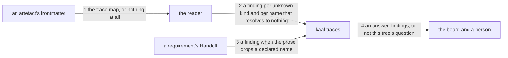

---
traces:
  requirement: an-artefact-traces-what-it-came-from
  principles: nothing
---

# Drawing: an-artefact-traces-what-it-came-from

_Written in architect mode from `requirements/an-artefact-traces-what-it-came-from`,
six criteria and six red tests. Read first: `applies-here` and
`nothing-passes-vacuously`, which fix that a command answers, refuses or says
the question is not its own; `a-task-names-its-people`, which put a
requirement's own defect into the wall that already reads the page rather than
inventing a command; and `a-trace-pins-what-it-read`, merged an hour ago and
open, whose criteria extend this command with a pin. That one is not built
here and it is read here, because a seam it will cross is a seam this drawing
fixes._

## What the runs said

- `bin/lib/frontmatter.mjs` returns `{"traces":{...}}` for a block whose
  `traces:` key has indented pairs beneath it, unchanged. Five call sites and
  no list support, so a comma separated value arrives as one string.
- Neither template carries frontmatter: both open on their `# ` heading.
  55 requirements and 48 drawings carry none either.
- `GUARDED` in `bin/lib/applies.mjs` holds ten commands. Eight are asked
  about their first argument and two, `runner` and `release`, about the
  working directory because their argument is not a path.
- The board runs eleven walls. Nothing reads a requirement and a drawing in
  the same pass today: `acceptance` reads requirements, `drawings` reads
  drawings, and neither knows the other's artefact.
- `bin/lib/acceptance.mjs` reads a requirement's body line with
  `/^- People: (.+)$/m` over the whole page, and no requirement carries two
  of any handoff line or one outside a Handoff.
- 12 requirements name a task on their `Supersedes:` line and every one of
  the 12 is a sentence.

## Structure

One module is new, one command is added, one module learns an eleventh case,
one wall is added, two templates gain a block, and 103 artefacts are
migrated.

- **the reader** (`bin/lib/traces.mjs`, new): reads an artefact's trace map
  out of its frontmatter, resolves each kind against one table, and reports.
  It reads files and never runs anything.
- **the table** (`KINDS`, exported from the same module): one row per kind,
  each saying where things of that kind live. Adding a kind is adding a row,
  which is the whole of what makes this general.
- **the command** (`bin/kaal.mjs`, changes): dispatches `traces`, prints and
  sets the exit code.
- **applicability** (`bin/lib/applies.mjs`, changes): a `traces` case asked
  about its first argument, like the eight that take a root.
- **the board** (`kaal.config.json`, changes): a twelfth wall.
- **the surface page** (`SURFACE.md`, changes): a `traces` entry.
- **the templates** (`skills/analyse/references/requirement.md` and
  `skills/architect/references/drawing.md`, changes): each opens with a
  block carrying a `traces` map.
- **the tree** (103 artefacts, changes): every requirement and every drawing
  gains a block. This is the bulk of the diff and none of the risk.
- **the parser** (`bin/lib/frontmatter.mjs`, unchanged): the constraint, and
  the reason the value grammar is what it is.

## Seams

1. **The trace, read from the page.** `readTrace(text)` returns the map, an
   empty map when the block has no `traces` key, and `null` when there is no
   block at all. Those are three different facts and the reader keeps them
   apart, because criterion 5 reports the last two and not the first. It
   takes text: no root, no filesystem.
2. **The kind resolved against the table.** `KINDS` maps a kind to where its
   things live. `checkTraces(root)` walks both artefact directories and
   reports one finding per kind the table does not hold, and one per name
   with no file where the table says it lives. `nothing`, an empty value and
   an absent key each name nothing. Resolution and never reading: what the
   named file says is not this wall's business.
3. **The prose that must carry the names.** For a requirement, every name its
   trace declares appears in the `- Supersedes:` line. Read one direction
   only, and the drawing says so where a developer will look for it: the
   other direction is parsing English.
4. **The command's answer.** `kaal traces [root]` prints what comes back and
   exits 0, 1 or 2, and is guarded on its first argument.

## Fixed and free

Fixed:

- `readTrace` takes text alone and distinguishes three cases: a map, an
  empty map, and no block. Collapsing the last two loses criterion 5.
- `KINDS` is exported and is a table from a kind to where that kind lives.
  A rule per kind, written out, is the shape this task exists to refuse.
- The three kinds on the first day: `requirement`, `principles`,
  `supersedes`. `parent` is not one of them; it arrives with its own task.
- A kind not in `KINDS` is a finding. Silence on an unrecognised key is the
  vacuous pass, and it is the one defect a reader of this module will be
  tempted to write.
- One finding per unresolved name, naming the artefact, the kind and the
  name; and the finding for an unknown kind names the artefact and the kind.
- `nothing` read without regard to case, an empty value, and an absent key
  each name nothing.
- A drawing's map carries `requirement`. Its absence is a finding like any
  other unresolved trace.
- The command takes a root as its first argument and joins `GUARDED`.
- Its exit codes and their meanings, and a reason for a foreign tree that is
  not another command's.
- The value grammar: comma separated, a name optionally in backticks, a
  trailing period tolerated. It is `Feeds:`'s grammar and `retros.mjs` has
  already written the splitter.
- The prose check reads only a requirement's `- Supersedes:` line, and only
  frontmatter to prose.

Free:

- The wording of every finding beyond the artefact, the kind and the name.
  The command prints `<artefact>: <kind>: <message>` or its own shape, and a
  message opening with the kind says it twice.
- Whether `checkTraces` walks the two directories itself or takes a list.
- Whether the splitter is imported from `retros.mjs` or written again. It is
  four lines and the two callers read different files; the drawing does not
  decide it, and the retro that follows may.
- How the 103 artefacts are migrated, and whether the script that does it is
  kept. `a-trace-pins-what-it-read` brings a durable `--write`; this task
  needs the blocks in the tree once.
- The order the findings come back in.

## Decisions

### One command over both artefacts, rather than a rule in each existing wall

- Chosen: a new `traces` command and a twelfth wall, reading requirements and
  drawings in one pass.
- Not taken: a rule in the acceptance wall for requirements and one in the
  drawings wall for drawings; a rule in the drawings wall only.
- Because: the concept is one concept. Nothing in the tree reads both
  artefacts today, and the two existing walls each know one. Splitting the
  reading between them would make a general thing read as two special ones,
  and criterion 4's one to one between a drawing and its requirement cannot
  be asked from inside a wall that sees one side.
- Bought: the shortest path to the thing the task is for. A person asking
  what an artefact came from runs one command and the answer is complete.
- Spent: a twelfth wall and an eleventh guarded command, which is more
  surface than a rule would have been, and `a-task-names-its-people` set the
  opposite precedent by putting a requirement's defect in a wall that was
  already reading the page.
- Reopens if: a second reading over both artefacts appears, at which point
  the two share a walker and the question is whether it is one wall or two.

### The kind is a row, and three rows on the first day

- Chosen: `KINDS` is a table and the module holds three rows.
- Not taken: a function per kind; a table with every kind the ask named,
  including tests, code and operations.
- Because: a row is what makes adding a link kind cheap, and cheap is the
  whole claim. Three is what the tree can resolve today: tests and code have
  no name a trace could point at, so a row for them would be a row that
  never resolves and a finding nobody can fix.
- Bought: keeping the most choices open. `parent` lands as a row and nothing
  else moves; `a-trace-pins-what-it-read` adds a column and nothing else
  moves.
- Spent: the ask named six pairs and this delivers three, so the map is
  incomplete on the day it lands and the missing edges are invisible rather
  than reported.
- Reopens if: a kind needs to resolve somewhere that is not a directory of
  files, at which point a row is a path and needs to become a reader.

### The prose check lives here, though it reads a body line

- Chosen: criterion 6's reading sits in this module beside the frontmatter
  reading.
- Not taken: in `bin/lib/acceptance.mjs`, which already reads a requirement's
  body lines and owns `readPeople`.
- Because: it is a check on the trace, not on the requirement. It exists only
  because the trace declares names, it is meaningless without the map beside
  it, and a reader looking for why a name must appear twice will look where
  the map is read.
- Bought: the shortest path for a reader. One module answers "what does this
  artefact claim it came from, and does the page agree".
- Spent: two modules now read a requirement's body lines with their own
  regexes, and `acceptance.mjs`'s reads the whole page. That is the
  duplication the architect retros keep naming and it is not fixed here.
- The gap this widens, and the task that closes it: **the one reader for a
  handoff line**, unnamed and unowed, which becomes worth writing when a
  third caller appears rather than now.
- Reopens if: a third module needs a handoff line.

### A drawing declares its principles; the per decision line is left alone

- Chosen: `traces.principles` on a drawing is resolved against the architect's
  principles directory, exactly as any other kind, and the per decision
  `Weighed against:` line that `architecture/an-architect-names-its-principles`
  drew is left alone.
- Not taken: making the merged and unbuilt drawing's rule resolve against
  this declaration instead of the directory.
- Because: that drawing is approved and its build is owed, and changing what
  it means from inside another task's drawing is a supersede done sideways.
  The two readings do not conflict: one asks whether a drawing's principles
  exist, the other whether a decision's citation exists.
- Bought: keeping both tasks buildable independently, and no amendment to a
  merged drawing.
- Spent: a drawing will name its principles twice, once per drawing and once
  per decision, with nothing making the two agree. That is the same defect
  criterion 6 exists to prevent one level up, admitted here rather than
  fixed.
- The gap this widens, and the task that closes it: the asker's open
  question on `an-artefact-traces-what-it-came-from`, which is whether the
  per decision line becomes a citation of the per drawing trace. It is
  theirs to answer and it is recorded there.
- Reopens if: the asker answers it, at which point the rule in the other
  drawing changes before it is built.

## Test strategy

| criterion | layer          | kind          | why                                                                                                             |
| --------- | -------------- | ------------- | --------------------------------------------------------------------------------------------------------------- |
| 1         | none           | none          | a block in 103 files and two templates; the acceptance test reads them and no seam sits under a migration       |
| 2         | contract       | deterministic | seam 4: the command answers a clean tree, refuses a foreign one, and the page is text the acceptance test holds |
| 3         | contract, unit | deterministic | seam 2: one finding per unresolved name, driven on a fixture root, and the table read as data                   |
| 4         | contract, unit | deterministic | seam 2 again, and the case a reader is most likely to write as a silence                                        |
| 5         | contract, unit | deterministic | seams 1 and 2: the three cases `readTrace` keeps apart, driven with text and with a root                        |
| 6         | contract       | deterministic | seam 3: the prose read one direction, on a fixture whose declared name resolves                                 |

## Handoff

- Task: an-artefact-traces-what-it-came-from
- Seams: 4; contract tests: 4 (equal)
- Red run: `node --test --test-timeout=60000 architecture/an-artefact-traces-what-it-came-from/contracts.test.mjs`, all 4 failing; stand-in green: all 4 passing, discarded
- Criteria served: seam 1 -> 5; seam 2 -> 3, 4, 5; seam 3 -> 6; seam 4 -> 2
- Fixed for the developer: three cases from `readTrace`, `KINDS` as a table
  of three rows, an unknown kind as a finding, one finding per unresolved
  name naming three things, the three ways of naming nothing, a drawing's
  `requirement`, the command's argument and its three codes, the value
  grammar, and the prose read one direction
- Owed with the build: 103 artefacts migrated in the same change, because a
  wall reporting a hundred findings on the day it lands is a wall nobody
  reads. The migration is a script that is not part of the deliverable;
  `a-trace-pins-what-it-read` brings the durable writer
- Unproven, and it is worth saying: criterion 1 is a migration and no test
  under the acceptance test holds it. If a later change drops a block from
  one artefact, criterion 5's wall catches it, so the migration is held
  going forward by a different criterion than the one that asked for it
