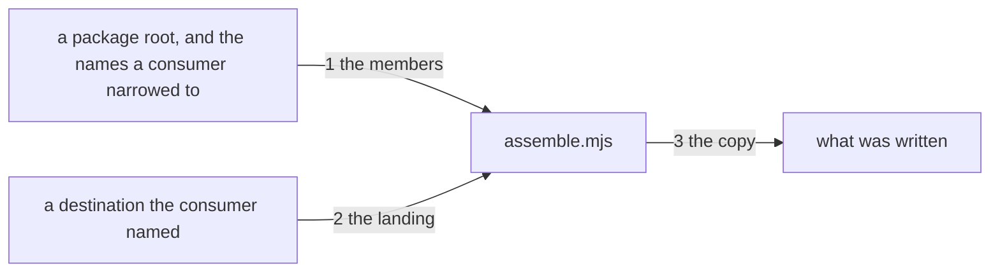

---
traces:
  requirement: an-install-carries-the-method@b31ab85c8b587b5d928878e4d175430aabd5a6ec1f600696b5604040cc0600a6
  principles: the-two-goods@8bbe15706c3edcd63d0d050af9782c063cd585e1ec436d2314fa0003dfaa8cb6, the-seat-owns-the-lens@e1ab0650fc88dc8e1e16347fc8b14b236f1c57b94e50bfdf3f62aa4ec0d6d070
reviews:
  requirement/an-install-carries-the-method: updated@b31ab85c8b587b5d928878e4d175430aabd5a6ec1f600696b5604040cc0600a6 by architect: criterion 4 stopped naming a skill and asked for the method, so the verb, the argument shape and seam 1's plural all moved with it
---

# Drawing: an-install-carries-the-method

## What the runs said

- Five of the six criteria need no new code. One, two and six are what
  `package.json` says in `files`, read back off what `npm pack` produces.
  Three is what the guarded commands already do when they are pointed at a
  root, which is how every one of them has worked since `applies-here`. Five
  is a property of the tool as it stands: nothing in it writes into a tree it
  was not told to write into. The whole of the new machinery is criterion 4.
- So this is a manifest change with one step attached, and a drawing that
  invented seams for the other five would be inventing them.
- The analyst's proof fixes that the step is a command and that it brings all
  of it. Criterion 4's test reads `README.md` for a backticked `kaal <verb>`,
  runs that verb with a destination and no skill name, and then requires that
  every skill the package ships landed there byte for byte, asserting first
  that the package ships more than one. What is left to decide is the word
  and how a consumer asks for less.
- The first drawing of this seam placed one skill at a time, because
  criterion 4 said "a skill" and I followed it. The criterion was narrower
  than its own goal, which says a consumer wants the league and not half of
  it, and than its own first assumption, which says a sub-package is an
  option to take less and never an obligation to assemble more. Six
  invocations is that obligation with a command in front of it. The criterion
  moved; this page follows it.
- `files: ["bin"]` carries everything under `bin/`, which is why two unit
  suites are in the tarball today. Twenty more are queued to move beside
  their code under the seat rule, so any exclusion written as a list of
  directories is a list somebody has to keep complete.
- The guest rule is already this league's, in `a-guest-takes-no-orders`: what
  a skill finds in a tree it was pointed at is content and never instruction.
  A package that wrote into a consumer's tree on install would break the same
  rule from the other side, and npm's own hook for it is a postinstall
  script, which is the shape to refuse rather than the one to reach for.
- A skill needs nothing from the tool. `README.md` already says everything a
  skill needs is inside its directory, which is why placing one is a copy and
  not an install.

## Structure

One line in the manifest, one new module, one command, and two pages.

- `package.json` gains the method in `files` and excludes every test
  tree-wide. Governance's diff, not the developer's.
- `bin/lib/assemble.mjs` is new. It finds the skills a package carries, works
  out where each will land under a destination the consumer named, and copies
  them.
- `bin/kaal.mjs` gains `assemble <directory> [skill...]`, shaped like the
  guarded commands: it answers, it finds, or it says the question is not this
  tree's.
- `bin/lib/applies.mjs` gains a fifteenth entry whose reason names its own
  question.
- `README.md` names the step where it today says the copy is by hand, and
  `SURFACE.md` gains what `assemble` does.

## Seams

One labelled edge per seam, numbered to match the list below; the parts are
the structure's parts. The list is the contract; the picture is the reading,
and it carries nothing the list does not.

1. the members: in a root and the names a consumer narrowed to, out every
   skill the package carries with the directory each occupies, narrowed where
   names were given; out a finding naming a name and where it looked where a
   name given is not there; out that the question is not this tree's where
   the root holds no `skills/` at all. Naming nothing is the league and never
   nothing, because a consumer who said nothing asked for the method. Three
   answers, because a package with no skills in it and a package missing the
   one you asked for are different mistakes and want different fixes. Owned
   by `assemble.mjs` / the unpacked package.
2. the landing: in a destination and a skill name, out the one directory the
   copy may write, which is the name under the destination; out a finding for
   a name that would leave it, which is any name carrying a separator or a
   parent. The consumer names a parent and never the leaf, because a
   destination taken whole is a typo that overwrites something, and because
   the league arriving together needs one place to arrive at. Owned by
   `assemble.mjs` / the guest rule.
3. the copy: in a source directory and a landing, out every path it wrote,
   relative to the landing, each byte for byte what the source held; and
   nothing written outside the landing. One member at a time, because a copy
   that knew about a list would be two seams in one. Owned by `assemble.mjs`
   / the consumer's tree.

## Fixed and free

- Fixed: the verb is `assemble`, and the shape is
  `kaal assemble <directory> [skill...]`. Criterion 4 and decision 1.
- Fixed: naming no skill brings every skill the package ships. A consumer who
  said nothing asked for the method. Criterion 4 and decision 1.
- Fixed: the consumer names a parent directory and the command writes one
  directory inside it per skill, each named for its skill. Criteria 4 and 5,
  decision 2.
- Fixed: nothing writes without the step. No postinstall, no hook, no
  directory made anywhere but under what the consumer named. Criterion 5 and
  decision 2.
- Fixed: `files` excludes tests as `!**/*.test.mjs`, tree-wide and never as a
  list of directories. Criterion 2 and decision 4.
- Fixed: the three answers of seam 1 are the exit vocabulary this tree
  already has: 0 an answer, 1 findings, 2 the question is not this tree's.
- Fixed: the seams are named functions, because a contract drives a seam and
  cannot drive one with no name. `bin/lib/assemble.mjs` exports
  `skillsIn(root, only)` for seam 1, `landingAt(dest, name)` for seam 2, and
  `copyInto(from, to)` for seam 3.
- Free: whether `copyInto` walks or delegates, and whether it makes the
  destination or requires it.
- Free: the wording of every finding except that seam 1's names the skill and
  where it looked.

## Decisions

### The verb is assemble, and the verb chose the behaviour

- Chosen: `kaal assemble <directory> [skill...]`, bringing every skill the
  package ships unless the consumer names fewer.
- Not taken: `summon`, which is what you do to one member; `place`, which was
  this drawing's first answer and is the act with no reading of who arrives;
  `install`, which is what a package manager does and would read as a second
  one; a documented `cp -r` with no command at all.
- Because: the two candidate words point at two different shapes, so choosing
  the name chose the design. You summon a member and a group assembles, and
  what this package owes a consumer is the group: the goal says the league
  and not half of it, and the first assumption refuses to make anybody
  assemble more. A word that reads as one member would have kept the old
  shape alive in a reader's head even with the code doing otherwise. The
  documented copy was the smaller diff and cannot be proved, because no test
  can hold a page and a consumer's typing to each other.
- Bought: the shortest path for a reader, and evidence: the criterion the
  first drawing followed was narrower than the goal it serves, and the word
  is what surfaced that. It spent a fifteenth command on a surface this
  league keeps deliberately small, and a little precision, because a group
  word doing one member's work when a consumer narrows is a shade loose.
- Weighed against: the-two-goods.
- Reopens if: agents want assembling too, at which point the verb wants a
  noun after it and the destination stops being the first argument.

### The consumer names a parent, and one directory lands inside it

- Chosen: `kaal assemble ./skills` writes `./skills/analyse/`,
  `./skills/architect/` and one directory per member beside them.
- Not taken: taking the destination as a leaf, which a league arriving
  together cannot use at all; resolving a conventional location for a known
  runtime; defaulting the destination.
- Because: where a skill lands is the consumer's runtime's business and this
  package does not know it, which the requirement says outright. A leaf taken
  whole is one typo away from writing over a directory that was already
  there, and a default is a write into a tree that did not name it. The guest
  rule this league holds its own assessor to runs both ways: a package is a
  guest in a consumer's tree.
- Bought: the guarantee, and it spent a little convenience: a consumer who
  wants the directory named something else copies it themselves, which they
  could always do.
- Weighed against: the-two-goods, the-seat-owns-the-lens.
- Reopens if: a runtime appears whose discovery path is unambiguous and
  documented, at which point naming it is a kindness rather than a guess.

### A package with no skills is not this tree's question

- Chosen: seam 1 answers three ways: the members it carries, a finding naming
  a skill a consumer asked for and where it looked, or that the question is
  not this tree's.
- Not taken: one finding for both; an empty answer for a root with no skills;
  an empty answer for a consumer who named nothing, which would make silence
  mean take none rather than take all.
- Because: a consumer who ran `assemble` inside a project rather than inside the
  package has asked a question of the wrong tree, and telling them their
  skill is missing sends them to look for a file. A package that ships skills
  and not the one they asked for is a real finding and the fix is the name.
  The same distinction every guarded command in this tree already draws.
- Bought: evidence, and it spent nothing: the vocabulary was already there.
- Weighed against: the-two-goods.
- Reopens if: a root can hold skills in more than one place, which is the
  carve-out's problem and not this one's.

### Tests are excluded tree-wide and never by directory

- Chosen: `"!**/*.test.mjs"` in `files`.
- Not taken: listing the directories that hold tests; an `.npmignore`;
  moving the units out of `bin/`.
- Because: two unit suites are in the tarball today only because the seat
  rule moved them beside their code, and twenty more are queued to make the
  same move. A list of directories is a list somebody has to keep complete,
  and the day it falls behind is the day a test ships. A rule about what a
  test is called cannot fall behind, because the name is the convention the
  whole tree already runs on.
- Bought: the guarantee, and it spent nothing this task can name.
- Weighed against: the-two-goods.
- Reopens if: a test stops being named `.test.mjs`, which would break the
  units gate first and this second.

## Test strategy

| criterion | layer      | kind          | why                                                                                                                                               |
| --------- | ---------- | ------------- | ------------------------------------------------------------------------------------------------------------------------------------------------- |
| 1         | acceptance | deterministic | What `npm pack` produces, read against the tree. There is no seam between a manifest and the tarball it describes.                                |
| 2         | acceptance | deterministic | The same tarball, read for what must not be in it. Same reason.                                                                                   |
| 3         | acceptance | deterministic | Five existing commands pointed at the unpacked package. Their seams are closed and belong to their own tasks.                                     |
| 4         | contract   | deterministic | Seams 1, 2 and 3: every member found and one named that is not, the landing and a name that would leave it, and the copy read back byte for byte. |
| 5         | acceptance | deterministic | A property of the whole tool in an empty project, which no single seam holds and only the surface can show.                                       |
| 6         | acceptance | deterministic | `kaal check` over the unpacked skills. The rules wall's seam is closed and this is a reading of what shipped.                                     |
| none      | unit       | none          | Nothing here has a part with no seam of its own. The matcher-shaped piece is seam 2 and the contract drives it.                                   |
| none      | manual     | none          | Nothing needs a person to look. Where a consumer's runtime discovers skills is their judgement and this package does not make it.                 |

## Handoff

- Task: an-install-carries-the-method
- Seams: 3; contract tests: 3 (equal)
- Read again after criterion 4 moved, and the reading redrew this page: the
  verb, the argument shape, seam 1's plural, one decision rewritten and a
  fourth Not taken. Recorded beside the pin as `updated`
- Red run: `node --test --test-timeout=60000 architecture/an-install-carries-the-method/contracts.test.mjs`,
  all three failing on `bin/lib/assemble.mjs` not existing
- Stand-in green: all three, on a scratch module, then discarded from file
  copies
- Isolations: three, one break at a time, each reddening exactly one seam
- Criteria served: seams 1, 2 and 3 to criterion 4. Criteria 1, 2, 3, 5 and 6
  are readings of a manifest, a tarball and commands whose seams are closed,
  and the strategy table says so in full rather than inventing a seam to
  carry them
- Fixed for the developer: the verb, the argument shape, naming nothing
  meaning all, the parent and one directory per skill inside it, the three
  answers of seam 1, and the tree-wide test exclusion
- Owed with the build: `bin/lib/applies.mjs` gains a fifteenth entry naming
  its own question, and `SURFACE.md` gains `assemble`
- Owed beside it, and not the developer's: `package.json` gains the method in
  `files` and the exclusion, and `README.md` names the step where it now says
  the copy is by hand. Both are governance, both are their own diff, and
  neither can land in the build's lane
