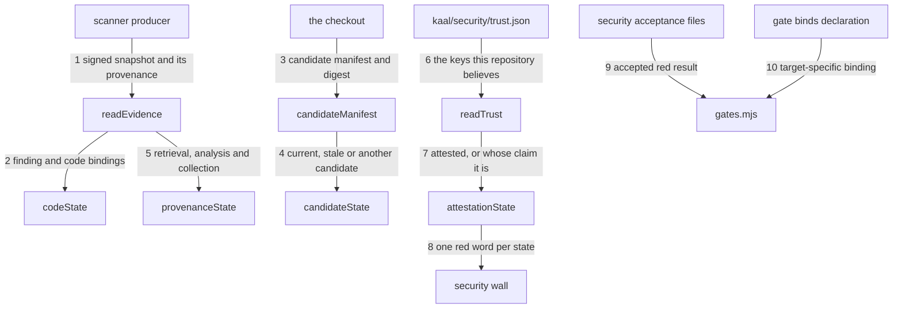

---
traces:
  parent: a-promotion-names-what-it-refuses@ef51aace07dfab1e74cbf09580f229777941d2819595b88bedbd37245913e098
  requirement: an-open-finding-blocks-every-target@69a3792bf08c327370a28813d4a7f6832cc991e1d5b0106e736e0de26c1de540
  principles: the-two-goods@8bbe15706c3edcd63d0d050af9782c063cd585e1ec436d2314fa0003dfaa8cb6, the-seat-owns-the-lens@e1ab0650fc88dc8e1e16347fc8b14b236f1c57b94e50bfdf3f62aa4ec0d6d070
---

# Drawing: an-open-finding-blocks-every-target

One wall reads a gathered scanner snapshot from the tree. Its result is the
same fact at every target, and its declaration makes that red bind `release`
as well as `main`. This revision answers the amended requirement on two
counts: the snapshot must prove a completed analysis of the exact candidate
the board judges with every applicable finding collected, and it must be
something the person holding the checkout could not have written.

## What the runs said

- `node bin/kaal.mjs drawings` answered
  `an-open-finding-blocks-every-target: strategy: criteria not in the strategy
table: 6, 7, 8, 9, 10, 11, 12, 13, 14`, and `node bin/kaal.mjs traces` said the
  requirement under this drawing had moved. It was written against five
  criteria and the requirement now carries fourteen.
- Five bug pages in `tests/bugs/` all named `architecture/*`, and running each
  blocked case showed the same cause: `drawings` refusing the league over that
  one strategy table.
- **The first revision of this drawing was refuted by running it.** A forty
  line script with no scanner, no token and no network walked a checkout,
  wrote `schema: 2` with `retrieval.state: ok`, `analysis.state: completed`,
  `collection.state: complete`, `collection.expected: 0`, an empty `findings`
  array and the correct manifest digest. `node bin/lib/security.mjs` in that
  tree exited **0**. Nothing had been scanned.
- The same script carrying one finding of a notional two, with `expected: 1`
  to match and `locations: "all"`, plus an acceptance for the one it carried,
  answered `waived security by Kai` and the board exited **0**. An internally
  consistent truncation reached a green board.
- Against this revision, the strongest forgery a person can write, with the
  repository's own trust anchor copied in, the subject, workflow and scanner
  matched and the manifest recomputed, answers `unattested evidence: the
snapshot carries no attestation, so every fact in it is the writer's own
claim` and exits 1.
- Against a throwaway that keeps the ten seams below, the requirement's
  fourteen acceptance criteria answered fourteen passing and none failing, and
  the ten contract tests answered ten passing. The stand-in was then discarded
  and `bin/lib/security.mjs` is unchanged in this diff; with it gone, nine of
  the ten contracts are red and the tenth is the guard named in the Handoff.

## Structure

Seven pieces make the path from a scanner report to a blocked target.

- **`kaal/security/trust.json`** is the root of trust: the keys this
  repository will believe, each with its algorithm, its public key, and the
  subject, workflow and scanner it is allowed to speak for. It holds no
  private key and never can. Governance owns it, because `kaal/**` is the
  governance lane, so changing who may attest is a reviewed merge.
- **`kaal/security/findings.json`** is the gathered snapshot, at schema 2. It
  carries the provenance of the analysis, the identity of the candidate that
  was analysed, the state of the collection that produced its findings, the
  identity it was gathered under, and an attestation over all of it.
- **the candidate manifest** is the complete content of the checkout the board
  is judging, read by the wall rather than declared to it: every regular file
  under the root except the league's own history, the acceptances, and the
  evidence file itself. A digest over the manifest text is the candidate's
  identity, so adding, deleting, renaming or modifying any file, the trust
  anchor included, is a different candidate.
- **`bin/lib/security.mjs`** is both the reader and the wall executable. It
  reads only the checkout, verifies the attestation against the pinned key,
  recomputes the manifest and the code hashes, prints one red line per state,
  and exits 1 for every state that is not an attested, completed, complete,
  current and empty result. It reads no waiver when answering as a wall.
- **the producer**, outside KAAL, runs the scan, retrieves every applicable
  result for that exact candidate, writes the whole file, and signs it with a
  private key the tree does not hold. It declares what it could not do: an
  analysis that has not finished, a retrieval that was refused, a collection
  it knows is partial.
- **`waivers/security/*.md`** holds security risk acceptances. These are
  `kind: security` objects naming one finding, one person, one reason, and the
  same code bindings the person accepted. They carry no `wall` or `until`.
- **the gate declaration** opts into two policies with `waiver: "security"`
  and `binds: ["release"]`. The first selects the security waiver reader. The
  second adds `release` to the targets where this wall's red is binding;
  `main` remains binding by the ordinary target rule.

The trust anchor has this JSON shape:

```json
{
  "schema": 1,
  "keys": [
    {
      "keyId": "the name the evidence refers to",
      "alg": "ed25519",
      "publicKey": "base64 SPKI",
      "subject": "owner/repository",
      "workflow": ".github/workflows/security.yml",
      "scanner": "scanner-name"
    }
  ]
}
```

The snapshot has this JSON shape:

```json
{
  "schema": 2,
  "scanner": "scanner-name",
  "repository": "owner/repository",
  "workflow": ".github/workflows/security.yml",
  "retrieval": { "state": "ok" },
  "analysis": {
    "state": "completed",
    "id": "the scanner's own analysis identity",
    "tools": ["tool-name"],
    "categories": ["/language:javascript"]
  },
  "collection": { "state": "complete", "locations": "all", "expected": 1 },
  "candidate": {
    "kind": "checkout",
    "digest": "sha256-of-the-manifest-text",
    "files": { "path/to/code.mjs": "sha256-of-the-whole-file" }
  },
  "findings": [
    {
      "id": "native-stable-id",
      "summary": "what the scanner reported",
      "bindings": { "path/to/code.mjs": "sha256-of-the-whole-file" }
    }
  ],
  "attestation": { "keyId": "...", "alg": "ed25519", "signature": "base64" }
}
```

`retrieval.state` is one of `ok`, `unavailable`, `unauthorized`.
`analysis.state` is one of `none`, `in-progress`, `errored`, `completed`.
`collection.state` is one of `gathering`, `truncated`,
`primary-locations-only`, `complete`. `candidate.kind` is `checkout` when the
producer analysed the very tree the board judges, and otherwise names the
identity it did analyse: `head`, `merge-ref`, `merge-result` or `pre-merge`.
Only an attestation by a pinned key, over `ok`, `completed`, `complete`, a
matching digest and an empty `findings` array, is green.

The signature covers the canonical serialization of the document with
`attestation` removed: keys sorted at every depth, no whitespace, UTF-8. The
manifest text is one line per file, `<path> <sha256>`, sorted by path, with
`/` as the separator, and `candidate.digest` is the SHA-256 of that text.
`collection.expected` is how many applicable findings the analysis reported,
and it must equal the number the snapshot carries.

The wall's finding identity is `<scanner>/<id>`. Both parts are required, and
the pair is unique in one snapshot. Every finding has at least one binding.
A binding path is relative to the root, stays inside it, and names a regular
file. Its value is the lowercase SHA-256 of that file's complete bytes.

A security waiver has this frontmatter shape:

```yaml
---
kind: security
finding: scanner-name/native-stable-id
who: a person
why: the risk being accepted
bindings:
  path/to/code.mjs: sha256-of-the-whole-file
---
```

The bindings must equal the finding's bindings and the current files must
still have those hashes. A missing, extra or changed binding leaves the
finding open. One applicable waiver is allowed per finding; duplicates are a
finding rather than an arbitrary winner. An acceptance is read only over
evidence that is already attested, completed, complete and current: there is
no finding to accept while nobody can say what was analysed, or who says so.

## Seams



1. `readEvidence(root)`: in a tree; out `{ state: "absent", findings: [] }`
   when the snapshot is missing, `{ state: "legacy", findings: [], problems }`
   when it carries any schema but 2, `{ state: "invalid", findings, problems }`
   when it is malformed, and otherwise `{ state: "gathered", document, scanner,
repository, workflow, attestation, retrieval, analysis, collection, candidate,
findings }`. `document` is the parsed file exactly as written, because seam 7
   authenticates what the producer signed and never this reader's view of it.
   Owned by `security.mjs` / the producer's complete-file write.
2. `contentSha(root, path)` and `codeState(root, bindings)`: in root-relative
   paths and their pinned hashes; out the current hash and `{ current,
changed }`. A path that escapes the root, is absent or is not a regular file
   is changed. Owned by `security.mjs` / the checkout.
3. `candidateManifest(root)`: in a tree; out `{ files, digest }`, where
   `files` maps every candidate path to the SHA-256 of its complete bytes and
   `digest` is the SHA-256 of the manifest text. The walk skips `.git/`,
   `waivers/` and the single file `kaal/security/findings.json`, and nothing
   else. Owned by `security.mjs` / the checkout.
4. `candidateState(root, evidence)`: in a tree and a gathered snapshot; out
   `{ state, judged, declared, added, changed, missing }`, where `state` is
   `current` when the digests agree, `stale` when they disagree and the
   evidence declared `kind: "checkout"`, and `wrong-candidate` when they
   disagree and it declared any other kind. Owned by `security.mjs` / the
   producer's declaration.
5. `provenanceState(evidence)`: in a gathered snapshot; out `{ state, why }`
   with `state` one of `complete`, `retrieval-unavailable`,
   `retrieval-unauthorized`, `no-analysis`, `incomplete-analysis`,
   `errored-analysis`, `gathering` and `incomplete-collection`, read in that
   order of precedence. A declared `expected` that differs from the findings
   carried is `incomplete-collection` whatever the collection state says. This
   seam checks consistency and never authenticity. Owned by `security.mjs` /
   the producer's declaration.
6. `readTrust(root)`: in a tree; out `{ state: "absent", keys: [] }`,
   `{ state: "invalid", keys, problems }` or `{ state: "pinned", keys }`. It
   reads the anchor and nothing about any evidence, so a tree that pins
   nothing says so in its own word. Owned by `security.mjs` / governance.
7. `attestationState(root, evidence)`: in a tree and a gathered snapshot; out
   `{ state, why }` with `state` one of `attested`, `no-trust-anchor`,
   `invalid-trust-anchor`, `unattested`, `untrusted-attestor`,
   `wrong-attestor` and `broken-attestation`. It resolves `attestation.keyId`
   in the anchor, requires the key's `subject`, `workflow` and `scanner` to
   equal the evidence's `repository`, `workflow` and `scanner`, and verifies
   the signature over the canonical document. One reason per state and never
   one per document: which field somebody moved after signing is not a thing a
   signature knows. Owned by `security.mjs` / the producer's private key.
8. `security(root)`: in the evidence, the anchor, the provenance, the
   candidate and the current code; out `{ ok, findings }`. It answers absent,
   then legacy, then invalid, then the attestation, then the provenance, then
   the candidate, then the findings themselves, and only an attested,
   completed, complete, current and empty snapshot is `ok`. The module's
   executable surface prints those lines and exits by `ok`, without reading a
   token, a network, a clock or a waiver. Owned by `security.mjs` / the gate
   command.
9. `securityWaiver(root)` through a gate carrying `waiver: "security"`: in
   the open findings and all `waivers/security/*.md`; out an applicable
   wall-level waiver only when the evidence is attested, complete and current
   and each open finding has exactly one matching, current acceptance. The
   board's line names the acceptance that did not apply when one did not.
   `runGates` then reports `waived security`, never `ok security`. Owned by
   `security.mjs` / `gates.mjs`.
10. `binding(into, gate)`: in a target and a gate declaration; out true for
    the ordinary binding rule, plus true when `gate.binds` explicitly names
    the target. An absent `binds` keeps every existing wall's behavior. Owned
    by `targets.mjs` / the board's exit code.

## Fixed and free

- Fixed: the anchor path, its schema number 1, and the six fields of a pinned
  key, by criteria 8 and 13.
- Fixed: the evidence path, the schema number 2, the four declared blocks, the
  `repository` and `workflow` the attestation binds, and the `attestation`
  block itself, by criteria 8 and 13.
- Fixed: the signature covers the canonical serialization of the document
  minus `attestation`, with keys sorted at every depth and no whitespace, so a
  formatter may rewrite the file and the seal survives, by criterion 13.
- Fixed: authenticity is answered before anything the evidence declares about
  itself, by criterion 13. An unattested document has no provenance to report.
- Fixed: the words each declared state may take, listed under Structure, by
  criterion 8. A word outside those lists is invalid evidence, never a green
  one.
- Fixed: the manifest is every regular file under the root except `.git/`,
  `waivers/` and `kaal/security/findings.json`; the trust anchor is inside the
  candidate; the manifest text is `<path> <sha256>` per line sorted by path;
  the digest is the SHA-256 of that text, by criteria 6 and 7.
- Fixed: `candidate.kind` decides between `stale` and `wrong-candidate` on the
  same digest disagreement, by criterion 12.
- Fixed: composite finding identity and whole file SHA-256 bindings, by
  criteria 2, 3 and 5.
- Fixed: the wall itself ignores waivers and remains red for a waived finding;
  the board alone reports that red as waived, by criterion 4.
- Fixed: security waiver location and fields, exact binding equality, no clock
  field, one waiver per finding, and no acceptance at all over evidence that
  is not attested, complete and current, by criteria 4 and 5.
- Fixed: `waiver: "security"` selects the security acceptance policy and
  `binds: ["release"]` makes this class of wall stop release, by criteria 1
  and 4.
- Fixed: the twenty-eight semantic trees under `fixtures/` are this drawing's,
  and the developer reads them rather than editing them. Their attestor is
  derived from the phrase `kaal fixture attestor`: SHA-256 of those ASCII
  bytes is the Ed25519 seed, so anyone can rebuild every signature and no
  private key is committed anywhere.
- Free: scanner names, native IDs, analysis identities, tool and category
  strings, key ids, summary wording, waiver filenames, line order, the exact
  sentences a red state prints, and the words after the required
  `waived security` board prefix.

## Decisions

### Content alone cannot separate a gathered fact from a written one

- Chosen: treat the first revision's failure as structural rather than as a
  missing check, and move the trust boundary instead of adding to it.
- Not taken: another declared field; a stricter shape; a heuristic on the
  analysis identity; requiring more internal agreement between fields.
- Because: the wall is a pure function of the checkout and the evidence is a
  file in the checkout, so any byte sequence a producer can write, a person
  holding the tree can write. No function of content alone can tell the two
  apart, and every field added to the document is another field that person
  fills in. That is not an argument from taste: the first revision was run,
  and a hand-written file with a correct manifest digest exited 0. The only
  escape is evidence carrying something the writer cannot compute, which means
  a secret they do not hold.
- Bought: the design now refuses the exact document that defeated it, and it
  spent self-sufficiency: this wall alone is no longer enough, and a key has
  to exist somewhere outside the tree before the gate can be turned on.
- Weighed against: the-two-goods, the-seat-owns-the-lens.
- Reopens if: a scanner surface appears that a checkout can verify without a
  key, which would make the whole anchor unnecessary rather than cheaper.

### The root of trust is a key the repository pins and does not hold

- Chosen: `kaal/security/trust.json` pins public keys, each bound to a
  subject, a workflow and a scanner; the producer signs with the private half,
  which lives in the workflow's secrets and never in the tree.
- Not taken: a signed commit; a provider API the wall calls; Sigstore bundles;
  trusting the checkout's git history.
- Because: verification needs only the public half, so the wall stays offline,
  deterministic, tokenless and clockless while production needs a secret. A
  signed commit authenticates an author and not a scan, and reading it needs
  history. Calling a provider puts the network inside a wall this league has
  ruled must answer from a checkout. Sigstore would be the better root in a
  tree that could carry it, and this one ships `files: ["bin"]` with no
  runtime dependency, so verifying a bundle would mean writing a second
  implementation of somebody else's format inside a wall that must be simple
  enough to trust. Ed25519 through `node:crypto` is four lines and no
  dependency.
- Bought: a person with the checkout and no key cannot make the wall green,
  and it spent a control outside the tree: somebody must create the key, hold
  it, and rotate it, which is the class of thing only Kai can do and the same
  class the release plan already tracks.
- Weighed against: the-two-goods.
- Reopens if: this tree gains a dependency budget, when a Sigstore or OIDC
  attestation would remove the long-lived secret this choice creates.

### The trust anchor is candidate content

- Chosen: the manifest skips `.git/`, `waivers/` and the single file
  `kaal/security/findings.json`. Everything else, the anchor included, is
  candidate content.
- Not taken: skipping the whole `kaal/security/` directory, which is what the
  first revision did; letting the evidence declare its own exclusions.
- Because: hashing the evidence into the candidate it describes cannot
  terminate, and hashing an acceptance would mean that accepting a risk makes
  the evidence stale, so no finding could ever be waived. Neither argument
  reaches the anchor, and including it buys something: rotating or widening
  the root of trust changes the candidate digest, so every attestation
  gathered under the old root goes stale and must be re-gathered rather than
  quietly inherited. Letting the evidence declare exclusions would hand a
  producer the power to hide the file its own finding is in.
- Bought: a change of trust root cannot be retroactive, and it spent one more
  reason a board goes red after a governance diff nobody thought was risky.
- Weighed against: the-two-goods.
- Reopens if: anchor rotation becomes frequent enough that forced
  re-gathering costs more than the retroactivity it prevents.

### The signature covers a canonical reading, not the file's bytes

- Chosen: sign the canonical serialization of the document minus
  `attestation`: keys sorted at every depth, no whitespace.
- Not taken: signing the file's bytes; signing a hand-listed subset of fields;
  a detached signature file.
- Because: this repository formats every JSON file it holds, and a seal that a
  formatter breaks is a seal nobody can keep. Signing a listed subset is how a
  field gets added later and silently left out of the seal, which is the same
  defect as the first revision in a smaller place. The whole document minus
  the signature is the only subset that cannot drift.
- Bought: every fact in the document is bound, including `expected` and
  `locations`, so a person cannot lower a count without breaking the seal, and
  it spent a canonicalization rule the producer and the wall must implement
  identically.
- Weighed against: the-two-goods.
- Reopens if: a producer cannot canonicalize, which would make a detached
  signature over the exact bytes the lesser evil.

### What the attestation still cannot prove, said here rather than discovered later

- Chosen: state the residual in the drawing and control it outside the wall,
  rather than claim the boundary is complete.
- Not taken: presenting attestation as proof that the scan happened; adding
  checks that look like they close the gap and do not.
- Because: the wall proves who attested and never what happened at the
  scanner. A gatherer that signs `expected: 1` over an analysis that reported
  two produces a valid attestation, and no offline function of any tree can
  catch it. What changes is who can do it: not a person with a checkout and a
  text editor, but whoever holds the key, and the key is held by a workflow
  under `.github/**`, which is the governance lane and a reviewed merge. So
  the residual risk is a diff a human approves, which is where this league
  puts every other unverifiable act.
- Bought: the boundary is written down where the next reader meets it, and it
  spent the comfort of a clean claim: this wall makes forgery a governance act
  rather than making it impossible.
- Weighed against: the-seat-owns-the-lens.
- Reopens if: a scanner attests its own results end to end, which would move
  the root of trust from the gatherer to the scanner and shrink this residual
  to nothing.

### The candidate is the checkout's content, not a commit

- Chosen: the candidate is identified by a manifest of every file in the
  checkout and a SHA-256 digest over that manifest's text.
- Not taken: a commit SHA; a git tree digest; a provider's ref name; the set
  of paths the findings happen to name.
- Because: a commit binds history the wall would have to read, and a wall here
  answers from a plain checkout, which is what the fixture trees are. A ref
  name is a label a producer can write about a tree it never read.
  Finding-named paths were the hole the amended requirement found: an empty
  result names no paths, so nothing bound it to anything.
- Bought: the evidence is provably about this exact tree with no history and
  no network, and it spent cheapness: every board run rehashes every candidate
  file.
- Weighed against: the-two-goods.
- Reopens if: the rehash becomes measurable on a real repository, which would
  make a cached manifest keyed by the same digest worth its own task.

### Provenance is three declared states and never an inference

- Chosen: the snapshot declares `retrieval`, `analysis` and `collection`
  separately, each from a closed list of words, and the wall reads them in
  that order.
- Not taken: one `status` field; inferring completion from a non-empty
  findings array; treating a refused retrieval as no findings.
- Because: the requirement names nine distinct red facts, and a single field
  would force the producer to pick one word for two different failures. They
  are also different acts by different parties: a retrieval is the gatherer's,
  an analysis is the scanner's, and a collection is how much of the scanner's
  answer the gatherer managed to read. Inferring any of them from the findings
  array is how an empty array came to mean clean.
- Bought: a reader of a red board can tell whose problem it is, and it spent
  three fields a producer must set honestly rather than one. What makes that
  honesty checkable is the seal over them, not the fields themselves.
- Weighed against: the-seat-owns-the-lens.
- Reopens if: a scanner surface appears whose failures do not separate this
  way.

### Completeness is a declared count and a collected locations word

- Chosen: `collection.expected` is how many applicable findings the analysis
  reported and must equal the number carried, and `collection.locations` says
  whether every location was collected or only the primary one. Both are
  inside the seal.
- Not taken: trusting the array's length; a boolean `complete`; a page cursor
  the wall would have to follow.
- Because: a truncated page and a complete result look identical from the
  array alone. A count the producer states and the wall checks makes them
  disagree loudly, and the seal is what stops the party whose completeness is
  in question from choosing both numbers afterwards. Following a cursor would
  put the network back inside the wall.
- Bought: a partial collection is red in its own words rather than quietly
  smaller, and it spent a number the producer must get right: a producer that
  states the wrong count makes its own evidence red rather than green.
- Weighed against: the-two-goods.
- Reopens if: a scanner reports applicability per location rather than per
  finding, which would make the count the wrong unit.

### Gathering is a state of the evidence, so no board can race a producer

- Chosen: `collection.state: "gathering"` is a red state, and the producer
  writes it before it starts and replaces the whole file when it finishes.
- Not taken: a lock file; a timestamp the board compares; the board waiting;
  the board reusing the previous clean result while gathering runs.
- Because: the requirement puts scan, gathering and judgment in that order for
  one candidate, and the only ordering a clockless offline wall can read is
  one written into the file it already reads. A timestamp is a clock, and a
  wall here may not fail on a schedule. Reusing older evidence is precisely
  the race: the previous answer was true about a candidate that no longer
  exists, and its digest already says so.
- Bought: the ordering is checkable from one file with no coordination, and it
  spent a second producer write, and a second signature, per candidate.
- Weighed against: the-two-goods.
- Reopens if: a producer cannot write twice, which would make the absent
  snapshot the only in-progress marker and lose the distinction.

### The declared kind separates a wrong candidate from a stale one

- Chosen: on a digest disagreement, `kind: "checkout"` is `stale` and any
  other kind is `wrong-candidate`, and the red line names the kind and both
  digests.
- Not taken: one word for both; deciding by which files differ; the wall
  guessing the provider's ref topology.
- Because: they are different failures with different owners. Stale means the
  producer analysed this tree and the tree then moved, which the next
  gathering fixes. Wrong candidate means it analysed a pull request's head, a
  provider's merge ref or a prospective merge result, which no re-gathering of
  the same thing fixes. File differences cannot tell them apart, because both
  look like a changed file. The kind is the one thing only the producer knows.
- Bought: a red board says whether to re-scan or to re-point the workflow, and
  it spent one more field inside the seal. A producer that writes `checkout`
  about a merge ref gets `stale` instead, and is red either way.
- Weighed against: the-seat-owns-the-lens.
- Reopens if: a provider appears whose candidate identities are not
  distinguishable by name at gathering time.

### The producer translates SARIF and signs one complete file before the board

- Chosen: the gatherer reads the scanner's SARIF, whose `runs`, `invocations`
  and `automationDetails` carry the tool, the category and whether execution
  succeeded, writes the whole snapshot into the working tree in the same job
  and signs it, before the board step. The file may be committed or left
  uncommitted; the wall reads the tree either way.
- Not taken: the wall calling a scanner or an API; a provider-specific
  response shape in the schema; a committed evidence branch; a separate
  workflow whose result the board waits for.
- Because: SARIF is the one surface several scanners already speak and carries
  the three facts the provenance block needs, so the schema stays scanner
  neutral and the translation stays outside the wall. One job in one checkout
  is what makes the ordering true without a lock. A separate workflow
  reintroduces the race. Committing is permitted rather than required exactly
  because the manifest excludes the evidence file, so a commit of it cannot
  change the candidate it describes.
- Bought: any scanner that emits SARIF can be the producer and the tree never
  learns a provider's name, and it spent a gathering and signing step somebody
  must write and keep in front of the board in every workflow that runs this
  wall.
- Weighed against: the-seat-owns-the-lens.
- Reopens if: the applicable set must be defined by something SARIF does not
  carry, which would make the tool and category strings insufficient.

### A finding names every whole file it concerns

- Chosen: each finding carries a map from root-relative code paths to SHA-256
  hashes of their complete bytes, separately from the candidate manifest.
- Not taken: line numbers; a git commit; dropping finding-local bindings now
  that the whole candidate is bound.
- Because: line numbers do not identify text, and a commit binds unrelated
  files while requiring history. The candidate manifest answers whether the
  evidence is about this tree; the finding's own bindings answer which code a
  person accepted when they accepted a risk, and that is a smaller and longer
  lived claim. Collapsing them would make every acceptance expire on any edit
  anywhere, which is an acceptance nobody could use.
- Bought: deterministic bindings over a plain checkout and an acceptance that
  survives edits elsewhere, and it spent region precision: an unrelated edit
  in the same file still requires a new acceptance.
- Weighed against: the-two-goods.
- Reopens if: that conservative invalidation creates repeated acceptances in
  files large enough to measure.

### A security acceptance is not a waiver-v1 wall waiver

- Chosen: a distinct `kind: security` object under `waivers/security/*.md`,
  selected by the gate's waiver policy.
- Not taken: superseding `waiver-v1` criterion 3; adding an `until` date to a
  security acceptance; silently changing every wall waiver.
- Because: `waiver-v1` accepts one wall's red until a date and identifies it
  with `wall`. This object accepts one scanner finding only while exact code
  is unchanged and identifies it with `finding`. They answer different
  questions even though governance records both under `waivers/**`. The
  ordinary dated object remains exactly as drawn for gates with no declared
  waiver policy, so satisfying this task consults no clock.
- Bought: no closed criterion moves and existing wall waivers keep their
  behavior, and it spent having two waiver schemas under one governed tree.
- Weighed against: the-two-goods.
- Reopens if: governance forbids generic dated waivers for the security wall;
  that would supersede `waiver-v1` rather than alter this object.

### The waiver repeats the code it accepts, and never reaches unauthentic evidence

- Chosen: `finding` identifies the scanner record, `bindings` must exactly
  repeat that record and still match the checkout, and the acceptance reader
  refuses to run at all while the evidence is absent, legacy, invalid,
  unattested, incomplete or about another candidate.
- Not taken: identity by filename; a waiver that names only the finding ID; a
  waiver that carries only new hashes; an acceptance read over any evidence.
- Because: a filename is not scanner evidence, an ID alone makes the accepted
  code implicit, and accepting new hashes the scanner did not report detaches
  the decision from the finding. Repetition makes the human act readable and
  exact equality makes disagreement red rather than guessed. The refusal over
  unauthentic evidence is the same rule one level up, and it is what stopped
  the truncation the review found: a board that reported `waived` there would
  be waiving a question rather than an answer.
- Bought: the acceptance page says what code was accepted on its face and can
  never cover a gap in the evidence, and it spent duplicated hashes that a
  person must update when acting again.
- Weighed against: the-seat-owns-the-lens.
- Reopens if: waiver creation becomes mechanical while the approval remains a
  separate human act.

### Binding release is declared per gate

- Chosen: an optional `binds` list on a gate adds targets to the ordinary
  `binding(into)` answer. The security fixtures name `release`; `main` is
  already strict.
- Not taken: special casing the gate name `security`; making every wall bind
  release; changing what `release` means.
- Because: criterion 1 asks for one exception and the amended parent makes it
  a class rather than a name. A declaration is visible in each semantic tree
  and preserves all existing gates when absent.
- Bought: any wall whose own contract requires release binding can declare it,
  and it spent one optional policy field in the gate shape.
- Weighed against: the-two-goods.
- Reopens if: more than one target policy appears and a list stops expressing
  their difference.

## Test strategy

| criterion | layer      | kind          | why                                                                                  |
| --------- | ---------- | ------------- | ------------------------------------------------------------------------------------ |
| 1         | contract   | deterministic | seams 8 and 10: one red fact, and a declaration that binds release beside main       |
| 2         | contract   | deterministic | seams 1 and 8: absent, legacy and gathered are different states read from files      |
| 3         | contract   | deterministic | seam 8: the wall answers twice alike, with no token, clock or network                |
| 4         | contract   | deterministic | seam 9: the governance object waives the board and never the wall                    |
| 5         | contract   | deterministic | seams 2 and 9: a finding's own bindings decide whether an acceptance applies         |
| 6         | contract   | deterministic | seams 3 and 4: a modified, deleted or renamed file leaves the pinned manifest        |
| 7         | contract   | deterministic | seams 3 and 4: an unlisted file is candidate content the analysis never saw          |
| 8         | contract   | deterministic | seams 1, 4, 5 and 7: fifteen states, fourteen red, each in its own words             |
| 9         | contract   | deterministic | seams 5 and 7: a count and a locations word, and a seal so one party cannot set both |
| 10        | contract   | deterministic | seam 5: gathering is a state of the evidence, so the board cannot race it            |
| 11        | contract   | deterministic | seams 8 and 10: a release candidate's own finding, carried onto the board's lines    |
| 12        | contract   | deterministic | seam 4: the declared kind separates a wrong candidate from a late one                |
| 13        | contract   | deterministic | seams 6 and 7: the authored document is refused by a key its writer does not hold    |
| 14        | acceptance | deterministic | no seam: activation is a governance act over this tree and the analyst reads it      |
| none      | unit       | none          | walking, hashing, canonicalizing and parsing belong beside the developer's module    |
| none      | manual     | none          | no seam reaches a person or a live scanner                                           |

## Handoff

- Task: an-open-finding-blocks-every-target
- Seams: 10; contract tests: 10 (equal)
- Red run: `node --test
architecture/an-open-finding-blocks-every-target/contracts.test.mjs`; nine of
  ten fail, on explicit assertions naming the missing function
  (`candidateManifest`, `candidateState`, `provenanceState`, `readTrust`,
  `attestationState`) or the reader that has not been amended, and no test
  errors before its assertion
- Green before the build: test 10 alone, and it is a guard rather than a
  defect. `binding(into, gate)` was built under the first revision of this
  drawing and criterion 1 still needs it to behave exactly as it does; the
  test is there so a change to the target rule cannot pass unnoticed
- Stand-in green: a throwaway `bin/lib/security.mjs` keeping the ten seams
  answered ten contract tests passing and all fourteen acceptance criteria
  passing; it was discarded and `bin/` carries no change in this diff
- Criteria served: seam 1 -> 2, 8 and 13; seam 2 -> 5; seam 3 -> 6 and 7;
  seam 4 -> 6, 7, 8 and 12; seam 5 -> 8, 9 and 10; seam 6 -> 13; seam 7 -> 8,
  9 and 13; seam 8 -> 1, 2, 3, 8, 9, 11 and 13; seam 9 -> 4 and 5; seam 10 ->
  1 and 11
- Fixed for the developer: the anchor path and shape; the evidence path and
  schema 2; the four declared blocks and the closed word list of each; the
  identity fields the seal binds; the canonical serialization rule; the
  manifest's skip list, text shape and digest; composite finding identity and
  whole-file bindings; the precedence order the wall answers in, with
  authenticity before anything the evidence declares; the security waiver
  schema and its refusal over unauthentic evidence; policy-selected waiver
  reader; gate-level target binding
- Build order: seam 1, then seams 6 and 7, then 3 and 4, then 5, then 8, then 9. Seams 2 and 10 stand as built. Verification is `node:crypto`'s `verify`
  with a `spki` public key and no dependency; the fixture attestor is Ed25519
  from the SHA-256 of the ASCII phrase `kaal fixture attestor`, so every
  fixture signature can be rebuilt without any secret
- Fixtures: twenty-eight semantic trees are this drawing's. Five sit beside it
  and twenty-three under `fixtures/current-evidence/`, one per state the
  criteria and the review ask the wall to tell apart. Every digest was
  computed after the formatter ran; the signatures are format independent by
  the decision above, so reformatting evidence is safe and rehashing candidate
  content is not optional
- Blocked on governance, and on a control outside the tree: the repository's
  `kaal.config.json` must declare the security gate with `command: "node
bin/lib/security.mjs"`, `waiver: "security"` and `binds: ["release"]`, and
  `kaal/security/trust.json` must pin a real key whose private half exists in
  the security workflow's secrets. Neither is written here, and criterion 14
  keeps activation behind a current drawing, fourteen passing criteria and a
  recorded zero-failure run. Creating and holding that key is the class of
  control the release plan already tracks as Kai's
- Gathering handoff: the producer runs the scan, translates SARIF, writes the
  complete snapshot and signs it, in the same job and checkout, before the
  board step. No token, network or scanner client enters the wall
- The residual, stated once more because a reader of the Handoff may not read
  the Decisions: this wall proves who attested and never what happened at the
  scanner. A gatherer that signs a wrong count is not catchable here, and the
  control for it is that the key is held by a workflow under `.github/**`,
  which is a governance lane and a reviewed merge
- Clears when built: five standing bugs in `tests/bugs/` name `architecture/*`
  and all five are the drawings wall refusing the league over this task's
  strategy table. This diff answers that; the records are the tester's to
  clear once the cases run green
- What this diff leaves red, with its owner. `drawings` goes green. `units`
  goes red on three units in `bin/lib/security.test.mjs`, which read the
  fixtures this drawing carried to schema 2: the developer's, and they turn
  with the build. `traces` goes red on five findings saying each bug page is
  about a case that now passes: the tester's, and one deletion each. Through
  that one red, `acceptance` and `regression` go red on
  `a-trace-pins-what-it-read`, `a-tree-has-one-root` and
  `the-test-tree-is-written-down`, all three of which read the league's own
  trace wall; they follow the tester's five deletions and need nothing else.
  No wall here is red for a reason no seat owns, and nothing in
  `tests/bugs/**` or `bin/**` may travel in this lane
- Supersedes: nothing. `waiver-v1` remains the dated, wall-wide object; this
  task defines a finding-specific, content-bound security object under the
  same governance-owned tree
- People: none
