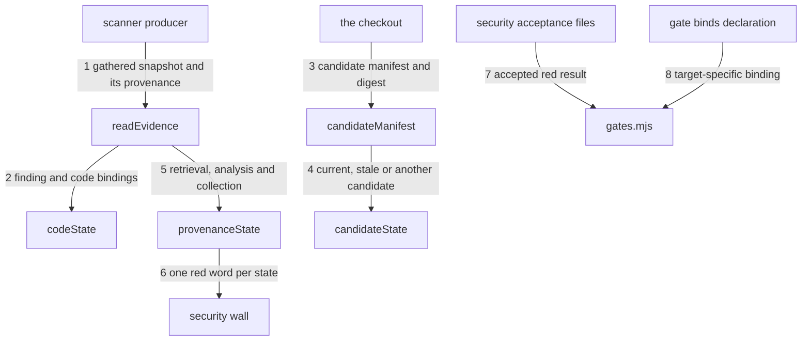

---
traces:
  parent: a-promotion-names-what-it-refuses@ef51aace07dfab1e74cbf09580f229777941d2819595b88bedbd37245913e098
  requirement: an-open-finding-blocks-every-target@69a3792bf08c327370a28813d4a7f6832cc991e1d5b0106e736e0de26c1de540
  principles: the-two-goods@8bbe15706c3edcd63d0d050af9782c063cd585e1ec436d2314fa0003dfaa8cb6, the-seat-owns-the-lens@e1ab0650fc88dc8e1e16347fc8b14b236f1c57b94e50bfdf3f62aa4ec0d6d070
---

# Drawing: an-open-finding-blocks-every-target

One wall reads a gathered scanner snapshot from the tree. Its result is the
same fact at every target, and its declaration makes that red bind `release`
as well as `main`. This revision answers the amended requirement: the snapshot
must now prove a completed analysis, of the exact candidate the board judges,
with every applicable finding collected, before it may be read as clean.

## What the runs said

- `node bin/kaal.mjs drawings` answered
  `an-open-finding-blocks-every-target: strategy: criteria not in the strategy
table: 6, 7, 8, 9, 10, 11, 12, 13, 14`, and `node bin/kaal.mjs traces` answered
  `an-open-finding-blocks-every-target: requirement: ... moved: its Acceptance
criteria no longer matches the pin; review-needed`. This drawing was written
  against five criteria and the requirement now carries fourteen.
- `node --test architecture/applies-here/contracts.test.mjs` failed with
  `drawings refused the league`, and so did `architect-v2` and
  `nothing-passes-vacuously`. Five cases in `tests/bugs/` name the same red and
  all five name `architecture/*` as the lane that can fix it. One incomplete
  strategy table is the whole of it.
- `node --test requirements/an-open-finding-blocks-every-target/acceptance.test.mjs`
  failed nine of fourteen against the shipped module. Eight of the nine ask for
  `architecture/an-open-finding-blocks-every-target/fixtures/current-evidence/`,
  which did not exist: the analyst named seventeen semantic trees and left
  their contents to this drawing.
- Against a throwaway that keeps the seams below, the same command answered
  fourteen passing and none failing, and the eight contract tests answered
  eight passing. The stand-in was then discarded and `bin/lib/security.mjs` is
  unchanged in this diff.
- `node bin/kaal.mjs contracts architecture/an-open-finding-blocks-every-target/contracts.test.mjs`
  answered `ok not delivered ... green, and no run has recorded it yet`, so the
  red this handoff leaves on its own suite is the licence an open task already
  has and not a wall this diff turns.
- `npm test` against `origin/release` answered
  `red: 15 wall(s), 4 failing, 0 waived`, and the same command on the release
  head it branches from answers `traces` green and `bin/lib/security.test.mjs`
  five passing. Four of those walls are this diff's and the Handoff names the
  seat that owns each; `drawings`, which was red on that head, is green here.

## Structure

Six pieces make the path from a scanner report to a blocked target. The first
four are what this revision moves; the last two stand as drawn.

- **`kaal/security/findings.json`** is the gathered snapshot, now at schema 2.
  Its presence is no longer evidence on its own: it carries the provenance of
  the analysis, the identity of the candidate that was analysed, and the state
  of the collection that produced its findings. Its absence is not a clean
  scan, and neither is a schema 1 file, which can say none of those things.
- **the candidate manifest** is the complete content of the checkout the board
  is judging, read by the wall rather than declared to it: every regular file
  under the root except the league's own history, the evidence itself and the
  acceptances. The snapshot repeats that manifest as the candidate it
  analysed, and the wall recomputes it. A digest over the manifest text is the
  candidate's identity, so adding, deleting, renaming or modifying any file is
  a different candidate and cannot be the one the evidence is about.
- **`bin/lib/security.mjs`** is both the reader and the wall executable. It
  reads only the checkout, recomputes the manifest and the code hashes, prints
  one red line per state, and exits 1 for every state that is not a completed,
  complete, current and empty result. It does not read waivers when answering
  as a wall.
- **the producer**, outside KAAL, runs the scan, retrieves every applicable
  result for that exact candidate, and replaces the whole file before the board
  is asked. It declares what it could not do: an analysis that has not
  finished, a retrieval that was refused, a collection it knows is partial.
- **`waivers/security/*.md`** holds security risk acceptances. These are
  `kind: security` objects naming one finding, one person, one reason, and the
  same code bindings the person accepted. They carry no `wall` or `until`.
- **the gate declaration** opts into two policies with `waiver: "security"`
  and `binds: ["release"]`. The first selects the security waiver reader. The
  second adds `release` to the targets where this wall's red is binding;
  `main` remains binding by the ordinary target rule.

The snapshot has this JSON shape:

```json
{
  "schema": 2,
  "scanner": "scanner-name",
  "retrieval": { "state": "ok" },
  "analysis": {
    "state": "completed",
    "id": "the scanner's own analysis identity",
    "tools": ["tool-name"],
    "categories": ["/language:javascript"]
  },
  "collection": { "state": "complete", "locations": "all", "expected": 1 },
  "candidate": {
    "kind": "checkout",
    "digest": "sha256-of-the-manifest-text",
    "files": { "path/to/code.mjs": "sha256-of-the-whole-file" }
  },
  "findings": [
    {
      "id": "native-stable-id",
      "summary": "what the scanner reported",
      "bindings": { "path/to/code.mjs": "sha256-of-the-whole-file" }
    }
  ]
}
```

`retrieval.state` is one of `ok`, `unavailable`, `unauthorized`.
`analysis.state` is one of `none`, `in-progress`, `errored`, `completed`.
`collection.state` is one of `gathering`, `truncated`,
`primary-locations-only`, `complete`. `candidate.kind` is `checkout` when the
producer analysed the very tree the board judges, and otherwise names the
identity it did analyse: `head`, `merge-ref`, `merge-result` or `pre-merge`.
Only `ok`, `completed`, `complete`, a matching digest and an empty `findings`
array are green; every other combination is red in its own words.

The manifest text is one line per file, `<path> <sha256>`, sorted by path,
with `/` as the separator, and `candidate.digest` is the SHA-256 of that text.
`collection.expected` is how many applicable findings the analysis reported,
and it must equal the number the snapshot carries.

The wall's finding identity is `<scanner>/<id>`. Both parts are required, and
the pair is unique in one snapshot. Every finding has at least one binding.
A binding path is relative to the root, stays inside it, and names a regular
file. Its value is the lowercase SHA-256 of that file's complete bytes.

A security waiver has this frontmatter shape:

```yaml
---
kind: security
finding: scanner-name/native-stable-id
who: a person
why: the risk being accepted
bindings:
  path/to/code.mjs: sha256-of-the-whole-file
---
```

The bindings must equal the finding's bindings and the current files must
still have those hashes. A missing, extra or changed binding leaves the
finding open. One applicable waiver is allowed per finding; duplicates are a
finding rather than an arbitrary winner. An acceptance is read only over
evidence that is already completed, complete and current: there is no finding
to accept while the evidence cannot say what was analysed.

## Seams



1. `readEvidence(root)`: in a tree; out `{ state: "absent", findings: [] }`
   when the snapshot is missing, `{ state: "legacy", findings: [], problems }`
   when it carries any schema but 2, `{ state: "invalid", findings, problems }`
   when it is malformed, and otherwise
   `{ state: "gathered", scanner, retrieval, analysis, collection, candidate,
findings }` with the declared blocks carried through unchanged. Owned by
   `security.mjs` / the producer's complete-file write.
2. `contentSha(root, path)` and `codeState(root, bindings)`: in root-relative
   paths and their pinned hashes; out the current hash and `{ current,
changed }`. A path that escapes the root, is absent or is not a regular file
   is changed. Owned by `security.mjs` / the checkout.
3. `candidateManifest(root)`: in a tree; out `{ files, digest }`, where
   `files` maps every candidate path to the SHA-256 of its complete bytes and
   `digest` is the SHA-256 of the manifest text. The walk skips `.git/`,
   `kaal/security/` and `waivers/` and nothing else. Owned by `security.mjs` /
   the checkout.
4. `candidateState(root, evidence)`: in a tree and a gathered snapshot; out
   `{ state, judged, declared, added, changed, missing }`, where `state` is
   `current` when the digests agree, `stale` when they disagree and the
   evidence declared `kind: "checkout"`, and `wrong-candidate` when they
   disagree and it declared any other kind. The three path lists say which
   files differ, whichever answer was given. Owned by `security.mjs` / the
   producer's declaration.
5. `provenanceState(evidence)`: in a gathered snapshot; out `{ state, why }`
   with `state` one of `complete`, `retrieval-unavailable`,
   `retrieval-unauthorized`, `no-analysis`, `incomplete-analysis`,
   `errored-analysis`, `gathering` and `incomplete-collection`, read in that
   order of precedence, and `why` a sentence for every state but `complete`.
   A declared `expected` that differs from the findings carried is
   `incomplete-collection` whatever the collection state says. Owned by
   `security.mjs` / the producer's declaration.
6. `security(root)`: in the evidence, the provenance, the candidate and the
   current code; out `{ ok, findings }`. Only a gathered, completed, complete,
   current and empty snapshot is `ok`, and each other state answers in its own
   words, absent before legacy before invalid before provenance before
   candidate before the findings themselves. The module's executable surface
   prints those lines and exits by `ok`, without reading a token, a network, a
   clock or a waiver. Owned by `security.mjs` / the gate command.
7. `securityWaiver(root)` through a gate carrying `waiver: "security"`: in
   the open findings and all `waivers/security/*.md`; out an applicable
   wall-level waiver only when the evidence is gathered, complete and current
   and each open finding has exactly one matching, current acceptance. The
   board's line names the acceptance that did not apply when one did not.
   `runGates` then reports `waived security`, never `ok security`. Owned by
   `security.mjs` / `gates.mjs`.
8. `binding(into, gate)`: in a target and a gate declaration; out true for
   the ordinary binding rule, plus true when `gate.binds` explicitly names
   the target. An absent `binds` keeps every existing wall's behavior. Owned
   by `targets.mjs` / the board's exit code.

## Fixed and free

- Fixed: the evidence path, the schema number 2, and the four declared blocks
  `retrieval`, `analysis`, `collection` and `candidate`, by criteria 8 and 13.
- Fixed: the words each declared state may take, listed under Structure, by
  criterion 8. A word outside those lists is invalid evidence and never a
  green one.
- Fixed: the manifest is every regular file under the root except `.git/`,
  `kaal/security/` and `waivers/`; the manifest text is `<path> <sha256>` per
  line sorted by path; the digest is the SHA-256 of that text, by criteria 6
  and 7.
- Fixed: `candidate.kind` decides between `stale` and `wrong-candidate` on the
  same digest disagreement, by criterion 12.
- Fixed: composite finding identity and whole file SHA-256 bindings, by
  criteria 2, 3 and 5.
- Fixed: absent, legacy, invalid, each provenance state, each candidate state
  and an open finding are distinct answers, by criteria 8 and 13.
- Fixed: the wall itself ignores waivers and remains red for a waived finding;
  the board alone reports that red as waived, by criterion 4.
- Fixed: security waiver location and fields, exact binding equality, no
  clock field, one waiver per finding, and no acceptance at all over evidence
  that is not complete and current, by criteria 4 and 5.
- Fixed: `waiver: "security"` selects the security acceptance policy and
  `binds: ["release"]` makes this class of wall stop release, by criteria 1
  and 4.
- Fixed: the seventeen semantic trees under `fixtures/current-evidence/` and
  the five beside them are this drawing's, and the developer reads them rather
  than editing them.
- Free: scanner names, native IDs, analysis identities, tool and category
  strings, summary wording, waiver filenames, line order, the exact sentences
  a red state prints, and the words after the required `waived security` board
  prefix.

## Decisions

### The candidate is the checkout's content, not a commit

- Chosen: the candidate is identified by a manifest of every file in the
  checkout and a SHA-256 digest over that manifest's text.
- Not taken: a commit SHA; a git tree digest; a provider's ref name; the set
  of paths the findings happen to name.
- Because: a commit binds history the wall would have to read, and this league
  has already ruled that a wall answers from a plain checkout, which is what
  the fixture trees are. A ref name is a label a producer can write about a
  tree it never read. Finding-named paths were exactly the hole the amended
  requirement found: an empty result named no paths at all, so nothing bound
  it to anything and it stayed green while the repository moved underneath it.
  Content is the only identity that is true of the tree in front of the wall.
- Bought: the wall proves the evidence is about this exact tree with no
  history and no network, and it spent cheapness: every board run rehashes
  every candidate file.
- Weighed against: the-two-goods.
- Reopens if: the rehash becomes measurable on a real repository, which would
  make a cached manifest keyed by the same digest worth its own task.

### The manifest never carries the evidence, the acceptances or the history

- Chosen: the walk skips `.git/`, `kaal/security/` and `waivers/`, and that
  list is fixed by this drawing rather than declared by the evidence.
- Not taken: hashing everything; letting the snapshot declare its own
  exclusions; excluding by a `.gitignore` reading.
- Because: hashing the evidence into the candidate it describes cannot
  terminate, and hashing an acceptance would mean that accepting a risk makes
  the evidence stale, so no finding could ever be waived. History is not
  candidate content and changes while nobody edits the tree. Letting the
  snapshot declare exclusions hands a producer the power to hide the file its
  own finding is in, which is the whole guarantee. A `.gitignore` reading is a
  second implementation of somebody else's grammar inside a wall that must be
  simple enough to trust.
- Bought: writing evidence and writing an acceptance are both safe acts, and
  it spent tolerance for untracked content: build output or an installed
  dependency tree present when the board runs reads as candidate content the
  analysis never saw, and the wall goes red. That is the conservative
  direction, and it is why criterion 14 keeps this gate inactive in this
  repository until a governance act decides where the board runs.
- Weighed against: the-two-goods, the-seat-owns-the-lens.
- Reopens if: activation finds no place to run the board where the tree is
  only its own content; the answer would then be a declared ignore policy in
  the gate rather than in the evidence.

### Provenance is three declared states and never an inference

- Chosen: the snapshot declares `retrieval`, `analysis` and `collection`
  separately, each from a closed list of words, and the wall reads them in
  that order.
- Not taken: one `status` field; inferring completion from a non-empty
  findings array; treating an unreadable or refused retrieval as no findings.
- Because: the requirement names nine distinct red facts, and a single field
  would force the producer to pick one word for two different failures. They
  are also genuinely different acts by different parties: a retrieval is the
  gatherer's, an analysis is the scanner's, and a collection is how much of
  the scanner's answer the gatherer managed to read. Inferring any of them
  from the findings array is how an empty array came to mean clean.
- Bought: a reader of a red board can tell whose problem it is, and it spent
  three fields a producer must set honestly rather than one.
- Weighed against: the-seat-owns-the-lens.
- Reopens if: a scanner surface appears whose failures do not separate this
  way.

### Completeness is a declared count and a collected locations word

- Chosen: `collection.expected` is how many applicable findings the analysis
  reported and must equal the number carried, and `collection.locations` says
  whether every location was collected or only the primary one.
- Not taken: trusting the array's length; a boolean `complete`; a page cursor
  the wall would have to follow.
- Because: a truncated page and a complete result look identical from the
  array alone, which is the shape of a partial retrieval passing as a clean
  one. A count the producer states and the wall checks makes the two
  disagree loudly. Following a cursor would put the network back inside the
  wall. Locations are separate from the count because a result page can be
  complete in findings and still carry one location of each.
- Bought: a partial collection is red in its own words rather than quietly
  smaller, and it spent a number the producer must get right: a producer that
  states the wrong count makes its own evidence red rather than green.
- Weighed against: the-two-goods.
- Reopens if: a scanner reports applicability per location rather than per
  finding, which would make the count the wrong unit.

### Gathering is a state of the evidence, so no board can race a producer

- Chosen: `collection.state: "gathering"` is a red state, and the producer
  writes it before it starts and replaces the whole file when it finishes.
- Not taken: a lock file; a timestamp the board compares; the board waiting;
  the board reusing the previous clean result while gathering runs.
- Because: the requirement puts scan, gathering and judgment in that order for
  one candidate, and the only ordering a clockless offline wall can read is one
  written into the file it already reads. A timestamp is a clock, and this
  league has ruled a wall may not fail on a schedule. Reusing older evidence is
  precisely the race: the previous answer was true about a candidate that no
  longer exists, and its digest already says so.
- Bought: the ordering is checkable from one file with no coordination, and it
  spent a second producer write per candidate.
- Weighed against: the-two-goods.
- Reopens if: a producer cannot write twice, which would make the absent
  snapshot the only in-progress marker and lose the distinction.

### The declared kind separates a wrong candidate from a stale one

- Chosen: on a digest disagreement, `kind: "checkout"` is `stale` and any
  other kind is `wrong-candidate`, and the red line names the kind and both
  digests.
- Not taken: one word for both; deciding by which files differ; the wall
  guessing the provider's ref topology.
- Because: they are different failures with different owners. Stale means the
  producer analysed this tree and the tree then moved, which the next
  gathering fixes. Wrong candidate means the producer analysed a pull
  request's head, a provider's merge ref or a prospective merge result and the
  board is judging something else, which no re-gathering of the same thing
  fixes. Deciding by the file differences cannot tell them apart, because both
  look like a changed file. The kind is the one thing only the producer knows,
  so the producer is who says it.
- Bought: a red board says whether to re-scan or to re-point the workflow, and
  it spent one more field the producer must not lie in. A producer that writes
  `checkout` about a merge ref gets `stale` instead of `wrong candidate`, and
  is red either way.
- Weighed against: the-seat-owns-the-lens.
- Reopens if: a provider appears whose candidate identities are not
  distinguishable by name at gathering time.

### The producer translates SARIF and writes one complete file before the board

- Chosen: the gatherer reads the scanner's SARIF, whose `runs`, `invocations`
  and `automationDetails` carry the tool, the category and whether execution
  succeeded, and writes the whole snapshot into the working tree in the same
  job, before the board step. The file may be committed or left uncommitted;
  the wall reads the tree either way.
- Not taken: the wall calling a scanner or an API; a provider-specific
  response shape in the schema; a committed evidence branch; a separate
  workflow whose result the board waits for.
- Because: SARIF is the one surface several scanners already speak, and it
  carries the three facts the provenance block needs, so the schema stays
  scanner neutral and the translation stays outside the wall. One job in one
  checkout is what makes the ordering true without a lock: the scan, the
  gathering and the judgment all see the same bytes. A separate workflow
  reintroduces the race the state above exists to refuse. Committing is
  permitted rather than required exactly because the manifest excludes the
  evidence, so a commit of it cannot change the candidate it describes.
- Bought: any scanner that emits SARIF can be the producer and the tree never
  learns a provider's name, and it spent a gathering step somebody must write
  and keep in front of the board in every workflow that runs this wall.
- Weighed against: the-seat-owns-the-lens.
- Reopens if: the applicable set must be defined by something SARIF does not
  carry, which would make the tool and category strings insufficient.

### A finding names every whole file it concerns

- Chosen: each finding carries a map from root-relative code paths to SHA-256
  hashes of their complete bytes, separately from the candidate manifest.
- Not taken: line numbers; a git commit; dropping finding-local bindings now
  that the whole candidate is bound.
- Because: line numbers do not identify text, and a commit binds unrelated
  files while requiring history. The candidate manifest answers whether the
  evidence is about this tree; the finding's own bindings answer which code a
  person accepted when they accepted a risk, and that is a smaller and longer
  lived claim. Collapsing them would make every acceptance expire on any edit
  anywhere, which is an acceptance nobody could use.
- Bought: deterministic bindings over a plain checkout and an acceptance that
  survives edits elsewhere, and it spent region precision: an unrelated edit in
  the same file still requires a new acceptance.
- Weighed against: the-two-goods.
- Reopens if: that conservative invalidation creates repeated acceptances in
  files large enough to measure.

### A security acceptance is not a waiver-v1 wall waiver

- Chosen: a distinct `kind: security` object under `waivers/security/*.md`,
  selected by the gate's waiver policy.
- Not taken: superseding `waiver-v1` criterion 3; adding an `until` date to a
  security acceptance; silently changing every wall waiver.
- Because: `waiver-v1` accepts one wall's red until a date and identifies it
  with `wall`. This object accepts one scanner finding only while exact code
  is unchanged and identifies it with `finding`. They answer different
  questions even though governance records both under `waivers/**`. The
  ordinary dated object remains exactly as drawn for gates with no declared
  waiver policy. A gate carrying `waiver: "security"` replaces that default
  reader, so a dated `waivers/security.md` does not accept a security risk and
  satisfying this task consults no clock.
- Bought: no closed criterion moves and existing wall waivers keep their
  behavior, and it spent having two waiver schemas under one governed tree.
- Weighed against: the-two-goods.
- Reopens if: governance forbids generic dated waivers for the security wall;
  that would supersede `waiver-v1` rather than alter this object.

### The waiver repeats the code it accepts, and never reaches evidence that cannot say what was analysed

- Chosen: `finding` identifies the scanner record, `bindings` must exactly
  repeat that record and still match the checkout, and the acceptance reader
  refuses to run at all while the evidence is absent, legacy, invalid,
  incomplete or about another candidate.
- Not taken: identity by filename; a waiver that names only the finding ID; a
  waiver that carries only new hashes; an acceptance read over any evidence at
  all.
- Because: a filename is not scanner evidence, an ID alone makes the accepted
  code implicit, and accepting new hashes that the scanner did not report can
  detach the decision from the finding. Repetition makes the human act
  readable and exact equality makes disagreement red rather than guessed. The
  refusal to read acceptances over incomplete evidence is the same rule one
  level up: there is no finding to accept while nobody can say what was
  analysed, and a board that reported `waived` there would be waiving a
  question rather than an answer.
- Bought: the acceptance page says what code was accepted on its face and can
  never cover a gap in the evidence, and it spent duplicated hashes that a
  person must update when acting again.
- Weighed against: the-seat-owns-the-lens.
- Reopens if: waiver creation becomes mechanical while the approval remains a
  separate human act.

### Binding release is declared per gate

- Chosen: an optional `binds` list on a gate adds targets to the ordinary
  `binding(into)` answer. The security fixtures name `release`; `main` is
  already strict.
- Not taken: special casing the gate name `security`; making every wall bind
  release; changing what `release` means.
- Because: criterion 1 asks for one exception and the amended parent makes it
  a class rather than a name. A declaration is visible in each semantic tree
  and preserves all existing gates when absent.
- Bought: any wall whose own contract requires release binding can declare
  it, and it spent one optional policy field in the gate shape.
- Weighed against: the-two-goods.
- Reopens if: more than one target policy appears and a list stops expressing
  their difference.

## Test strategy

| criterion | layer      | kind          | why                                                                              |
| --------- | ---------- | ------------- | -------------------------------------------------------------------------------- |
| 1         | contract   | deterministic | seams 6 and 8: one red fact, and a declaration that binds release beside main    |
| 2         | contract   | deterministic | seams 1 and 6: absent, legacy and gathered are different states read from files  |
| 3         | contract   | deterministic | seam 6: the wall answers twice alike, with no token, clock or network            |
| 4         | contract   | deterministic | seam 7: the governance object waives the board and never the wall                |
| 5         | contract   | deterministic | seams 2 and 7: a finding's own bindings decide whether an acceptance applies     |
| 6         | contract   | deterministic | seams 3 and 4: a modified, deleted or renamed file leaves the pinned manifest    |
| 7         | contract   | deterministic | seams 3 and 4: an unlisted file is candidate content the analysis never saw      |
| 8         | contract   | deterministic | seams 1, 4 and 5: ten states, nine of them red, each in its own words            |
| 9         | contract   | deterministic | seam 5: a declared count and a locations word are what completeness is read from |
| 10        | contract   | deterministic | seam 5: gathering is a state of the evidence, so the board cannot race it        |
| 11        | contract   | deterministic | seams 6 and 8: a release candidate's own finding, carried onto the board's lines |
| 12        | contract   | deterministic | seam 4: the declared kind separates a wrong candidate from a late one            |
| 13        | contract   | deterministic | seam 1: the legacy shape carries no provenance, so its schema number refuses it  |
| 14        | acceptance | deterministic | no seam: activation is a governance act over this tree and the analyst reads it  |
| none      | unit       | none          | walking, hashing and parsing details belong beside the developer's module        |
| none      | manual     | none          | no seam reaches a person or a live scanner                                       |

## Handoff

- Task: an-open-finding-blocks-every-target
- Seams: 8; contract tests: 8 (equal)
- Red run: `node --test
architecture/an-open-finding-blocks-every-target/contracts.test.mjs`; seven of
  eight fail, five of them on an explicit assertion naming the missing
  function (`candidateManifest`, `candidateState`, `provenanceState`) or the
  reader that has not been amended, and no test errors before its assertion
- Green before the build: test 8 alone, and it is a guard rather than a
  defect. `binding(into, gate)` was built under the previous revision of this
  drawing and criterion 1 still needs it to behave exactly as it does; the
  test is there so a change to the target rule cannot pass unnoticed
- Stand-in green: a throwaway `bin/lib/security.mjs` keeping the eight seams
  answered eight contract tests passing and all fourteen acceptance criteria
  passing; it was discarded and `bin/` carries no change in this diff
- Criteria served: seam 1 -> 2, 8 and 13; seam 2 -> 5; seam 3 -> 6 and 7;
  seam 4 -> 6, 7, 8 and 12; seam 5 -> 8, 9 and 10; seam 6 -> 1, 2, 3, 8, 9,
  11 and 13; seam 7 -> 4 and 5; seam 8 -> 1 and 11
- Fixed for the developer: the evidence path and schema 2; the four declared
  blocks and the closed word list of each; the manifest's skip list, text
  shape and digest; composite finding identity and whole-file bindings; the
  precedence order the wall answers in; the security waiver schema and its
  refusal over incomplete evidence; policy-selected waiver reader; gate-level
  target binding
- Build order: seam 1, then seams 3 and 4, then seam 5, then seam 6, then
  seam 7. Seams 2 and 8 stand as built. The fixture wall command is the module
  itself; no `kaal` subcommand is added
- Fixtures: twenty-two semantic trees are this drawing's. Five keep their
  names beside the drawing and are carried to schema 2; seventeen are new
  under `fixtures/current-evidence/`, one per state the amended criteria name.
  Every digest in them was computed after the formatter ran, so regenerating
  one means rehashing it
- Blocked on governance: the repository's `kaal.config.json` must declare the
  security gate with `command: "node bin/lib/security.mjs"`, `waiver:
"security"`, and `binds: ["release"]`. This drawing does not write that file,
  and criterion 14 keeps that act behind a current drawing, fourteen passing
  criteria and a recorded zero-failure run
- Gathering handoff: the producer runs the scan, translates SARIF, and writes
  the complete snapshot in the same job and checkout, before the board step.
  No token, network or scanner client enters the wall
- Clears when built: five standing bugs in `tests/bugs/` name
  `architecture/*` and all five are the drawings wall refusing the league over
  this task's strategy table. This diff answers that; the records are the
  tester's to clear once the cases run green
- What this diff leaves red, with its owner. `drawings` goes green. `units`
  goes red on three units in `bin/lib/security.test.mjs`, which read the
  fixtures this drawing carried to schema 2: the developer's, and they turn
  with the build. `traces` goes red on five findings saying each bug page is
  about a case that now passes: the tester's, and one deletion each. Through
  that one red, `acceptance` and `regression` go red on
  `a-trace-pins-what-it-read`, `a-tree-has-one-root` and
  `the-test-tree-is-written-down`, all three of which read the league's own
  trace wall; they follow the tester's five deletions and need nothing else.
  No wall here is red for a reason no seat owns, and nothing in
  `tests/bugs/**` or `bin/**` may travel in this lane
- Supersedes: nothing. `waiver-v1` remains the dated, wall-wide object; this
  task defines a finding-specific, content-bound security object under the
  same governance-owned tree
- People: none
