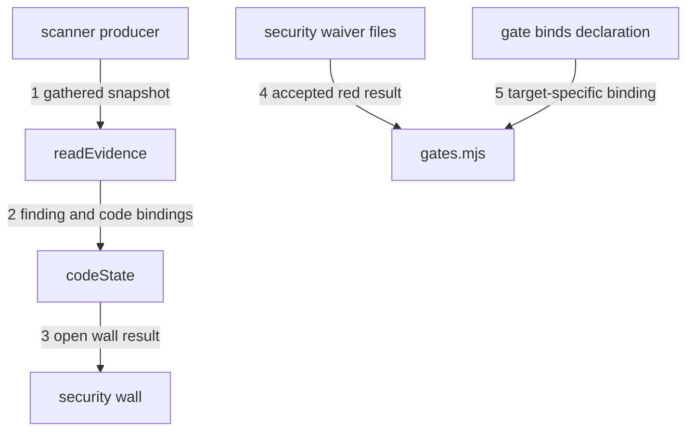

---
traces:
  parent: a-promotion-names-what-it-refuses@ef51aace07dfab1e74cbf09580f229777941d2819595b88bedbd37245913e098
  requirement: an-open-finding-blocks-every-target@1926074aa7a4182588888db8a81282933811689be0f8db02498e3526cbe37037
  principles: the-two-goods@8bbe15706c3edcd63d0d050af9782c063cd585e1ec436d2314fa0003dfaa8cb6, the-seat-owns-the-lens@e1ab0650fc88dc8e1e16347fc8b14b236f1c57b94e50bfdf3f62aa4ec0d6d070
---

# Drawing: an-open-finding-blocks-every-target

One wall reads a gathered scanner snapshot from the tree. Its result is the
same fact at every target, but its declaration makes that red bind `release`
as well as `main`. A security waiver is a second tree object, not the dated
wall waiver drawn by `waiver-v1`.

## Structure

Four pieces make the path from a scanner report to a blocked target.

- **`kaal/security/findings.json`** is the gathered snapshot. Its presence is
  evidence that the scanner producer completed its act, including when its
  `findings` array is empty. Its absence is not a clean scan.
- **`bin/lib/security.mjs`** is both the reader and the wall executable. It
  reads only the checkout, recomputes code hashes, prints every open finding,
  and exits 1 when the snapshot is absent, malformed or non-empty. It does not
  read waivers when answering as a wall.
- **`waivers/security/*.md`** holds security risk acceptances. These are
  `kind: security` objects naming one finding, one person, one reason, and the
  same code bindings the person accepted. They carry no `wall` or `until`.
- **the gate declaration** opts into two policies with `waiver: "security"`
  and `binds: ["release"]`. The first selects the security waiver reader. The
  second adds `release` to the targets where this wall's red is binding;
  `main` remains binding by the ordinary target rule.

The scanner producer, not KAAL, writes the snapshot immediately after its scan
completes and before the board is asked. A producer replaces the whole file,
including an empty `findings` array for a clean result. KAAL gains no gathering
command and never reaches the scanner. In this repository that producer's
write is a governance change because `kaal/**` is held by the governance lane.

The snapshot has this JSON shape:

```json
{
  "schema": 1,
  "scanner": "scanner-name",
  "findings": [
    {
      "id": "native-stable-id",
      "summary": "what the scanner reported",
      "bindings": {
        "path/to/code.mjs": "sha256-of-the-whole-file"
      }
    }
  ]
}
```

The wall's finding identity is `<scanner>/<id>`. Both parts are required, and
the pair is unique in one snapshot. Every finding has at least one binding.
A binding path is relative to the root, stays inside it, and names a regular
file. Its value is the lowercase SHA-256 of that file's complete bytes.

A security waiver has this frontmatter shape:

```yaml
---
kind: security
finding: scanner-name/native-stable-id
who: a person
why: the risk being accepted
bindings:
  path/to/code.mjs: sha256-of-the-whole-file
---
```

The bindings must equal the finding's bindings and the current files must
still have those hashes. A missing, extra or changed binding leaves the
finding open. One applicable waiver is allowed per finding; duplicates are a
finding rather than an arbitrary winner.

## Seams



1. `readEvidence(root)`: in a tree; out `{ state: "absent", findings: [] }`
   when the snapshot is missing, or `{ state: "gathered", scanner, findings }`
   for a valid snapshot. Malformed input is `{ state: "invalid", findings,
problems }` and can never be clean. Owned by `security.mjs` / the producer's
   complete-file write.
2. `contentSha(root, path)` and `codeState(root, bindings)`: in root-relative
   paths and their pinned hashes; out the current hash and `{ current,
changed }`. A path that escapes the root, is absent or is not a regular file
   is changed. Owned by `security.mjs` / the checkout.
3. `security(root)`: in the evidence and current code; out `{ ok, findings }`.
   Only a gathered empty snapshot is `ok`. An absent or invalid snapshot and
   every gathered finding are red in their own words. The module's executable
   surface prints those lines and exits by `ok`, without reading a token, a
   network, a clock or a waiver. Owned by `security.mjs` / the gate command.
4. `securityWaiver(root)` through a gate carrying `waiver: "security"`: in
   the open findings and all `waivers/security/*.md`; out an applicable
   wall-level waiver only when each open finding has exactly one matching,
   current acceptance. `runGates` then reports `waived security`, never `ok
security`. Owned by `security.mjs` / `gates.mjs`.
5. `binding(into, gate)`: in a target and a gate declaration; out true for
   the ordinary binding rule, plus true when `gate.binds` explicitly names
   the target. An absent `binds` keeps every existing wall's behavior. Owned
   by `targets.mjs` / the board's exit code.

## Fixed and free

- Fixed: the evidence path, JSON fields, composite finding identity and whole
  file SHA-256 bindings, by criteria 2, 3 and 5.
- Fixed: absent, invalid, clean and open are distinct answers; only gathered
  and empty is clean, by criteria 2 and 3.
- Fixed: the wall itself ignores waivers and remains red for a waived finding;
  the board alone reports that red as waived, by criterion 4.
- Fixed: security waiver location and fields, exact binding equality, no
  clock field, and one waiver per finding, by criteria 4 and 5.
- Fixed: `waiver: "security"` selects the security acceptance policy and
  `binds: ["release"]` makes this class of wall stop release, by criteria 1
  and 4.
- Free: scanner names and native IDs, summary wording, waiver filenames, line
  order, and the words after the required `waived security` board prefix.

## Decisions

### Gathering is a producer act and the empty snapshot is evidence

- Chosen: the scanner producer replaces `kaal/security/findings.json` after
  every completed scan, before the board runs. A clean scan writes an empty
  array.
- Not taken: the wall calling a scanner; a missing file meaning clean; a KAAL
  command that gathers.
- Because: the requirement puts the scanner outside the tree and makes the
  wall deterministic and offline. A complete-file replacement also prevents
  an old finding from surviving merely because a producer only appended.
- Bought: the wall can prove a scan was gathered without knowing the scanner,
  and it spent immediacy: somebody must carry the producer's changed snapshot
  before the board can judge it.
- Weighed against: the-seat-owns-the-lens.
- Reopens if: a scanner can attest a snapshot without placing evidence in the
  checkout.

### A finding names every whole file it concerns

- Chosen: each finding carries a map from root-relative code paths to SHA-256
  hashes of their complete bytes.
- Not taken: line numbers; a git commit; `regionSha` directly.
- Because: line numbers do not identify text, and a commit binds unrelated
  files while requiring history. `regionSha` in `bin/lib/traces.mjs` is the
  nearest clockless answer and supplies the model: pin text and compare it
  offline. Its `KINDS` table deliberately resolves named governed artefacts
  and their document regions, so arbitrary code does not belong in that
  table. `contentSha` keeps its SHA-256 comparison but hashes the entire named
  code file. This is conservative: any edit to that file reopens the finding.
- Bought: deterministic bindings over a plain checkout, and it spent region
  precision. An unrelated edit in the same file requires a new waiver.
- Weighed against: the-two-goods.
- Reopens if: that conservative invalidation creates repeated acceptances in
  files large enough to measure.

### A security acceptance is not a waiver-v1 wall waiver

- Chosen: a distinct `kind: security` object under
  `waivers/security/*.md`, selected by the gate's waiver policy.
- Not taken: superseding `waiver-v1` criterion 3; adding an `until` date to a
  security acceptance; silently changing every wall waiver.
- Because: `waiver-v1` accepts one wall's red until a date and identifies it
  with `wall`. This object accepts one scanner finding only while exact code
  is unchanged and identifies it with `finding`. They answer different
  questions even though governance records both under `waivers/**`. The
  ordinary dated object remains exactly as drawn for gates with no declared
  waiver policy. A gate carrying `waiver: "security"` replaces that default
  reader, so a dated `waivers/security.md` does not accept a security risk and
  satisfying this task consults no clock. No waiver has yet exercised
  `waiver-v1` outside its fixtures, so this separation preserves its proven
  contract without migrating tree data that does not exist.
- Bought: no closed criterion moves and existing wall waivers keep their
  behavior, and it spent having two waiver schemas under one governed tree.
- Weighed against: the-two-goods.
- Reopens if: governance forbids generic dated waivers for the security wall;
  that would supersede `waiver-v1` rather than alter this object.

### The waiver repeats the code it accepts

- Chosen: `finding` identifies the scanner record, while `bindings` must
  exactly repeat that record and still match the checkout.
- Not taken: identity by filename; a waiver that names only the finding ID; a
  waiver that carries only new hashes.
- Because: a filename is not scanner evidence, an ID alone makes the accepted
  code implicit, and accepting new hashes that the scanner did not report can
  detach the decision from the finding. Repetition makes the human act
  readable and exact equality makes disagreement red rather than guessed.
- Bought: the acceptance page says what code was accepted on its face, and it
  spent duplicated hashes that a person must update when acting again.
- Weighed against: the-seat-owns-the-lens.
- Reopens if: waiver creation becomes mechanical while the approval remains a
  separate human act.

### Binding release is declared per gate

- Chosen: an optional `binds` list on a gate adds targets to the ordinary
  `binding(into)` answer. The security fixtures name `release`; `main` is
  already strict.
- Not taken: special casing the gate name `security`; making every wall bind
  release; changing what `release` means.
- Because: criterion 1 asks for one exception and the amended parent makes it
  a class rather than a name. A declaration is visible in each semantic tree
  and preserves all existing gates when absent.
- Bought: any wall whose own contract requires release binding can declare
  it, and it spent one optional policy field in the gate shape.
- Weighed against: the-two-goods.
- Reopens if: more than one target policy appears and a list stops expressing
  their difference.

## Test strategy

| criterion | layer    | kind          | why                                                                  |
| --------- | -------- | ------------- | -------------------------------------------------------------------- |
| 1         | contract | deterministic | seams 3 and 5: one red fact and a gate that binds both targets       |
| 2         | contract | deterministic | seam 1: absent and gathered-empty are different states               |
| 3         | contract | deterministic | seams 1 and 3: a clean file-only answer repeated                     |
| 4         | contract | deterministic | seam 4: the distinct governance object waives the board, not wall    |
| 5         | contract | deterministic | seams 2 and 4: changed whole-file content invalidates the acceptance |
| none      | unit     | none          | parsing details belong beside the developer's module                 |
| none      | manual   | none          | no seam reaches a person or a live scanner                           |

## Handoff

- Task: an-open-finding-blocks-every-target
- Seams: 5; contract tests: 5 (equal)
- Red run: `node --test
architecture/an-open-finding-blocks-every-target/contracts.test.mjs`; all five
  fail on assertions naming their missing or unmet seams, and no test errors
  before its assertion
- Criteria served: seam 1 -> 2 and 3; seam 2 -> 5; seam 3 -> 1 and 3; seam 4
  -> 4 and 5; seam 5 -> 1
- Fixed for the developer: snapshot path and schema; composite identity;
  whole-file SHA-256 binding; wall ignores waivers; security waiver schema
  and exact binding match; policy-selected waiver reader; gate-level target
  binding
- Build order: seams 1 and 2, then seam 3, then seam 4, then seam 5. The
  fixture wall command is the module itself; no `kaal` subcommand is added
- Blocked on governance: the repository's `kaal.config.json` must declare the
  security gate with `command: "node bin/lib/security.mjs"`, `waiver:
"security"`, and `binds: ["release"]`. This drawing does not write that file
- Gathering handoff: the scanner producer writes the complete snapshot after
  a scan and before gates. That integration is outside KAAL and no token or
  scanner client enters the wall
- Supersedes: nothing. `waiver-v1` remains the dated, wall-wide object; this
  task defines a finding-specific, content-bound security object under the
  same governance-owned tree
