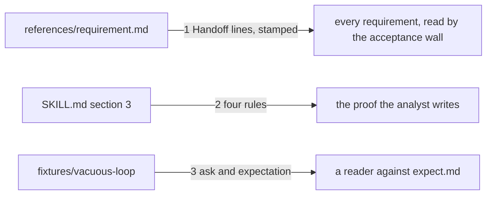

# Drawing: analyse-v2

_Written in architect mode from `requirements/analyse-v2`, six criteria,
four red tests (the fixture and the archive were the analyst's own acts).
The human approves by merge._

## Structure

What exists: `skills/analyse/SKILL.md` (sections 1 to 6 and The bar),
`skills/analyse/references/requirement.md` (the template), the acceptance
wall reading `- Status:` from a requirement's Handoff, `fixtures/`.

What is new, all of it text:

- **Three Handoff lines in the template**: `Status:` (open or closed),
  `Blocked on:` (a person, a setting, or nothing), `Supersedes:` (a task
  and what of it, or nothing), after `Open questions:`, in that order; the
  Hand off section of the skill says the analyst owns both ends of the
  status and names the other two lines.
- **Four rules in section 3**, each a bullet with a bold lead like the
  ones there: **Count first** (a test that iterates asserts there is
  something to iterate), **With a timeout** (the red run's command carries
  one), **Off the league's own tree** (a test that drives the league's
  commands runs on a fixture root or guards on `KAAL_GATES`), **A partial
  red is honest** (the handoff names criteria already met and criteria
  that need a person).
- **`fixtures/vacuous-loop/`**: in place from the requirement.

What changes: `SKILL.md` sections 3 and 5, `references/requirement.md`.
The wall reads the same `- Status:` line as before; the two new lines are
free text the wall ignores.

## Seams

1. **template to requirements**: in, the template; out, a requirement the
   acceptance wall reads. Owned by the skill on one side, the wall on the
   other. The contract: the three lines stand in the template's Handoff in
   the order named, and a requirement stamped from it, filled in, is read
   by `kaal acceptance` as closed and green: the two new lines do not
   confuse the status line.
2. **skill text to the proof**: in, section 3; out, four rules a writer of
   tests acts on. The contract: four bullets with bold leads in section 3
   carrying the four words the requirement names (iterate, timeout,
   fixture root, already met).
3. **fixture to the reader**: in, `ask.md` and `expect.md`; out, one
   verdict per expectation. The contract: the ask names an empty
   directory, and the expectation has at least three checkable lines, the
   first on the count.

## Fixed and free

- Fixed: the three line names and their order (criterion 1); the four
  bold leads' words (criteria 2, 3, 4); the fixture's files (criterion 5).
- Free: the sentences around the leads; whether section 5 restates the
  status rule in one sentence or two.

## Decisions

### Lines in the Handoff, not fields in frontmatter

- Chosen: `- Status:`, `- Blocked on:`, `- Supersedes:` as Handoff lines.
- Not taken: frontmatter on the requirement.
- Because: the wall already reads one Handoff line; a requirement has no
  frontmatter and the template would grow a second syntax for three
  lines.
- Reopens if: a fourth wall wants to read a requirement by field.

### Rules as bullets in section 3, not a new section

- Chosen: four bullets beside the existing five.
- Not taken: a section 7 on red runs.
- Because: the retros' Learned items changed how the proof is written,
  and section 3 is where a writer of proof looks; a new section is a
  place to skip.
- Reopens if: section 3 passes twenty bullets; then a split.

## Test strategy

| criterion | layer      | kind          | why                                  |
| --------- | ---------- | ------------- | ------------------------------------ |
| 1         | contract 1 | deterministic | the lines, and a stamped requirement |
| 2, 3, 4   | contract 2 | deterministic | four bold leads in section 3         |
| 5         | contract 3 | deterministic | the fixture's two files              |
| 6         | acceptance | deterministic | the archive, by the requirement      |

## Handoff

- Task: analyse-v2
- Seams: 3; contract tests: 3 (equal), beside this file; fixture `stamped`
  here
- Red run: seams 1 and 2 failing, seam 3 green (the fixture is in place)
- Criteria served: seam 1 serves 1; seam 2 serves 2, 3, 4; seam 3 serves
  5; criterion 6 is the requirement's own
- Next: the human approves by merge; then `code`
