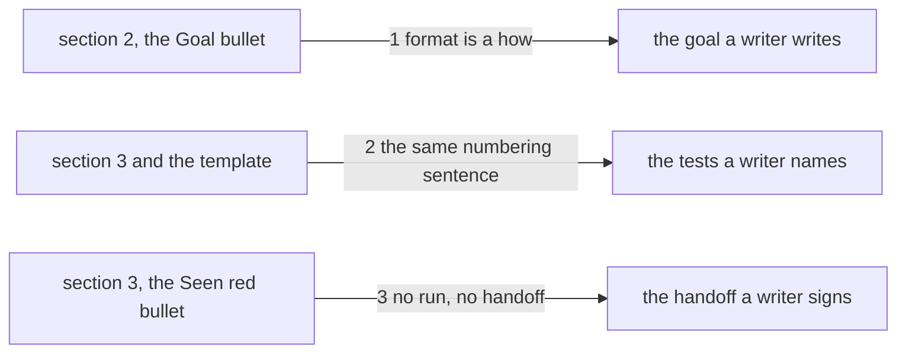

# Drawing: analyse-v3

_Written in architect mode from `requirements/analyse-v3`, four criteria,
three red tests (the archive was the analyst's act). The human approves by
merge._

## Structure

What exists: `skills/analyse/SKILL.md` sections 2 and 3, the bullets
**Goal**, **One criterion, one test** and **Seen red**;
`references/requirement.md` with its acceptance test shape.

What is new, three sentences, each appended to the bullet a writer is
reading when the mistake happens:

- **Goal**: the output's format (a flag, a file type, a serialisation) is
  a how; it belongs in an assumption or an open question and never in the
  goal.
- **One criterion, one test**: a test's name begins with its criterion's
  number, `1.`, `2.`, so the pairing is read, not inferred; the template's
  test shape says the same in the same words.
- **Seen red**: a red run reported as "not yet recorded" is not a red run;
  the handoff carries the run's own result, and a proof that has not been
  run is not handed off.

What changes: `SKILL.md` (three bullets grow one sentence each),
`references/requirement.md` (one sentence).

## Seams

1. **Goal rule to the goal**: in, the bullet; out, a goal with no format
   in it. The contract: the sentence sits inside the Goal bullet, not in a
   new bullet, and names format, assumption or open question, and the goal.
2. **numbering rule to the tests**: in, the bullet and the template; out,
   tests named `N.`. The contract: the sentence appears in both files with
   the same words, so the two cannot drift.
3. **red-run rule to the handoff**: in, the Seen red bullet; out, a handoff
   with a run in it or no handoff. The contract: the words "not yet
   recorded" and "not a red run" stand in that bullet.

## Fixed and free

- Fixed: which bullet each sentence lives in (criteria 1 to 3); the shared
  words between skill and template (criterion 2).
- Free: the wording around the fixed words; the example format named.

## Decisions

### A sentence in the bullet, not a new bullet

- Chosen: each rule grows inside the bullet it refines.
- Not taken: three new bullets; a section 7.
- Because: the model that missed was reading that bullet at the time; the
  correction has to be where the eye already is.
- Reopens if: a bullet passes eight lines; then it splits.

## Test strategy

| criterion | layer      | kind          | why                             |
| --------- | ---------- | ------------- | ------------------------------- |
| 1         | contract 1 | deterministic | the Goal bullet, read           |
| 2         | contract 2 | deterministic | the shared sentence, both files |
| 3         | contract 3 | deterministic | the Seen red bullet, read       |
| 4         | acceptance | deterministic | the archive, by the requirement |

## Handoff

- Task: analyse-v3
- Seams: 3; contract tests: 3 (equal), beside this file
- Red run: all three failing; the build, three sentences, turns them green
- Criteria served: seam 1 serves 1; seam 2 serves 2; seam 3 serves 3;
  criterion 4 is the requirement's own
- Next: the human approves by merge; then `code`
