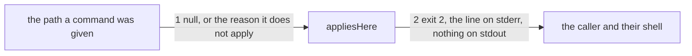

# Drawing: applies-here

_Written in architect mode from `requirements/applies-here`, three
criteria, two red tests and one green before the build. The closed
requirements that touch these paths were read first, and one of them
decided a seam: skills-v1 and fixtures-v1 point `kaal check` at a skills
directory, not at a root, so the table below must ask each command about
the thing it was actually given. push-v1, code-v2, architect-v2 and
agent-v1 point their commands at roots that hold what those commands
read, so applicability holds there and their tests do not move. The human
approves by merge._

## Structure

What exists: `bin/kaal.mjs`, whose branches each hand a root or a
directory to a module in `bin/lib/`; those modules, which read a league
artefact and return findings.

What is new:

- **`bin/lib/applies.mjs`**: one table of the five commands that read a
  league artefact from a path, each with what it looks for and how to say
  what it did not find. `appliesHere(cmd, arg, cwd)` returns null when the
  command applies, or the reason it does not.

What changes: `bin/kaal.mjs`, one guard before the branches, which ends
the run when the answer is a reason. `README.md`, one sentence on what a
command says about a tree that is not a league tree.

## Seams

1. **the path to applicability**: in, a command name and the path it was
   given; out, null when the artefact it reads is there, or the reason it
   is not. The contract: on `requirements/applies-here/fixtures/foreign`
   each of the five gives a reason; on the league each answers; and on
   `fixtures/half`, a tree that adopted the ledger and nothing else,
   `ledger` answers while `drawings` and `agents` do not, so applicability
   is per command and never per tree.
2. **the reason to the caller**: in, a reason; out, exit 2, one line on
   stderr of the shape `<command>: not applicable here: <what it looked
for>`, and nothing at all on stdout. The contract: the code and the
   shape on two commands, whose reasons differ, and an empty stdout.

## Fixed and free

- Fixed: the line's shape and stream, the exit code 2, the empty stdout,
  and the five command names. The decision is made before the command
  reads anything else, so a tree that would make a module throw is
  refused rather than crashed into.
- Free: the wording of each reason; whether the table is a map or a list;
  whether `appliesHere` takes the raw argument or a resolved path; where
  the guard sits in the dispatch, so long as nothing has been read before
  it.

## Decisions

### One table, in one module, not a guard in each branch

- Chosen: `bin/lib/applies.mjs`, five entries, called once.
- Not taken: a guard inside each of the five branches; a `--strict` flag
  the caller passes.
- Because: it is one rule, and five copies of a rule drift inside a
  month. A table is also countable: a test can assert that the list is
  five, so a sixth command added without its entry is red rather than
  quietly unguarded.
- Reopens if: a command's reason depends on reading its artefact (a
  ledger that exists but does not parse); then that entry names a
  function and the table keeps the shape.

### Each command is asked about the thing it was given

- Chosen: `check` is asked about the directory it was handed, and looks
  for `<dir>/<name>/SKILL.md`; the other four are asked about a root.
- Not taken: normalising `check` to take a root and look under
  `skills/`, which reads more consistently.
- Because: skills-v1 and fixtures-v1 point `check` at a skills directory
  (`fixtures/no-adversary/skills`), and both are closed. Consistency
  bought by breaking a closed requirement is not consistency, it is a
  rewrite.
- Reopens if: `check` ever grows a root form of its own; then the table
  carries both and the closed tests keep their path.

## Test strategy

| criterion | layer      | kind          | why                                        |
| --------- | ---------- | ------------- | ------------------------------------------ |
| 1         | contract 1 | deterministic | the five on a tree with no artefact        |
| 1         | contract 2 | deterministic | the code, the line, the empty stdout       |
| 2         | contract 1 | deterministic | check never reads a tree it does not fit   |
| 3         | contract 1 | deterministic | the league answers, and so does half of it |

## Handoff

- Task: applies-here
- Seams: 2; contract tests: 2 (equal), beside this file; fixture root
  `fixtures/half` here, and the requirement's `fixtures/foreign`
- Red run: both failing; the build, one module and one guard, turns them
  green
- Criteria served: seam 1 serves 1, 2 and 3; seam 2 serves 1
- Fixed for the developer: the line, the stream, the code, the empty
  stdout, and that nothing is read before the question is asked
- Next: the human approves by merge; then `code`
