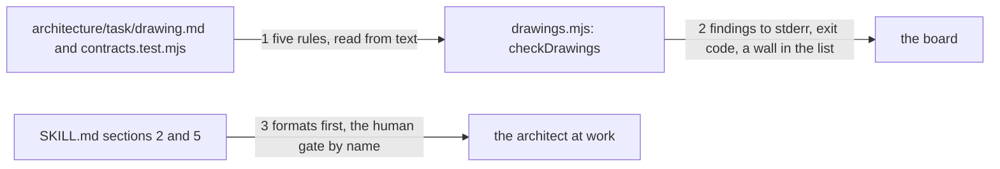

# Drawing: architect-v2

_Written in architect mode from `requirements/architect-v2`, six criteria,
four red tests (the fixture and the archive were the analyst's own acts).
The human approves by merge._

## Structure

What exists: `bin/kaal.mjs` (one entry point, findings to stderr one per
line, a summary to stdout), `bin/lib/rules.mjs` (the skill rules, one
finding per broken rule, `<skill>: <rule>: <message>`), the gates list in
`kaal.config.json`, `skills/architect/SKILL.md`, the drawing template.

What is new:

- **`bin/lib/drawings.mjs`**, `checkDrawings(root)`: reads every
  `architecture/<task>/drawing.md` and returns findings `{ task, rule,
message }` for five rules, read from text and never by running a test:
  `sections` (the six headings, in the template's order), `edges` (the
  mermaid block's labelled edges are as many as the numbered seams),
  `tests` (the `test("N.` calls in `contracts.test.mjs` are as many as the
  seams), `strategy` (every numbered criterion of
  `requirements/<task>/requirement.md` appears in the first column of the
  strategy table), `orphan` (no `requirements/<task>/`). A missing
  contracts file is `tests`; a missing mermaid block is `edges`.
- **`kaal drawings [root]`** in `bin/kaal.mjs`: findings to stderr as
  `<task>: <rule>: <message>`, exit 1 on any; `drawings: every drawing
holds its shape` on stdout otherwise.
- **A wall** in the gates list: `drawings`, `node bin/kaal.mjs drawings`,
  after `rules`.
- **Two sentences in the skill**: in section 2 under Fixed and free, that
  the formats the developer's tests will name are fixed first; in section
  5, that the approval is the `architecture` entry of `human.gates` in
  `kaal.config.json`, recorded by the merge, and that a drawing and its
  build in one pull request are approved by that one merge.

What changes: `bin/kaal.mjs` (dispatch and usage), `kaal.config.json`,
`SKILL.md`, `README.md` (the walls' list gains one).

## Seams

1. **drawing to check**: in, a task's drawing, contracts file and
   requirement; out, zero or more findings naming the task and the rule.
   Owned by the architect's files on one side, `drawings.mjs` on the
   other. The contract: on each fixture root under
   `requirements/architect-v2/fixtures/` exactly one finding, whose rule
   is the fixture's name; on `clean`, none.
2. **check to board**: in, the findings; out, one stderr line each in the
   form `<task>: <rule>: <message>`, exit 1, or the summary line and exit
   0; and the wall in the gates list so the board runs it. The contract:
   the line shape on a broken root, silence on stderr and the summary on
   the league's own tree, the config entry.
3. **skill text to the architect**: in, sections 2 and 5; out, two
   sentences acted on. The contract: `formats` and `first` in section 2's
   Fixed and free bullet; `human.gates` and `one merge` or `one pull
request` in section 5.

## Fixed and free

- Fixed: the five rule names (criterion 1); the finding line shape
  `<task>: <rule>: <message>` (criterion 1); the wall's name `drawings`
  and command (criterion 2); the two sentences' words (criteria 3, 4).
- Free: the messages after the rule; how the mermaid block is parsed
  (edges are lines with `-->` and a quoted label); whether `orphan` is
  checked first and short-circuits the rest.

## Decisions

### Read, never run

- Chosen: every rule reads text; the contracts file is parsed for
  `test("N.` calls, never executed.
- Not taken: running `node --test` to count tests.
- Because: the contracts wall already runs them; a shape check that
  runs code is a second wall doing the first's work, slower and with
  side effects.
- Reopens if: a contracts file names its tests some other way; then the
  parser, not the rule.

### One finding per rule per drawing

- Chosen: a drawing with two broken rules yields two lines.
- Not taken: stopping at the first.
- Because: the skill rules do the same, and a reader fixes a list, not a
  loop of runs.
- Reopens if: never.

## Test strategy

| criterion | layer      | kind          | why                                |
| --------- | ---------- | ------------- | ---------------------------------- |
| 1         | contract 1 | deterministic | one finding per fixture root       |
| 2         | contract 2 | deterministic | the line shape, the wall, the tree |
| 3, 4      | contract 3 | deterministic | two sentences, read                |
| 5         | acceptance | deterministic | the fixture, by the requirement    |
| 6         | acceptance | deterministic | the archive, by the requirement    |

## Handoff

- Task: architect-v2
- Seams: 3; contract tests: 3 (equal), beside this file; fixture roots
  under the requirement
- Red run: all three failing
- Criteria served: seam 1 serves 1; seam 2 serves 2; seam 3 serves 3, 4;
  criteria 5 and 6 are the requirement's own
- Next: the human approves by merge; then `code`
