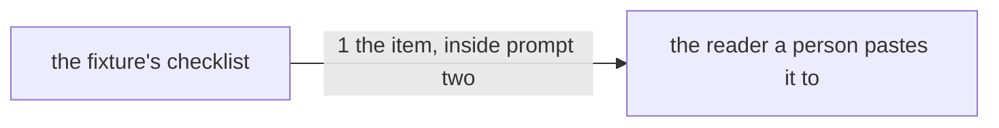

# Drawing: asks-when-not-told

_Written in architect mode from `requirements/asks-when-not-told`, one
criterion and one red test. The closed requirements that touch this path
were read first. eval-runner fixes that the reading prompt is generated
from `expect.md`, and it takes only the lines that begin with `- ` or two
spaces, which is why the seam below is about reaching the reader and not
about the file. fixtures-v1 fixes what a fixture must carry and touches
nothing here; nothing-stale fixes that a record says its shas, so the two
`json-flag` records go stale by `expect_sha` as well as by `skill_sha`,
which is honest and needs no action. This drawing and its build land in
one pull request with the requirement, and that one merge approves them,
as architect-v2 criterion 4 allows; the change is one checklist line._

## Structure

What exists: `skills/analyse/fixtures/json-flag/expect.md`, the receiving
seat's checklist; `bin/lib/runner.mjs`, which renders it into prompt two;
`skills/analyse/fixtures/json-flag/RUNNER.md`, the generated page a person
copies from.

What changes: `expect.md`, one item; `RUNNER.md`, regenerated.

Nothing is new, and nothing in `bin/` moves.

## Seams

1. **the item, inside prompt two**: in, `expect.md`; out, an item that
   arrives in the reading prompt `kaal runner analyse json-flag` renders,
   and a `RUNNER.md` the runners wall finds current. The contract reads the
   rendered page, not the file, because the renderer keeps only the lines
   that begin with `- ` or two spaces: an item written as a paragraph would
   sit in the file and never reach the reader, and the record would come
   back marked on a checklist that did not carry it. Owned by the fixture
   on one side, the reader model on the other.

## Fixed and free

- Fixed: that the item is a `- ` bullet, whatever its wrapping, so the
  renderer keeps it; that the words the acceptance test reads are in that
  one item and not spread across two; that `RUNNER.md` is regenerated in
  the same change. `ask.md` does not move, and no other fixture does.
- Free: the item's wording beyond those words, and where it sits in the
  list.

## Decisions

### The contract reads the rendered page, not the checklist file

- Chosen: drive `kaal runner analyse json-flag` and read prompt two.
- Not taken: read `expect.md`, which is what the acceptance test already
  does.
- Because: two tests that read the same file are one test written twice.
  The failure worth catching is the silent one, an item that exists and
  does not reach the reader, and only the renderer can show that.
- Reopens if: the runner ever stops filtering the checklist by line shape;
  then the seam is the file and the contract collapses into the criterion.

### One pull request for all three seats

- Chosen: requirement, drawing and build together, the merge approving the
  drawing.
- Not taken: three pull requests, which is the league's usual shape.
- Because: the change is one line in one checklist. Three merges to place
  it would cost more reading than the line is worth, and architect-v2
  already allows a drawing and its build under one merge. The pull request
  says so, which is the condition that rule carries.
- Reopens if: a task this small ever turns out to need the analyst's
  criteria reviewed before the build, which is what the separate merge
  buys.

## Test strategy

| criterion | layer      | kind          | why                                                  |
| --------- | ---------- | ------------- | ---------------------------------------------------- |
| 1         | acceptance | deterministic | the item is in the checklist, shaped like a peer     |
| 1         | contract 1 | deterministic | the item reaches the reader, and the page is current |
| 1         | eval       | harnessed     | whether a model actually asks; reports, never gates  |

## Handoff

- Task: asks-when-not-told
- Seams: 1; contract tests: 1 (equal), beside this file
- Red run:
  `node --test --test-timeout=60000 architecture/asks-when-not-told/contracts.test.mjs`;
  red. Stand-in green: on a checklist line added and then discarded
- Criteria served: seam 1 serves 1
- Fixed for the developer: the bullet shape, the words in one item, the
  regenerated `RUNNER.md`, and that nothing else in the fixture moves
- Next: the human approves the drawing by merging this pull request, which
  also carries the build
