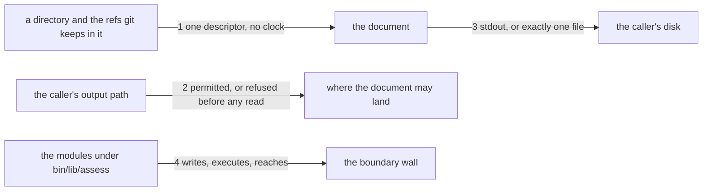

# Drawing: assess-boundary

_Written in architect mode from `requirements/assess-boundary`, six
criteria, six red tests. The closed requirements that touch these paths
were read first: security-v1 holds every workflow to a permissions block
(no workflow changes here), gates-v1 and gates-v2 hold the board's line
shapes (the new wall adds a line and changes none), and eval-runner fixed
that a generated document is compared byte for byte (the descriptor is
one). The human approves by merge._

## Structure

What exists: `bin/kaal.mjs`, the dispatch; `bin/lib/*.mjs`, one module
per act; `kaal.config.json`, the gates list; `bin/lib/rules.mjs`, whose
`REACH` pattern already names reaching the shell or the network.

What is new:

- **`bin/lib/assess/`**, the assessor's own tree, and the only tree the
  boundary wall reads. Two modules to begin with: one that turns a path
  into the descriptor, reading the directory and the refs git keeps in it
  as files; and `output.mjs`, the one module that may write, which takes
  a permitted path and a document.
- **`bin/lib/boundary.mjs`**, outside the tree it guards:
  `checkBoundary(root)` reads every `.mjs` under `bin/lib/assess/` that is
  not a test and returns one finding per file that writes, executes, or
  reaches the network, `output.mjs` excepted from writing alone.
- **`kaal assess <target> [--output <path>]`** and **`kaal boundary`** in
  the dispatch, and a **`boundary`** wall in the gates list.

What changes: `bin/kaal.mjs` (two commands, the usage line),
`kaal.config.json` (one gate), `README.md` (the board's walls).

## Seams

1. **tree to descriptor**: in, a path; out, one document carrying
   `schema`, `mode`, `target` and `access` and nothing that moves between
   runs. The contract: on a directory carrying a hand-written `.git/HEAD`
   and its ref file, `resolved_sha` is that ref's sha exactly; on a
   detached `HEAD`, the sha in it; on a ref whose file is missing,
   `resolved_sha` is null and `unresolved` names the ref; on a directory
   with no `.git`, null and a reason; and two renders of one tree are
   equal, with no key anywhere naming a time.
2. **the caller's path to a verdict**: in, the output path, the league's
   root and the target; out, permitted, or a refusal naming which
   boundary it crossed. The contract: a path inside the league is refused
   naming the league, a path inside the target naming the target, a path
   elsewhere is permitted; and the refusal happens before the target is
   read, proved by refusing when the target does not exist at all.
3. **document to the caller's disk**: in, the document and a permitted
   path or none; out, exactly one file, or stdout. The contract: the
   file's bytes equal the printed bytes, and the output directory gains
   that entry and no other.
4. **the assess tree to the wall**: in, the modules; out, one finding per
   file that writes, executes or reaches, naming the file and which. The
   contract: `output.mjs` may write and is not named for it, but is named
   when it reaches; a `.test.mjs` beside the modules is never read.

## Fixed and free

- Fixed: the document's four top level keys, and `unresolved` present only
  when `resolved_sha` is null. The two refusal lines, on stderr with exit
  1: `assess: refusing to write inside the league's own tree: <path>` and
  `assess: refusing to write inside the target: <path>`. The wall's two
  finding lines, on stderr with exit 1: `boundary: <file> writes` and
  `boundary: <file> reaches the shell or the network`. `output.mjs` as the
  one writer, and the wall living outside the tree it reads.
- Free: whether one module or two build the descriptor; how the refs are
  read (`HEAD`, `refs/`, `packed-refs`); the order of the keys, so long as
  it does not change between runs; the wall's line when it finds nothing;
  the `fix` text on the gate.

For this change the parts are modules and their reach, not sentences: the
fixed words are the four lines a person and a test both read.

## Decisions

### The wall lives outside the tree it guards

- Chosen: `bin/lib/boundary.mjs`, reading `bin/lib/assess/`.
- Not taken: the wall inside `assess/`, exempting itself; a rule inside
  `kaal check`.
- Because: a guard that must exempt itself is one edit away from
  exempting its neighbour, and `kaal check` is about skills, not about
  this tree. Outside, the rule has no exception except the one the
  requirement names.
- Reopens if: a second tree earns the same guard; then the module takes
  the directory as an argument and the wall names both.

### The output path is judged before the target is touched

- Chosen: refuse, then read.
- Not taken: resolve the target, then refuse, which is shorter to write
  and reads the same in the common case.
- Because: a refusal that happens after a read has already read, and the
  ask's own criterion says the refusal precedes collection. The contract
  proves the order structurally, by refusing with a target that does not
  exist: an assessor that resolved first would fail on the target instead.
- Reopens if: a future tier needs the target's identity to decide where
  output may land; then the judgement takes the resolved target and the
  order is stated again.

### Git is read from its files, never spawned

- Chosen: read `.git/HEAD` and the ref it names.
- Not taken: `git rev-parse HEAD` in a child process.
- Because: criterion 6 refuses an executing module under `assess/`, and
  the assessor's whole claim is that it runs nothing belonging to a tree
  it does not govern; a spawn would also inherit that tree's git
  configuration. Reading files keeps the claim literal.
- Reopens if: a worktree, a submodule or a packed ref cannot be read from
  files; then that case is `unresolved` with its reason, and spawning
  stays refused.

## Test strategy

| criterion | layer      | kind          | why                                    |
| --------- | ---------- | ------------- | -------------------------------------- |
| 1         | contract 1 | deterministic | the descriptor on hand-written refs    |
| 2         | contract 3 | deterministic | the file's bytes against the printed   |
| 3         | contract 1 | deterministic | two renders of one tree are equal      |
| 4         | contract 2 | deterministic | refused, and before the target is read |
| 5         | contract 2 | deterministic | refused, naming the target             |
| 6         | contract 4 | deterministic | the wall's exceptions on fixture roots |

## Handoff

- Task: assess-boundary
- Seams: 4; contract tests: 4 (equal), beside this file; fixture root
  `fixtures/reaching-sink` here, and the requirement's `fixtures/plain`,
  `fixtures/clean-assess` and `fixtures/second-writer`
- Red run: all four failing; the build, two commands and one gate, turns
  them green
- Criteria served: seam 1 serves 1 and 3; seam 2 serves 4 and 5; seam 3
  serves 2; seam 4 serves 6
- Fixed for the developer: the four lines above, the document's keys, the
  one writing module, and the wall outside the tree
- Next: the human approves by merge; then `code`
