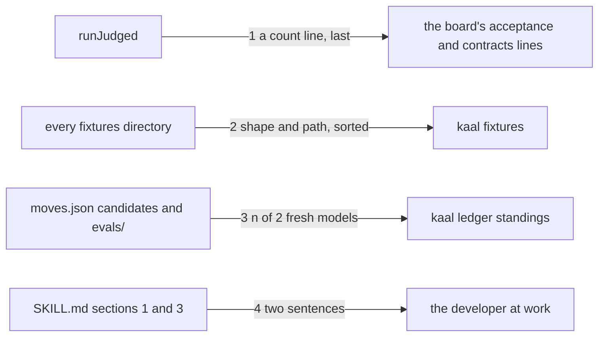

# Drawing: code-v2

_Written in architect mode from `requirements/code-v2`, seven criteria,
five red tests (the fixture and the archive were the analyst's own acts).
The human approves by merge._

## Structure

What exists: `bin/lib/acceptance.mjs` (`runJudged`, its lines and
summary), `bin/lib/gates.mjs` (the count regex `# pass N`), `bin/lib/ledger.mjs`
(`checkLedgers`, findings only), `bin/lib/record.mjs` (`freshModels`),
`bin/kaal.mjs`, `skills/code/SKILL.md`.

What is new:

- **A count line from the judged runner**: `runJudged` returns `passed`,
  the sum of passing tests, and the two commands print `# pass N` as their
  last line, after the summary; the board's count regex reads it and the
  `acceptance` and `contracts` lines carry `(N passing)`.
- **`bin/lib/fixtures.mjs`**, `listFixtures(root)`: walks the tree (not
  `node_modules`, not dot directories), and under every directory named
  `fixtures` finds artefacts by shape: `skill` (`SKILL.md`), `config`
  (`kaal.config.json`), `requirement` (`requirement.md`), `drawing`
  (`drawing.md`), `record` (a `.md` whose frontmatter has `verdict:`).
  Returns `{ shape, path }` sorted by path, the path relative to the root
  with forward slashes. `kaal fixtures [root]` prints `<shape> <path>` one
  per line, exit 1 with one stderr line when none is found.
- **Standings from the ledger**: `standings(root)` in `ledger.mjs`: for
  every move whose `candidate` is `skill`, the fresh passing models
  counted by `freshModels` over the move's `test` directory, or over every
  directory under `evals/<skill>/` when `test` is null. `kaal ledger`
  prints one stdout line per candidate, `<skill>: <move>: candidate
skill, <n> of 2 fresh models`, before its summary; findings stay on
  stderr.
- **Two sentences in the skill**: in section 3, that the repository's
  checks run on the whole tree (format everything, every time) and that
  the house rules apply to code (a rule about a banned character is
  written as its escape); in section 1 or 3, that fixtures obey the rules
  they are not testing and that a fixture command is a program and its
  arguments that parses the same under every platform's shell.

What changes: `acceptance.mjs`, `ledger.mjs`, `kaal.mjs` (dispatch,
usage), `SKILL.md`, `README.md` (one clause on counts), and the push-v1
ledger fixture, which gains a move at `nlp` with candidate `skill` so a
standing can be read from it; a fixture obeys the contract.

## Seams

1. **judged runner to board**: in, the files' results; out, `# pass N`
   as the last line, N the sum of passing tests. Owned by `acceptance.mjs`
   on one side, the runner's count regex on the other. The contract: on
   the `globs` fixture both commands end with `# pass 2`; on the league's
   tree the board's two lines carry a count.
2. **tree to fixture list**: in, a root; out, every artefact of the five
   shapes under any `fixtures` directory, sorted by path. Owned by
   `fixtures.mjs`. The contract: `fixtures/some` lists exactly its five,
   sorted, one shape each; `fixtures/none` exits 1 with one stderr line.
3. **ledger to standings**: in, the candidates and the eval records; out,
   one line per candidate with a count out of two. Owned by `ledger.mjs`.
   The contract: the push-v1 ledger fixture prints `2 of 2` for its
   candidate; the league's tree prints one line per candidate in
   `skills/*/moves.json`, none with a count above 2.
4. **skill text to the developer**: in, sections 1 and 3; out, two rules
   acted on. The contract: `whole tree` and `escape` in section 3;
   `fixtures obey the rules they are not testing` and `shell` in section
   1 or 3.

## Fixed and free

- Fixed: the count line's shape and place (criterion 1); the five shape
  names and the line `<shape> <path>` (criterion 2); the standing line's
  shape (criterion 3); the sentences' words (criteria 4, 5).
- Free: whether `listFixtures` reads a record's frontmatter with
  `frontmatter.mjs` or a regex; the order of standings (by skill, then
  by move, is the natural one).

## Decisions

### The count after the summary

- Chosen: `# pass N` is the last line of the judged commands.
- Not taken: a count in the summary line; a count per file only.
- Because: the runner reads the first `# pass` line in a wall's output;
  the per-file lines carry their own counts already and the board wants
  one number.
- Reopens if: the runner learns to sum; then the line goes.

### Candidates read `evals/<skill>/*` when they name no test

- Chosen: a candidate with `test: null` is counted over every fixture's
  records for its skill.
- Not taken: `0 of 2` for every candidate without a test.
- Because: the first hand-made record exists and names no move; the
  standing should show it, or the board says the league has no evidence
  when it has one record.
- Reopens if: a skill gains fixtures whose records must not count for
  a move; then the move names its test.

## Test strategy

| criterion | layer      | kind          | why                              |
| --------- | ---------- | ------------- | -------------------------------- |
| 1         | contract 1 | deterministic | the last line, the board's lines |
| 2         | contract 2 | deterministic | the two fixture roots            |
| 3         | contract 3 | deterministic | the ledger fixture and the tree  |
| 4, 5      | contract 4 | deterministic | the sentences, read              |
| 6, 7      | acceptance | deterministic | the fixture and the archive      |

## Handoff

- Task: code-v2
- Seams: 4; contract tests: 4 (equal), beside this file
- Red run: all four failing
- Criteria served: seam 1 serves 1; seam 2 serves 2; seam 3 serves 3;
  seam 4 serves 4, 5; criteria 6 and 7 are the requirement's own
- Next: the human approves by merge; then `code`
