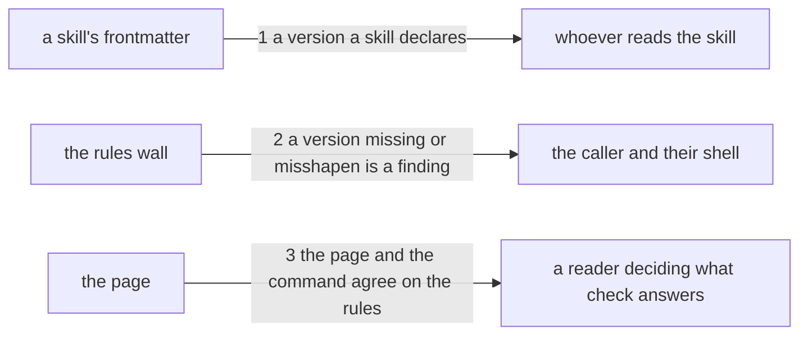

# Drawing: each-skill-carries-its-own-version

_Written in architect mode from `requirements/each-skill-carries-its-own-version`,
four criteria and four red tests. The closed requirements were read first:
`skills-v1` and `standard-v2` fix the frontmatter keys the rules mirror and
that `metadata` is a map of string values, `applies-here` fixes what `check`
does on a tree that holds no skills, `nothing-passes-vacuously` fixes that a
listing which finds nothing still answers, and `the-surface-is-written-down`
holds the page and the command equal. The finding shape `<skill>: <rule>:
<message>` is fixed by `skills-v1` and every rule in the wall already uses
it._

## Structure

One rule joins a wall that already has eleven, six files gain three lines
each, and one sentence on a page grows.

- **the rules wall** (`bin/lib/rules.mjs`, changes): a list of rule names and
  one function that walks every skill and finds. It gains a twelfth name and
  one block, beside the `metadata` block that already reads the same key.
- **the six skills** (`skills/<name>/SKILL.md`, change): each gains a
  `metadata` block carrying a version. `analyse`, `architect`, `code`,
  `operate`, `retro-4ls` and `test`, all at `0.0.1`, because a version that
  starts anywhere else is a claim about history nobody made.
- **the page** (`SURFACE.md`, changes): the sentence under `check` that lists
  what the rules require. It is held equal to the command by a closed test,
  so it moves or the tree is red.
- **the class wall** (`bin/lib/class.mjs`, unchanged): it reports that the
  skills moved and says nothing about their versions. Whether a changed skill
  must move its own version is the next task and this one does not reach for
  it.

## Seams

1. **a version a skill declares**: in, a skill's frontmatter; out, a
   `metadata.version` of three numeric places whose minor and major places
   are zero, as a string. Owned by the skill on one side and by every reader
   of a skill on the other: an eval record, a set that depends on it, a
   person asking which text they ran.
2. **a version missing or misshapen is a finding**: in, a skills directory;
   out, one line per skill at fault on stderr in the shape `skills-v1` fixed,
   `<skill>: version: <what is wrong>`, naming the version it found when
   there was one, and exit 1. Owned by the wall and the board.
3. **the page and the command agree on the rules**: in, the page's `check`
   section; out, the version named among what the rules require. Owned by
   `SURFACE.md` and the reader deciding what `check` answers, which is the
   promise `the-surface-is-written-down` made and a closed test already
   holds for the command list.

## Fixed and free

- Fixed: the key is `metadata.version` and its value is a string, because the
  standard allows six frontmatter keys and `version` is not one of them
  (constraint); the finding shape `<skill>: version: <message>`, from
  `skills-v1`; that the message names the version it found when a version was
  there (criterion 3); every skill starts at `0.0.1` (criterion 1); the rule
  name in the wall's list is `version`, since the list is compared as a whole
  by a unit test the developer owns; `check` keeps its exit codes and its
  argument.
- Free: whether the wall reports one finding or two for a version that is
  both misshapen and raised; the wording of each message; where the
  `metadata` block sits in a skill's frontmatter; whether the new block in
  the wall sits before or after the block that already reads `metadata`.

## Decisions

### The version is refused for its shape and its place, not just its absence

- Chosen: three findings from one rule: missing, not three numeric places,
  and a minor or major place that is not zero.
- Not taken: requiring only that a version exists, which is the whole of what
  "each skill carries a version" literally asks.
- Because: a version nobody constrains is a string, and a string drifts. The
  tool's own version is already held to its patch place by `kaal class`, and
  a skill whose version could jump to `2.0.0` in a pull request would make
  the two artefacts mean different things by the same notation.
- Bought: keeping choices open. The set Kai mentioned can depend on a skill
  version only if the notation is trustworthy, and a wall is what makes it
  so. It spends a little of the shortest path: three cases to build and to
  test rather than one, and a rule that will need loosening the day a skill
  earns a minor bump.
- Reopens if: a skill genuinely earns `0.1.0`, which is Kai's decision and
  not this wall's, at which point the place check becomes the thing in the
  way and moves to wherever the tool's own version rule ends up.

### The wall refuses; nothing compares a version to a change

- Chosen: `check` asks whether a version is there and well formed, and
  nothing asks whether it moved when the skill did.
- Not taken: teaching `kaal class` to compare each skill's version against
  the base, which is the natural home for it and is one command away.
- Because: the analyst split the ask and this is the first half. The second
  needs a base ref, which `check` does not take and should not: `check` reads
  a directory and answers about it, and giving it history would change what
  the command is.
- Bought: the shortest path, and `check` keeps its shape. It spends the
  guarantee that matters most to Kai's words, "each skill moves on its own":
  after this task a skill can change without its version moving and nothing
  notices. The task that closes that gap is named and not yet written.
- Reopens if: the second task lands, at which point this rule and that one
  are two halves of one promise and should be read together.

### Every skill starts at 0.0.1 and no skill starts higher

- Chosen: all six at `0.0.1` in the same change.
- Not taken: numbering by how much each skill has already moved, which would
  put `analyse` and `architect` well above the rest after forty uses and
  three analyst runs.
- Because: a version is a name for a state, not a measure of history, and any
  number above `0.0.1` would be a claim about the past that no record
  supports. The retros and the eval ledger already say how much a skill has
  moved and they say it better.
- Bought: the shortest path, and six identical edits nobody has to argue
  about. It spends information: a reader learns nothing from the version
  about which skills are older or more worked, and has to go to the retros
  for that, which is where it was anyway.
- Reopens if: a skill is added later, which starts at `0.0.1` like the rest
  and makes the number say even less about age.

## Test strategy

| criterion | layer      | kind          | why                                                                                         |
| --------- | ---------- | ------------- | ------------------------------------------------------------------------------------------- |
| 1         | contract 1 | deterministic | a frontmatter value is decidable by reading, and six files are countable                    |
| 2         | contract 2 | deterministic | a finding is a line the command prints, and a skills directory can be built to provoke it   |
| 3         | contract 2 | deterministic | the same command and the same shape, three cases of one rule rather than three rules        |
| 4         | contract 3 | deterministic | the page and the command are two readings of one fact, which a closed test already holds so |

## Handoff

- Task: each-skill-carries-its-own-version
- Seams: 3; contract tests: 3 (equal), beside this file
- Red run:
  `node --test --test-timeout=60000 architecture/each-skill-carries-its-own-version/contracts.test.mjs`;
  all three red, run and read. Stand-in green: all three, on a scratch rule,
  six frontmatter blocks and a page sentence, discarded with
  `git checkout --`
- Criteria served: seam 1 serves 1; seam 2 serves 2 and 3; seam 3 serves 4
- Fixed for the developer: the words under Fixed above. The wall's rule list
  is compared as a whole by `tests/rules.test.mjs`, which is a unit test and
  yours, so it moves with the list. A skills directory a test builds obeys
  the rules it is not testing, adversarial fixture included; the acceptance
  tests were red for the wrong reason until they did.
- Next: the human approves by merge; then `code`
