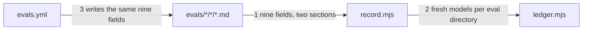

# Drawing: eval-record-v1

_Written in architect mode from `requirements/eval-record-v1`, four criteria,
four red tests. The human approves this drawing by merging it._

## Structure

What exists: `bin/lib/ledger.mjs` reading records with `model`, `verdict`
and `skill_sha`; `bin/lib/sha.mjs`; the evals workflow writing that shape.

What is new:

- **The record module**, `bin/lib/record.mjs`: the one list of required
  fields (`FIELDS`), `readRecord(path)` returning the frontmatter or the
  first missing field, and `isFresh(record, root, skill)` comparing
  `skill_sha`, `ask_sha` and `expect_sha` against the current files. The
  ledger stops reading records itself and asks this module.
- **The contract document**, `evals/README.md`: the same fields named, the
  two body sections, and the sentence that a stale or incomplete record
  counts for nothing. A unit test holds the document's field list equal to
  the module's.
- **The workflow's record**: `reader` (the model that read the output, the
  same model in v1), `temperature` (0, the value the request sends),
  `ask_sha` and `expect_sha` computed from the fixture's files with the same
  sha function the ledger uses.

What changes: `bin/lib/ledger.mjs` (delegates), `.github/workflows/evals.yml`
(writes every field), `evals/README.md` (new), and the push-v1 requirement's
assumption about the record shape, superseded by reference.

## Seams

1. **record file to module**: in, a markdown file with `---` frontmatter;
   out, its fields when all nine are present and `verdict` is `pass` or
   `flag`, otherwise the name of the first missing or invalid field. Owned by
   the workflow and the person who runs a model on one side, `record.mjs` on
   the other.
2. **module to ledger**: in, an eval directory, a skill name, the root; out,
   the set of distinct `model` values whose records are complete, `pass`,
   and fresh on all three shas. Owned by `record.mjs` on one side,
   `ledger.mjs` on the other.
3. **workflow to record file**: in, a skill and a fixture; out, a record
   carrying every field the module requires, with the shas computed from
   the same files the ledger will read. Owned by `evals.yml` on one side,
   the record contract on the other.

## Fixed and free

- Fixed: the nine field names and `verdict` values (criterion 1); a missing
  field counts for nothing (criterion 2); freshness on all three shas
  (criterion 3); the workflow writes every field (criterion 4); the field
  list lives once in code and the document matches it (constraint).
- Free: the module's internal shape; how the workflow computes the shas
  (any way that equals `fileSha`); the finding's wording, beyond naming the
  field.

## Decisions

### Reader may equal model in v1

- Chosen: `reader` is required and may hold the same value as `model`.
- Not taken: requiring a second model as reader.
- Because: the bar for the Skill rung is two distinct `model` values; a
  distinct reader is the harness's business (N, K, a skeptic), not the
  record's, and the field exists now so the harness has somewhere to write.
- Reopens if: the harness lands and self-reading is shown to inflate pass
  rates on the fixtures.

### The ledger delegates rather than parses

- Chosen: `ledger.mjs` calls `record.mjs`; the field list lives in one file.
- Not taken: extending the ledger's inline parsing.
- Because: the constraint says one place in code, and the workflow, the
  ledger and a future `kaal table` all read records.
- Reopens if: never; this is the shape.

## Test strategy

| criterion | layer      | kind          | why                                          |
| --------- | ---------- | ------------- | -------------------------------------------- |
| 1         | acceptance | deterministic | words in a file; unit holds it equal to code |
| 2         | contract 1 | deterministic | a named missing field                        |
| 3         | contract 2 | deterministic | exit codes on stale shas                     |
| 4         | contract 3 | deterministic | computed shas in the workflow                |

## Handoff

- Task: eval-record-v1
- Seams: 3; contract tests: 3 (equal), beside this file; fixture
  `stale-expect` here, the rest under the requirement
- Red run: all three failing; stand-in green in scratch
- Criteria served: seam 1 serves 1 and 2; seam 2 serves 2 and 3; seam 3
  serves 4
- Next: the human approves by merge; then `code`
