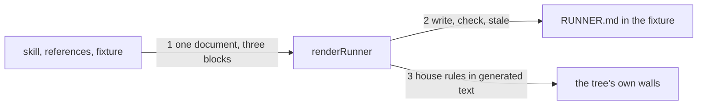

# Drawing: eval-runner

_Written in architect mode from `requirements/eval-runner`, three
criteria, three red tests. The human approves by merge._

## Structure

What exists: `skills/<skill>/SKILL.md`, `references/`, `fixtures/<f>/ask.md`
and `expect.md`; `bin/lib/sha.mjs`; `bin/kaal.mjs`.

What is new:

- **`bin/lib/runner.mjs`**, `renderRunner(root, skill, fixture)`: reads
  the skill, its references in name order, the fixture's ask and expect,
  and returns one markdown document: a first line saying it is generated
  and by what, a heading per part, and three fenced blocks (prompt 1,
  prompt 2, the record's frontmatter with the shas filled and the rest as
  placeholders). `runnerPath(root, skill, fixture)` is
  `skills/<skill>/fixtures/<fixture>/RUNNER.md`.
- **`kaal runner <skill> <fixture> [--write | --check]`**: prints the
  document; `--write` files it; `--check` compares the file with the
  document and exits 1 with `stale` on stderr when they differ or the
  file is missing.
- **`skills/analyse/fixtures/json-flag/RUNNER.md`**, generated.

What changes: `bin/kaal.mjs` (dispatch, usage), `evals/README.md` (one
paragraph: how a record is made, with the runner).

## Seams

1. **tree to document**: in, the three files and the references; out,
   the document with the skill and each reference after a line naming it,
   the ask last in block one, every checklist line and `Output:` last in
   block two, the shas in block three. The contract: `fixtures/tree` here,
   a skill with one reference and a two-item expect.
2. **document to file**: in, the document; out, the file, or the verdict
   stale. The contract: write then check exits 0; a changed file exits 1
   with `stale`; a missing file exits 1.
3. **generated text to walls**: in, the document; out, text the tree's
   rules accept. The contract: no en-dash or em-dash in the document, and
   its first line names it as generated.

## Fixed and free

- Fixed: the file's place and name (criterion 2); the order inside block
  one (skill, references, ask) and block two (instruction, items,
  `Output:`); the three shas' names.
- Free: the framing sentences' wording; the headings between the blocks.

## Decisions

### In the fixture, not beside the records

- Chosen: `skills/<skill>/fixtures/<fixture>/RUNNER.md`.
- Not taken: `evals/<skill>/<fixture>/RUNNER.md`.
- Because: every reader of `evals/` treats a `.md` there as a record, and
  a runner is not one; in the fixture it travels with the skill and is
  found next to the ask it renders.
- Reopens if: a consumer's bundle rule refuses a file there; then the
  consumer decides where its runners live.

## Test strategy

| criterion | layer      | kind          | why                                |
| --------- | ---------- | ------------- | ---------------------------------- |
| 1         | contract 1 | deterministic | the fixture skill with a reference |
| 2         | contract 2 | deterministic | write, check, stale, missing       |
| 3         | contract 3 | deterministic | dashes and the first line          |
| 1 to 3    | acceptance | deterministic | on the league's own fixture        |

## Handoff

- Task: eval-runner
- Seams: 3; contract tests: 3 (equal), beside this file; fixture `tree`
  here
- Red run: all three failing; the build turns them green
- Criteria served: seam 1 serves 1; seam 2 serves 2; seam 3 serves 3
- Next: the human approves by merge; then `code`
