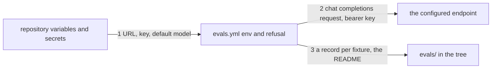

# Drawing: evals-v2

_Written in architect mode from `requirements/evals-v2`, four criteria,
four red tests. The human approves by merge._

## Structure

What exists: `.github/workflows/evals.yml` (the comment and dispatch
triggers, the branch resolution, the run step that asks a model twice per
fixture and writes a record, the commit step), `evals/README.md`, the record
contract in `bin/lib/record.mjs`.

What is new:

- **Three settings** read in the workflow's `env`: `EVALS_API_URL` from
  `vars`, `EVALS_API_KEY` from `secrets`, `EVALS_MODEL` from `vars` as the
  default model; the comment's third word and the dispatch input override
  the model as before.
- **A refusal step** before the run: when the URL or the key is empty, one
  `::error` line names both settings and the step exits 1, so no request is
  made and the log says what to configure.
- **The request** goes to `process.env.EVALS_API_URL` with a bearer
  `EVALS_API_KEY`; the body (`model`, `messages`, `temperature: 0`) and the
  reading of `choices[0].message.content` do not change.
- **The README** says the three settings and their meaning.

What changes: `evals.yml` (the `models: read` permission goes; the
retired host goes), `evals/README.md`, `DESIGN.md` and `SECURITY.md` (one
sentence each said "hosted models"), and push-v1: its assumption and its
criterion 8 are superseded, so its test 8 reads the new truth and its
requirement says so; that is what a supersedes line is for.

## Seams

1. **settings to workflow**: in, `vars.EVALS_API_URL`, `secrets.EVALS_API_KEY`,
   `vars.EVALS_MODEL`; out, the run's environment, or a refusal naming what
   is missing. Owned by the repository's settings on one side, the workflow
   on the other. The contract: the env block maps the three names, and the
   refusal precedes the run.
2. **workflow to endpoint**: in, the request (`model`, `messages`,
   `temperature: 0`, `Authorization: Bearer`); out, `choices[0].message.content`.
   Owned by the workflow. The contract: the fetch reads its URL and key from
   the environment and sends that body; no host in the text.
3. **workflow to tree**: in, a model's output and reading; out, the record
   with the nine fields under `evals/<skill>/<fixture>/<model>.md`, and the
   README naming the settings. Owned by the workflow and the README. The
   contract: the record template still writes every field the contract
   names, and the README names the three settings.

## Fixed and free

- Fixed: the three setting names (criteria 1, 4); the refusal before the
  run, naming both (criterion 2); no `models` permission (criterion 3); the
  request shape and the record's fields.
- Free: the wording of the README; whether the refusal is a step or the
  first lines of the run step, as long as it precedes any request.

## Decisions

### A setting, not a host

- Chosen: the URL is a repository variable; the tree never names a
  provider.
- Not taken: a new provider's URL in the workflow; a provider chosen by a
  `process.platform`-style switch.
- Because: the retired service was named in the tree and the tree was
  wrong the day it was retired; the vendor rule already forbids naming one,
  and a URL is the same thing in another spelling.
- Reopens if: the chat completions shape stops being the common one.

### Refuse loudly before the first request

- Chosen: one `::error` line naming both settings, exit 1.
- Not taken: letting the fetch fail with the provider's own message.
- Because: "410 brownout" from a retired service told the reader nothing
  about what to do; the workflow's own line does.
- Reopens if: never.

## Test strategy

| criterion | layer      | kind          | why                                       |
| --------- | ---------- | ------------- | ----------------------------------------- |
| 1, 4      | contract 1 | deterministic | the env block maps the three names        |
| 1         | contract 2 | deterministic | the fetch reads URL and key from env      |
| 2         | contract 1 | deterministic | the refusal precedes the run              |
| 3         | acceptance | deterministic | the permissions block, by the requirement |
| 4         | contract 3 | deterministic | the record's fields and the README        |

## Handoff

- Task: evals-v2
- Seams: 3; contract tests: 3 (equal), beside this file
- Red run: all three failing; the build turns them green
- Criteria served: seam 1 serves 1, 2, 4; seam 2 serves 1; seam 3 serves 4;
  criterion 3 is the requirement's own
- Next: the human approves by merge; then `code`
