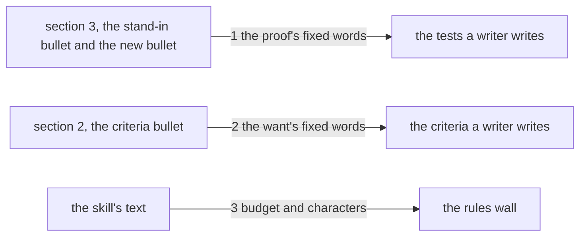

# Drawing: fixed-ground

_Written in architect mode from `requirements/fixed-ground`, five criteria,
four red tests (the archive was the analyst's act). The human approves by
merge._

## Structure

What exists: `skills/analyse/SKILL.md` sections 2 and 3, the bullets
**Acceptance criteria**, **Seen green on a stand-in**, **Off the league's
own tree** and **A partial red is honest**.

What is new, four sentences, each in the place a writer is reading when the
ground moves:

- **Seen green on a stand-in** grows one sentence: a criterion on a skill's
  text or a template is not exempt; it is proven on a stand-in copy of the
  file, and a text criterion needs the stand-in most.
- **Acceptance criteria** grows two sentences: a criterion on a wall's
  finding or a command's output line fixes that line's format in the
  requirement, so the test can be written before any code exists; and
  where a file the task creates lives is a criterion, not a detail.
- A new bullet **On fixed ground**, between **Off the league's own tree**
  and **A partial red is honest**: a test reads a fixture root, never the
  league's own tree for a state that a rerun or a later change will move.

What changes: `SKILL.md` only (two bullets grow, one bullet is new). The
template does not change; none of the four is a shape the template carries.

## Seams

1. **proof rules to the tests**: in, the two bullets; out, a test on a
   stand-in and on a fixture root. The contract: the stand-in bullet
   carries "text criterion" and "stand-in copy", and the fixed-ground
   bullet stands as its own bullet in section 3 and carries "fixture root"
   and "will move"; neither sentence sits in any other bullet.
2. **want rule to the criteria**: in, the Acceptance criteria bullet; out,
   a criterion that fixes a line and names a place. The contract: the
   bullet carries "fixes that line's format" and "before any code exists"
   and "where a file the task creates lives is a criterion", and no other
   bullet of section 2 does.
3. **the skill's text to the rules wall**: in, the grown text; out, a
   green `kaal check`. The contract: the tool exits 0 on the league's
   skills, so the budget holds and no banned character came in with the
   sentences.

## Fixed and free

- Fixed: which bullet each sentence lives in, and that the fixture-root
  rule is a bullet of its own (criteria 1 to 4); the fixed words the
  contracts read, listed under Seams.
- Free: the wording around the fixed words; the bullet's exact lead after
  "On fixed ground" if the developer finds a better two words.

For a text change the parts are the sentences' places, and the fixed words
are what the contract reads; this drawing is that rule applied.

## Decisions

### A new bullet for the fixture root, not a sentence in the tree bullet

- Chosen: **On fixed ground** as its own bullet.
- Not taken: appending to **Off the league's own tree**, which already
  says a test drives the league's commands on a fixture root.
- Because: the existing bullet is about re-entry, a test that runs the
  runner that runs it; the new rule is about state that moves, and a
  writer who reads only the lead must find the right one. The
  requirement's name is the bullet's name.
- Reopens if: section 3 passes ten bullets; then the two merge under one
  lead about fixture roots.

## Test strategy

| criterion | layer      | kind          | why                                  |
| --------- | ---------- | ------------- | ------------------------------------ |
| 1         | contract 1 | deterministic | the stand-in bullet, read            |
| 2         | contract 2 | deterministic | the criteria bullet, read            |
| 3         | contract 1 | deterministic | the new bullet, read, and only there |
| 4         | contract 2 | deterministic | the criteria bullet, read            |
| 1 to 4    | contract 3 | deterministic | the rules wall on the grown skill    |
| 5         | acceptance | deterministic | the archive, by the requirement      |

## Handoff

- Task: fixed-ground
- Seams: 3; contract tests: 3 (equal), beside this file
- Red run: contracts 1 and 2 failing, contract 3 green before the build
  (the wall holds on the text as it is, and must still hold after); the
  build, four sentences, turns the two green and keeps the third
- Criteria served: seam 1 serves 1 and 3; seam 2 serves 2 and 4; seam 3
  serves 1 to 4; criterion 5 is the requirement's own
- Next: the human approves by merge; then `code`
