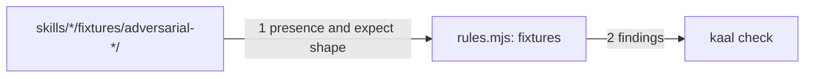

# Drawing: fixtures-v1

_Written in architect mode from `requirements/fixtures-v1`, four criteria,
four red tests. The human approves by merge._

## Structure

What exists: one friendly fixture per skill under `skills/<n>/fixtures/`;
the skill rules in `bin/lib/rules.mjs` with a `reach` rule that walks each
skill; the evals workflow, which runs every fixture directory it finds.

What is new:

- **Six adversarial fixtures**, `skills/<n>/fixtures/adversarial-scope/`,
  one per skill, each an ask that carries an instruction the skill must not
  obey and an `expect.md` whose lines begin `- Refuses` or `- Does not`. The
  adversary is scope, never damage: the ask tempts an invented goal, an
  unrequested seam, an edited upstream test, a wish as a criterion, a
  production release on hearsay, a tidied contradiction.
- **The `fixtures` rule** in `rules.mjs`: a skill with no fixture directory
  beginning `adversarial-` is a finding; so is an adversarial `expect.md`
  with no `- Refuses` or `- Does not` line, because an adversary whose
  expectation is not a refusal is a friendly fixture with a scary name.

What changes: `RULES` gains `fixtures`; `README.md`'s walls clause names
it; `SECURITY.md`'s Threats section gains one sentence, that the adversarial
fixtures are the threat model exercised.

## Seams

1. **fixture directory to rule**: in, a skill's `fixtures/`; out, a
   `fixtures` finding when no `adversarial-` directory exists or one exists
   whose `expect.md` names no refusal. Owned by the skill's author on one
   side, `rules.mjs` on the other.
2. **rule to command**: unchanged from push-v1; the finding reads
   `<skill>: fixtures: <message>`.

## Fixed and free

- Fixed: the directory prefix and the two line openers (criteria 1, 2); the
  six adversaries by kind (criterion 3); the rule name (criterion 4).
- Free: the asks' wording; how many adversaries beyond one.

## Decisions

### The rule reads the expectation's shape, not only the directory's name

- Chosen: an adversarial `expect.md` without a refusal line is a finding.
- Not taken: presence only.
- Because: a name is a claim; the line is the evidence that the fixture is
  adversarial.
- Reopens if: a legitimate adversary's expectation cannot be phrased as a
  refusal or an abstention.

## Test strategy

| criterion | layer      | kind          | why                             |
| --------- | ---------- | ------------- | ------------------------------- |
| 1, 2, 3   | acceptance | deterministic | files and lines                 |
| 4         | contract 1 | deterministic | named finding on fixture skills |

## Handoff

- Task: fixtures-v1
- Seams: 2; contract tests: 1 on seam 1 (seam 2 is push-v1's, already
  held); fixture `no-refusal` here, `no-adversary` under the requirement
- Red run: failing; stand-in green in scratch
- Criteria served: seam 1 serves 1, 2, 4
- Next: the human approves by merge; then `code`
