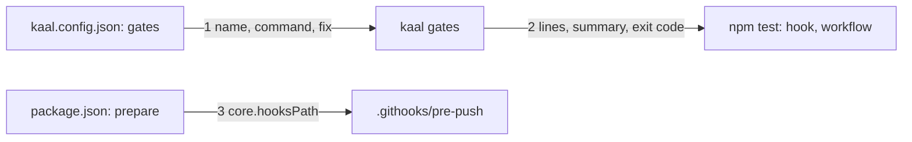

# Drawing: gates-v1

_Written in architect mode from `requirements/gates-v1`, whose five criteria
each have a red acceptance test. The human approves this drawing before the
developer builds._

## Structure

What exists: the league's tool `bin/kaal.mjs` with `ledger`, `check`,
`retros` and their modules under `bin/lib/`; `kaal.config.json` carrying the
standard's pin; acceptance tests under `requirements/*/`, contract tests under
`architecture/*/`, unit tests under `tests/` and beside skill scripts; the
evals workflow.

What is new:

- **The walls as data**: a `gates` list in `kaal.config.json`, each entry
  `{ name, command, fix }`. The list is the only place the walls live. The
  first list: `acceptance` (every requirement's tests), `contracts` (every
  drawing's tests), `units` (the tool's and the skills' script tests),
  `rules` (`kaal check`), `ledger` (`kaal ledger`), `format` (the formatter
  in check mode).
- **The runner**, `gates` as a fourth command of `bin/kaal.mjs`, backed by
  `bin/lib/gates.mjs`: runs every wall in order, all of them even after one
  fails, prints one line per wall (`ok` or `FAIL`, the name, a count where
  the output carries one, the fix hint on failure) and a summary line, and
  exits 1 if any wall failed. A wall whose command cannot run is a failure,
  never a skip: silence and success must not look alike.
- **The one command**: `package.json` with `"test": "node bin/kaal.mjs
gates"`, `"prepare": "git config core.hooksPath .githooks"`, the formatter
  as the only dev dependency, and nothing else. `npm test` is the runner and
  the runner is `npm test`.
- **The hook**, `.githooks/pre-push`: runs `${KAAL_TEST_COMMAND:-npm test}`
  and exits with it. Wired by `prepare`, so `npm install` in a fresh clone
  turns it on and no hook tool is needed.
- **The workflow**, `.github/workflows/ci.yml`: on `pull_request` and on
  `push` to `main`; checkout, node 22, `npm ci`, one step whose run line is
  exactly `npm test`; a `# not run:` line naming the model evals as the
  walls it does not run.

What changes: `kaal.config.json` (the list), `bin/kaal.mjs` (dispatch),
`README.md` (the walls run with `npm test`; the developer edits the one
sentence that says otherwise).

## Seams

1. **config to runner**: in, `kaal.config.json` with `gates: [{name,
command, fix}]` read from the working directory; out, every wall run in
   order, one line each, a summary, exit 0 or 1; a missing or unrunnable
   command is `FAIL` with its fix hint. Owned by the config on one side,
   `gates.mjs` on the other.
2. **runner to shell**: in, `node bin/kaal.mjs gates`; out, the per-wall
   lines and the summary on stdout, the walls' own stderr passed through,
   exit code as above. Owned by the runner on one side, the hook, the
   workflow and `npm test` on the other.
3. **install to hook**: in, `npm install` (or `npm ci`) in a clone; out,
   `git config core.hooksPath` equal to `.githooks`, so the pre-push hook
   runs without any hook tool. Owned by `package.json` on one side, git on
   the other.

## Fixed and free

- Fixed: the config key and entry shape (criterion 1); `npm test` exactly
  (criteria 1, 2, 3); the `# not run:` line (criterion 4); the gates'
  commands reaching every acceptance, contract and script test (criterion
  5); all walls run even after a failure; an unrunnable wall fails.
- Free: the line format inside the contract; how the count is read from a
  wall's output; the order of the walls; the node version pin's form.

## Decisions

### The format check is a wall, not advice

- Chosen: `format` is in the gates list and fails the run.
- Not taken: advisory only; not in the list at all.
- Because: a formatter drift that CI refuses and the hook does not is the
  case conduct's fourth law describes, local green that is not CI green.
  The formatter is the one dev dependency the requirement allows, and
  `npm ci` installs it where the walls run.
- Reopens if: a consumer runs the walls without installing; then the runner
  reports `FAIL format` with the fix hint `npm install`, which is the honest
  answer, not a skip.

### `prepare` wires the hook

- Chosen: `"prepare": "git config core.hooksPath .githooks"`.
- Not taken: a hook manager as a dependency; a documented manual step.
- Because: the requirement wants no dependency beyond node and the
  formatter, and a manual step is a step that is skipped. `prepare` runs on
  every install in a clone and on nothing else.
- Reopens if: a consumer's repository already sets `core.hooksPath`; then
  the consumer owns the merge of the two hook sets.

### All walls run, then the verdict

- Chosen: the runner does not stop at the first failure.
- Not taken: fail fast.
- Because: the record a reader needs is every wall's state, not the first
  red; the cost is a minute.
- Reopens if: a wall becomes slow enough to make the minute an hour.

### The hook takes its command from the environment

- Chosen: `${KAAL_TEST_COMMAND:-npm test}` in the hook.
- Not taken: a hardcoded `npm test`, tested by pushing in a temp repository.
- Because: the acceptance test injects a failing command through that
  variable; the analyst's retro already named this a test's fingerprint in
  production code, and it stays until a better proof exists.
- Reopens if: the developer finds a way to prove the hook fails with
  `npm test` without the variable; then the variable goes.

## Test strategy

| criterion | layer      | kind          | why                                       |
| --------- | ---------- | ------------- | ----------------------------------------- |
| 1         | contract 1 | deterministic | exit codes and lines on a fixture config  |
| 2         | acceptance | deterministic | the hook file, its mode, an injected fail |
| 3, 4      | acceptance | deterministic | lines in the workflow file                |
| 5         | acceptance | deterministic | glob expansion of the gates' commands     |
| hook wire | contract 3 | deterministic | git config after prepare in a temp clone  |

## Handoff

- Task: gates-v1
- Seams: 3; contract tests: 3 (equal), in `contracts.test.mjs` beside this
  file, fixture configs under `fixtures/`
- Red run: all three failing, no `gates` command exists; stand-in green in
  scratch
- Criteria served: seam 1 serves 1 and 5; seam 2 serves 1, 2, 3; seam 3
  serves 2
- Fixed for the developer: the list above; start red on the five acceptance
  tests and these three; build seam 1 first, then 2, then 3
- Next: the human approves this drawing; then `code`
