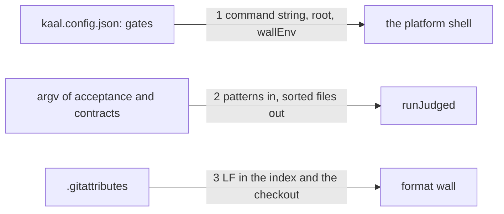

# Drawing: gates-v2

_Written in architect mode from `requirements/gates-v2`, four criteria, four
tests, three red. The human approves by merge._

## Structure

What exists: `bin/lib/gates.mjs` (`runGates`, `wallEnv`), `bin/lib/acceptance.mjs`
(`runJudged` for both `kaal acceptance` and `kaal contracts`), the gates list
in `kaal.config.json`, the pre-push hook (`sh`, run by git's own shell on
every platform), the `ci` workflow.

What is new:

- **The platform shell** in `runGates`: the command string goes to node's own
  shell mode (`shell: true`), which starts `/bin/sh` by absolute path on
  POSIX and `cmd.exe` on Windows; the runner names no shell. The cwd stays
  the root and the environment stays `wallEnv()`.
- **`expand(patterns)`** in `acceptance.mjs`: every argument holding `*`, `?`
  or `[` is expanded with node's own `fs.globSync` and sorted; a plain path
  passes through. Both commands call it before judging, so a glob arriving
  unexpanded from `cmd.exe` names the same files it names from `sh`.
  A pattern that matches nothing leaves the list empty, and the existing
  "no requirement files given" red stands.
- **`.gitattributes`** with one rule, `* text=auto eol=lf`: a checkout on any
  platform holds LF, so the format wall reads the same bytes everywhere.

What changes: `gates.mjs`, `acceptance.mjs`, `bin/kaal.mjs` (usage names
globs), `README.md` (one clause), and the fixtures and tests that carried
shell-isms: `architecture/gates-v1/fixtures/*` (`true`, `false`, `printf`
become node commands) and `architecture/push-v1/contracts.test.mjs` (a
`sh -c cp && rm` chain becomes node's `cpSync` and `rmSync`). A fixture
obeys the constraint the requirement states: every command is a program and
its arguments.

## Seams

1. **runner to platform shell**: in, one wall's command and the root; out,
   the exit status and stdout, produced by the platform's own shell with the
   cwd at the root and the wall environment set. Owned by `gates.mjs` on one
   side, node's `child_process` on the other. The contract: a wall that is a
   node program exits as it says on a PATH holding node and no `sh`, and it
   sees the root and `KAAL_GATES=1` and no `NODE_TEST_CONTEXT`.
2. **argv to judged files**: in, the arguments as given, expanded by a shell
   or not; out, the files judged, one line each, in sorted order. Owned by
   the two commands. The contract: a literal glob names the same files as
   its expansion, in the same order; a glob that matches nothing is red with
   the "no requirement files given" summary, never green.
3. **tree to checkout**: in, the tree; out, LF on every text file in the
   index and in a fresh checkout. Owned by `.gitattributes`. The contract:
   the rule exists, and `git ls-files --eol` shows no CRLF in the index.

## Fixed and free

- Fixed: no shell is named by the runner (criterion 1); both commands
  expand their own globs, sorted (criterion 2); the one `.gitattributes`
  rule (criterion 3); the board green on the league's tree (criterion 4).
- Free: whether `expand` lives in `acceptance.mjs` or its own file; how the
  hook is written (it stays `sh`, run by git's shell; the requirement's open
  question).

## Decisions

### Node's shell mode, not a shell of ours

- Chosen: `spawnSync(command, { shell: true })`.
- Not taken: splitting the command into a program and arguments and
  spawning it without a shell; picking `cmd.exe` or `sh` by `process.platform`.
- Because: the walls are strings in a config people edit; node already
  knows the platform's shell and starts it by path, so the runner needs no
  opinion; splitting strings by hand is a shell of our own.
- Reopens if: a wall needs a shell feature (a pipe, a redirect) that reads
  differently on the two shells; then the wall becomes a node script.

### Globs expanded by the league's commands, sorted

- Chosen: `fs.globSync`, results sorted, only for arguments that carry a
  glob character.
- Not taken: leaving expansion to the shell; leaving it to `node --test`
  (which expands, but runs every match in one process and judges nothing).
- Because: `cmd.exe` does not expand; and the judged runner needs one
  file at a time to read its status.
- Reopens if: node marks `globSync` experimental on a version the engines
  field admits; then a twenty-line expander of our own.

### Fixtures follow the constraint

- Chosen: gates-v1's fixture walls and push-v1's contract test lose their
  shell-isms.
- Not taken: leaving them, since they pass on POSIX.
- Because: the units wall would stay red on Windows for the fixtures alone,
  and the board would again say the league is broken when a fixture was.
- Reopens if: never.

## Test strategy

| criterion | layer      | kind          | why                                   |
| --------- | ---------- | ------------- | ------------------------------------- |
| 1         | contract 1 | deterministic | exit status on a PATH with no sh      |
| 2         | contract 2 | deterministic | files and order, and the empty case   |
| 3         | contract 3 | deterministic | the rule and the index's line endings |
| 4         | unit       | deterministic | the board, held by the requirement    |

## Handoff

- Task: gates-v2
- Seams: 3; contract tests: 3 (equal), beside this file; fixture `env`
  here, `globs` under the requirement
- Red run: all three failing; the build turns them green
- Criteria served: seam 1 serves 1; seam 2 serves 2; seam 3 serves 3;
  criterion 4 is the requirement's own
- Next: the human approves by merge; then `code`
