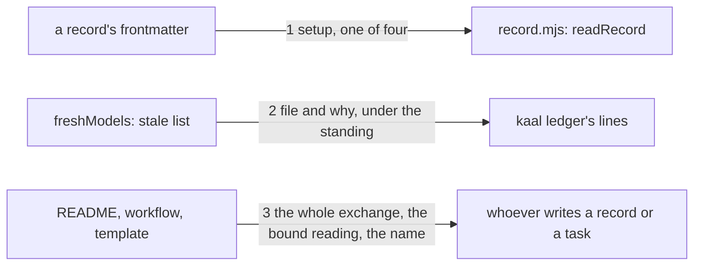

# Drawing: honest-records

_Written in architect mode from `requirements/honest-records`, five
criteria, five red tests. The human approves by merge._

## Structure

What exists: `bin/lib/record.mjs` (`FIELDS`, `readRecord`, `isFresh`,
`freshModels`), `bin/lib/ledger.mjs` (`standings`), `bin/kaal.mjs` (the
ledger's standing lines), `evals/README.md`, `.github/workflows/evals.yml`,
`skills/analyse/references/requirement.md`, the records under `evals/` and
under the fixture roots.

What is new:

- **`setup`** in `FIELDS`, with `SETUPS = ["chat", "system", "workspace",
"workflow"]`; `readRecord` names `setup` as missing when absent or not
  one of the four. Every record in the tree gains the line, the two under
  `evals/` as `chat`; a fixture record that is meant to be incomplete
  stays incomplete for its own reason.
- **`whyStale(data, root, skill)`** in `record.mjs`: which of the three
  files moved, as words (`skill moved`, `ask moved`, `expect moved`);
  `freshModels` puts it in the reason, and returns `stale` as a list of
  `{ file, why }` beside `models` and `reasons`.
- **Stale lines in the standings**: `standings` carries `stale` per
  candidate; `kaal ledger` prints `  stale: <file> (<why>)` under the
  standing line, one per stale record, and nothing when none.
- **Three texts**: the README's two rules and the field; the workflow's
  template line; the template's Task line.

## Seams

1. **frontmatter to contract**: in, a record; out, complete or the name
   of what is missing. The contract: `fixtures/no-setup` under the
   requirement yields `missing setup`; a record with `setup: phone` yields
   the same; the four words pass.
2. **freshness to board**: in, the records under a candidate's directory;
   out, the standing line unchanged and one indented line per stale
   record with the file and why. The contract: `fixtures/stale-standing`
   here prints `0 of 2 fresh models` and `  stale: evals/x/f/alpha.md
(skill moved)`, the file by its path from the root, since a candidate
   with no test reads over every fixture.
3. **texts to writers**: in, the three files; out, the sentences the
   requirement names. The contract: the README carries the two rules and
   the four words, the workflow writes `setup: workflow`, the template's
   Task line says named for the change, not numbered.

## Fixed and free

- Fixed: the four setup words (criterion 2); the stale line's shape
  `  stale: <file> (<why>)` (criterion 3); the standing line (code-v2).
- Free: the wording of `why` beyond the three phrases; whether
  `freshModels` returns `stale` or the standings recompute it.

## Decisions

### Stale as lines under the standing, not a count in it

- Chosen: the standing keeps its shape and stale records are listed under
  it.
- Not taken: `0 of 2 fresh, 2 stale` in the line.
- Because: code-v2 closed on that line's shape; and a list names the file
  a reader has to regenerate, which a count does not.
- Reopens if: a candidate accumulates more stale records than a screen.

## Test strategy

| criterion | layer      | kind          | why                              |
| --------- | ---------- | ------------- | -------------------------------- |
| 2         | contract 1 | deterministic | the fixture root, the four words |
| 3         | contract 2 | deterministic | the stale line on a fixture root |
| 1, 4, 5   | contract 3 | deterministic | three texts, read                |

## Handoff

- Task: honest-records
- Seams: 3; contract tests: 3 (equal), beside this file; fixture
  `stale-standing` here
- Red run: all three failing; the build turns them green
- Criteria served: seam 1 serves 2; seam 2 serves 3; seam 3 serves 1, 4, 5
- Next: the human approves by merge; then `code`
